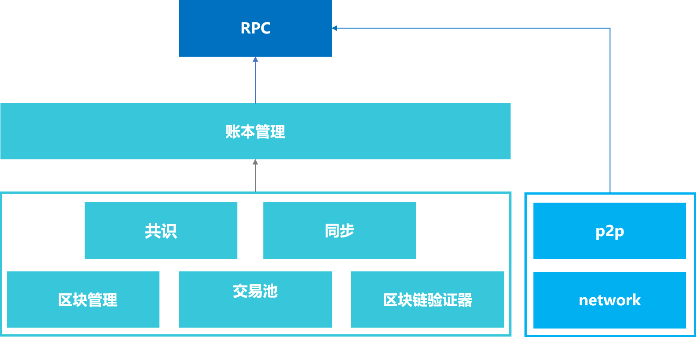

# 远程过程调用（RPC）

标签：``远程过程调用`` ``RPC``

----
RPC(Remote Procedure Call，远程过程调用)是客户端与区块链系统交互的一套协议和接口。用户通过RPC接口可查询区块链相关信息（如块高、区块、节点连接等）和发送交易。

## 1 名词解释
- [JSON](http://json.org/)(JavaScript Object Notation)：一种轻量级的数据交换格式。它可以表示数字、字符串、有序序列和键值对。    
- [JSON-RPC](https://www.jsonrpc.org/specification)：一种无状态、轻量级的远程过程调用协议。 该规范主要定义了几个数据结构及其处理规则。它允许运行在基于socket，http等诸多不同消息传输环境的同一进程中。它使用JSON ([RFC 4627](http://www.ietf.org/rfc/rfc4627.txt))作为数据格式。FISCO BCOS采用JSON-RPC 2.0协议。

## 2 模块架构
 

 RPC模块负责提供FISCO BCOS的外部接口，客户端通过RPC发送请求，RPC通过调用[账本管理模块](architecture/group.md)和[p2p模块](p2p/p2p.md)获取相关响应，并将响应返回给客户端。其中账本管理模块通过多账本机制管理区块链底层的相关模块，具体包括[共识模块](consensus/index.html)，[同步模块](sync/sync.md)，区块管理模块，交易池模块以及区块验证模块。

## 3 数据定义
### 3.1 客户端请求
客户端请求发送至区块链节点会触发RPC调用，客户端请求包括下列数据成员：   
- jsonrpc: 指定JSON-RPC协议版本的字符串，必须准确写为“2.0”。         
- method: 调用方法的名称。          
- params: 调用方法所需要的参数，方法参数可选。由于FISCO BCOS 2.0启用了多账本机制，因此本规范要求传入的第一个参数必须为群组ID。
- id: 已建立客户端的唯一标识ID，ID必须是一个字符串、数值或NULL空值。如果不包含该成员则被认定为是一个通知。

RPC请求包格式示例:
```
{"jsonrpc": "2.0", "method": "getBlockNumber", "params": [1], "id": 1}
```
**注：**       
- 在请求对象中不建议使用NULL作为id值，因为该规范将使用空值认定为未知id的请求。 
- 在请求对象中不建议使用小数作为id值，因为具有不确定性。

### 3.2 服务端响应
当发起一个RPC调用时，除通知之外，区块链节点都必须回复响应。响应表示为一个JSON对象，使用以下成员：
- jsonrpc: 指定JSON-RPC协议版本的字符串。必须准确写为“2.0”。       
- result: 正确结果字段。该成员在响应处理成功时必须包含，当调用方法引起错误时必须不包含该成员。  
- error: 错误结果字段。该成员在失败是必须包含，当没有引起错误的时必须不包含该成员。该成员参数值必须为[3.3](#id6)节中定义的对象。     
- id: 响应id。该成员必须包含，该成员值必须与对应客户端请求中的id值一致。若检查请求对象的id错误（例如参数错误或无效请求），则该值必须为空值。     

RPC响应包格式示例:
```
{"jsonrpc": "2.0", "result": "0x1", "id": 1}
```
**注：**
服务端响应必须包含result或error成员，但两个成员不能同时包含。

### 3.3 错误对象
当一个RPC调用遇到错误时，返回的响应对象必须包含error错误结果字段，相关的描述和错误码，请参考：[RPC 错误码](../api.html#rpc)

## 4 RPC接口的设计

FISCO BCOS提供丰富的RPC接口供客户端调用。其中分为3类：
- 以get开头命名的查询接口：例如`[getBlockNumber]`接口，查询最新的区块高度。
- `[sendRawTransaction]`接口: 执行一笔签名的交易，将等待区块链共识后才返回响应。
- `[call]`接口: 执行一个请求将不会创建一笔交易，不需要区块链共识，而是获取响应立刻返回。

## 5 RPC接口列表
参考[RPC API文档](../api.md)
