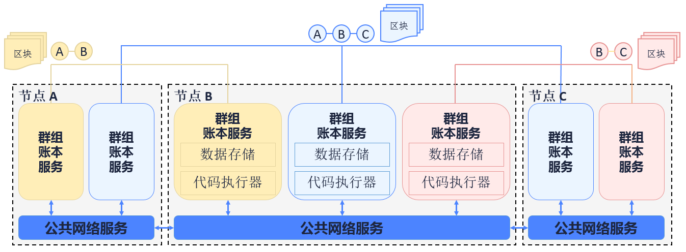
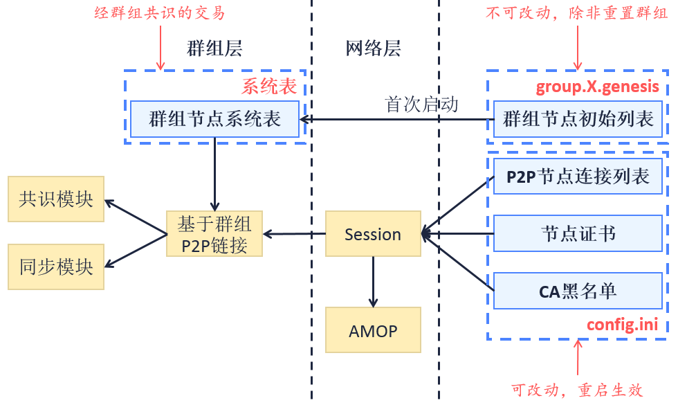
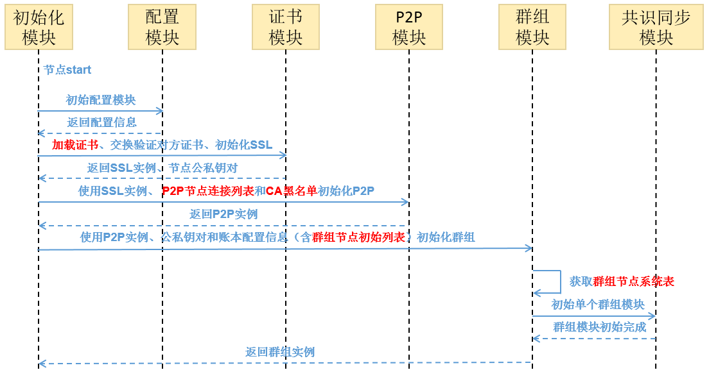

# 节点准入管理介绍

标签：``安全控制`` ``访问控制`` ``节点准入`` 

----

本文档对节点准入管理进行介绍性说明，实践方法参见[《节点准入管理操作文档》](../../manual/node_management.md)。

## 概述

### 单链多账本

区块链技术是一种去中心化、公开透明的分布式数据存储技术，能够降低信任成本，实现安全可靠的数据交互。然而区块链的交易数据面临着隐私泄露威胁：

- 对于公有链，一节点可任意加入网络，从全局账本中获得所有数据；
- 对于联盟链，虽有网络准入机制，但节点加入区块链后即可获取全局账本的数据。

作为联盟链的FISCO BCOS，对链上隐私这一问题，提出了**单链多账本**的解决方案。FISCO BCOS通过引入**群组**概念，使联盟链从原有一链一账本的存储/执行机制扩展为一链多账本的存储/执行机制，基于群组维度实现同一条链上的数据隔离和保密。


<center>多账本</center>

如上图所示，节点ABC加入蓝色群组，并共同维护蓝色账本; 节点B和C加入粉色群组并维护粉红色账本; 节点A和B加入黄色群组并维护黄色账本。三个群组间共享公共的网络服务，但各群组有各自独立的账本存储及交易执行环境。客户端将交易发到节点所属的某个群组上，该群组内部对交易及数据进行共识并存储，其他群组对该交易无感知不可见。

### 节点准入机制

基于群组概念的引入，节点准入管理可分为**网络准入机制**和**群组准入机制**。准入机制的规则记录在配置中，节点启动后将读取配置信息实现网络及群组的准入判断。

## 名词解释

### 节点类型

本文档所讨论的节点为已完成网络准入可进行P2P通信的节点。**网络准入过程涉及P2P节点连接列表添加和证书验证。**

- **群组节点**：完成网络准入并加入群组的节点。群组节点只能是共识节点和观察节点两者之一。其中共识节点参与共识出块和交易/区块同步，观察节点只参与区块同步。**群组节点准入过程涉及动态增删节点的交易发送。**

- **游离节点**：完成网络准入但没有加入群组的节点。**游离节点尚未通过群组准入，不参与共识和同步。**

节点关系如下：


<center>节点关系</center>

### 配置类型

<table border="3">
<tr bgcolor="#CDCDCD">
  <td>划分维度</td>
  <td>配置类型</td>
  <td><center>说明</center></td>
</tr>
<tr>
  <td rowspan="2">影响范围</td>
  <td>网络配置</td><td>全局性质的配置，节点的配置影响该节点所在的整个网络，节点对整个网络使用同一份配置，<br><B>文件名为config.*</B></td>
</tr>
<tr>
  <td>群组配置</td><td>节点的配置影响该节点所在的单个群组，每个群组各有一份配置，<br><B>文件名为group.X.*，其中X为群组号</B></td>
</tr>
<tr>
  <td rowspan="2">是否可改</td><td>固定配置</td><td>只使用首次配置内容，后续对配置的修改无效，<br><B>文件后缀为.genesis</B></td>
</tr>
<tr>
  <td>可改配置</td><td>配置后续可改动，节点重启生效，<br><B>文件后缀为.ini</B></td>
<tr>
  <td rowspan="2">存放位置</td><td>本地存储</td><td>配置存放在本地文件，用户可直接修改，<br><B>用户修改自身文件能重启生效的配置项</B></td>
</tr>
<tr>
  <td>链上存储</td><td>配置存放在区块链上，对其修改需群组共识，目前没有需全网共识的内容，<br><B>需新链重置或通过交易修改生效的配置项</B></td>
</tr>
</table>

### 节点准入配置项

涉及节点转入管理相关的配置项有：**P2P节点连接列表**，**节点证书**，**CA黑名单**，**群组节点初始列表**和**群组节点系统表**。

<table border="3">
<tr bgcolor="#CDCDCD">
  <td><center>配置项</center></td>
  <td><center>作用</center></td>
  <td><center>影响范围</center></td>
  <td><center>是否可改</center></td>
  <td><center>存放位置</center></td>
</tr>
<tr>
  <td>P2P节点连接列表</td><td>记录本节点期望与哪些节点建立网络通信</td><td>网络配置</td><td>可改配置</td><td>本地存储</td>
</tr>
<tr>
  <td>节点证书</td><td>证明自己是由可信第三方许可的节点</td><td>网络配置</td><td>可改配置</td><td>本地存储</td>
</tr>
<tr>
  <td>CA黑名单</td><td>记录本节点禁止与哪些节点建立网络通信</td><td>网络配置</td><td>可改配置</td><td>本地存储</td>
</tr>
<tr>
  <td>群组节点初始列表</td><td>记录创世块阶段参与共识/同步的节点列表</td><td>群组配置</td><td>固定配置</td><td>本地存储</td>
</tr>
<tr>
  <td>群组节点系统表</td><td>记录当前参与一群组共识/同步的节点列表</td><td>群组配置</td><td>可改配置</td><td>链上存储</td>
</tr>
</table>

## 模块架构


<center>模块架构</center>

**配置项及系统模块关系图**如上，箭头方向A->B表示B模块依赖A模块的数据，同时B模块晚于A模块初始化。

## 核心流程

### 一般初始化流程


<center>一般初始化流程</center>

### 首次初始化流程

节点在首次启动时，对其所属的各个群组，以群组为单位将固定配置文件的内容写入第0块并直接提交上链。初始化的具体逻辑为：


<center>首次初始化流程</center>

这一阶段需写入的与节点准入管理相关的配置内容有：**群组节点初始列表->群组节点系统表**。

说明：

- 同一账本的所有节点的第0块需一致，即**固定配置文件**均一致；
- 节点后续的每次启动均检查第0块信息是否与固定配置文件一致。如果固定配置文件被修改，节点再次启动将输出告警信息，但不会影响群组正常运作。

### 基于CA黑名单的节点建连流程

**SSL认证用于确定节点之间是否许可加入某条链**。一条链上的节点均信任可信的第三方（节点证书的颁发者）。

FISCO BCOS要求实现**SSL双向认证**。节点在handshake过程中，从对方节点提供的证书中获取对方节点的nodeID，检查该nodeID是否在自身的CA黑名单。如存在，关闭该connection，如不在，建立session。

CA黑名单机制也支持**SSL单向认证**的场景，作用时机是：节点在session建立后，可从session中获取对方节点的nodeID进行判断，如果nodeID在自身的CA黑名单中，将已建立的session断连。

### 节点相关类型及其转换操作

三种节点类型（共识节点+观察节点+游离节点）可通过相关接口进行如下转换：


<center>共识节点相关类型及其转换操作</center>

## 接口及配置描述

### 节点配置文件层级


<center>配置文件的层级关系</center>

配置文件的组织规则为：**各群组的配置独立**、**固定配置和可改配置相独立**。目前使用的文件有**网络可改配置文件**`config.ini`、**群组固定配置文件**`group.N.genesis`和**群组可改配置文件**`group.N.ini`，其中`N`为节点所在的群组号。对于**网络/群组可改配置文件**，如果文件中没有显式定义某配置项的值，程序将使用该配置项的默认值。

### 配置文件示例

对于**网络可改配置文件**`config.ini`，节点准入管理涉及**P2P节点连接列表`[p2p]`**、**节点证书`[network_security]`**、**CA黑名单`[certificate_blacklist]`**。`[certificate_blacklist]`可缺少。配置项举例如下：

```eval_rst
.. note::
    为便于开发和体验，p2p模块默认监听IP是 `0.0.0.0` ，出于安全考虑，请根据实际业务网络情况，修改为安全的监听地址，如：内网IP或特定的外网IP
```

```
[p2p]
    ;p2p listen ip
    listen_ip=0.0.0.0
    ;p2p listen port
    listen_port=30300
    ;nodes to connect
    node.0=127.0.0.1:30300
    node.1=127.0.0.1:30301
    node.2=127.0.0.1:30302
    node.3=127.0.0.1:30303
    
;certificate blacklist
[certificate_blacklist]
    ;crl.0 should be nodeid, nodeid's length is 128 
    ;crl.0=

;certificate configuration
[network_security]
    ;directory the certificates located in
    data_path=conf/
    ;the node private key file
    key=node.key
    ;the node certificate file
    cert=node.crt
    ;the ca certificate file
    ca_cert=ca.crt
```
对于**群组固定配置文件**`group.N.genesis`，节点准入管理涉及**群组节点初始列表[consensus]**。配置项举例如下：
```
;consensus configuration
[consensus]
    ;consensus algorithm type, now support PBFT(consensus_type=pbft) and Raft(consensus_type=raft)
    consensus_type=pbft
    ;the max number of transactions of a block
    max_trans_num=1000
    ;the node id of leaders
    node.0=79d3d4d78a747b1b9e59a3eb248281ee286d49614e3ca5b2ce3697be2da72cfa82dcd314c0f04e1f590da8db0b97de466bd08e27eaa13f85df9b60e54d6a1ec8
    node.1=da527a4b2aeae1d354102c6c3ffdfb54922a092cc9acbdd555858ef89032d7be1be499b6cf9a703e546462529ed9ea26f5dd847110ff3887137541bc651f1c32
    node.2=160ba08898e1e25b31e24c2c4e3c75eed996ec56bda96043aa8f27723889ab774b60e969d9bd25d70ea8bb8779b7070521d9bd775dc7636f4b2b800d2fc8c7dd
    node.3=a968f1e148e4b51926c5354e424acf932d61f67419cf7c5c00c7cb926057c323bee839d27fe9ad6c75386df52ae2b30b2e7ba152b0023979d25dee25b20c627f
```

### 群组节点系统表定义

<table border="3">
<tr bgcolor="#CDCDCD">
  <td><center>Field</center></td>
  <td><center>Type</center></td>
  <td><center>Null</center></td>
  <td><center>Key</center></td>
  <td><center>Expain</center></td>
</tr>
<tr><td>name</td><td>string</td><td>No</td><td>PRI</td><td>各行同一值，分布式存储基于此key实现全表查询</td></tr>
<tr><td>type</td><td>string</td><td>No</td><td></td><td>节点类型（sealer/observer）</td></tr>
<tr><td>node_id</td><td>string</td><td>No</td><td></td><td>节点NodeID</td></tr>
<tr><td>enable_num</td><td>string</td><td>No</td><td></td><td>该节点类型生效的区块高度</td></tr>
<tr><td>_status_</td><td>string</td><td>No</td><td></td><td>分布式存储通用字段，“0”可用“1”删除</td></tr>
</table>

### 群组系统表接口定义

**群组系统表实现群组层的白名单机制（对比CA黑名单实现网络的黑名单机制）**。群组系统表提供的接口有：

```sol
contract ConsensusSystemTable
{
    // 修改一节点为共识节点
    function addSealer(string nodeID) public returns(int256);
    // 修改一节点为观察节点
    function addObserver(string nodeID) public returns(int256);
    // 把该节点从群组系统表中移除
    function remove(string nodeID) public returns(int256);
}
```

## 功能展望

- **可改配置**目前为修改后重启生效，后续可实现动态加载，修改实时生效；
- **CA黑名单**目前实现了基于节点的黑名单，后续可考虑基于机构的黑名单。
