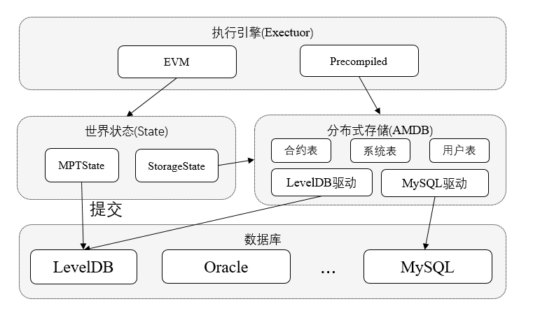

# 存储模块

## 框架

存储模块架构图如下所示：

### 世界状态

1. MPTSTate
使用MPT树存储账户的状态，与以太坊一致。

1. StorageState
使用分布式存储的表结构存储账户状态，不存历史信息，去掉了对MPT树的依赖，具有更好的性能表现。

### 分布式存储（Advanced Mass Database，AMDB）

通过抽象表结构，实现了SQL和NOSQL的统一，通过实现对应的存储驱动，可以支持各类数据库，目前已经实现支持LevelDB。

## AMDB

分布式存储（Advanced Mass Database，AMDB）通过对表结构的设计，既可以对应到关系型数据库的表，又可以拆分使用KV数据库存储。通过实现对应于不通数据库的存储驱动，AMDB理论上可以支持所有关系型和KV的数据库。

### 名词解释

- Entry，对应于表中的一行，每行以列名作为key，对应的值作为value，构成KV结构。每个Entry拥有自己的AMDB主key，不同Entry允许拥有相同的AMDB主key。
- Entries，Entries中存放主Key相同的Entry，数组。AMDB的主Key与Mysql中的主key不同，AMDB主key用于标示Entry属于哪个key，相同key的Entry会存放在同一个Entries中。
- Table，存储表中的所有数据，KV结构，kV由AMDB主key和Entries对象构成。

### 一个例子

- 表格中每一行就是一个Entry，每个Entry里面存储列名到值的映射。例如Entry0中就会存储`{_id_:0,_hash_:"...",_status_:0,name:小明,address:南山,,age:18}`，其中"..."表示hash的缩写。
- 以address作为AMDB的主key。
- Entry0和Entry2的AMDB主key相同，所以会放在同一个Entries中。
- 整个表构成一个AMDB的Table，Table中存储AMDB主key到对应Entries的映射。可以基于AMDB主key进行增删改查，支持条件筛选。

## StorageState

StorageState是基于AMDB实现的存储账户状态的方式，相比于MPTState去掉了MPT树，每个账户会有一个AMDB的Table来存储其相关数据。

## MPT State
