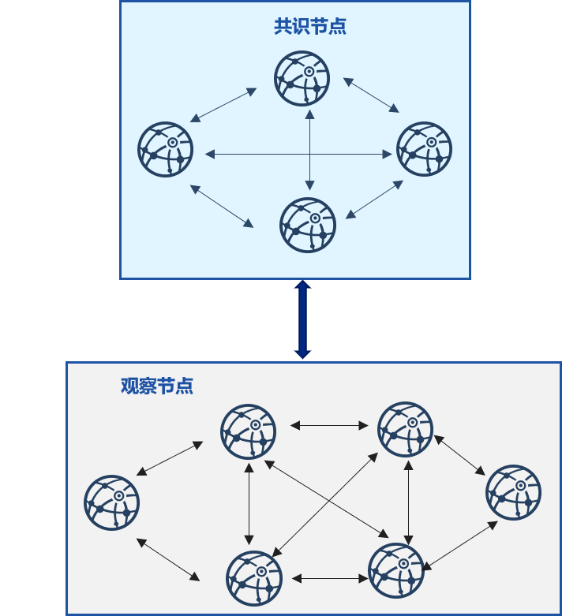
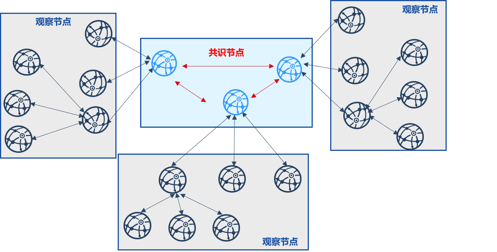
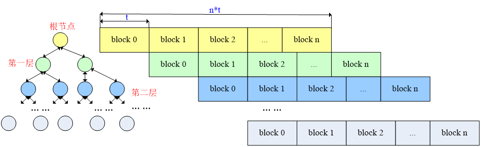
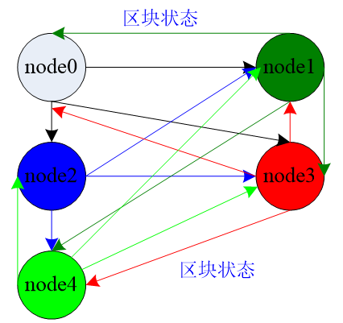

# 区块同步优化 

标签：``数据同步`` ``同步优化`` 

----

为了增强区块链系统在网络带宽受限情况下的可扩展性，FISCO BCOS v2.2.0对区块同步进行了优化：

- 为了降低单个节点的出带宽，消除网络带宽对网络规模的限制，支持更大网络规模，采用树状拓扑进行区块同步

- 采用gossip协议来保障树状拓扑区块同步的健壮性，定期同步区块状态，使得在部分节点网络断连的情况下，所有节点均能同步到最新区块状态

## 背景

考虑到目前使用BFT类共识算法的区块链网络复杂度较高、不具有无限可扩展性，因此大部分业务架构仅有部分节点作为共识节点，其他节点均作为观察节点(不参与共识，但拥有区块链全量数据)，如下图所示。

在这种架构中，大部分观察节点均随机从拥有最新区块的共识节点同步区块，在包含`n`个共识节点、`m`个观察节点的区块链系统中，设每个区块大小为`block_size`，理想情况下(即负载均衡)，每共识一个区块，每个共识节点需要向`m/n`个观察节点发送区块，共识节点出带宽大约是`(m/n)*block_size`，设网络带宽是`bandwidth`，则每个共识节点最多可向`(bandwidth/block_size)`个节点同步区块，即区块链网络规模最大是`(n*bandwidth/block_size)`，在公网带宽`bandwidth`较小，区块较大的情况下，能容纳的节点数有限，因此随机的区块同步策略不具有可扩展性。

## 区块状态树状广播

为降低多个观察节点向单个共识节点同步区块时，共识节点的网络出带宽对网络规模的影响，FISCO BCOS v2.2.0实现了区块状态树状广播策略。下图是由3个共识节点、18个观察节点构成的区块链系统沿三叉树进行区块同步的示意图：

该策略将观察节点分摊给每个共识节点，并以共识节点为顶点构造一颗三叉树，共识节点出块后，优先向其子观察节点发送最新区块状态，子观察节点同步最新区块后，优先向自己的子节点发送最新区块状态，以此类推。采用了区块状态树状广播策略后，每个节点仅将最新区块状态发送给子节点，设区块大小为`block_size`，树的宽度为`w`，则用于区块同步的网络带宽均为`(block_size * w)`，与区块链系统的节点总数无关，具有可扩展性。上图所示的共识节点采用区块状态树状广播后，出带宽降低了2倍。

区块状态树状广播工作流程如下：

- 共识节点共识提交新区块`block i`后，若其与子节点连通，则向其子节点同步最新区块状态，包括高度和区块哈希，记为`{i, block_hash(i)}`；否则递归判断是否与孙子节点连通，若连通，则向孙子节点同步最新区块状态；

- 子节点收到共识节点的区块状态后，判断接收到的区块状态`{i, block_hash(i)}`比自身区块状态新，则向共识节点发送区块请求，共识节点收到请求后，向该节点发送对应的区块；

- 子节点收到共识节点的区块后，验证成功后将其落盘，继续向自己的子节点发送自身的区块状态，同样，若该节点与自己的子节点断连，会递归判断是否与孙子节点连通，并向连通的孙子节点发送最新区块状态；

- 收到新区块状态的子节点，重复步骤(2)，进行区块同步。

当然，使用区块状态树状广播策略时，由于区块并非由拥有最新区块的根节点直接下发到所有观察者节点，作为叶子节点的观察者节点同步区块的时延会相对长一些。

下图展示了各层节点提交n个区块的时延，设树的深度为`d`，每个区块提交时延为`t`，则根节点(共识节点)提交`n`个区块的时延为`n*t`，第一层节点(观察者节点)同步并提交区块的时延为`n*t + t`，第二层节点(观察者节点)同步并提交区块的时延为`n*t + 2*t`，叶子节点同步并提交区块的时延为`n*t + d * t`，与共识节点的时延差为`d*t`，`n`远大于`d`时，这个时延几乎可以忽略，因此该策略对观察者节点TPS的影响非常小。

## 定期同步区块状态

考虑到若树状拓扑中部分节点断连，可能会导致区块无法到达部分节点，区块状态树状广播优化策略还采用了gossip协议定期同步区块状态。

即：随机挑选若干个节点，同步最新区块状态信息。由于最终区块状态信息会收敛所有区块链节点，树状拓扑中断连节点也能从其邻居节点同步最新区块，保证了树状区块状态广播的健壮性。

 
上图展示了各个节点如何使用gossip协议定期同步区块状态：

- 各个区块链节点每2s随机选择三个邻居节点广播当前区块状态，包括{区块高度，区块哈希}
- 节点收到这些区块状态包后，更新本地缓存的各个节点区块状态到最新
- 若某节点区块高度高于本节点区块高度，该节点会向拥有更高区块的节点同步区块

由于区块链节点之间定期同步区块状态，即使树状拓扑中部分节点断连，也可以保证每个节点同步到尽可能多的节点区块状态，并从拥有最高区块的节点下载最新区块，保障了树状区块状态广播可扩展性的同时，增强了整个系统的健壮性。

## 带宽对比

下图是采用了区块状态树状广播、定期同步区块状态策略后，区块同步优化效果：

整个区块链网络中包含10个共识节点，90个观察者节点，树的度设置为2。优化前，观察者节点主要从10个共识节点下载区块，共识节点的出流量可达到5000MB；优化后，部分下载流量分摊到了观察者节点，节点由区块下载带来的流量开销降低到了1400MB，降低了3倍多，基本接近最优(最优的情况是优化前峰值出带宽是优化后峰值出带宽的4.5倍，由于gossip协议导致的区块随机拉取情况的存在，无法达到最优，只能接近最优)。