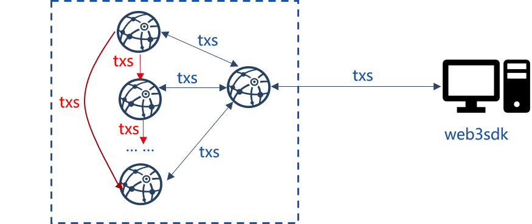
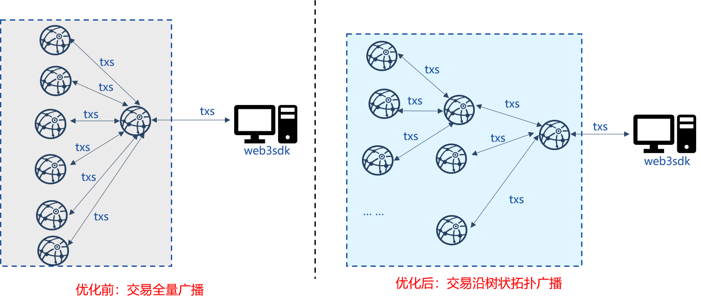
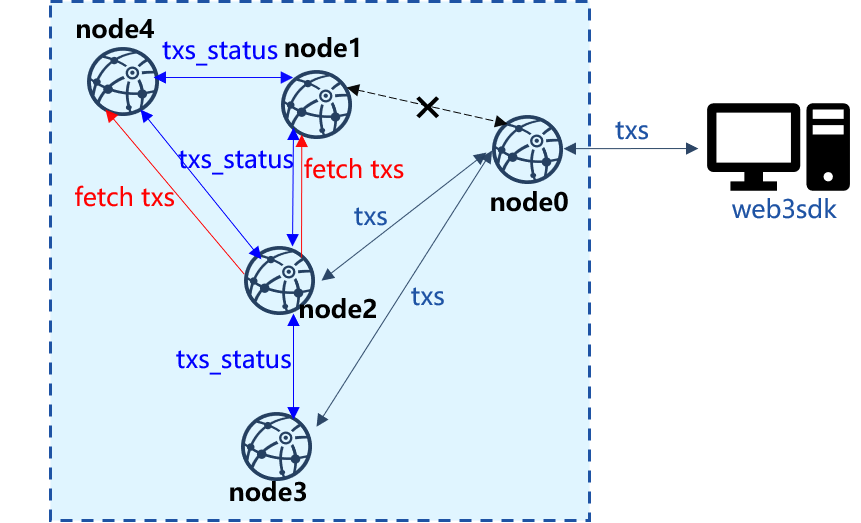

# 交易同步优化

标签：``数据同步`` ``同步优化`` ``交易同步``

----

区块链系统中，为了保障客户端发送的交易能到达所有节点，SDK直连的区块链节点需要将收到的交易广播给其他节点，如下图所示：

显然，SDK直连节点的出带宽与区块链节点总数成正比，随着区块链系统节点数的增加，该节点必然成为整个系统的瓶颈。

此外，为了保障节点网络断连的情况下，交易也能尽量到达所有节点，还引入了交易转发逻辑，节点收到其他节点广播过来的交易后，会随机选取25%的邻居节点转发收到的交易，在网络全连的情况下，这种交易转发策略无疑会带来巨大的带宽浪费，且节点数目越多，因交易转发带来的数据包冗余越多。

为降低SDK直连节点的出带宽、降低交易转发引起的大量冗余消息包，提升区块链系统的可扩展性，FISCO BCOS v2.2.0提出了**交易广播优化策略**和**交易转发优化策略**。

## 交易广播优化策略

为了降低SDK直连节点交易广播带来的网络压力，FISCO BCOS v2.2.0中，SDK直连节点收到交易后，沿着树状拓扑广播交易(树的宽度默认为3)。下图展示了优化前后7节点区块链系统交易广播拓扑：

- 优化前：节点收到SDK的交易后，全量广播给其他节点；
- 优化后：节点收到SDK的交易后，将其发送给子节点，子节点收到交易后，继续将其发送给自身的子节点。

采用交易树状广播后，上图所示的7节点区块链系统，SDK直连节点的带宽降低为原先的一半，且由于SDK直连节点以及其他节点广播交易的出带宽仅与树状拓扑的宽度有关，因此优化后的交易同步具有可扩展性。

## 交易转发优化策略

交易转发对于交易同步尤为重要，可以包含部分节点网络断连情况下，SDK发出的交易能尽量到达所有节点。但正如前面提到的，已有的交易转发策略会带来大量的带宽冗余，因此在交易树状广播的基础上，FISCO BCOS v2.2.0提出了交易转发优化策略，如下图所示，优化后的交易转发策略不直接转发交易，仅转发交易状态，节点根据其他节点的交易状态，获取缺失的交易，然后直接向对应节点请求交易。

上图中，SDK直连`node0`，但是`node0`与`node1`断连，此时`node0`仅能将交易广播给`node2`和`node3`。`node2`和`node3`收到交易后，将最新交易的列表打包成状态包发送给其他节点，`node1`和`node4`收到状态包后，与本地交易池内的交易列表做对比，获取缺失的交易列表，并批量向拥有这些交易的`node2`或`node3`请求这些交易。

交易转发具体流程如下：

- 节点收到新交易`txs`后，获取所有新交易的哈希，记为`txs_hash_list`，并将其打包成状态包，随机发送给25%的节点；
- 节点`node_x`收到某节点`node_i`交易状态包后，从中解出交易哈希列表`txs_hash_list`，并将其与本地交易池中的交易列表做对比，获取缺失的交易列表，记为`missed_txs_hash_list`，将其打包成交易请求，向`node_i`发出交易请求；
- `node_i`接收到交易请求后，从交易池中取出`missed_txs_hash_list`对应的所有交易，回复给`node_x`。

由于在全连的网络拓扑中，所有节点交易状态基本一致，因此节点间交易请求较少，相较于直接转发交易，大大降低了转发冗余交易引起的带宽浪费。

