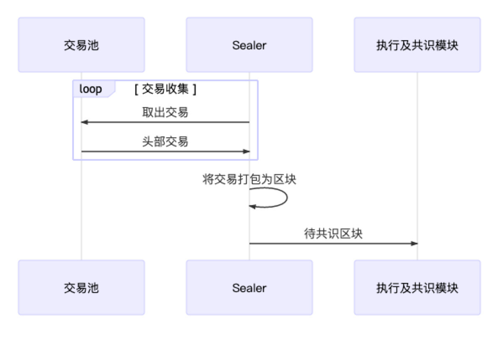

# 区块链交易流程

交易——区块链系统的核心，负责记录区块链上发生的一切。区块链引入智能合约后，交易便超脱『价值转移』的原始定义，其更加精准的定义应该是区块链中一次事务的数字记录。无论大小事务，都需要交易的参与。

交易的一生，贯穿下图所示的各个阶段。本文将梳理交易的整个流转过程，一窥FISCO BCOS交易完整生命周期。

## 交易生成

用户的请求给到客户端后，客户端会构建出一笔有效交易，交易中包括以下关键信息：

1. 发送地址：即用户自己的账户，用于表明交易来自何处。
2. 接收地址：FISCO BCOS中的交易分为两类，一类是部署合约的交易，一类是调用合约的交易。前者，由于交易并没有特定的接收对象，因此规定这类交易的接收地址固定为0x0；后者，则需要将交易的接收地址置为链上合约的地址。
3. 交易相关的数据：一笔交易往往需要一些用户提供的输入来执行用户期望的操作，这些输入会以二进制的形式被编码到交易中。
4. 交易签名：为了表明交易确实是由自己发送，用户会向SDK提供私钥来让客户端对交易进行签名，其中私钥和用户账户是一一对应的关系。

之后，区块链客户端会再向交易填充一些必要的字段，如用于防交易重放的交易ID及blockLimit。交易的具体结构和字段含义可以参考[编码协议文档](https://fisco-bcos-documentation.readthedocs.io/zh_CN/latest/docs/design/protocol_description.html)，交易构造完成后，客户端随后便通过Channel或RPC信道将交易发送给节点。

## 交易池

区块链交易被发送到节点后，节点会通过验证交易签名的方式来验证一笔交易是否合法。若一笔交易合法，则节点会进一步检查该交易是否重复出现过，若从未出现过，则将交易加入交易池缓存起来。若交易不合法或交易重复出现，则将直接丢弃交易。

## 交易广播

节点在收到交易后，除了将交易缓存在交易池外，节点还会将交易广播至该节点已知的其他节点。

为了能让交易尽可能到达所有节点，其他收到广播过来的交易节点，也会根据一些精巧的策略选择一些节点，将交易再一次进行广播，比如：对于从其他节点转发过来的交易，节点只会随机选择25%的节点再次广播，因为这种情况一般意味着交易已经开始在网络中被节点接力传递，缩减广播的规模有助于避免因网络中冗余的交易太多而出现的广播风暴问题。

## 交易打包

为了提高交易处理效率，同时也为了确定交易之后的执行顺序保证事务性，当交易池中有交易时，Sealer线程负责从交易池中按照先进先出的顺序取出一定数量的交易，组装成待共识区块，随后待共识区块会被发往各个节点进行处理。

## 交易执行

节点在收到区块后，会调用区块验证器把交易从区块中逐一拿出来执行。如果是预编译合约代码，验证器中的执行引擎会直接调用相应的C++功能，否则执行引擎就会把交易交给EVM（以太坊虚拟机）执行。

交易可能会执行成功，也可能因为逻辑错误或Gas不足等原因执行失败。交易执行的结果和状态会封装在交易回执中返回。

## 交易共识

区块链要求节点间就区块的执行结果达成一致才能出块。FISCO BCOS中一般采用PBFT算法保证整个系统的一致性，其大概流程是：各个节点先独立执行相同的区块，随后节点间交换各自的执行结果，如果发现超过2/3的节点都得出了相同的执行结果，那说明这个区块在大多数节点上取得了一致，节点便会开始出块。

## 交易落盘

在共识出块后，节点需要将区块中的交易及执行结果写入硬盘永久保存，并更新区块高度与区块哈希的映射表等内容，然后节点会从交易池中剔除已落盘的交易，以开始新一轮的出块流程。用户可以通过交易哈希等信息，在链上的历史数据中查询自己感兴趣的交易数据及回执信息。