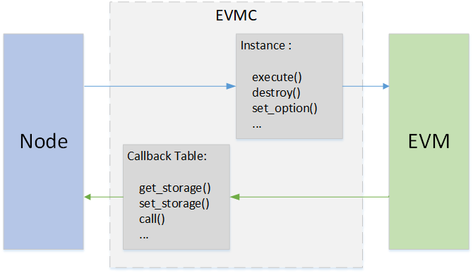

# EVM 以太坊虚拟机

标签：``EVM`` ``智能合约`` ``虚拟机`` 

----

在区块链上，用户通过运行部署在区块链上的合约，完成需要共识的操作。以太坊虚拟机，是智能合约代码的执行器。

当智能合约被编译成二进制文件后，被部署到区块链上。用户通过调用智能合约的接口，来触发智能合约的执行操作。EVM执行智能合约的代码，修改当前区块链上的数据（状态）。被修改的数据，会被共识，确保一致性。


## EVMC – Ethereum Client-VM Connector API

新版本的以太坊将EVM从节点代码中剥离出来，形成一个独立的模块。EVM与节点的交互，抽象出EVMC接口标准。通过EVMC，节点可以对接多种虚拟机，而不仅限于传统的基于solidity的虚拟机。

传统的solidity虚拟机，在以太坊中称为interpreter，下文主要解释interpreter的实现。

### EVMC 接口

EVMC主要定义了两种调用的接口：

- Instance接口：节点调用EVM的接口
- Callback接口：EVM回调节点的接口

EVM本身不保存状态数据，节点通过instance接口操作EVM，EVM反过来，调Callback接口，对节点的状态进行操作。



**Instance 接口**

定义了节点对虚拟机的操作，包括创建，销毁，设置等。

接口定义在evmc_instance（evmc.h）中

* abi_version  
* name  
* version  
* destroy  
* execute  
* set_tracer  
* set_option

**Callback接口**

定义了EVM对节点的操作，主要是对state读写、区块信息的读写等。

接口定义在evmc_context_fn_table（evmc.h）中。


* evmc_account_exists_fn account_exists
* evmc_get_storage_fn get_storage
* evmc_set_storage_fn set_storage
* evmc_get_balance_fn get_balance
* evmc_get_code_size_fn get_code_size
* evmc_get_code_hash_fn get_code_hash
* evmc_copy_code_fn copy_code
* evmc_selfdestruct_fn selfdestruct
* evmc_call_fn call
* evmc_get_tx_context_fn get_tx_context
* evmc_get_block_hash_fn get_block_hash
* evmc_emit_log_fn emit_log


## EVM 执行

### EVM 指令

solidity是合约的执行语言，solidity被solc编译后，变成类似于汇编的EVM指令。Interpreter定义了一套完整的指令集。solidity被编译后，生成二进制文件，二进制文件就是EVM指令的集合，交易以二进制的形式发往节点，节点收到后，通过EVMC调用EVM执行这些指令。在EVM中，用代码模拟实现了这些指令的逻辑。

Solidity是基于堆栈的语言，EVM在执行二进制时，也是以堆栈的方式进行调用。

**算术指令举例**

一条ADD指令，在EVM中的代码实现如下。SP是堆栈的指针，从栈顶第一和第二个位置（```SP[0]```、```SP[1]```）拿出数据，进行加和后，写入结果堆栈SPP的顶端```SPP[0]```。

``` cpp
CASE(ADD)
{
    ON_OP();
    updateIOGas();

    // pops two items and pushes their sum mod 2^256.
    m_SPP[0] = m_SP[0] + m_SP[1];
}
```

**跳转指令举例**

JUMP指令，实现了二进制代码间的跳转。首先从堆栈顶端```SP[0]```取出待跳转的地址，验证一下是否越界，放到程序计数器PC中，下一个指令，将从PC指向的位置开始执行。

``` cpp
CASE(JUMP)
{
    ON_OP();
    updateIOGas();
    m_PC = verifyJumpDest(m_SP[0]);
}
```

**状态读指令举例**

SLOAD可以查询状态数据。大致过程是，从堆栈顶端```SP[0]```取出要访问的key，把key作为参数，然后调evmc的callback函数```get_storage()``` ，查询相应的key对应的value。之后将读到的value写到结果堆栈SPP的顶端```SPP[0]```。

``` cpp
CASE(SLOAD)
{
    m_runGas = m_rev >= EVMC_TANGERINE_WHISTLE ? 200 : 50;
    ON_OP();
    updateIOGas();

    evmc_uint256be key = toEvmC(m_SP[0]);
    evmc_uint256be value;
    m_context->fn_table->get_storage(&value, m_context, &m_message->destination, &key);
    m_SPP[0] = fromEvmC(value);
}
```

**状态写指令举例**

SSTORE指令可以将数据写到节点的状态中，大致过程是，从栈顶第一和第二个位置（```SP[0]```、```SP[1]```）拿出key和value，把key和value作为参数，调用evmc的callback函数```set_storage()``` ，写入节点的状态。

``` cpp
CASE(SSTORE)
{
    ON_OP();
    if (m_message->flags & EVMC_STATIC)
        throwDisallowedStateChange();

    static_assert(
        VMSchedule::sstoreResetGas <= VMSchedule::sstoreSetGas, "Wrong SSTORE gas costs");
    m_runGas = VMSchedule::sstoreResetGas;  // Charge the modification cost up front.
    updateIOGas();

    evmc_uint256be key = toEvmC(m_SP[0]);
    evmc_uint256be value = toEvmC(m_SP[1]);
    auto status =
        m_context->fn_table->set_storage(m_context, &m_message->destination, &key, &value);

    if (status == EVMC_STORAGE_ADDED)
    {
        // Charge additional amount for added storage item.
        m_runGas = VMSchedule::sstoreSetGas - VMSchedule::sstoreResetGas;
        updateIOGas();
    }
}
```

**合约调用指令举例**

CALL指令能够根据地址调用另外一个合约。首先，EVM判断是CALL指令，调用```caseCall()```，在caseCall()```中，用```caseCallSetup()```从堆栈中拿出数据，封装成msg，作为参数，调用evmc的callback函数call。Eth在被回调```call()```后，启动一个新的EVM，处理调用，之后将新的EVM的执行结果，通过```call()```的参数返回给当前的EVM，当前的EVM将结果写入结果堆栈SSP中，调用结束。合约创建的逻辑与此逻辑类似。

``` cpp
CASE(CALL)
CASE(CALLCODE)
{
    ON_OP();
    if (m_OP == Instruction::DELEGATECALL && m_rev < EVMC_HOMESTEAD)
        throwBadInstruction();
    if (m_OP == Instruction::STATICCALL && m_rev < EVMC_BYZANTIUM)
        throwBadInstruction();
    if (m_OP == Instruction::CALL && m_message->flags & EVMC_STATIC && m_SP[2] != 0)
        throwDisallowedStateChange();
    m_bounce = &VM::caseCall;
}
BREAK

void VM::caseCall()
{
    m_bounce = &VM::interpretCases;

    evmc_message msg = {};

    // Clear the return data buffer. This will not free the memory.
    m_returnData.clear();

    bytesRef output;
    if (caseCallSetup(msg, output))
    {
        evmc_result result;
        m_context->fn_table->call(&result, m_context, &msg);

        m_returnData.assign(result.output_data, result.output_data + result.output_size);
        bytesConstRef{&m_returnData}.copyTo(output);

        m_SPP[0] = result.status_code == EVMC_SUCCESS ? 1 : 0;
        m_io_gas += result.gas_left;

        if (result.release)
            result.release(&result);
    }
    else
    {
        m_SPP[0] = 0;
        m_io_gas += msg.gas;
    }
    ++m_PC;
}
```


## 总结

EVM是一个状态执行的机器，输入是solidity编译后的二进制指令和节点的状态数据，输出是节点状态的改变。以太坊通过EVMC实现了多种虚拟机的兼容。但截至目前，并未出现除开interpreter之外的，真正生产可用的虚拟机。也许要做到同一份代码在不同的虚拟机上跑出相同的结果，是一件很难的事情。BCOS将持续跟进此部分的发展。

