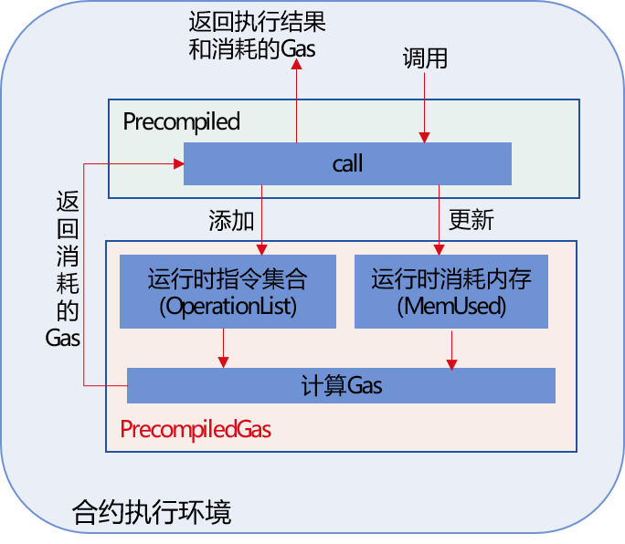
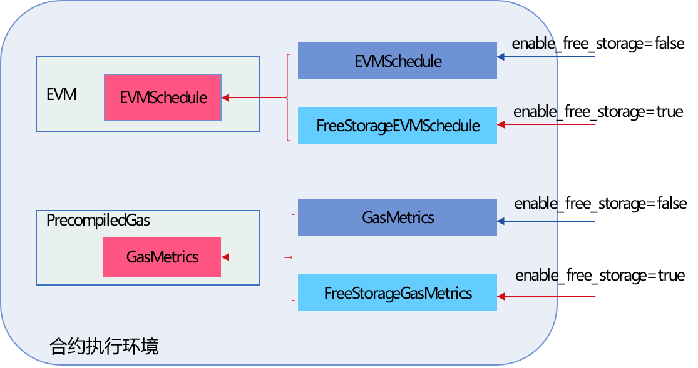

# Gas

标签：``Gas`` ``智能合约`` ``虚拟机`` 

----
EVM虚拟机有一整套Gas机制来衡量每笔交易上链消耗的CPU、内存和存储资源。FISCO BCOS 2.0引入了Precompiled合约，支持内置的C++合约，为了提升Precompiled合约的安全性，FISCO BCOS v2.4.0在Precompiled合约中引入了Gas机制。

此外，EVM原始的Gas机制中，交易的主要Gas消耗来源于存储，考虑到联盟链场景更关注CPU和内存消耗，FISCO BCOS v2.4.0调整了存储Gas，引入`Free Storage` Gas衡量模式，提升CPU和内存在交易Gas消耗中的占比。


## Precompiled合约支持Gas计算

```eval_rst
.. note::
    Precompiled合约支持Gas计算的特性从v2.4.0开始支持，当 ``supported_version`` 小于v2.4.0，或者旧链直接替换二进制升级时，不支持该特性
```

### 模块架构

FISCO BCOS v2.4.0新增了`PrecompiledGas`模块进行Gas计算，Gas开销主要包括CPU、内存和存储三个维度，模块图如下：



`PrecompiledGas`主要记录了每个交易执行Precompiled合约过程中调用的基础操作、占用内存消耗的Gas，交易调用Precompiled合约时Gas计算机制如下：

- 虚拟机执行交易调用`Precompiled`合约的`call`接口时，每调用一个基础操作，会将其对应的`OPCode`添加到`PrecompiledGas`的**运行时指令集合**中

- 虚拟机执行交易调用`Precompiled`合约的`call`接口时，基础操作占用的内存变化时，会更新`PrecompiledGas`的运行时消耗的内存

- `Precompiled`合约执行完毕后，可调用接口，根据运行`Precompiled`合约过程中执行的指令集合、消耗的内存，计算出该`Precompiled`合约Gas消耗。


### Precompiled合约Gas衡量标准

FISCO BCOS Precompiled合约Gas衡量标准参考了EVM，主要包括CPU、内存和存储三个维度。下面详细介绍Precompiled合约具体的Gas计算方法。

#### Precompiled合约内存Gas计算

Precompiled合约内存消耗主要来自于输入、输出以及运行时产生的额外内存消耗。某笔交易消耗的总内存为`txMemUsed`时，其对应的内存Gas计算公式如下。即：每32字节增加`memoryGasUnit`个Gas，`memoryGasUnit`的值为3.

```
    MemoryGas(txMemUsed) = memoryGasUnit * txMemUsed / 32 + (txMemUsed * txMemUsed)/512
```

#### Precompiled合约CPU、存储Gas计算

为了计算Precompiled合约基础操作消耗的Gas，FISCO BCOS v2.4.0将Precompiled合约映射到具体的操作码，并定义了每个基础操作对应的Gas。

##### Precompiled合约基础操作对应的操作码

`PrecompiledGas`模块将Precompiled合约基础操作映射到了操作码如下：

操作 | 说明 |  操作码  
-|-|-
EQ | ConditionPrecompiled的EQ调用，判断两个操作数是否相等 | 0x00 |
GE | ConditionPrecompiled的GE调用，判读左值是否大于等于右值 | 0x01 |
GT | ConditionPrecompiled的GT调用，判断左值是否大于右值 | 0x02 |
LE | ConditionPrecompiled的LE调用，判断左值是否小于等于右值 | 0x03 |
LT | ConditionPrecompiled的LT调用，判断左值是否小于右值 | 0x04 |
NE | ConditionPrecompiled的NE调用，判断左值是否不等于右值 | 0x05 |
Limit | ConditionPrecompiled的Limit调用，限制从CRUD接口中查询出来的数据条数 | 0x06 |
GetInt | EntryPrecompiled的getInt调用，将字符串转换成int256/uint256返回 | 0x07 |
GetAddr | EntryPrecompiled的getAddress调用，将字符串转换成Address | 0x08 |
Set | EntryPrecompiled的set调用，设置指定Key的值为指定的Value | 0x09 |
GetByte32 | EntryPrecompiled的getByte32，将字符串转换为byte 32| 0x0a |
GetByte64 | EntryPrecompiled的getByte64，将字符串转换为byte 64 | 0x0b |
GetString | EntryPrecompiled的getString，获取输入的Key对应的值Value | 0x0c |
CreateTable | TableFactoryPrecompiled的createTable调用，创建表 | 0x0d |
OpenTable | TableFactoryPrecompiled的openTable调用，打开表 | 0x0e |
Select | TablePrecompiled的select调用，查询表 | 0x0f |
Insert | TablePrecompiled的insert调用，向表中插入指定记录 | 0x10 |
Update | TablePrecompiled的update调用，更新指定表中的指定记录 | 0x11 |
Remove | TablePrecompiled的remove调用，删除指定表中的指定记录 | 0x12 |
PaillierAdd | 同态加接口 | 0x13 |
GroupSigVerify | 群签名验证接口 | 0x14 |
RingSigVerify | 环签名验证接口 | 0x15 |


##### Precompiled合约基础操作衡量标准

`PrecompiledGas`定义了Precompiled合约每个基础操作对应的Gas消耗，具体如下：

操作 | Gas消耗
-|-
EQ | 3 |
GE | 3 |
GT | 3 |
LE | 3 |
LT | 3 |
NE | 3 |
Limit | 3 |
GetInt | 3 |
GetAddr | 3 |
Set | 3 |
GetByte32 | 3 |
GetByte64 | 3 |
GetString | 3 |
CreateTable | 16000 |
OpenTable | 200 |
Select | 200 |
Insert | 10000 |
Update | 10000 |
Remove | 2500 |
PaillierAdd | 20000 |
GroupSigVerify | 20000 |
RingSigVerify | 20000 |


## EVM Gas衡量标准插件化

如前面所述，针对部分场景衡量交易资源耗用时，更加关注CPU和Gas，FISCO BCOS v2.4.0引入了`Free Storage`的Gas衡量模式，提升CPU和内存在交易Gas消耗中的占比。


```eval_rst
.. note::
    EVM Gas衡量标准支持插件化配置的特性从v2.4.0开始支持，当 ``supported_version`` 小于v2.4.0，或者旧链直接替换二进制升级时，不支持该特性
```

### 模块架构

为了支持Gas衡量标准插件化配置和FreeStorage的Gas衡量模式，FISCO BCOS v2.4.0在以太坊EVMSchedule引入`FreeStorageEVMSchedule`，在PrecopmiledGas的GasMetrics基础上引入了`FreeStorageGasMetrics`，并根据`genesis`文件的`enable_free_storage`配置项决定启用哪种Gas衡量模式，如下图所示：



为了提升CPU和内存在交易Gas消耗中的占比，`FreeStorageEVMSchedule`调整了创建合约、`SSTORE`、`SLOAD`等操作的Gas消耗；`FreeStorageGasMetrics`主要调整了`CreateTable`、`Insert`、`Remove`、`Update`等操作的Gas消耗。

### Gas衡量标准

下面分别介绍非`FreeStorage`模式和`FreeStorage`模式下，EVM虚拟机和Precompiled合约Gas衡量标准：

**EVM虚拟机Gas衡量标准**


Gas | 说明 | EVMSchedule模式下Gas消耗 | FreeStorageEVMSchedule模式下Gas消耗
-|- | - | - 
CreateGas | 创建合约的Gas消耗  | 32000 | 16000 |
sloadGas| 从存储读取32字节数据消耗的Gas  | 200 |  1200|
sstoreSetGas| 添加32字节数据到存储的Gas消耗 | 20000 | 1200 |
sstoreResetGas| 更新32字节存储数据的Gas消耗 |5000 | 1200 |

 **Precompiled合约Gas衡量标准**


Gas | 说明| GasMetrics模式下Gas消耗 | FreeStorageGasMetrics模式下Gas消耗
-|- | - | - 
CreateTableGas| 创建表的Gas消耗 | 16000 | 500 | 
StoreGas| 向表中插入数据或更新表中数据的Gas消耗 | 10000 | 200 | 
RemoveGas| 删除表中数据的Gas消耗 | 2500 | 200 | 


### 配置项

```eval_rst
.. note::
    EVM Gas衡量标准支持插件化配置项位于 ``genesis`` 文件中，详细可参考 `这里 <../../manual/configuration.html#evm>`_ 
```