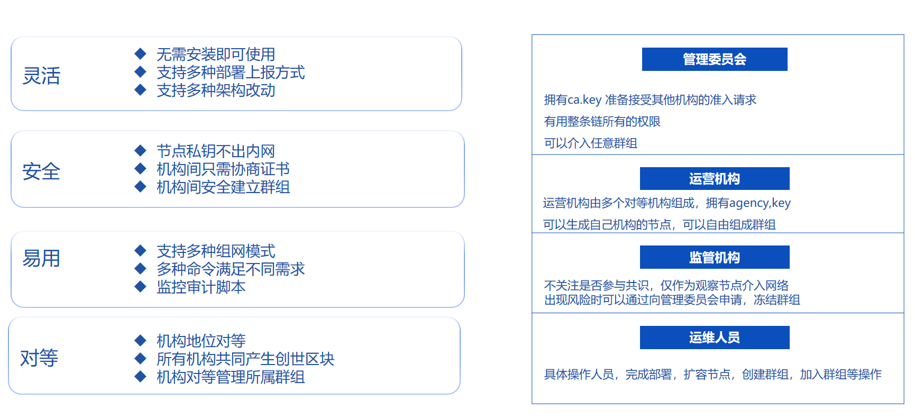

##############################################################
企业工具
##############################################################
fisco-generator_ 是针对多机构组网的企业区块链部署工具。 在使用时，本工具会根据用户配置的配置文件（包含节点的hostip，端口号等信息），及meta目录下用户存放的符合规范的节点证书，生成节点所需启动的安装包。

.. _fisco-generator: https://github.com/FISCO-BCOS/generator

用户生成安装包后，导入私钥，既可以启动节点。同时允许可以使用本工具及目录下的证书，生成新group的相关配置，用户将生成的配置文件拷贝至对应节点下，节点会进行group组网

特性分析如图所示:

注1：与1.3不同，fisco generator生成的安装包以node为单位，一个node为一个安装包，不建议一台服务器部署多个节点

注2：本文档中提及的节点证书，均为同一联盟链委员会(ca.crt）签发的证书

.. toctree::
   :maxdepth: 1

   hardware_requirement.md
   installing.md
   quick_start.md
   config.md
   manual/index.rst
   monitor.md
   playgroud/index.rst
