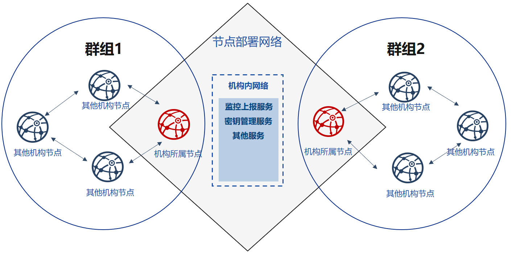

##############################################################
企业工具
##############################################################
fisco-generator_ 是针对多机构组网，适用于多机构部署维护多群组联盟链的企业区块链部署工具。

    - 在使用本工具时，所有机构间只需要共享节点的证书，各机构自己维护节点的私钥，并保证节点私钥不出内网，确保机构间节点安全性;
    - 本工具同时提供了多种部署方式，可以降低机构间生成与维护区块链的复杂度；
    - 基于本工具，多机构间可以通过交换数字证书，对等、安全地部署自己的节点。

.. _fisco-generator: https://github.com/FISCO-BCOS/generator

.. toctree::
   :maxdepth: 2

   introduction.md
   installation.md
   quick_start.md
   manual/index.rst
   using_playgroud.md