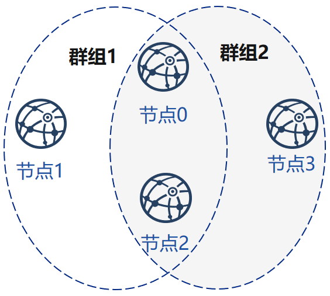
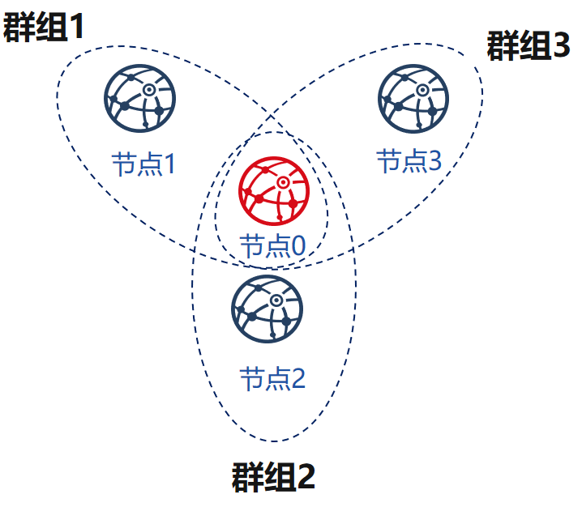
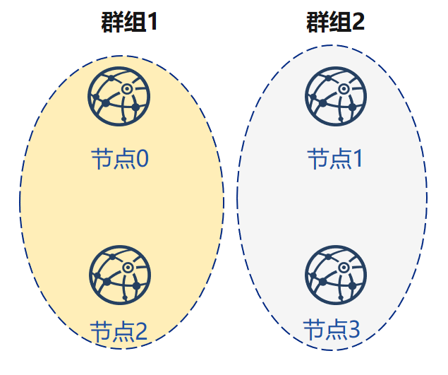

# 组网模式分析

针对[场景分析](./simple.md)中的场景，fisco generator将其总结为以下四种组网模式。

## 简单模式组网

简单模式组网可以适用于大多数单一业务的使用场景。整条链的所有节点都在唯一的一个群组中。

当业务的数据需要由区块链所有节点共识时，一般采用此模式组网

## 网状模式组网

网状模式组网适合有多个自需求的业务，如一条链的不同节点需要有多个需要共识的业务账本，希望业务没有交叉时彼此之间的账本是独立的，可以采用此模式组网。

## 星型模式组网

星型模式组网适合某一机构与其他机构有较多的交叉，但是其他机构之间通信较少的业务模式。

# 环形模式组网

环形模式组网适合多个机构之间经常有临时账本建立的需求，需要临时组网进行交易交互的模式。