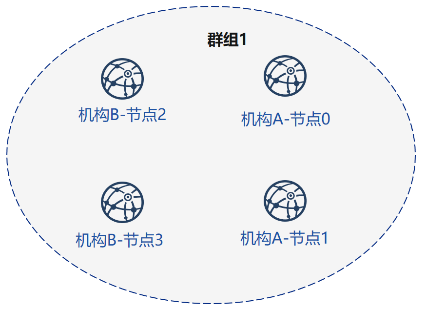
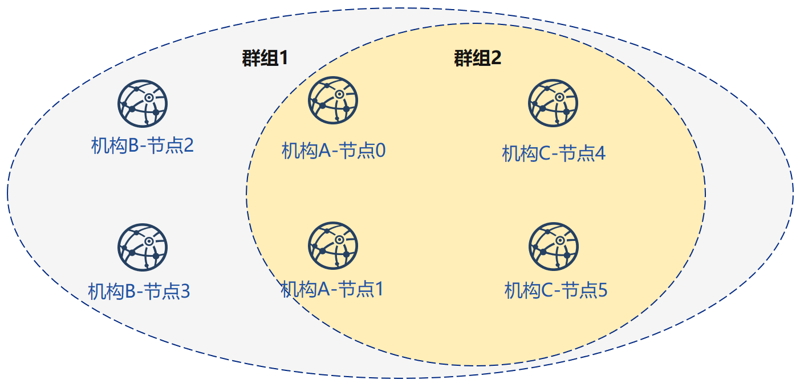

# 使用运维部署工具部署国密区块链

此文档为[使用运维部署工具部署](./tutorial_detail_operation.md)的国密部署版本

本章以部署**6节点3机构2群组**的组网模式，演示运维部署工具的使用方法。更多参数选项说明请参考[这里](./operation.md)。

本章节为多机构对等部署的过程，适用于多机构部署，机构私钥不出内网的情况，由单机构一键生成所有机构节点配置文件的教程可以参考[FISCO BCOS运维部署工具一键部署](./tutorial_one_click.md)。

## 下载安装

**下载**

```bash
cd ~/ && git clone https://github.com/FISCO-BCOS/generator.git
```

**安装**

此操作要求用户具有sudo权限。

```bash
cd ~/generator && bash ./scripts/install.sh
```

检查是否安装成功，若成功，输出 usage: generator xxx

```bash
./generator -h
```

**获取节点二进制**

拉取最新fisco-bcos二进制文件到meta中，如果网络较差，可以尝试通过其他方式下载`fisco-bcos`，或使用`--cdn`选项，并将下载好的二进制放置于`meta`文件夹下

```bash
./generator --download_fisco ./meta
```

**检查二进制版本**

2.5 及以前版本，若成功，输出 FISCO-BCOS gm Version : x.x.x-x
2.6 版本之后，直接输出 FISCO-BCOS Version : x.x.x-x

```bash
./meta/fisco-bcos -v
```

**PS**：[源码编译](../manual/get_executable.md)节点二进制的用户，只需要用编译出来的二进制替换掉`meta`文件夹下的二进制即可。

## 典型示例

为了保证机构的密钥安全，运维部署工具提供了一种机构间相互合作的的搭链方式。本节以部署6节点3机构2群组的组网模式，演示企业间如何相互配合，搭建区块链。

### 节点组网拓扑结构

一个如图所示的6节点3机构2群组的组网模式。机构B和机构C分别位于群组1和群组2中。机构A同属于群组1和群组2中。


### 机器环境

每个节点的IP，端口号为如下：

| 机构  | 节点  | 所属群组  | P2P地址           | RPC监听地址       | Channel监听地址|
| --- | --- | ----- | --------------- | --------------------- | -------------------- |
| 机构A | 节点0 | 群组1、2 | 127.0.0.1:30300 | 127.0.0.1:8545 | 0.0.0.0:20200 |
|     | 节点1 | 群组1、2 | 127.0.0.1:30301 | 127.0.0.1:8546 | 0.0.0.0:20201 |
| 机构B | 节点2 | 群组1   | 127.0.0.1:30302 | 127.0.0.1:8547 | 0.0.0.0:20202 |
|     | 节点3 | 群组1   | 127.0.0.1:30303  | 127.0.0.1:8548 | 0.0.0.0:20203 |
| 机构C | 节点4 | 群组2   | 127.0.0.1:30304 | 127.0.0.1:8549 | 0.0.0.0:20204 |
|     | 节点5 | 群组2   | 127.0.0.1:30305 | 127.0.0.1:8550 | 0.0.0.0:20205 |

```eval_rst
.. note::
    - 云主机的公网IP均为虚拟IP，若rpc_ip/p2p_ip/channel_ip填写外网IP，会绑定失败，须填写0.0.0.0
    - RPC/P2P/Channel监听端口必须位于1024-65535范围内，且不能与机器上其他应用监听端口冲突
    - 出于安全性和易用性考虑，FISCO BCOS v2.3.0版本最新节点config.ini配置将listen_ip拆分成jsonrpc_listen_ip和channel_listen_ip，但仍保留对listen_ip的解析功能，详细请参考 `这里 <../manual/configuration.html#configure-rpc>`_
    - 为便于开发和体验，channel_listen_ip参考配置是 `0.0.0.0` ，出于安全考虑，请根据实际业务网络情况，修改为安全的监听地址，如：内网IP或特定的外网IP
```

### 涉及机构

搭链操作涉及多个机构的合作，包括：

-   证书颁发机构
-   搭建节点的机构（简称“机构”）

### 关键流程

本流程简要的给出**证书颁发机构**，**节点机构间**如何相互配合搭建区块链。

#### 一、初始化链证书

1.  证书颁发机构操作：
    -   生成链证书

#### 二、生成群组1

1.  证书颁发机构操作：颁发机构证书
    -   生成机构证书
    -   发送证书
2.  机构间独立操作
    -   修改配置文件`node_deployment.ini`
    -   生成节点证书及节点P2P端口地址文件
3.  选取其中一个机构为群组生成创世块
    -   收集群组内所有节点证书
    -   修改配置文件`group_genesis.ini`
    -   为群组生成创世块文件
    -   分发创世块文件
4.  机构间独立操作：生成节点
    -   收集群组其他节点的P2P端口地址文件
    -   生成节点
    -   启动节点

#### 三、初始化新机构

1.  证书颁发机构操作：颁发新机构证书
    -   生成机构证书
    -   发送证书

#### 四、生成群组2

1.  新机构独立操作
    -   修改配置文件`node_deployment.ini`
    -   生成节点证书及节点P2P端口地址文件
2.  选取其中一个机构为群组生成创世块
    -   收集群组内所有节点证书
    -   修改配置文件`group_genesis.ini`
    -   为群组生成创世块文件
    -   分发创世块文件
3.  新机构独立操作：生成节点
    -   收集群组其他节点的P2P端口地址文件
    -   生成节点
    -   启动节点
4.  已有机构操作：配置新群组
    -   收集群组其他节点的P2P端口地址文件
    -   配置新群组与新增节点的P2P端口地址
    -   重启节点

#### 五、现有节点加入群组1

1.  群组1原有机构操作：
    -   发送群组1创世区块至现有节点
    -   配置控制台
    -   获取加入节点nodeid
    -   使用控制台将节点加入群组1

## 联盟链初始化

为了操作简洁，本示例所有操作在同一台机器上进行，用不同的目录模拟不同的机构环境。用文件复制操作来模拟网络的发送。进行了教程中的`下载安装`后，请将generator复制到对应机构的generator目录中。

### 机构初始化

我们以**教程中下载的generator作为证书颁发机构**。

**初始化机构A**

```bash
cp -r ~/generator ~/generator-A
```

**初始化机构B**

```bash
cp -r ~/generator ~/generator-B
```

### 初始化链证书

**由于FISCO BCOS节点与SDK通信时采用非国密方式，因此节点需要生成非国密版本的证书**

在证书颁发机构上进行操作，一条联盟链拥有唯一的链证书`ca.crt`和`gmca.crt`

用 [`--generate_chain_certificate`](./operation.html#generate-chain-certificate) 命令生成链证书

在证书生成机构目录下操作:

```bash
cd ~/generator
```


生成国密证书

```bash
./generator --generate_chain_certificate ./dir_chain_ca -g
```

生成普通证书

```bash
./generator --generate_chain_certificate ./dir_chain_ca_normal
```

查看链证书及私钥:

```bash
ls ./dir_chain_ca
```

```bash
# 上述命令解释
# 从左至右分别为链证书、链私钥
gmca.crt  gmca.key
```

```bash
ls ./dir_chain_ca_normal
```

```bash
# 上述命令解释
# 从左至右分别为链证书、链私钥
ca.crt  ca.key
```

## 机构A、B构建群组1

### 初始化机构A

教程中为了简化操作直接生成了机构证书和私钥，实际应用时应该由机构本地生成私钥`agency.key和gmagency.key`，再生成证书请求文件，向证书签发机构获取机构证书`agency.crt和gmagency.crt`。

在证书生成机构目录下操作:

```bash
cd ~/generator
```

生成机构A证书：

```bash
./generator --generate_agency_certificate ./dir_agency_ca ./dir_chain_ca agencyA -g
```

```bash
./generator --generate_agency_certificate ./dir_agency_ca ./dir_chain_ca_normal agencyA_normal
```

查看机构证书及私钥:

```bash
ls dir_agency_ca/agencyA/
```

```bash
# 上述命令解释
# 从左至右分别为机构证书、机构私钥、链证书
gmagency.crt  gmagency.key  gmca.crt
```

```bash
ls dir_agency_ca/agencyA_normal/
```

```bash
# 上述命令解释
# 从左至右分别为机构证书、机构私钥、链证书
agency.crt  agency.key  ca.crt
```


发送链证书、机构证书、机构私钥至机构A，示例是通过文件拷贝的方式，从证书授权机构将机构证书发送给对应的机构，放到机构的工作目录的meta子目录下

```bash
cp ./dir_agency_ca/agencyA/* ~/generator-A/meta/
```

```bash
cp ./dir_agency_ca/agencyA_normal/* ~/generator-A/meta/
```

### 初始化机构B

在证书生成机构目录下操作:

```bash
cd ~/generator
```

生成机构B证书：

```bash
./generator --generate_agency_certificate ./dir_agency_ca ./dir_chain_ca agencyB -g
```

```bash
./generator --generate_agency_certificate ./dir_agency_ca ./dir_chain_ca_normal agencyB_normal
```

发送链证书、机构证书、机构私钥至机构B，示例是通过文件拷贝的方式，从证书授权机构将机构证书发送给对应的机构，放到机构的工作目录的meta子目录下

```bash
cp ./dir_agency_ca/agencyB/* ~/generator-B/meta/
```

```bash
cp ./dir_agency_ca/agencyB_normal/* ~/generator-B/meta/
```

```eval_rst
.. important::

    一条联盟链中只能用到一个根证书ca.crt，多服务器部署时不要生成多个根证书和私钥。一个群组只能有一个群组创世区块group.x.genesis
```

### 机构A修改配置文件

[node_deployment.ini](./config.md#node-deployment-ini)为节点配置文件，运维部署工具会根据`node_deployment.ini`下的配置生成相关节点证书，及生成节点配置文件夹等。

机构A修改conf文件夹下的`node_deployment.ini`如下图所示:

在~/generator-A目录下执行下述命令

```bash
cd ~/generator-A
```

```bash
cat > ./conf/node_deployment.ini << EOF
[group]
group_id=1

[node0]
; host ip for the communication among peers.
; Please use your ssh login ip.
p2p_ip=127.0.0.1
; listen ip for the communication between sdk clients.
; This ip is the same as p2p_ip for physical host.
; But for virtual host e.g. vps servers, it is usually different from p2p_ip.
; You can check accessible addresses of your network card.
; Please see https://tecadmin.net/check-ip-address-ubuntu-18-04-desktop/
; for more instructions.
rpc_ip=127.0.0.1
channel_ip=0.0.0.0
p2p_listen_port=30300
channel_listen_port=20200
jsonrpc_listen_port=8545

[node1]
p2p_ip=127.0.0.1
rpc_ip=127.0.0.1
channel_ip=0.0.0.0
p2p_listen_port=30301
channel_listen_port=20201
jsonrpc_listen_port=8546
EOF
```

### 机构B修改配置文件

机构B修改conf文件夹下的`node_deployment.ini`如下图所示:

在~/generator-B目录下执行下述命令

```bash
cd ~/generator-B
```

```bash
cat > ./conf/node_deployment.ini << EOF
[group]
group_id=1

[node0]
; host ip for the communication among peers.
; Please use your ssh login ip.
p2p_ip=127.0.0.1
; listen ip for the communication between sdk clients.
; This ip is the same as p2p_ip for physical host.
; But for virtual host e.g. vps servers, it is usually different from p2p_ip.
; You can check accessible addresses of your network card.
; Please see https://tecadmin.net/check-ip-address-ubuntu-18-04-desktop/
; for more instructions.
rpc_ip=127.0.0.1
channel_ip=0.0.0.0
p2p_listen_port=30302
channel_listen_port=20202
jsonrpc_listen_port=8547

[node1]
p2p_ip=127.0.0.1
rpc_ip=127.0.0.1
channel_ip=0.0.0.0
p2p_listen_port=30303
channel_listen_port=20203
jsonrpc_listen_port=8548
EOF
```

### 机构A生成并发送节点信息

在~/generator-A目录下执行下述命令

```bash
cd ~/generator-A
```

机构A生成节点证书及P2P连接信息文件，此步需要用到上述配置的`node_deployment.ini`，及机构meta文件夹下的机构证书与私钥，机构A生成节点证书及P2P连接信息文件

```bash
./generator --generate_all_certificates ./agencyA_node_info -g
```

查看生成文件:

```bash
ls ./agencyA_node_info
```

```bash
# 上述命令解释
# 从左至右分别为需要交互给机构A的节点证书，节点P2P连接地址文件(根据node_deployment.ini生成的本机构节点信息)
gmcert_127.0.0.1_30300.crt gmcert_127.0.0.1_30301.crt peers.txt
```

机构生成节点时需要指定其他节点的节点P2P连接地址，因此，A机构需将节点P2P连接地址文件发送至机构B

```bash
cp ./agencyA_node_info/peers.txt ~/generator-B/meta/peersA.txt
```

### 机构B生成并发送节点信息

在~/generator-B目录下执行下述命令

```bash
cd ~/generator-B
```

机构B生成节点证书及P2P连接信息文件：

```bash
./generator --generate_all_certificates ./agencyB_node_info -g
```

生成创世区块的机构需要节点证书，示例中由A机构生成创世区块，因此B机构除了发送节点P2P连接地址文件外，还需发送节点证书至机构A

发送证书

```bash
cp ./agencyB_node_info/gmcert*.crt ~/generator-A/meta/
```

发送节点P2P连接地址文件

```bash
cp ./agencyB_node_info/peers.txt ~/generator-A/meta/peersB.txt
```

### 机构A生成群组1创世区块

在~/generator-A目录下执行下述命令

```bash
cd ~/generator-A
```

机构A修改conf文件夹下的`group_genesis.ini`，配置项可参考[手册](./config.md#group-genesis-ini)。:

```bash
cat > ./conf/group_genesis.ini << EOF
[group]
group_id=1

[nodes]
node0=127.0.0.1:30300
node1=127.0.0.1:30301
node2=127.0.0.1:30302
node3=127.0.0.1:30303
EOF
```

命令执行之后会修改./conf/group_genesis.ini文件：

```ini
;命令解释
[group]
;群组id
group_id=1

[nodes]
;机构A节点p2p地址
node0=127.0.0.1:30300
;机构A节点p2p地址
node1=127.0.0.1:30301
;机构B节点p2p地址
node2=127.0.0.1:30302
;机构B节点p2p地址
node3=127.0.0.1:30303
```

教程中选择机构A生成群组创世区块，实际生产中可以通过联盟链委员会协商选择。

此步会根据机构A的meta文件夹下配置的节点证书，生成group_genesis.ini配置的群组创世区块，教程中需要机构A的meta下有名为`gmcert_127.0.0.1_30300.crt`，`gmcert_127.0.0.1_30301.crt`，`gmcert_127.0.0.1_30302.crt`，`gmcert_127.0.0.1_30303.crt`的节点证书，此步需要用到机构B的节点证书。

```bash
./generator --create_group_genesis ./group -g
```

分发群组1创世区块至机构B：

```bash
cp ./group/group.1.genesis ~/generator-B/meta
```

### 机构A生成所属节点

在~/generator-A目录下执行下述命令

```bash
cd ~/generator-A
```

生成机构A所属节点，此命令会根据用户配置的`node_deployment.ini`文件生成相应的节点配置文件夹:

注意，此步指定的节点P2P连接信息`peers.txt`为群组内其他节点的链接信息，多个机构组网的情况下需要将其合并。

```bash
./generator --build_install_package ./meta/peersB.txt ./nodeA -g
```

查看生成节点配置文件夹：

```bash
ls ./nodeA
```

```bash
# 命令解释 此处采用tree风格显示
# 生成的文件夹nodeA信息如下所示，
├── monitor # monitor脚本
├── node_127.0.0.1_30300 # 127.0.0.1服务器 端口号30300的节点配置文件夹
├── node_127.0.0.1_30301
├── scripts # 节点的相关工具脚本
├── start_all.sh # 节点批量启动脚本
└── stop_all.sh # 节点批量停止脚本
```

机构A启动节点：

```bash
bash ./nodeA/start_all.sh
```

查看节点进程:

```bash
ps -ef | grep fisco
```

```bash
# 命令解释
# 可以看到如下进程
fisco  15347     1  0 17:22 pts/2    00:00:00 ~/generator-A/nodeA/node_127.0.0.1_30300/fisco-bcos -c config.ini
fisco  15402     1  0 17:22 pts/2    00:00:00 ~/generator-A/nodeA/node_127.0.0.1_30301/fisco-bcos -c config.ini
```

### 机构B生成所属节点

在~/generator-B目录下执行下述命令

```bash
cd ~/generator-B
```

生成机构B所属节点，此命令会根据用户配置的`node_deployment.ini`文件生成相应的节点配置文件夹:

```bash
./generator --build_install_package ./meta/peersA.txt ./nodeB -g
```

机构B启动节点：

```bash
bash ./nodeB/start_all.sh
```

```eval_rst
.. note::

    节点启动只需要推送对应ip的node文件夹即可，如127.0.0.1的服务器，只需node_127.0.0.1_port对应的节点配置文件夹。多机部署时，只需要将生成的节点文件夹推送至对应服务器即可。
```

### 查看群组1节点运行状态

查看进程：

```bash
ps -ef | grep fisco
```

```bash
# 命令解释
# 可以看到如下所示的进程
fisco  15347     1  0 17:22 pts/2    00:00:00 ~/generator-A/nodeA/node_127.0.0.1_30300/fisco-bcos -c config.ini
fisco  15402     1  0 17:22 pts/2    00:00:00 ~/generator-A/nodeA/node_127.0.0.1_30301/fisco-bcos -c config.ini
fisco  15457     1  0 17:22 pts/2    00:00:00 ~/generator-B/nodeB/node_127.0.0.1_30302/fisco-bcos -c config.ini
fisco  15498     1  0 17:22 pts/2    00:00:00 ~/generator-B/nodeB/node_127.0.0.1_30303/fisco-bcos -c config.ini
```

查看节点log：

```bash
tail -f ./node*/node*/log/log*  | grep +++
```

```bash
# 命令解释
# log中打印的+++即为节点正常共识
info|2019-02-25 17:25:56.028692| [g:1][p:264][CONSENSUS][SEALER]++++++++++++++++ Generating seal on,blkNum=1,tx=0,myIdx=0,hash=833bd983...
info|2019-02-25 17:25:59.058625| [g:1][p:264][CONSENSUS][SEALER]++++++++++++++++ Generating seal on,blkNum=1,tx=0,myIdx=0,hash=343b1141...
info|2019-02-25 17:25:57.038284| [g:1][p:264][CONSENSUS][SEALER]++++++++++++++++ Generating seal on,blkNum=1,tx=0,myIdx=1,hash=ea85c27b...
```

至此，我们完成了如图所示机构A、B搭建群组1的操作：



## 证书授权机构初始化机构C

在证书生成机构目录下操作:

```bash
cd ~/generator
```

**初始化机构C**，请注意，此时generator目录下有链证书及私钥，实际环境中机构C无法获取链证书及私钥。

```bash
cp -r ~/generator ~/generator-C
```

生成机构C证书：

```bash
./generator --generate_agency_certificate ./dir_agency_ca ./dir_chain_ca agencyC -g
```

```bash
./generator --generate_agency_certificate ./dir_agency_ca ./dir_chain_ca_normal agencyC_normal
```

发送链证书、机构证书、机构私钥至机构C，示例是通过文件拷贝的方式，从证书授权机构将机构证书发送给对应的机构，放到机构的工作目录的meta子目录下

```bash
cp ./dir_agency_ca/agencyC/* ~/generator-C/meta/
```

```bash
cp ./dir_agency_ca/agencyC_normal/* ~/generator-C/meta/
```

## 机构A、C构建群组2

接下来，机构C需要与A进行新群组建立操作，示例中以C生成创世区块为例。

### 机构A发送节点信息

由于机构A已经生成过节点证书及peers文件，只需将之前生成的节点P2P连接信息以及节点证书发送至机构C，操作如下：

在~/generator-A目录下执行下述命令

```bash
cd ~/generator-A
```

示例中由机构C生成群组创世区块，因此需要机构A的节点证书和节点P2P连接地址文件，将上述文件发送至机构C

发送证书

```bash
cp ./agencyA_node_info/gmcert*.crt ~/generator-C/meta/
```

发送节点P2P连接地址文件

```bash
cp ./agencyA_node_info/peers.txt ~/generator-C/meta/peersA.txt
```

### 机构C修改配置文件

机构C修改conf文件夹下的`node_deployment.ini`如下图所示:

在~/generator-C目录下执行下述命令

```bash
cd ~/generator-C
```

```bash
cat > ./conf/node_deployment.ini << EOF
[group]
group_id=2

[node0]
; host ip for the communication among peers.
; Please use your ssh login ip.
p2p_ip=127.0.0.1
; listen ip for the communication between sdk clients.
; This ip is the same as p2p_ip for physical host.
; But for virtual host e.g. vps servers, it is usually different from p2p_ip.
; You can check accessible addresses of your network card.
; Please see https://tecadmin.net/check-ip-address-ubuntu-18-04-desktop/
; for more instructions.
rpc_ip=127.0.0.1
channel_ip=0.0.0.0
p2p_listen_port=30304
channel_listen_port=20204
jsonrpc_listen_port=8549

[node1]
p2p_ip=127.0.0.1
rpc_ip=127.0.0.1
channel_ip=0.0.0.0
p2p_listen_port=30305
channel_listen_port=20205
jsonrpc_listen_port=8550
EOF
```

### 机构C生成并发送节点信息

在~/generator-C目录下执行下述命令

```bash
cd ~/generator-C
```

机构C生成节点证书及P2P连接信息文件：

```bash
./generator --generate_all_certificates ./agencyC_node_info -g
```

查看生成文件:

```bash
ls ./agencyC_node_info
```

```bash
# 上述命令解释
# 从左至右分别为需要交互给机构A的节点证书，节点P2P连接地址文件(根据node_deployment.ini生成的本机构节点信息)
gmcert_127.0.0.1_30304.crt gmcert_127.0.0.1_30305.crt peers.txt
```

机构生成节点时需要指定其他节点的节点P2P连接地址，因此，C机构需将节点P2P连接地址文件发送至机构A

```bash
cp ./agencyC_node_info/peers.txt ~/generator-A/meta/peersC.txt
```

### 机构C生成群组2创世区块

在~/generator-C目录下执行下述命令

```bash
cd ~/generator-C
```

机构C修改conf文件夹下的`group_genesis.ini`如下图所示:

```bash
cat > ./conf/group_genesis.ini << EOF
[group]
group_id=2

[nodes]
node0=127.0.0.1:30300
node1=127.0.0.1:30301
node2=127.0.0.1:30304
node3=127.0.0.1:30305
EOF
```

命令执行之后会修改./conf/group_genesis.ini文件：

```ini
;命令解释
[group]
group_id=2

[nodes]
node0=127.0.0.1:30300
;机构A节点p2p地址
node1=127.0.0.1:30301
;机构A节点p2p地址
node2=127.0.0.1:30304
;机构C节点p2p地址
node3=127.0.0.1:30305
;机构C节点p2p地址
```

教程中选择机构C生成群组创世区块，实际生产中可以通过联盟链委员会协商选择。

此步会根据机构C的meta文件夹下配置的节点证书，生成group_genesis.ini配置的群组创世区块。

```bash
./generator --create_group_genesis ./group -g
```

分发群组2创世区块至机构A：

```bash
cp ./group/group.2.genesis ~/generator-A/meta/
```

### 机构C生成所属节点

在~/generator-C目录下执行下述命令

```bash
cd ~/generator-C
```

```bash
./generator --build_install_package ./meta/peersA.txt ./nodeC -g
```

机构C启动节点：

```bash
bash ./nodeC/start_all.sh
```

```bash
ps -ef | grep fisco
```

```bash
# 命令解释
# 可以看到如下进程
fisco  15347     1  0 17:22 pts/2    00:00:00 ~/generator-A/nodeA/node_127.0.0.1_30300/fisco-bcos -c config.ini
fisco  15402     1  0 17:22 pts/2    00:00:00 ~/generator-A/nodeA/node_127.0.0.1_30301/fisco-bcos -c config.ini
fisco  15457     1  0 17:22 pts/2    00:00:00 ~/generator-B/nodeB/node_127.0.0.1_30302/fisco-bcos -c config.ini
fisco  15498     1  0 17:22 pts/2    00:00:00 ~/generator-B/nodeB/node_127.0.0.1_30303/fisco-bcos -c config.ini
fisco  15550     1  0 17:22 pts/2    00:00:00 ~/generator-C/nodeC/node_127.0.0.1_30304/fisco-bcos -c config.ini
fisco  15589     1  0 17:22 pts/2    00:00:00 ~/generator-C/nodeC/node_127.0.0.1_30305/fisco-bcos -c config.ini
```

### 机构A为现有节点初始化群组2

在~/generator-A目录下执行下述命令

```bash
cd ~/generator-A
```

添加群组2配置文件至已有节点，此步将群组2创世区块`group.2.genesis`添加至./nodeA下的所有节点内：

```bash
./generator --add_group ./meta/group.2.genesis ./nodeA
```

添加机构C节点连接文件peers至已有节点，此步将`peersC.txt`的节点P2P连接地址添加至./nodeA下的所有节点内:

```bash
./generator --add_peers ./meta/peersC.txt ./nodeA
```

重启机构A节点:

```bash
bash ./nodeA/stop_all.sh
```

```bash
bash ./nodeA/start_all.sh
```

### 查看群组2节点运行状态

查看节点进程：

```bash
ps -ef | grep fisco
```

```bash
# 命令解释
# 可以看到如下进程
fisco  15347     1  0 17:22 pts/2    00:00:00 ~/generator-A/nodeA/node_127.0.0.1_30300/fisco-bcos -c config.ini
fisco  15402     1  0 17:22 pts/2    00:00:00 ~/generator-A/nodeA/node_127.0.0.1_30301/fisco-bcos -c config.ini
fisco  15457     1  0 17:22 pts/2    00:00:00 ~/generator-B/nodeB/node_127.0.0.1_30302/fisco-bcos -c config.ini
fisco  15498     1  0 17:22 pts/2    00:00:00 ~/generator-B/nodeB/node_127.0.0.1_30303/fisco-bcos -c config.ini
fisco  15550     1  0 17:22 pts/2    00:00:00 ~/generator-C/nodeC/node_127.0.0.1_30304/fisco-bcos -c config.ini
fisco  15589     1  0 17:22 pts/2    00:00:00 ~/generator-C/nodeC/node_127.0.0.1_30305/fisco-bcos -c config.ini
```

查看节点log：

在~/generator-C目录下执行下述命令

```bash
cd ~/generator-C
```

```bash
tail -f ./node*/node*/log/log*  | grep +++
```

```bash
# 命令解释
# log中打印的+++即为节点正常共识
info|2019-02-25 17:25:56.028692| [g:2][p:264][CONSENSUS][SEALER]++++++++++++++++ Generating seal on,blkNum=1,tx=0,myIdx=0,hash=833bd983...
info|2019-02-25 17:25:59.058625| [g:2][p:264][CONSENSUS][SEALER]++++++++++++++++ Generating seal on,blkNum=1,tx=0,myIdx=0,hash=343b1141...
info|2019-02-25 17:25:57.038284| [g:2][p:264][CONSENSUS][SEALER]++++++++++++++++ Generating seal on,blkNum=1,tx=0,myIdx=1,hash=ea85c27b...
```

至此，我们完成了如图所示的机构A、C搭建群组2构建：


## 扩展教程--机构C节点加入群组1

将节点加入已有群组需要用户使用控制台发送指令，将节点加入群组，示例如下：

此时群组1内有机构A、B的节点，机构C节点加入群组1需要经过群组内节点的准入，示例以机构A节点为例：

在~/generator-A目录下执行下述命令

```bash
cd ~/generator-A
```

### 发送群组1创世区块至机构C

发送群组1配置文件至机构C节点：

```bash
./generator --add_group ./group/group.1.genesis  ~/generator-C/nodeC
```

当前`FISCO BCOS`暂不支持文件热更新，为机构C节点添加群组1创世区块后需重启节点。

重启机构C节点:

```bash
bash ~/generator-C/nodeC/stop_all.sh
```

```bash
bash ~/generator-C/nodeC/start_all.sh
```

### 配置控制台

机构A配置控制台或sdk，教程中以控制台为例：

```eval_rst
.. note::

    企业部署工具会根据generator/meta文件夹下的机构证书及私钥生成sdk相应证书，如需手动生成可以参考操作手册中的generate_sdk_certificate命令
```

国内用户推荐使用cdn下载，如果访问github较快，可以去掉`--cdn`选项 (**默认下载2.6.0+版本控制台不需要额外配**)：

```bash
./generator --download_console ./ --cdn
```


### 查看机构C节点4信息

机构A使用控制台加入机构C节点4为观察节点，其中参数第二项需要替换为加入节点的nodeid，nodeid在节点文件夹的conf的`gmnode.nodeid`文件

查看机构C节点nodeid：

```bash
cat ~/generator-C/nodeC/node_127.0.0.1_30304/conf/gmnode.nodeid
```

```bash
# 命令解释
# 可以看到类似于如下nodeid，控制台使用时需要传入该参数
ea2ca519148cafc3e92c8d9a8572b41ea2f62d0d19e99273ee18cccd34ab50079b4ec82fe5f4ae51bd95dd788811c97153ece8c05eac7a5ae34c96454c4d3123
```

### 使用控制台注册观察节点

启动控制台：

```bash
cd ~/generator-A/console && bash ./start.sh 1
```

使用控制台`addObserver`命令将节点注册为观察节点，此步需要用到`cat`命令查看得到机构C节点的`gmnode.nodeid`：

```bash
addObserver ea2ca519148cafc3e92c8d9a8572b41ea2f62d0d19e99273ee18cccd34ab50079b4ec82fe5f4ae51bd95dd788811c97153ece8c05eac7a5ae34c96454c4d3123
```

```bash
# 命令解释
# 执行成功会提示success
$ [group:1]> addObserver ea2ca519148cafc3e92c8d9a8572b41ea2f62d0d19e99273ee18cccd34ab50079b4ec82fe5f4ae51bd95dd788811c97153ece8c05eac7a5ae34c96454c4d3123
{
	"code":0,
	"msg":"success"
}
```

退出控制台：

```bash
exit
```

### 查看机构C节点5信息

机构A使用控制台加入机构C的节点5为共识节点，其中参数第二项需要替换为加入节点的nodeid，nodeid在节点文件夹的conf的`node.nodeid`文件

查看机构C节点nodeid：

```bash
cat ~/generator-C/nodeC/node_127.0.0.1_30305/conf/gmnode.nodeid
```

```bash
# 命令解释
# 可以看到类似于如下nodeid，控制台使用时需要传入该参数
5d70e046047e15a68aff8e32f2d68d1f8d4471953496fd97b26f1fbdc18a76720613a34e3743194bd78aa7acb59b9fa9aec9ec668fa78c54c15031c9e16c9e8d
```

### 使用控制台注册共识节点

启动控制台：

```bash
cd ~/generator-A/console && bash ./start.sh 1
```

使用控制台`addSealer`命令将节点注册为共识节点，此步需要用到`cat`命令查看得到机构C节点的`gmnode.nodeid`：

```bash
addSealer 5d70e046047e15a68aff8e32f2d68d1f8d4471953496fd97b26f1fbdc18a76720613a34e3743194bd78aa7acb59b9fa9aec9ec668fa78c54c15031c9e16c9e8d
```

```bash
# 命令解释
# 执行成功会提示success
$ [group:1]> addSealer 5d70e046047e15a68aff8e32f2d68d1f8d4471953496fd97b26f1fbdc18a76720613a34e3743194bd78aa7acb59b9fa9aec9ec668fa78c54c15031c9e16c9e8d
{
	"code":0,
	"msg":"success"
}
```

退出控制台：

```bash
exit
```

### 查看节点

在~/generator-C目录下执行下述命令

```bash
cd ~/generator-C
```

查看节点log内group1信息:

```bash
cat node*/node_127.0.0.1_3030*/log/log* | grep g:1  | grep Report
```

```bash
# 命令解释
# 观察节点只会同步交易数据，不会同步非交易状态的共识信息
# log中的^^^即为节点的交易信息，g:1为群组1打印的信息
info|2019-02-26 16:01:39.914367| [g:1][p:65544][CONSENSUS][PBFT]^^^^^^^^Report,num=0,sealerIdx=0,hash=9b76de5d...,next=1,tx=0,nodeIdx=65535
info|2019-02-26 16:01:40.121075| [g:1][p:65544][CONSENSUS][PBFT]^^^^^^^^Report,num=1,sealerIdx=3,hash=46b7f17c...,next=2,tx=1,nodeIdx=65535
info|2019-02-26 16:03:44.282927| [g:1][p:65544][CONSENSUS][PBFT]^^^^^^^^Report,num=2,sealerIdx=2,hash=fb982013...,next=3,tx=1,nodeIdx=65535
info|2019-02-26 16:01:39.914367| [g:1][p:65544][CONSENSUS][PBFT]^^^^^^^^Report,num=0,sealerIdx=0,hash=9b76de5d...,next=1,tx=0,nodeIdx=4
info|2019-02-26 16:01:40.121075| [g:1][p:65544][CONSENSUS][PBFT]^^^^^^^^Report,num=1,sealerIdx=3,hash=46b7f17c...,next=2,tx=1,nodeIdx=4
info|2019-02-26 16:03:44.282927| [g:1][p:65544][CONSENSUS][PBFT]^^^^^^^^Report,num=2,sealerIdx=2,hash=fb982013...,next=3,tx=1,nodeIdx=4
```

至此 我们完成了所示构建教程中的所有操作。



通过本节教程，我们在本机生成一个网络拓扑结构为3机构2群组6节点的多群组架构联盟链。

如果使用该教程遇到问题，请查看[FAQ](../faq.md)
