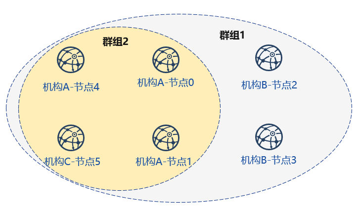
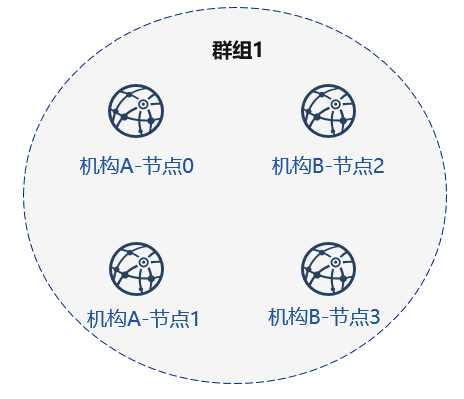
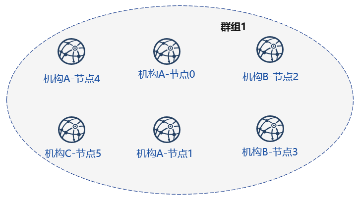

# 一键部署

标签：``运维部署工具`` ``一键部署``

----
`one_click_generator.sh`脚本为根据用户填写的节点配置，一键部署联盟链的脚本。脚本会根据用户指定文件夹下配置的`node_deployment.ini`，在文件夹下生成相应的节点。

本章主要以部署**3机构2群组6节点**的组网模式，为用户讲解单机构一键部署运维部署工具的使用方法。

本教程适用于单机构搭建所有节点的部署方式，运维部署工具多机构部署教程可以参考[使用运维部署工具](./tutorial_detail_operation.md)。

```eval_rst
.. important::
     一键部署脚本使用时需要确保当前meta文件夹下不含节点证书信息，请清空meta文件夹。
```

## 下载安装

**下载**

```bash
cd ~/ 
git clone https://github.com/FISCO-BCOS/generator.git

# 若因为网络问题导致长时间无法下载，请尝试以下命令：
git clone https://gitee.com/FISCO-BCOS/generator.git
```

**安装**

此操作要求用户具有sudo权限。

```bash
cd ~/generator && bash ./scripts/install.sh
```

检查是否安装成功，若成功，输出 usage: generator xxx

```bash
./generator -h
```

**获取节点二进制**

拉取最新fisco-bcos二进制文件到meta中，如果网络较差，可以尝试通过其他方式下载`fisco-bcos`，或使用`--cdn`选项，并将下载好的二进制放置于`meta`文件夹下

```bash
./generator --download_fisco ./meta
```

**检查二进制版本**

若成功，输出 FISCO-BCOS Version : x.x.x-x

```bash
./meta/fisco-bcos -v
```

**PS**：[源码编译](../manual/get_executable.md)节点二进制的用户，只需要用编译出来的二进制替换掉`meta`文件夹下的二进制即可。

## 背景介绍

本节以部署6节点3机构2群组的组网模式，演示如何使用运维部署工具一键部署功能，搭建区块链。

### 节点组网拓扑结构

一个如图所示的6节点3机构2群组的组网模式。机构B和机构C分别位于群组1和群组2中。机构A同属于群组1和群组2中。



### 机器环境

每个节点的IP，端口号为如下：

| 机构  | 节点  | 所属群组  | P2P地址           | RPC      | Channel监听地址 |
| --- | --- | ----- | --------------- | --------------------- | ------------------- |
| 机构A | 节点0 | 群组1、2 | 127.0.0.1:30300 | 127.0.0.1:8545 | 0.0.0.0:20200 |
|     | 节点1 | 群组1、2 | 127.0.0.1:30301 | 127.0.0.1:8546 | 0.0.0.0:20201 |
|     | 节点4 | 群组1、2  | 127.0.0.1:30304 | 127.0.0.1:8549 | 0.0.0.0:20202 |
| 机构B | 节点2 | 群组1   | 127.0.0.1:30302 | 127.0.0.1:8547 | 0.0.0.0:20203 |
|     | 节点3 | 群组1   | 127.0.0.1:30303  | 127.0.0.1:8548 | 0.0.0.0:20204 |
| 机构C | 节点5 | 群组1、2   | 127.0.0.1:30305 | 127.0.0.1:8550 | 0.0.0.0:20205 |

```eval_rst
.. note::
    - 云主机的公网IP均为虚拟IP，若rpc_ip/p2p_ip/channel_ip填写外网IP，会绑定失败，须填写0.0.0.0
    - RPC/P2P/Channel监听端口必须位于1024-65535范围内，且不能与机器上其他应用监听端口冲突
    - 出于安全性和易用性考虑，FISCO BCOS v2.3.0版本最新节点config.ini配置将listen_ip拆分成jsonrpc_listen_ip和channel_listen_ip，但仍保留对listen_ip的解析功能，详细请参考 `这里  <../manual/configuration.html#rpc>`_
    - 为便于开发和体验，channel_listen_ip参考配置是 `0.0.0.0` ，出于安全考虑，请根据实际业务网络情况，修改为安全的监听地址，如：内网IP或特定的外网IP
```

## 部署网络

首先完成如图所示机构A、B搭建群组1的操作：



使用前用户需准备如图如`tmp_one_click`的文件夹，在文件夹下分别拥有不同机构的目录，每个机构目录下需要有对应的配置文件[```node_deployment.ini```](./config.md#node-deployment-ini)。使用前需要保证generator的meta文件夹没有进行过任何操作。

查看一键部署模板文件夹：

```bash
cd ~/generator
ls ./tmp_one_click
```

```bash
# 参数解释
# 如需多个机构，需要手动创建该文件夹
tmp_one_click # 用户指定进行一键部署操作的文件夹
├── agencyA # 机构A目录，命令执行后会在该目录下生成机构A的节点及相关文件
│   └── node_deployment.ini # 机构A节点配置文件，一键部署命令会根据该文件生成相应节点
└── agencyB # 机构B目录，命令执行后会在该目录下生成机构B的节点及相关文件
    └── node_deployment.ini # 机构B节点配置文件，一键部署命令会根据该文件生成相应节点
```

### 机构填写节点信息

教程中将配置文件放置与tmp_one_click文件夹下的agencyA, agencyB下

```bash
cat > ./tmp_one_click/agencyA/node_deployment.ini << EOF
[group]
group_id=1

[node0]
; Host IP for the communication among peers.
; Please use your ssh login IP.
p2p_ip=127.0.0.1
; listening IP for the communication between SDK clients.
; This IP is the same as p2p_ip for the physical host.
; But for virtual host e.g., VPS servers, it is usually different from p2p_ip.
; You can check accessible addresses of your network card.
; Please see https://tecadmin.net/check-ip-address-ubuntu-18-04-desktop/
; for more instructions.
rpc_ip=127.0.0.1
channel_ip=0.0.0.0
p2p_listen_port=30300
channel_listen_port=20200
jsonrpc_listen_port=8545

[node1]
p2p_ip=127.0.0.1
rpc_ip=127.0.0.1
channel_ip=0.0.0.0
p2p_listen_port=30301
channel_listen_port=20201
jsonrpc_listen_port=8546
EOF
```

```bash
cat > ./tmp_one_click/agencyB/node_deployment.ini << EOF
[group]
group_id=1

[node0]
; Host IP for the communication among peers.
; Please use your ssh login IP.
p2p_ip=127.0.0.1
; listening IP for the communication between SDK clients.
; This IP is the same as p2p_ip for the physical host.
; But for virtual host e.g., VPS servers, it is usually different from p2p_ip.
; You can check accessible addresses of your network card.
; Please see https://tecadmin.net/check-ip-address-ubuntu-18-04-desktop/
; for more instructions.
rpc_ip=127.0.0.1
channel_ip=0.0.0.0
p2p_listen_port=30302
channel_listen_port=20202
jsonrpc_listen_port=8547

[node1]
p2p_ip=127.0.0.1
rpc_ip=127.0.0.1
channel_ip=0.0.0.0
p2p_listen_port=30303
channel_listen_port=20203
jsonrpc_listen_port=8548
EOF
```

### 生成节点

```bash
bash ./one_click_generator.sh -b ./tmp_one_click
```

执行完毕后，./tmp_one_click文件夹结构如下：

查看执行后的一键部署模板文件夹：

```bash
ls ./tmp_one_click
```

```bash
├── agencyA # A机构文件夹
│   ├── agency_cert # A机构证书及私钥
│   ├── generator-agency # 自动代替A机构进行操作的generator文件夹
│   ├── node # A机构生成的节点，多机部署时推送至对应服务器即可
│   ├── node_deployment.ini # A机构的节点配置信息
│   └── sdk # A机构的sdk或控制台配置文件
├── agencyB
|   ├── agency_cert
|   ├── generator-agency
|   ├── node
|   ├── node_deployment.ini
|   └── sdk
|── ca.crt # 链证书
|── ca.key # 链私钥
|── group.1.genesis # 群组1创世区块
|── peers.txt # 节点的peers.txt信息
```

### 启动节点

调用脚本启动节点：

```bash
bash ./tmp_one_click/agencyA/node/start_all.sh
```

```bash
bash ./tmp_one_click/agencyB/node/start_all.sh
```

查看节点进程：

```bash
ps -ef | grep fisco
```

```bash
# 命令解释
# 可以看到如下进程
fisco  15347     1  0 17:22 pts/2    00:00:00 ~/generator/tmp_one_click/agencyA/node/node_127.0.0.1_30300/fisco-bcos -c config.ini
fisco  15402     1  0 17:22 pts/2    00:00:00 ~/generator/tmp_one_click/agencyA/node/node_127.0.0.1_30301/fisco-bcos -c config.ini
fisco  15442     1  0 17:22 pts/2    00:00:00 ~/generator/tmp_one_click/agencyB/node/node_127.0.0.1_30302/fisco-bcos -c config.ini
fisco  15456     1  0 17:22 pts/2    00:00:00 ~/generator/tmp_one_click/agencyB/node/node_127.0.0.1_30303/fisco-bcos -c config.ini
```

### 查看节点运行状态

查看节点log：

```bash
tail -f ~/generator/tmp_one_click/agency*/node/node*/log/log*  | grep +++
```

```bash
# 命令解释
# +++即为节点正常共识
info|2019-02-25 17:25:56.028692| [g:1][p:264][CONSENSUS][SEALER]++++++++++++++++ Generating seal on,blkNum=1,tx=0,myIdx=0,hash=833bd983...
info|2019-02-25 17:25:59.058625| [g:1][p:264][CONSENSUS][SEALER]++++++++++++++++ Generating seal on,blkNum=1,tx=0,myIdx=0,hash=343b1141...
info|2019-02-25 17:25:57.038284| [g:1][p:264][CONSENSUS][SEALER]++++++++++++++++ Generating seal on,blkNum=1,tx=0,myIdx=1,hash=ea85c27b...
```

## 新增节点 (扩容新节点)

```eval_rst
.. important::
     一键部署脚本使用时需要确保当前meta文件夹下不含节点证书信息，请清空meta文件夹。
```

接下来，我们为机构A和机构C增加新节点，完成下图所示的组网：



### 初始化扩容配置

**创建扩容文件夹，示例中tmp_one_click_expand可以为任意名称，请每次扩容使用新的文件夹**

```bash
mkdir ~/generator/tmp_one_click_expand/
```

拷贝链证书及私钥至扩容文件夹

```bash
cp  ~/generator/tmp_one_click/ca.* ~/generator/tmp_one_click_expand/
```

拷贝群组1创世区块`group.1.genesis`至扩容文件夹

```bash
cp  ~/generator/tmp_one_click/group.1.genesis ~/generator/tmp_one_click_expand/
```

拷贝群组1节点P2P连接文件`peers.txt`至扩容文件夹

```bash
cp  ~/generator/tmp_one_click/peers.txt ~/generator/tmp_one_click_expand/
```

### 机构A配置节点信息

创建机构A扩容节点所在目录

```bash
mkdir ~/generator/tmp_one_click_expand/agencyA
```

此时机构A已经存在联盟链中，因此需拷贝机构A证书、私钥至对应文件夹

```bash
cp -r ~/generator/tmp_one_click/agencyA/agency_cert ~/generator/tmp_one_click_expand/agencyA
```

机构A填写节点配置信息

```bash
cat > ./tmp_one_click_expand/agencyA/node_deployment.ini << EOF
[group]
group_id=1

[node0]
; Host IP for the communication among peers.
; Please use your ssh login IP.
p2p_ip=127.0.0.1
; listening IP for the communication between SDK clients.
; This IP is the same as p2p_ip for the physical host.
; But for virtual host e.g., VPS servers, it is usually different from p2p_ip.
; You can check accessible addresses of your network card.
; Please see https://tecadmin.net/check-ip-address-ubuntu-18-04-desktop/
; for more instructions.
rpc_ip=127.0.0.1
channel_ip=0.0.0.0
p2p_listen_port=30304
channel_listen_port=20204
jsonrpc_listen_port=8549
EOF
```

### 机构C配置节点信息

创建机构C扩容节点所在目录

```bash
mkdir ~/generator/tmp_one_click_expand/agencyC
```

机构C填写节点配置信息

```bash
cat > ./tmp_one_click_expand/agencyC/node_deployment.ini << EOF
[group]
group_id=1

[node0]
; Host IP for the communication among peers.
; Please use your ssh login IP.
p2p_ip=127.0.0.1
; listening IP for the communication between SDK clients.
; This IP is the same as p2p_ip for the physical host.
; But for virtual host e.g., VPS servers, it is usually different from p2p_ip.
; You can check accessible addresses of your network card.
; Please see https://tecadmin.net/check-ip-address-ubuntu-18-04-desktop/
; for more instructions.
rpc_ip=127.0.0.1
channel_ip=0.0.0.0
p2p_listen_port=30305
channel_listen_port=20205
jsonrpc_listen_port=8550
EOF
```

### 生成扩容节点

```bash
bash ./one_click_generator.sh -e ./tmp_one_click_expand
```

### 启动新节点

调用脚本启动节点：

```bash
bash ./tmp_one_click_expand/agencyA/node/start_all.sh
```

```bash
bash ./tmp_one_click_expand/agencyC/node/start_all.sh
```

查看节点进程：

```bash
ps -ef | grep fisco
```

```bash
# 命令解释
# 可以看到如下进程
fisco  15347     1  0 17:22 pts/2    00:00:00 ~/generator/tmp_one_click/agencyA/node/node_127.0.0.1_30300/fisco-bcos -c config.ini
fisco  15402     1  0 17:22 pts/2    00:00:00 ~/generator/tmp_one_click/agencyA/node/node_127.0.0.1_30301/fisco-bcos -c config.ini
fisco  15403     1  0 17:22 pts/2    00:00:00 ~/generator/tmp_one_click_expand/agencyA/node/node_127.0.0.1_30304/fisco-bcos -c config.ini
fisco  15442     1  0 17:22 pts/2    00:00:00 ~/generator/tmp_one_click/agencyB/node/node_127.0.0.1_30302/fisco-bcos -c config.ini
fisco  15456     1  0 17:22 pts/2    00:00:00 ~/generator/tmp_one_click/agencyB/node/node_127.0.0.1_30303/fisco-bcos -c config.ini
fisco  15466     1  0 17:22 pts/2    00:00:00 ~/generator/tmp_one_click_expand/agencyC/node/node_127.0.0.1_30305/fisco-bcos -c config.ini
```

```eval_rst
.. important::

    为群组1扩容的新节点需要使用sdk或控制台加入到群组中。
```

### 使用控制台注册节点

由于控制台体积较大，一键部署中没有直接集成，用户可以使用以下命令获取控制台

```eval_rst
.. note::

    企业部署工具会根据generator/meta文件夹下的机构证书及私钥生成sdk相应证书，如需手动生成可以参考操作手册中的generate_sdk_certificate命令
```

获取控制台，可能需要较长时间，国内用户可以使用`--cdn`命令：

以机构A使用控制台为例，此步需要切换到机构A对应的`generator-agency`文件夹

```bash
cd ~/generator/tmp_one_click/agencyA/generator-agency
```

```bash
./generator --download_console ./ --cdn
```

### 查看机构A节点4

机构A使用控制台加入机构A节点4为共识节点，其中参数第二项需要替换为加入节点的nodeid，nodeid在节点文件夹的conf的`node.nodeid`文件

查看机构A节点nodeid：

```bash
cat ~/generator/tmp_one_click_expand/agencyA/node/node_127.0.0.1_30304/conf/node.nodeid
```

```bash
# 命令解释
# 可以看到类似于如下nodeid，控制台使用时需要传入该参数
ea2ca519148cafc3e92c8d9a8572b41ea2f62d0d19e99273ee18cccd34ab50079b4ec82fe5f4ae51bd95dd788811c97153ece8c05eac7a5ae34c96454c4d3123
```

### 使用控制台注册共识节点

启动控制台：

```bash
cd ~/generator/tmp_one_click/agencyA/generator-agency/console && bash ./start.sh 1
```

使用控制台`addSealer`命令将节点注册为共识节点，此步需要用到`cat`命令查看得到机构A节点的`node.nodeid`：

```bash
addSealer ea2ca519148cafc3e92c8d9a8572b41ea2f62d0d19e99273ee18cccd34ab50079b4ec82fe5f4ae51bd95dd788811c97153ece8c05eac7a5ae34c96454c4d3123
```

```bash
# 命令解释
# 执行成功会提示success
$ [group:1]> addSealer ea2ca519148cafc3e92c8d9a8572b41ea2f62d0d19e99273ee18cccd34ab50079b4ec82fe5f4ae51bd95dd788811c97153ece8c05eac7a5ae34c96454c4d3123
{
	"code":0,
	"msg":"success"
}

```
退出控制台：

```bash
exit
```

### 查看机构C节点5

机构A使用控制台加入机构C的节点5为观察节点，其中参数第二项需要替换为加入节点的nodeid，nodeid在节点文件夹的conf的`node.nodeid`文件

查看机构C节点nodeid：

```bash
cat ~/generator/tmp_one_click_expand/agencyC/node/node_127.0.0.1_30305/conf/node.nodeid
```

```bash
# 命令解释
# 可以看到类似于如下nodeid，控制台使用时需要传入该参数
5d70e046047e15a68aff8e32f2d68d1f8d4471953496fd97b26f1fbdc18a76720613a34e3743194bd78aa7acb59b9fa9aec9ec668fa78c54c15031c9e16c9e8d
```

### 使用控制台注册观察节点

启动控制台：

```bash
cd ~/generator/tmp_one_click/agencyA/generator-agency/console && bash ./start.sh 1
```

使用控制台`addObserver`命令将节点注册为观察节点，此步需要用到`cat`命令查看得到机构C节点的`node.nodeid`：

```bash
addObserver 5d70e046047e15a68aff8e32f2d68d1f8d4471953496fd97b26f1fbdc18a76720613a34e3743194bd78aa7acb59b9fa9aec9ec668fa78c54c15031c9e16c9e8d
```

```bash
# 命令解释
# 执行成功会提示success
$ [group:1]> addObserver 5d70e046047e15a68aff8e32f2d68d1f8d4471953496fd97b26f1fbdc18a76720613a34e3743194bd78aa7acb59b9fa9aec9ec668fa78c54c15031c9e16c9e8d
{
	"code":0,
	"msg":"success"
}
```

退出控制台：

```bash
exit
```

至此，我们完成了新增节点至现有群组的操作。

## 新增群组 (扩容新群组)

新建群组的操作用户可以在执行`one_click_generator.sh`脚本的目录下，通过修改`./conf/group_genesis.ini`文件，并执行`--create_group_genesis`命令。

为如图4个节点生成群组2


### 配置群组2创世区块

```eval_rst
.. important::

    此操作需要在和上述操作generator下执行。
```

```bash
cd ~/generator
```

配置群组创世区块文件，指定`group_id`为2。并在`[node]`下指定新群组中各个节点的IP和P2P端口，分别为机构A-节点0，机构A-节点1，机构A-节点4和机构C-节点5。

```bash
cat > ./conf/group_genesis.ini << EOF
[group]
group_id=2

[nodes]
node0=127.0.0.1:30300
node1=127.0.0.1:30301
node2=127.0.0.1:30304
node3=127.0.0.1:30305
EOF
```

### 获取对应节点证书

机构A-节点0（`node0=127.0.0.1:30300`）

```bash
cp ~/generator/tmp_one_click/agencyA/generator-agency/meta/cert_127.0.0.1_30300.crt ~/generator/meta
```

机构A-节点1（`node1=127.0.0.1:30301`）

```bash
cp ~/generator/tmp_one_click/agencyA/generator-agency/meta/cert_127.0.0.1_30301.crt ~/generator/meta
```

机构A-节点4（`node2=127.0.0.1:30304`）

```bash
cp ~/generator/tmp_one_click_expand/agencyA/generator-agency/meta/cert_127.0.0.1_30304.crt ~/generator/meta
```

机构C-节点5（`node3=127.0.0.1:30305`）

```bash
cp ~/generator/tmp_one_click_expand/agencyC/generator-agency/meta/cert_127.0.0.1_30305.crt ~/generator/meta
```

### 生成群组创世区块

```bash
./generator --create_group_genesis ./group2
```

将群组创世区块加入现有节点：

机构A-节点0（`node0=127.0.0.1:30300`）

```bash
./generator --add_group ./group2/group.2.genesis ./tmp_one_click/agencyA/node/node_127.0.0.1_30300
```

机构A-节点1（`node1=127.0.0.1:30301`）

```bash
./generator --add_group ./group2/group.2.genesis ./tmp_one_click/agencyA/node/node_127.0.0.1_30301
```

机构A-节点4（`node2=127.0.0.1:30304`）

```bash
 ./generator --add_group ./group2/group.2.genesis ./tmp_one_click_expand/agencyA/node/node_127.0.0.1_30304
```

机构C-节点5（`node3=127.0.0.1:30305`）

```bash
./generator --add_group ./group2/group.2.genesis ./tmp_one_click_expand/agencyC/node/node_127.0.0.1_30305
```

### 加载、启动新群组

节点在运行时，可直接用脚本`load_new_groups.sh`加载新群组配置，并调用`startGroup`RPC接口启动新群组：

机构A-节点0（`node0=127.0.0.1:30300`）

```bash
bash ./tmp_one_click/agencyA/node/node_127.0.0.1_30300/scripts/load_new_groups.sh
curl -X POST --data '{"jsonrpc":"2.0","method":"startGroup","params":[2],"id":1}' http://127.0.0.1:8545
```

机构A-节点1（`node1=127.0.0.1:30301`）

```bash
bash ./tmp_one_click/agencyA/node/node_127.0.0.1_30301/scripts/load_new_groups.sh
curl -X POST --data '{"jsonrpc":"2.0","method":"startGroup","params":[2],"id":1}' http://127.0.0.1:8546
```

机构A-节点4（`node2=127.0.0.1:30304`）

```bash
bash ./tmp_one_click_expand/agencyA/node/node_127.0.0.1_30304/scripts/load_new_groups.sh
curl -X POST --data '{"jsonrpc":"2.0","method":"startGroup","params":[2],"id":1}' http://127.0.0.1:8549
```

机构C-节点5（`node3=127.0.0.1:30305`）

```bash
bash ./tmp_one_click_expand/agencyC/node/node_127.0.0.1_30305/scripts/load_new_groups.sh
curl -X POST --data '{"jsonrpc":"2.0","method":"startGroup","params":[2],"id":1}' http://127.0.0.1:8550
```

### 查看节点

查看节点log内group1信息:

```bash
tail -f ~/generator/tmp_one_click/agency*/node/node*/log/log* | grep g:2 | grep +++
```

```bash
# 命令解释
# +++即为节点正常共识
info|2019-02-25 17:25:56.028692| [g:2][p:264][CONSENSUS][SEALER]++++++++++++++++ Generating seal on,blkNum=1,tx=0,myIdx=0,hash=833bd983...
info|2019-02-25 17:25:59.058625| [g:2][p:264][CONSENSUS][SEALER]++++++++++++++++ Generating seal on,blkNum=1,tx=0,myIdx=0,hash=343b1141...
info|2019-02-25 17:25:57.038284| [g:2][p:264][CONSENSUS][SEALER]++++++++++++++++ Generating seal on,blkNum=1,tx=0,myIdx=1,hash=ea85c27b...
```

至此 我们完成了所示构建教程中的所有操作。

```eval_rst
.. note::

    使用完成后建议用以下命令对meta文件夹进行清理:

    - rm ./meta/cert_*
    - rm ./meta/group*
```

## 更多操作

更多操作，可以参考[操作手册](./operation.md)，或[企业工具对等部署教程](./tutorial_detail_operation.md)。

如果使用该教程遇到问题，请查看[FAQ](../faq/index.md)
