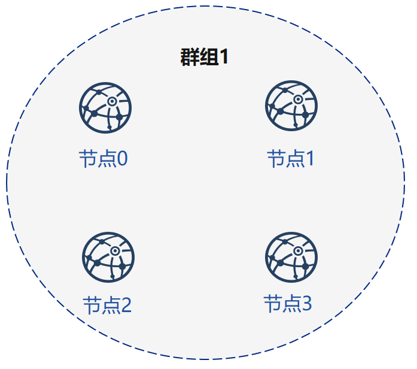

# 常见组网模式

按照一般业务分析，可以将场景分为以下四种，分别是以下四种场景

## 起始组网

A、B、C三个对等机构需要沟通搭建一条链，开始时只需要一个账本，需要生成节点配置文件，启动节点，初始化一个业务。操作步骤如下：

1. A、B、C三个机构采用链下安全的方式共享自己的节点证书与节点信息（此步可选择由某一机构统一收集，或是所有机构都收集）
2. 假设A收集所有资料后，将证书按照指定格式放在meta目录下，并配置`mchain.ini`中的node信息，指定配置文件中的groupid
3. A机构执行[build_install_package](./operation.html#build-install-package-b)命令，指定生成节点配置文件的目录，会在指定目录下生成多个不含节点私钥的节点配置文件夹（如果所有机构都收集了证书，可以由各个机构生成自己所属的节点节点配置文件）
4. A机构将生成的节点配置文件夹分发给B、C机构，并将自己的节点配置文件推送至对应服务器，拷贝节点私钥至节点配置文件下，启动节点，默认节点加入的群组为`mchain.ini`的groupid

## 新节点加入网络

新节点加入网络有两种情况，场景如下：

### 新节点加入现有group

在本场景中，节点需要与所有原有节点进行网络连接，并且需要加入现有群组，以上述`起始组网`为例，操作步骤如下：
假设D机构需要新加入节点到A、B、C的组网的group1中

1. D机构收集A、B、C组网生成的`config.ini`与`group.1.genesis`，`group.1.ini`文件，统一放置与某一文件夹下
2. D机构配置`mexpand.ini`中的节点信息，将扩容节点的证书按照指定格式放在meta目录下
3. D机构使用[build_expand_package](./operation.html#build-expand-package-e)命令指定扩容节点配置文件节点输出路径，在输出路径生成扩容节点节点配置文件夹
4. D机构将私钥导入扩容节点配置文件夹，将节点配置文件夹推送至指定服务器，启动节点
5. D机构请求A、B、C中的某一个机构将自己的节点注册入group1中，完成新节点入网操作

### 新节点创建新group

在本场景中，节点只需要与链中的某几个节点进行网络连接，并且不需要加入原有群组，以上述[起始组网]为例，假设E、F机构需要与C机构组网，新建一个group2，对于C机构而言，不需要再从新搭建一条链，直接复用[起始组网]中的节点，新建群组即可满足需求

操作步骤类似于[起始组网]：

1. C、E、F三个机构采用链下安全方式共享自己的节点证书，节点信息（此步共享原理同上，可选择由某一机构统一收集，或是所有机构都收集）
2. 假设此步所有机构都收集了新群组节点的证书，C、E、F三个机构将证书按照指定格式放在meta目录下，E、F配置`mchain.ini`中的node信息，指定配置文件中的groupid，
3. E、F机构执行[build_install_package](./operation.html#build-install-package-b)命令，指定生成节点配置文件的目录，生成所需群组的节点配置文件夹
4. E、F机构将私钥导入扩容节点配置文件，将节点配置文件夹推送至指定服务器，启动节点
5. 由于C已经生成了节点节点配置文件，因此C只需配置`mgroup.ini`中的配置
6. C执行[create_group_config](./operation.html#create-group-config-c)命令，生成`group.2.genesis`和`group.2.ini`，将配置信息拷贝至已经协商过程中已经存在的节点目录下
7. C机构从启节点，完成新group的建立

## 节点新建群组

在本场景中，链中的已有节点需要建立新群组。

假设节点均已建立为网络链接，需要建立新群组，如上述场景中A、B、C、D要新建立group3，则需要进行的操作如下：

1. A、B、C、D四个机构采用链下安全的方式共享自己的节点证书与节点信息（此步可选择由某一机构统一收集，或是所有机构都收集）
2. A配置`mgroup.ini`中的信息，将1中协商的证书放置与meta文件夹下
3. A执行[create_group_config](./operation.html#create-group-config-c)命令，生成`group.3.genesis`和`group.3.ini`，将生成的配置信息发送给B、C、D
4. A、B、C、D将生成`group.i.genesis`和`group.i.ini`拷贝到已存在的节点文件夹下，从启节点完成新群组的建立

## 组网模式分析

针对上述场景，FISCO BCOS generator将其总结为以下四种组网模式。

不妨设4个节点的地址为：

| 节点序号 |   P2P地址     |   RPC/channel地址     |
| :-----------: | :-------------: | :-------------: |
|   节点0     | 127.0.0.1:30300| 127.0.0.1:8545/:20200 |
|   节点1     | 127.0.0.1:30301| 127.0.0.1:8546/:20201 |
|   节点2     | 127.0.0.1:30302| 127.0.0.1:8547/:20202 |
|   节点3     | 127.0.0.1:30303| 127.0.0.1:8548/:20203 |

### 简单模式组网



简单模式组网可以适用于大多数单一业务的使用场景。整条链的所有节点都在唯一的一个群组中。

当业务的数据需要由区块链所有节点共识时，一般采用此模式组网

使用示例：

用户操作如下：

1. 用户生成、交换证书

2. 修改`mchain.ini`中的配置如下：

```ini
[group]
group_id=1

[node0]
p2p_ip=127.0.0.1
rpc_ip=127.0.0.1
p2p_listen_port=30300
channel_listen_port=20200
jsonrpc_listen_port=8545

[node1]
p2p_ip=127.0.0.1
rpc_ip=127.0.0.1
p2p_listen_port=30301
channel_listen_port=20201
jsonrpc_listen_port=8546

[node2]
p2p_ip=127.0.0.1
rpc_ip=127.0.0.1
p2p_listen_port=30302
channel_listen_port=20202
jsonrpc_listen_port=8547

[node3]
p2p_ip=127.0.0.1
rpc_ip=127.0.0.1
p2p_listen_port=30303
channel_listen_port=20203
jsonrpc_listen_port=8548
```

3. 使用[build_install_package](./operation.html#build-install-package-b)命令生成节点配置文件

4. 导入私钥、启动节点

5. 节点0和节点2修改配置文件`mgroup.ini`如下：

[group]
group_id=2

[member]
member0=127.0.0.1:30300
member1=127.0.0.1:30302

6. 节点0和节点2使用[create_group_config](./operation.html#create-group-config-c)命令生成群组2配置文件

7. 将生成的配置文件导入节点conf文件夹下，从启节点

### 网状模式组网


网状模式组网适合有多个自需求的业务，如一条链的不同节点需要有多个需要共识的业务账本，希望业务没有交叉时彼此之间的账本是独立的，可以采用此模式组网。

使用示例：

用户操作如下：

1. 用户生成、交换证书

2. 修改`mchain.ini`中的配置如下：

```ini
[group]
group_id=1

[node0]
p2p_ip=127.0.0.1
rpc_ip=127.0.0.1
p2p_listen_port=30300
channel_listen_port=20200
jsonrpc_listen_port=8545

[node1]
p2p_ip=127.0.0.1
rpc_ip=127.0.0.1
p2p_listen_port=30301
channel_listen_port=20201
jsonrpc_listen_port=8546

[node2]
p2p_ip=127.0.0.1
rpc_ip=127.0.0.1
p2p_listen_port=30302
channel_listen_port=20202
jsonrpc_listen_port=8547
```

3. 节点0、1、2使用[build_install_package](./operation.html#build-install-package-b)命令生成节点配置文件夹

4. 导入私钥、启动节点

5. 节点0和节点2修改配置文件`mgroup.ini`如下：

[group]
group_id=2

[member]
member0=127.0.0.1:30300
member1=127.0.0.1:30302
member2=127.0.0.1:30303

此步中节点3修改`mchain.ini`中的配置如下：

```ini
[group]
group_id=2

[node0]
p2p_ip=127.0.0.1
rpc_ip=127.0.0.1
p2p_listen_port=30300
channel_listen_port=20200
jsonrpc_listen_port=8545

[node1]
p2p_ip=127.0.0.1
rpc_ip=127.0.0.1
p2p_listen_port=30302
channel_listen_port=20202
jsonrpc_listen_port=8547

[node2]
p2p_ip=127.0.0.1
rpc_ip=127.0.0.1
p2p_listen_port=30303
channel_listen_port=20203
jsonrpc_listen_port=8548
```

6. 节点0和节点2使用[create_group_config](./operation.html#create-group-config-c)命令生成群组2配置文件，节点3使用[build_install_package](./operation.html#build-install-package-b)命令生成节点配置文件夹

7. 节点0和节点2将生成的配置文件导入节点conf文件夹下，从启节点。节点3将私钥导入节点配置文件夹，启动节点

### 星型模式组网


星型模式组网适合某一机构与其他机构有较多的交叉，但是其他机构之间通信较少的业务模式。

在这种模式中，节点0需要与其他所有节点交互，而节点1、2、3只需关心与节点0的交互即可

使用示例：

用户操作如下：

1. 用户生成证书、节点0节点1、2、3分别交换证书

2. 节点1、2、3分别修改`mchain.ini`中的配置，只用写自己的节点与节点0即可

3. 使用[build_install_package](./operation.html#build-install-package-b)命令生成节点配置文件夹

4. 导入私钥，启动节点

在这种模式中，节点0首先修改`mchain.ini`中的配置，指向节点1.生成节点配置文件，导入私钥，启动节点。

之后分别修改`mgroup.ini`的配置，指向节点2、3.生成群组配置文件，导入节点配置文件，从启节点。

### 孤立模式组网


孤立模式组网适合多个机构之间经常有临时账本建立的需求，需要临时组网进行交易交互的模式。

使用示例：

用户操作如下：

1. 用户生成证书，节点0和2交换证书，节点1和3交换证书

2. 节点0和2修改`mchain.ini`中的配置如下：

```ini
[group]
group_id=1

[node0]
p2p_ip=127.0.0.1
rpc_ip=127.0.0.1
p2p_listen_port=30300
channel_listen_port=20200
jsonrpc_listen_port=8545

[node1]
p2p_ip=127.0.0.1
rpc_ip=127.0.0.1
p2p_listen_port=30302
channel_listen_port=20202
jsonrpc_listen_port=8547
```

节点1和3修改`mchain.ini`中的配置如下：

```ini
[group]
group_id=2

[node0]
p2p_ip=127.0.0.1
rpc_ip=127.0.0.1
p2p_listen_port=30301
channel_listen_port=20201
jsonrpc_listen_port=8546

[node1]
p2p_ip=127.0.0.1
rpc_ip=127.0.0.1
p2p_listen_port=30303
channel_listen_port=20203
jsonrpc_listen_port=8548
```

3. 4个节点使用[build_install_package](./operation.html#build-install-package-b)命令生成节点配置文件夹

4. 导入私钥、启动节点