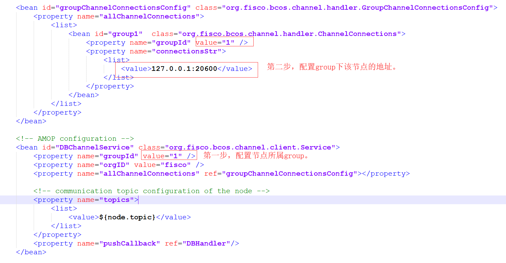

# 分布式存储

## 逻辑架构图
amdb多群组架构下，群组下的单个节点对应一个amdb实例，例如，区块链网络中，有三个节点A,B,C，其中A,B属于Group1,B,C属于Group2。节点A和C分别对应1个db实例，B节点对应了2个db实例，逻辑架构图如下：


## 节点配置
区块链底层配置 编辑每个群组的group.<群组编号>.genesis文件，修改[storage]段的内容，设置为如下内容：
```bash
[storage]
    	;storage db type, now support leveldb, external
    	type=external
        ;这里请注意，需要和要连接的amdb中的amdb.properties中的node.topic保持一致。需要保证单机上的唯一。分2种情况，节点属于多个group或者1台机器部署了多个节点，topic都需要配置成不一样。
    	topic=DB
    	maxRetry=100
```
这里需要注意一下：同一条链上的所有节点，group.<群组编号>.genesis中storage和state必须保持一致。
配置内容描述：

|配置项|可选值|描述|
|:--|:--|:--|
|type|leveldb、external|配置类型，当前支持：leveldb：本地数据存储external：外部存储，通过AMOP访问|
|topic|字符串|通过AMOP访问外部存储的topic，需要与AMDB服务配置的topic一致|
|maxRetry|大于0的数字|通过AMOP访问外部存储失败时的最大重试次数，达到最大重试次数后，区块链进程将退出|

## gradle环境配置
amdb源码编译需要用到gradle，需要预先安装gradle。
这里为了方便更快速查阅，给出简单步骤，更详细的步骤，请参考[官网](https://gradle.org/install/)。

从官网下载对应版本的 gradle 安装包，解压到对应目录(请将XXX换成对应的版本号)。
```bash
$ mkdir /software/
$ unzip -d /software/ gradleXXX.zip
```
配置环境变量
```bash
	export GRADLE_HOME=/software/gradle-XXX
	export PATH=$GRADLE_HOME/bin:$PATH
```
配置完成后执行下面命令确认配置成功。
```bash
$ gradle --version

------------------------------------------------------------
Gradle 5.3.1
------------------------------------------------------------

Build time:   2019-03-28 09:09:23 UTC
Revision:     f2fae6ba563cfb772c8bc35d31e43c59a5b620c3

Kotlin:       1.3.21
Groovy:       2.5.4
Ant:          Apache Ant(TM) version 1.9.13 compiled on July 10 2018
JVM:          11.0.2 (Oracle Corporation 11.0.2+9-LTS)
OS:           Linux 3.10.0-327.36.3.el7.x86_64 amd64
```


## amdb代码编译

### 源码获取
```bash
$ git clone https://github.com/FISCO-BCOS/AMDB.git
```

### 源码编译
```bash
$ cd AMDB && gradle build
```
编译完成之后，会生成一个dist目录，文件结构如下：
```bash
├── apps
│   └── AMDB.jar
├── conf
│   ├── amdb.properties
│   ├── applicationContext.xml
│   ├── contracts
│   │   ├── Table.sol
│   │   ├── TableTest.sol
│   ├── db.properties
│   ├── doc
│   │   ├── amop.png
│   │   ├── leveldb.png
│   │   └── README.md
│   ├── log4j2.xml
│   └── mappers
│       └── data_mapper.xml
├── lib
├── log
└── start.sh
```

## 证书与配置文件配置
amdb与节点连接过程，amdb是client,节点是server，启动过程是amdb主动连接节点，节点无需配置，amdb需要通过证书准入。因此，配置涉及到证书及配置文件配置。
### 证书配置
将节点sdk目录下所有文件（包括 ca.crt，node.crt，node.key）拷贝到dist/conf目录。

### 配置文件配置
#### amdb.properties配置
amdb.properties配置amdb需要连接的节点的配置信息
```
#节点ip
node.ip=127.0.0.1
#节点rpc listen port(请参考节点config.ini中的channel_listen_port)
node.listen_port=20600
#节点的topic，请与节点中的topic配置保持一致,需要保证单机上的唯一
#节点属于多个group或者1台机器部署了多个节点，topic都需要配置成不一样
node.topic=DB
```

#### db.properties配置
db.properties为amdb实例的配置信息，参考配置如下：
```
#数据库服务器的ip
db.ip=127.0.0.1
#数据库服务器监听端口
db.port=3306
#数据库用户名
db.user=root
#数据库密码
db.password=123456
#dbname
db.database=bcos
```
这里需要在上述的db实例中建好相应的数据库，创建语句
```bash
CREATE DATABASE bcos;
```

#### applicationContext.xml配置
该文件用于amdb代理连接节点。因此，第一步是配置节点所属的group，第二步是配置group下节点的地址。参考如下：



在多群组架构下，存在一个节点属于多个group的情况，这种情况下，需要为每一个group下的节点配置amdb代理。
举个例子，节点B分别属于group1,group2。B节点的地址为127.0.0.1:20600，下面给出对应的配置。

`applicationContext.xml`中group1的相关配置参考如下（部分信息）。
```
	<bean id="groupChannelConnectionsConfig" class="org.fisco.bcos.channel.handler.GroupChannelConnectionsConfig">
		<property name="allChannelConnections">
			<list>
				<bean id="group1"  class="org.fisco.bcos.channel.handler.ChannelConnections">
					<property name="groupId" value="1" />
					<property name="connectionsStr">
						<list>
							<value>127.0.0.1:20600</value>
						</list>
					</property>
				</bean>
			</list>
		</property>
	</bean>

<bean id="DBChannelService" class="org.fisco.bcos.channel.client.Service">
		<property name="groupId" value="1" />
		<property name="orgID" value="fisco" />
		<property name="allChannelConnections" ref="groupChannelConnectionsConfig"></property>
		
		<!-- communication topic configuration of the node -->
		<property name="topics">
			<list>
				<value>${node.topic}</value>
			</list>
		</property>
		<property name="pushCallback" ref="DBHandler"/>
	</bean>
```

**对应的amdb.properties配置如下:**
```
#节点ip
node.ip=127.0.0.1
#节点rpc listen port(请参考节点config.ini中的channel_listen_port)
node.listen_port=20600
#节点的topic，请与节点中的topic配置保持一致,需要保证单机上的唯一。分2种情况，节点属于多个group或者1台机器部署了多个节点，topic都需要配置成不一样。
node.topic=DB_G1B
```

**db.properties配置如下:**
```
#数据库服务器的ip
db.ip=127.0.0.1
#数据库服务器监听端口
db.port=3306
#数据库用户名
db.user=root
#数据库密码
db.password=123456
#dbname
db.database=bcos_g1b
```

**节点配置如下：**
```
[storage]
    	;storage db type, now support leveldb, external
    	type=external
        ;这里请注意，需要和要连接的amdb中的amdb.properties中的node.topic保持一致。需要保证单机上的唯一。分2种情况，节点属于多个group或者1台机器部署了多个节点，topic都需要配置成不一样。
    	topic=DB_G1B
    	maxRetry=100
```

group2下的节点B配置参考如下（部分信息）
```
	<bean id="groupChannelConnectionsConfig" class="org.fisco.bcos.channel.handler.GroupChannelConnectionsConfig">
		<property name="allChannelConnections">
			<list>
				<bean id="group2"  class="org.fisco.bcos.channel.handler.ChannelConnections">
					<property name="groupId" value="2" />
					<property name="connectionsStr">
						<list>
							<value>127.0.0.1:20600</value>
						</list>
					</property>
				</bean>
			</list>
		</property>
	</bean>

<bean id="DBChannelService" class="org.fisco.bcos.channel.client.Service">
		<property name="groupId" value="2" />
		<property name="orgID" value="fisco" />
		<property name="allChannelConnections" ref="groupChannelConnectionsConfig"></property>
		
		<!-- communication topic configuration of the node -->
		<property name="topics">
			<list>
				<value>${node.topic}</value>
			</list>
		</property>
		<property name="pushCallback" ref="DBHandler"/>
	</bean>
```
对应的amdb.properties配置如下:
```
#节点ip
node.ip=127.0.0.1
#节点rpc listen port(请参考节点config.ini中的channel_listen_port)
node.listen_port=20600
#节点的topic，请与节点中的topic配置保持一致,需要保证单机上的唯一。分2种情况，节点属于多个group或者1台机器部署了多个节点，topic都需要配置成不一样。
node.topic=DB_G2B
```
db.properties配置如下:
```
#数据库服务器的ip
db.ip=127.0.0.1
#数据库服务器监听端口
db.port=3306
#数据库用户名
db.user=root
#数据库密码
db.password=123456
#dbname
db.database=bcos_g2b
```
节点配置如下：
```
[storage]
    	;storage db type, now support leveldb, external
    	type=external
        ;这里请注意，需要和要连接的amdb中的amdb.properties中的node.topic保持一致。需要保证单机上的唯一。分2种情况，节点属于多个group或者1台机器部署了多个节点，topic都需要配置成不一样。
    	topic=DB_G2B
    	maxRetry=100
```

## amdb进程启动
```bash
cd dist;sh start.sh
```
ps查看到java进程并确认日志没有问题，确认启动成功就可以启动节点了。
```bash
ps -ef|grep amdb
app    68051      1  3 Apr24 ?        01:05:25 java -cp conf/:apps/*:lib/* org.bcos.amdb.server.Main
```
