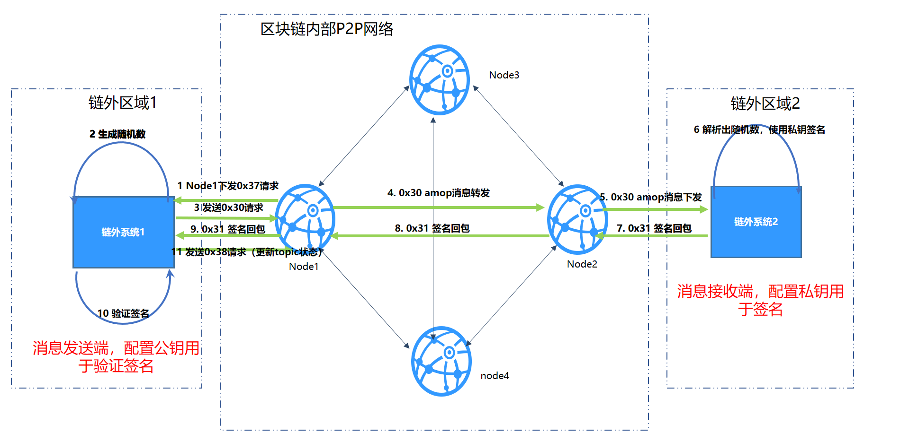

# 链上信使协议

## 介绍

链上信使协议AMOP（Advanced Messages Onchain Protocol）系统旨在为联盟链提供一个安全高效的消息信道，联盟链中的各个机构，只要部署了区块链节点，无论是共识节点还是观察节点，均可使用AMOP进行通讯，AMOP有如下优势：  
- 实时：AMOP消息不依赖区块链交易和共识，消息在节点间实时传输，延时在毫秒级。  
- 可靠：AMOP消息传输时，自动寻找区块链网络中所有可行的链路进行通讯，只要收发双方至少有一个链路可用，消息就保证可达。  
- 高效：AMOP消息结构简洁、处理逻辑高效，仅需少量cpu占用，能充分利用网络带宽。  
- 安全：AMOP的所有通讯链路使用SSL加密，加密算法可配置,支持身份认证机制。
- 易用：使用AMOP时，无需在SDK做任何额外配置。

## 逻辑架构


以银行典型IDC架构为例，各区域概述：  
- 链外区域：机构内部的业务服务区,此区域内的业务子系统使用区块链SDK，连接到区块链节点。  
- 区块链P2P网络：此区域部署各机构的区块链节点，此区域为逻辑区域，区块链节点也可部署在机构内部。

## 配置
AMOP无需任何额外配置，以下为[Web3SDK](./configuration.md)的配置案例。
SDK配置（Spring Bean）：
```
<?xml version="1.0" encoding="UTF-8" ?>
<beans xmlns="http://www.springframework.org/schema/beans"
  xmlns:xsi="http://www.w3.org/2001/XMLSchema-instance" xmlns:p="http://www.springframework.org/schema/p"
  xmlns:tx="http://www.springframework.org/schema/tx" xmlns:aop="http://www.springframework.org/schema/aop"
  xmlns:context="http://www.springframework.org/schema/context"
  xsi:schemaLocation="http://www.springframework.org/schema/beans   
    http://www.springframework.org/schema/beans/spring-beans-2.5.xsd  
          http://www.springframework.org/schema/tx   
    http://www.springframework.org/schema/tx/spring-tx-2.5.xsd  
          http://www.springframework.org/schema/aop   
    http://www.springframework.org/schema/aop/spring-aop-2.5.xsd">
    
<!-- AMOP消息处理线程池配置，根据实际需要配置 -->
<bean id="pool" class="org.springframework.scheduling.concurrent.ThreadPoolTaskExecutor">
  <property name="corePoolSize" value="50" />
  <property name="maxPoolSize" value="100" />
  <property name="queueCapacity" value="500" />
  <property name="keepAliveSeconds" value="60" />
  <property name="rejectedExecutionHandler">
    <bean class="java.util.concurrent.ThreadPoolExecutor.AbortPolicy" />
  </property>
</bean>

<!-- 群组信息配置 -->
  <bean id="groupChannelConnectionsConfig" class="org.fisco.bcos.channel.handler.GroupChannelConnectionsConfig">
      <property name="allChannelConnections">
        <list>
          <bean id="group1"  class="org.fisco.bcos.channel.handler.ChannelConnections">
            <property name="groupId" value="1" />
            <property name="connectionsStr">
              <list>
                <value>127.0.0.1:20200</value> <!-- 格式：IP:端口 -->
                <value>127.0.0.1:20201</value>
              </list>
            </property>
          </bean>
        </list>
      </property>
    </bean>

  <!-- 区块链节点信息配置 -->
    <bean id="channelService" class="org.fisco.bcos.channel.client.Service" depends-on="groupChannelConnectionsConfig">
      <property name="groupId" value="1" />
      <property name="orgID" value="fisco" />
      <property name="allChannelConnections" ref="groupChannelConnectionsConfig"></property>
      <!-- 如果需要使用topic认证功能，请将下面的注释去除 -->
      <!-- <property name="topic2KeyInfo" ref="amopVerifyTopicToKeyInfo"></property>--> 
    </bean>

  <!--  这里配置的是topic到公私钥配置信息的映射关系，这里只配置了一个topic，可以通过新增entry的方式来新增映射关系。-->
  <!--
    <bean class="org.fisco.bcos.channel.handler.AMOPVerifyTopicToKeyInfo" id="amopVerifyTopicToKeyInfo">
		<property name="topicToKeyInfo">
			<map>
				<entry key="${topicname}" value-ref="AMOPVerifyKeyInfo_${topicname}" />
			</map>
		</property>
	</bean>
  -->

  <!--  在topic的生产者端，请将如下的注释打开，并配置公钥文件，
        每个需要身份验证的消费者都拥有不同的公私钥对，请列出所有需要身份验证的消费者的公钥文件。
  -->
  <!--
	<bean class="org.fisco.bcos.channel.handler.AMOPVerifyKeyInfo" id="AMOPVerifyKeyInfo_${topicname}">
		<property name="publicKey">
			<list>
				<value>classpath:$consumer_public_key_1.pem$</value>
				<value>classpath:$consumer_public_key_2.pem$</value>
			</list>
		</property>
	</bean>
	--> 

  <!--  在topic的消费者端，请将如下的注释打开，并配置私钥文件，程序使用私钥向相应的主题生产者验证您的身份。-->
  <!--
	<bean class="org.fisco.bcos.channel.handler.AMOPVerifyKeyInfo" id="AMOPVerifyKeyInfo_${topicname}">
		<property name="privateKey" value="classpath:$consumer_private_key.pem$"></property>
	</bean>
	--> 

```

## SDK使用
AMOP的消息收发基于topic（主题）机制，服务端首先设置一个topic，客户端往该topic发送消息，服务端即可收到。

AMOP支持在同一个区块链网络中有多个topic收发消息，topic支持任意数量的服务端和客户端，当有多个服务端关注同一个topic时，该topic的消息将随机下发到其中一个可用的服务端。

服务端代码案例：

```java
package org.fisco.bcos.channel.test.amop;

import org.fisco.bcos.channel.client.Service;
import org.slf4j.Logger;
import org.slf4j.LoggerFactory;
import org.springframework.context.ApplicationContext;
import org.springframework.context.support.ClassPathXmlApplicationContext;

import java.util.HashSet;
import java.util.Set;

public class Channel2Server {
    static Logger logger = LoggerFactory.getLogger(Channel2Server.class);

    public static void main(String[] args) throws Exception {
        if (args.length < 1) {
          System.out.println("Param: topic");
          return;
        }

        String topic = args[0];

        logger.debug("init Server");

        ApplicationContext context = new ClassPathXmlApplicationContext("classpath:applicationContext.xml");
        Service service = context.getBean(Service.class);

        // 设置topic，支持多个topic
        Set<String> topics = new HashSet<String>();
        topics.add(topic);
        service.setTopics(topics);

        // 处理消息的PushCallback类，参见Callback代码
        PushCallback cb = new PushCallback();
        service.setPushCallback(cb);

        System.out.println("3s...");
        Thread.sleep(1000);
        System.out.println("2s...");
        Thread.sleep(1000);
        System.out.println("1s...");
        Thread.sleep(1000);

        System.out.println("start test");
        System.out.println("===================================================================");
        
        // 启动服务
        service.run();
    }
}
```

服务端的PushCallback类案例：

```java
package org.fisco.bcos.channel.test.amop;

import java.time.LocalDateTime;
import java.time.format.DateTimeFormatter;

import org.slf4j.Logger;
import org.slf4j.LoggerFactory;

import org.fisco.bcos.channel.client.ChannelPushCallback;
import org.fisco.bcos.channel.dto.ChannelPush;
import org.fisco.bcos.channel.dto.ChannelResponse;

class PushCallback extends ChannelPushCallback {
    static Logger logger = LoggerFactory.getLogger(PushCallback.class);

    // onPush方法，在收到AMOP消息时被调用
    @Override
    public void onPush(ChannelPush push) {
        DateTimeFormatter df = DateTimeFormatter.ofPattern("yyyy-MM-dd HH:mm:ss");
        logger.debug("push:" + push.getContent());

        System.out.println(df.format(LocalDateTime.now()) + "server:push:" + push.getContent());

        // 回包消息
        ChannelResponse response = new ChannelResponse();
        response.setContent("receive request seq:" + String.valueOf(push.getMessageID()));
        response.setErrorCode(0);

        push.sendResponse(response);
    }
}
```

客户端案例：

```java
package org.fisco.bcos.channel.test.amop;

import java.time.LocalDateTime;
import java.time.format.DateTimeFormatter;

import org.slf4j.Logger;
import org.slf4j.LoggerFactory;
import org.springframework.context.ApplicationContext;
import org.springframework.context.support.ClassPathXmlApplicationContext;

import org.fisco.bcos.channel.client.Service;
import org.fisco.bcos.channel.dto.ChannelRequest;
import org.fisco.bcos.channel.dto.ChannelResponse;

public class Channel2Client {
    static Logger logger = LoggerFactory.getLogger(Channel2Client.class);

    public static void main(String[] args) throws Exception {
        if(args.length < 2) {
            System.out.println("param: target topic total number of request");
            return;
        }

        String topic = args[0];
        Integer count = Integer.parseInt(args[1]);
        DateTimeFormatter df = DateTimeFormatter.ofPattern("yyyy-MM-dd HH:mm:ss");

        ApplicationContext context = new ClassPathXmlApplicationContext("classpath:applicationContext.xml");

        Service service = context.getBean(Service.class);
        service.run();

        System.out.println("3s ...");
        Thread.sleep(1000);
        System.out.println("2s ...");
        Thread.sleep(1000);
        System.out.println("1s ...");
        Thread.sleep(1000);

        System.out.println("start test");
        System.out.println("===================================================================");
        for (Integer i = 0; i < count; ++i) {
          Thread.sleep(2000);  // 建立连接需要一点时间，如果立即发送消息会失败

          ChannelRequest request = new ChannelRequest();
          request.setToTopic(topic);  // 设置消息topic
          request.setMessageID(service.newSeq());  // 消息序列号，唯一标识某条消息，可用newSeq()随机生成
          request.setTimeout(5000);  // 消息的超时时间

          request.setContent("request seq:" + request.getMessageID());  // 发送的消息内容
          System.out.println(df.format(LocalDateTime.now()) + " request seq:" + String.valueOf(request.getMessageID())
          + ", Content:" + request.getContent());

          ChannelResponse response = service.sendChannelMessage2(request);  // 发送消息

          System.out.println(df.format(LocalDateTime.now()) + "response seq:" + String.valueOf(response.getMessageID())
                + ", ErrorCode:" + response.getErrorCode() + ", Content:" + response.getContent());
        }
    }
}
```

## Topic认证功能

在普通的配置下，任何一个监听了某topic的接收者都能接受到发送者推送的消息。但在某些场景下，发送者只希望特定的接收者能接收到消息，不希望无关的接收者能任意的监听此topic。在此场景下，需要使用Topic认证功能。
认证功能是指对于特定的topic消息，允许通过认证的接收者接收消息。
2.1.0及之后的sdk和节点版本新增了topic认证功能，默认的配置没有开启认证功能，需要用到认证功能的话请参考[配置文件配置](./amop_protocol.html#id3)配置好公私钥，公私钥的生成方式请参考[生成公私钥脚本](./account.md)。使用过程如下：
- 1：接收者使用[生成公私钥脚本](./account.md)生成公私钥文件，私钥保留，公钥给生产者。
- 2：参考配置案例将配置文件配好。启动接收端和发送端进行收发消息。

假定链外系统1是消息发送者，链外系统2是消息接收者。链外系统2宣称监听topic T1的消息，topic认证流程图如下：



- 1：链外系统2连接Node2,宣称监听T1,Node2将T1加入到topic列表，并将seq加1。同时每5秒同步seq到其他节点。
- 2：Node1收到seq之后，对比本地seq和同步过来的seq，不一致从Node2获取topic列表，并将topic列表更新到p2p的topic列表，对于需要认证且还没认证的topic，状态置为待认证。Node1遍历列表。针对每一个待认证的topic,进行如下操作：
  - 2.1：Node1往Node1推送消息(消息类型0x37)，请求链外系统1发起topic认证流程。
  - 2.2：链外系统1接收到消息之后，生成随机数，并使用amop消息(消息类型0x30)将消息发送出去，并监听回包。
  - 2.3：消息经过 链外系统1-->Node1-->Node2-->链外系统2的路由，链外系统2接收到消息后解析出随机数并使用私钥签名随机数。
  - 2.4：签名包(消息类型0x31)经过 链外系统2-->Node2-->Node1->链外系统1的路由，链外系统1接收到签名包之后，解析出签名并使用公钥验证签名。
  - 2.5：链外系统1验证签名后，发送消息(消息类型0x38)，请求节点更新topic状态（认证成功或者认证失败）。
- 3：如果认证成功，链外系统的一条消息到达Node1之后，Node1会将这条消息转发给Node2,Node2会将消息推送给链外系统2。

## topic认证功能配置

默认提供的配置文件不包括认证功能，需要使用认证功能，请参考如下配置文件
```
<?xml version="1.0" encoding="UTF-8" ?>
<beans xmlns="http://www.springframework.org/schema/beans"
  xmlns:xsi="http://www.w3.org/2001/XMLSchema-instance" xmlns:p="http://www.springframework.org/schema/p"
  xmlns:tx="http://www.springframework.org/schema/tx" xmlns:aop="http://www.springframework.org/schema/aop"
  xmlns:context="http://www.springframework.org/schema/context"
  xsi:schemaLocation="http://www.springframework.org/schema/beans   
    http://www.springframework.org/schema/beans/spring-beans-2.5.xsd  
          http://www.springframework.org/schema/tx   
    http://www.springframework.org/schema/tx/spring-tx-2.5.xsd  
          http://www.springframework.org/schema/aop   
    http://www.springframework.org/schema/aop/spring-aop-2.5.xsd">
    
<!-- AMOP消息处理线程池配置，根据实际需要配置 -->
<bean id="pool" class="org.springframework.scheduling.concurrent.ThreadPoolTaskExecutor">
  <property name="corePoolSize" value="50" />
  <property name="maxPoolSize" value="100" />
  <property name="queueCapacity" value="500" />
  <property name="keepAliveSeconds" value="60" />
  <property name="rejectedExecutionHandler">
    <bean class="java.util.concurrent.ThreadPoolExecutor.AbortPolicy" />
  </property>
</bean>

<!-- 群组信息配置 -->
  <bean id="groupChannelConnectionsConfig" class="org.fisco.bcos.channel.handler.GroupChannelConnectionsConfig">
      <property name="allChannelConnections">
        <list>
          <bean id="group1"  class="org.fisco.bcos.channel.handler.ChannelConnections">
            <property name="groupId" value="1" />
            <property name="connectionsStr">
              <list>
                <value>127.0.0.1:20200</value> <!-- 格式：IP:端口 -->
                <value>127.0.0.1:20201</value>
              </list>
            </property>
          </bean>
        </list>
      </property>
    </bean>

  <!-- 区块链节点信息配置 -->
    <bean id="channelService" class="org.fisco.bcos.channel.client.Service" depends-on="groupChannelConnectionsConfig">
      <property name="groupId" value="1" />
      <property name="orgID" value="fisco" />
      <property name="allChannelConnections" ref="groupChannelConnectionsConfig"></property>
        <!--  topic认证功能的配置项 -->
      <property name="topic2KeyInfo" ref="amopVerifyTopicToKeyInfo"></property>> 
    </bean>

  <!--  这里配置的是topic到公私钥配置信息的映射关系，这里只配置了一个topic，可以通过新增entry的方式来新增映射关系。-->
    <bean class="org.fisco.bcos.channel.handler.AMOPVerifyTopicToKeyInfo" id="amopVerifyTopicToKeyInfo">
		<property name="topicToKeyInfo">
			<map>
				<entry key="${topicname}" value-ref="AMOPVerifyKeyInfo_${topicname}" />
			</map>
		</property>
	</bean>

  <!--  在topic的生产者端，请在这里配置公钥文件，每个需要身份验证的消费者 都拥有不同的公私钥对，
        请列出所有需要身份验证的消费者的公钥文件。 程序启动前请确保所有的公钥文件都存在于web3sdk的conf目录下,
        文件名分别为$consumer_public_key_1.pem$，$consumer_public_key_2.pem$(请将这2个变量替换为实际文件名)，如果不需要两个公钥文件，请将其中一行删除并替换变量名，可以通过新增行的方式来增加公钥文件配置。-->
	<bean class="org.fisco.bcos.channel.handler.AMOPVerifyKeyInfo" id="AMOPVerifyKeyInfo_${topicname}">
		<property name="publicKey">
			<list>
				<value>classpath:$consumer_public_key_1.pem$</value>
				<value>classpath:$consumer_public_key_2.pem$</value>
			</list>
		</property>
	</bean>

  <!--  在topic的消费者端，请在这里配置私钥文件，程序使用私钥向相应的主题生产者验证您的身份。
        程序启动前请确保私钥文件存在于web3sdk的conf目录下，文件名为$consumer_private_key.pem$(请将变量替换为实际文件名)。-->
	<bean class="org.fisco.bcos.channel.handler.AMOPVerifyKeyInfo" id="AMOPVerifyKeyInfo_${topicname}">
		<property name="privateKey" value="classpath:$consumer_private_key.pem$"></property>
	</bean>

```


配置需要重启才可以生效，配置修改完成后，请重启基于web3sdk的应用程序。


## 测试
按上述说明配置好后，用户指定一个主题：topic，执行以下两个命令可以进行测试。  
### 单播文本
启动AMOP服务端：  
```shell
java -cp 'conf/:apps/*:lib/*' org.fisco.bcos.channel.test.amop.Channel2Server [topic]
```
启动AMOP客户端：   
```shell
java -cp 'conf/:apps/*:lib/*' org.fisco.bcos.channel.test.amop.Channel2Client [topic] [消息条数]
```

AMOP除了支持单播文本，还支持发送二进制，多播以及身份认证机制。相应的测试命令如下：

### 单播二进制，多播文本，多播二进制
启动AMOP服务端：  
```shell
java -cp 'conf/:apps/*:lib/*' org.fisco.bcos.channel.test.amop.Channel2Server [topic]
```
启动AMOP客户端：
```shell
#单播二进制
java -cp 'conf/:apps/*:lib/*' org.fisco.bcos.channel.test.amop.Channel2ClientBin [topic] [filename]
#多播文本
java -cp 'conf/:lib/*:apps/*' org.fisco.bcos.channel.test.amop.Channel2ClientMulti [topic]  [消息条数]
#多播二进制
java -cp 'conf/:lib/*:apps/*' org.fisco.bcos.channel.test.amop.Channel2ClientMultiBin [topic]  [filename]
```


### 带认证机制的单播文本，单播二进制，多播文本，多播二进制
在使用认证机制前，请确保参考配置文件配置好了用于认证的公私钥对。
启动AMOP服务端：
```shell
java -cp 'conf/:apps/*:lib/*' org.fisco.bcos.channel.test.amop.Channel2ServerNeedVerify [topic]
```
启动AMOP客户端：
```shell
#带认证机制的单播文本
java -cp 'conf/:apps/*:lib/*' org.fisco.bcos.channel.test.amop.Channel2ClientNeedVerify [topic] [消息条数]
#带认证机制的单播二进制
java -cp 'conf/:apps/*:lib/*' org.fisco.bcos.channel.test.amop.Channel2ClientBinNeedVerify [topic] [filename]
#带认证机制的多播文本
java -cp 'conf/:lib/*:apps/*' org.fisco.bcos.channel.test.amop.Channel2ClientMultiNeedVerify [topic]  [消息条数]
#带认证机制的多播二进制
java -cp 'conf/:lib/*:apps/*' org.fisco.bcos.channel.test.amop.Channel2ClientMultiBinNeedVerify [topic]  [filename]
```

## 错误码
- 99：发送消息失败，AMOP经由所有链路的尝试后，消息未能发到服务端，建议使用发送时生成的`seq`，检查链路上各个节点的处理情况。
- 100：区块链节点之间经由所有链路的尝试后，消息未能发送到可以接收该消息的节点，和错误码‘99’一样，建议使用发送时生成的‘seq’，检查链路上各个节点的处理情况。
- 101：区块链节点往Sdk推送消息，经由所有链路的尝试后，未能到达Sdk端，和错误码‘99’一样，建议使用发送时生成的‘seq’，检查链路上各个节点以及Sdk的处理情况。
- 102：消息超时，建议检查服务端是否正确处理了消息，带宽是否足够。
