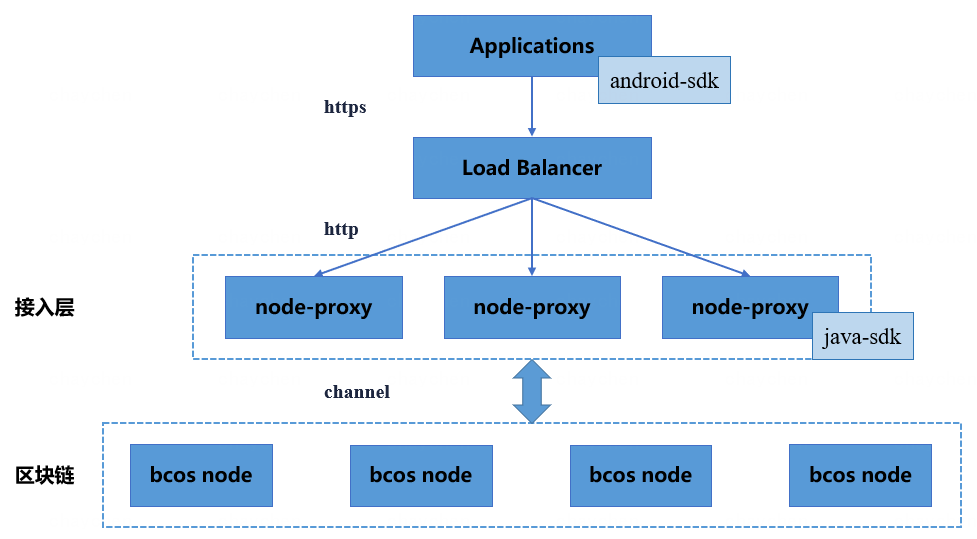

# 节点接入代理服务

标签：``节点接入代理`` ``node proxy``

----

bcos-node-proxy 作为 FISCO-BCOS 节点的接入代理，负责接受 Android/iOS 终端 SDK 的 http/https 连接，对请求的内容进行解析，并通过内置的 java-sdk 走 ChannelMessage 协议向节点进行转发。bcos-node-proxy 层本身是无状态的，实践中可以启动多个 bcos-node-proxy 实例，通过负载均衡组件（如 LVS、HAProxy 或 F5）对外提供统一的接入地址，终端 SDK 的请求可以均匀地分摊在多个 bcos-node-proxy 实例上以达到负载均衡的效果。bcos-node-proxy 本身并不存储数据，只是解析终端 SDK 的请求，将实际的数据读取请求/交易请求转发给底层的 FISCO-BCOS 节点。进一步的，bcos-node-proxy 对请求中的上链操作（部署合约、调用合约写接口），进行了异步请求转同步的实现。



说明：

1. 用户使用`bcos-node-proxy`前需搭建 FISCO-BCOS 区块链，具体搭建方法可参考[文档](https://fisco-bcos-documentation.readthedocs.io/zh_CN/latest/docs/installation.html);
2. `bcos-node-proxy`已实现以下 6 种请求的转发：交易发送（sendRawTransaction 和 call）、查询节点二进制版本信息（getClientVersion）、查询块高（getBlockNumber）、基于交易 hash 查询交易内容（getTransactionByHash），以及基于交易 hash 查询交易回执（getTransactionReceipt）。

- [Github 地址](https://github.com/FISCO-BCOS/bcos-node-proxy.git)
- [Gitee 地址](https://gitee.com/FISCO-BCOS/bcos-node-proxy.git)

## 一、部署基于 http 协议的 bcos-node-proxy

### 1.1 前提条件

| 序号 | 软件                         |
| ---- | ---------------------------- |
| 1    | Java8或以上版本，使用OpenJDK |

### 1.2 拉取代码

执行命令：

```shell
git clone https://github.com/FISCO-BCOS/bcos-node-proxy.git && cd bcos-node-proxy
```

### 1.3 编译代码

使用 gradlew 编译：

```shell
./gradlew build
```

构建完成后，在根目录`bcos-node-proxy`下生成目录`dist`。

### 1.4 服务配置及启停

#### 1.4.1 修改服务配置

（1）在`dist`目录，根据配置模板生成一份实际配置`conf`。

```shell
cp -r conf_template conf
```

（2）Proxy 默认使用端口`8170`监听 Android/iOS SDK 的 http 请求。该监听端口可在文件`conf/asServer/application.yml`中进行修改。

（3）Proxy 使用`fisco-bcos-java-sdk`与节点通信。用户需根据已搭建的 FISCO-BCOS 区块链情况在`conf/asClient/config.toml`中的[network.peers]设置节点`Ip 和 Port`，以及添加 SDK 证书（包括`ca.crt`、`sdk.crt`和`sdk.key`）到`conf/asClient`目录下。

修改配置后，`dist/conf`目录内容如下：

```text
.
├── asClient
│   ├── ca.crt
│   ├── config.toml
│   ├── log4j.properties
│   ├── sdk.crt
│   └── sdk.key
└── asServer
    ├── application.yml
    └── log4j2.xml
```

#### 1.4.2 启停服务及检查服务状态

在`dist`目录下执行：

```shell
启动：
[app@VM_0_1_centos dist]$ ./start.sh
try to start server org.fisco.bcos.proxy.Application
    server org.fisco.bcos.proxy.Application start successfully.
停止：
[app@VM_0_1_centos dist]$ ./stop.sh
try to stop server org.fisco.bcos.proxy.Application
    server org.fisco.bcos.proxy.Application stop successfully.
检查：
[app@VM_0_1_centos dist]$ ps aux | grep "org.fisco.bcos.proxy.Application" | grep java
```

#### 1.4.3 查看日志

在`dist`目录查看：

```shell
全量日志：tail -f log/bcos-node-proxy.log
错误日志：tail -f log/bcos-node-proxy-error.log
启动日志：tail -f log/proxy.out
```

## 二、接口说明

### 2.1 RPC 模块</span>

RPC 模块的接口可以用于：

- 部署合约和调用合约写函数，接口的请求操作将在链上进行记录；
- 调用合约读函数，接口的请求操作不在链上进行记录；
- 查询链状态（如块高）和链数据（如 Block 内容），接口的请求操作不在链上进行记录。

#### 2.1.1 传输协议规范

* 网络传输协议：使用`HTTP`协议
* 请求地址：`/rpc/v1/`
* 请求方式：POST
* 请求头：Content-type:application/json
* 返回格式：JSON

#### 2.1.2 参数信息详情

| 序号 | 请求body | 类型    | 可为空 | 备注                                      |
| ---- | -------- | ------- | ------ | ----------------------------------------- |
| 1    | jsonrpc  | String  | 否     | jsonrpc 版本，当前为 2.0                  |
| 2    | method   | String  | 否     | jsonrpc 方法名（目前支持6种，1.1.5 说明） |
| 3    | params   | List    | 否     | 请求内容列表（第一个内容固定为群组 id)    |
| 4    | id       | Integer | 否     | jsonrpc 序号                              |

| 序号  | 返回body | 类型    | 可为空 | 备注                                          |
| ----- | -------- | ------- | ------ | --------------------------------------------- |
| 1     | code     | Integer | 否     | 返回码，0：成功，其它：失败                   |
| 2     | message  | String  | 否     | code 对应的描述                               |
| 3     | data     | Object  | 是     | 返回信息实体，JsonRpcResponse Json 序列化结果 |
| 3.1   | id       | Integer | 否     | jsonrpc 序号，与请求 body 的 id 对应          |
| 3.2   | jsonrpc  | String  | 否     | jsonrpc 版本，与请求 body 的 jsonrpc 对应     |
| 3.3   | result   | Object  | 是     | 请求结果，与错误信息二选一                    |
| 3.4   | error    | Object  | 是     | 错误信息，与交易回执二选一                    |
| 3.4.1 | code     | Int     | 否     | FISCO-BCOS 内部错误码，0：成功 其它：失败     |
| 3.4.2 | message  | String  | 否     | 描述                                          |
| 3.4.3 | data     | String  | 否     | 预留，默认为空                                |

#### 2.1.3 入参示例

`http://127.0.0.1:8170/bcos-node-proxy/rpc/v1`

```text
// 查询节点信息
{
    "jsonrpc": "2.0",
    "method": "getClientVersion",
    "params": [1],
    "id": 3
}
```

#### 2.1.4 出参示例

* 成功：

```text
// 查询节点信息
{
    "code": 0,
    "message": "Success",
    "data": {
        "id": 3,
        "jsonrpc": "2.0",
        "result": {
            "Build Time": "20201208 11:00:41",
            "Build Type": "Linux/clang/Release",
            "Chain Id": "1",
            "FISCO-BCOS Version": "2.7.1",
            "Git Branch": "HEAD",
            "Git Commit Hash": "50a7ffba26a7ebc925b7e98483000daaacc67a8a",
            "Supported Version": "2.7.0"
        }
    }, 
    "error": null
}
```

* 失败：

```text
{
    "code": 100000,
    "message": "system exception",
    "data": null
}
```

#### 2.1.5 RPC 方法名及参数

| 方法名                | 参数序号 | 参数类型 | 参数描述                 |
| --------------------- | -------- | -------- | ------------------------ |
| getClientVersion      | 1        | Integer  | 群组 id                  |
| getBlockNumber        | 1        | Integer  | 群组 id                  |
| sendRawTransaction    | 1        | Integer  | 群组 id                  |
|                       | 2        | String   | 签名的交易数据（0x开头） |
| call                  | 1        | Integer  | 群组 id                  |
|                       | 2        | Object   | 交易                     |
|                       | 2.1      | String   | 交易发送方               |
|                       | 2.2      | String   | 合约地址                 |
|                       | 2.3      | String   | 交易数据（0x开头）       |
| getTransactionByHash  | 1        | Integer  | 群组 id                  |
|                       | 2        | String   | 交易 hash                |
| getTransactionReceipt | 1        | Integer  | 群组 id                  |
|                       | 2        | Integer  | 交易 hash                |

### 2.2 返回码说明</span>

| code   | message                  |
| ------ | ------------------------ |
| 0      | success                  |
| 100000 | system exception         |
| 200100 | invalid rpc method       |
| 200101 | unsupported rpc method   |
| 200102 | invalid groupId          |
| 200103 | inside json parser error |
| 300000 | param exception          |

## 三、bcos-node-proxy 配置 Nginx 实现 https 访问

参考[文档](./bcos_node_proxy.html#http-bcos-node-proxy)在两台机器上（`127.0.0.1`和`127.0.0.2`）分别部署 bcos-node-proxy 服务，两个服务均监听`8170`端口。记用户安装 Nginx 的操作目录为`/data/home/app/`。

### 3.1 编译 Nginx 源码

#### 3.1.1 安装依赖

Centos系统：
```shell
yum -y install openssl openssl-devel
yum -y install pcre-devel
```

Ubuntu系统：
```shell 
sudo apt-get install openssl libssl-dev
sudo apt-get install libpcre3 libpcre3-dev
```

#### 3.1.2 获取源码

```shell
wget -c https://nginx.org/download/nginx-1.18.0.tar.gz
```

#### 3.1.3 解压并进入源码目录

```shell
tar -zxvf nginx-1.18.0.tar.gz && cd nginx-1.18.0
```

#### 3.1.4 指定安装目录及启用 SSL 支持

```shell
./configure --prefix=/data/home/app/nginx/ --with-http_ssl_module
```

注：安装目录不能为当前目录

#### 3.1.5 编译安装

```shell
make && make install
```

#### 3.1.6 在安装目录启动、检查、停止 Nginx

```shell
cd /data/home/app/nginx/ 
/data/home/app/nginx/sbin/nginx
ps aux | grep nginx | grep app
/data/home/app/nginx/sbin/nginx -s stop
```

### 3.2 证书生成

#### 3.2.1 创建证书目录

```shell
cd /data/home/app/nginx/ && mkdir ssl && cd ssl
```

#### 3.2.2 创建密钥

```shell
openssl genrsa -des3 -out nginx.key 1024
```

创建密钥过程中需指定密码

#### 3.2.3 生成证书签名请求

```shell
openssl req -new -key nginx.key -out nginx.csr
```

生成签名请求过程中需输入步骤`3.2.2`中指定的密码，并按提示操作（提示部分可一路回车）。

#### 3.2.4 生成证书

```shell
openssl x509 -req -days 365 -in nginx.csr -signkey nginx.key -out nginx.crt
```

生成证书请求过程中需输入步骤`3.2.2`中指定的密码。执行完毕后检查当前目录`/data/home/app/nginx/ssl`是否存在以下三个文件。

```text
nginx.key nginx.csr nginx.crt
```

### 3.3 修改 Nginx 配置

修改配置文件`/data/home/app/nginx/conf/nginx.conf`，在`http`中添加以下内容，指向已部署的两个 Proxy 服务，并指定负载均衡策略。

```text
    upstream proxy {
        server 127.0.0.1:8170 weight=1;
        server 127.0.0.2:8170 weight=1;
    }
```

在`server`中添加以下内容，指定 Nginx 监听端口、启用 SSL 服务、单向验证（不需启动双向验证）证书位置。

```text
    server {
        listen       8181;            # 监听 http 请求的端口
        listen       8180 ssl;        # 监听 https 请求的端口
        server_name  localhost;

        ssl_certificate      /data/home/app/nginx/ssl/nginx.crt;
        ssl_certificate_key  /data/home/app/nginx/ssl/nginx.key;

        ssl_session_cache    shared:SSL:1m;
        ssl_session_timeout  5m;

        ssl_ciphers  HIGH:!aNULL:!MD5;
        ssl_prefer_server_ciphers  on;

        location / {
            proxy_pass http://proxys;
        }
    }
```

重启 Nginx ，过程中需输入步骤`3.2.2`中指定的密码。

```shell
/data/home/app/nginx/sbin/nginx -s stop
/data/home/app/nginx/sbin/nginx
```
