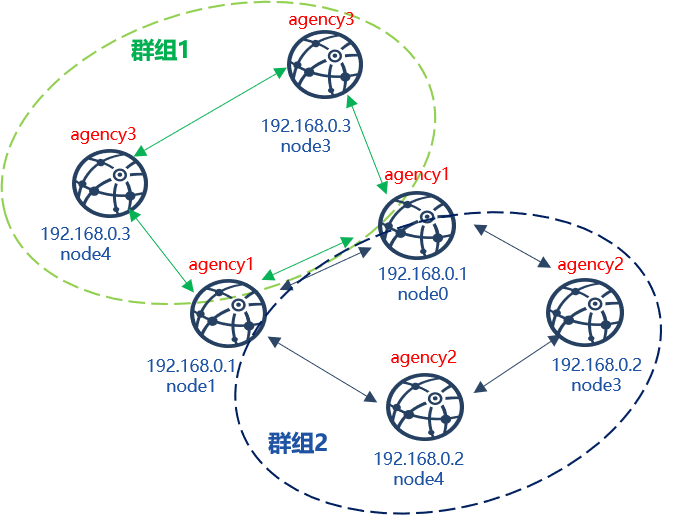

# 多群组操作指南

## 创建多群组区块链

FISCO BCOS提供了一键安装脚本[build_chain.sh](./build_chain.md)用于快速生成链配置文件。该脚本使用可参考[快速建链指南](./build_chain.md)。

创建下图所示拓扑的区块链系统，具体操作如下：



```bash

# 创建配置文件ipList
echo "192.168.0.1:2 agency1 1,2
192.168.0.2:2 agency2 1
192.168.0.3:2 agency3 2" > ipList

# 获取二进制文件，并调用build_chain.sh脚本建链
# 若有源码编译FISCO BCOS需求，请参考 FISCO BCOS源码安装
$ bash <(curl -s https://raw.githubusercontent.com/FISCO-BCOS/FISCO-BCOS/release-2.0.1/tools/ci/download_bin.sh)
$ bash build_chain.sh -f ipList -e ../build/bin/fisco-bcos
```


## 配置并启动控制台

为方便用户操作，FISCO BCOS在[web3sdk](../sdk/index.html)基础上封装了[控制台](./console.md)，用户可方便地通过控制台[增删共识节点](./console.html#addminer)、[修改区块可打包最大交易数](./console.html#setsystemconfigbykey)、[修改最大gas限制](./console.html#setsystemconfigbykey)，并可调用FISCO BCOS底层提供的所有RPC接口，详细说明请参考[控制台使用指南](./console.md)。

控制台是对web3sdk的封装，配置控制台前，需先部署web3sdk，详细配置可参考[配置控制台](./console.html#id7)

控制台配置完毕后，通过`bash start group_id`启动组`group_id`的控制台:

```bash
# 获取控制台
$ curl -LO https://github.com/FISCO-BCOS/LargeFiles/raw/master/tools/console.tar.gz && tar -zxf console.tar.gz
$ cd console

# 设启动组1的控制台
$ bash ./start 1

```


## 节点入网操作


为保证区块链安全性，FISCO BCOS引入了[游离节点](../design/security_control/node_access_management.html#id6)、[观察者节点](../design/security_control/node_access_management.html#id6)和[共识节点](../design/security_control/node_access_management.html#id6)，并可通过控制台动态将节点转换成这三类节点，具体可参考[节点入网](./node_access_management.md)。

控制台提供了 **[AddSealer(as)](./console.html#addminer)** 、**[AddObserver(ao)](./console.html#addobserver)** 和 **[RemoveNode(rn)](./console.html#removenode)** 三类命令将指定节点转换为共识节点、观察者节点和游离节点，并可使用 **[getSealerList(gsl)](./console.html#getminerlist)**、**[getObserverList(gol)](./console.html#getobserverlist)** 和 **[getNodeIDList(gnl)](./console.html#getnodeidlist)** 查看当前组的共识节点列表、观察者节点列表和组内所有节点列表。

例：
将指定节点分别转换成组1的共识节点、观察者节点、游离节点，具体操作和验证步骤如下：

```eval_rst
.. important::
    
    转换节点类型后，请确保节点Node ID存在，节点Node ID可在节点目录下执行 cat conf/node.nodeid获取
```

```bash
# 获取节点Node ID（设节点目录为~/nodes/192.168.0.1/node0/）
$ cat ~/nodes/192.168.0.1/node0/conf/node.node_id
7a056eb611a43bae685efd86d4841bc65aefafbf20d8c8f6028031d67af27c36c5767c9c79cff201769ed80ff220b96953da63f92ae83554962dc2922aa0ef50

# 连接组1的控制台(设控制台位于~/console目录)
$ cd ~/console

$ bash ./start 1

# 将指定节点转换为共识节点
> addSealer 7a056eb611a43bae685efd86d4841bc65aefafbf20d8c8f6028031d67af27c36c5767c9c79cff201769ed80ff220b96953da63f92ae83554962dc2922aa0ef50
# 查询共识节点列表
> getSealerList
[
	7a056eb611a43bae685efd86d4841bc65aefafbf20d8c8f6028031d67af27c36c5767c9c79cff201769ed80ff220b96953da63f92ae83554962dc2922aa0ef50
]

# 将指定节点转换为观察者节点
> addObserver 7a056eb611a43bae685efd86d4841bc65aefafbf20d8c8f6028031d67af27c36c5767c9c79cff201769ed80ff220b96953da63f92ae83554962dc2922aa0ef50

# 查询观察者节点列表
> getObserverList
[
	7a056eb611a43bae685efd86d4841bc65aefafbf20d8c8f6028031d67af27c36c5767c9c79cff201769ed80ff220b96953da63f92ae83554962dc2922aa0ef50
]

# 将指定节点转换为游离节点
> removeNode 7a056eb611a43bae685efd86d4841bc65aefafbf20d8c8f6028031d67af27c36c5767c9c79cff201769ed80ff220b96953da63f92ae83554962dc2922aa0ef50

# 查询节点列表
> getNodeIDList
[
	7a056eb611a43bae685efd86d4841bc65aefafbf20d8c8f6028031d67af27c36c5767c9c79cff201769ed80ff220b96953da63f92ae83554962dc2922aa0ef50
]
> getSealerList
[]
> getObserverList
[]

```

## 修改系统参数

FISCO BCOS系统目前主要包括如下系统参数(未来会扩展其他系统参数)：


```eval_rst
+-----------------+-----------+---------------------------------+
| 系统参数        | 默认值    |             含义                |
+=================+===========+=================================+
| tx_count_limit  | 1000      | 一个区块中可打包的最大交易数目  |
+-----------------+-----------+---------------------------------+
| tx_gas_limit    | 300000000 | 一个区块最大gas限制             |
+-----------------+-----------+---------------------------------+

```

控制台提供 **[setSystemConfigByKey(ssc)](./console.html#setsystemconfigbykey)** 命令来修改这些系统参数，**[getSystemConfigByKey(gsc)](./console.html#getsystemconfigbykey)** 命令可查看系统参数的当前值：


```eval_rst
.. important::

    不建议随意修改tx_count_limit和tx_gas_limit，如下情况可修改这些参数：

    - 机器网络或CPU等硬件性能有限：调小tx_count_limit，或降低业务压力；
    - 业务逻辑太复杂，执行区块时gas不足：调大tx_gas_limit。
```

```bash
# 设置一个区块可打包最大交易数为500
> setSystemConfigByKey tx_count_limit 500
# 查询tx_count_limit
> getSystemConfigByKey tx_count_limit
[500]

# 设置区块gas限制为400000000
> getSystemConfigByKey tx_gas_limit 400000000
> getSystemConfigByKey
[400000000]
```

## RPC接口调用

通过控制台可调用所有RPC接口，详细可参考[控制台操作手册](./console.html#id10)
