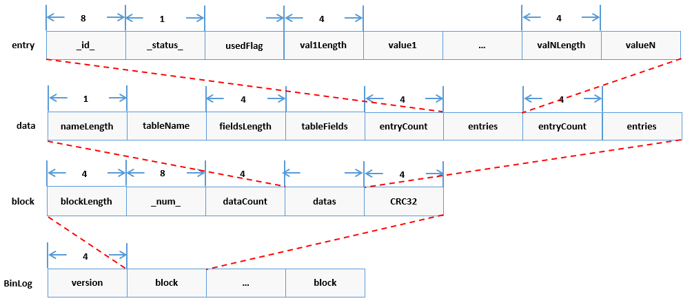

# 海量数据治理

区块链在运行的过程中，随着上链业务数的增加，会出现链数据量成比例增加和链性能有一定程度衰减的情况。其中性能衰减对业务体验影响较大，并且无法通过增加硬盘容量等硬件方式解决。通过分析，我们可采用**scalable存储模式**，通过对写入本地的链上数据按照一定维度进行划分，分别存于不同存储实例，从而控制节点所访问的单个存储实例大小，稳定链处理能力；同时，对本地的存储实例，在实现其备份归档后可以有选择地进行实例删除，控制本地存储的整体数据量。

```eval_rst
.. important::

    - FISCO BCOS从2.7.1版本开始，通过配置“数据仓库”，实现对海量数据治理的支持；

    - FISCO BCOS为实现海量数据治理的功能，需使用scalable存储模式、开启binlog及配置amdb-proxy，相关操作见本文档说明；
    
    - “数据仓库”的使用请参考 `[文档] <https://data-doc.readthedocs.io/zh_CN/latest/docs/WeBankBlockchain-Data-Stash/index.html>`_ 。

```

## scalable存储模式

FISCO BCOS节点在配置scalable存储模式时，对于本地经裁剪后缺少的数据，将通过代理amdb-proxy访问“数据仓库”数据源进行获取。

### 模式启用

- 设置群组的ini配置文件中`[storage].type=scalable`来选择链的存储模式为`scalable`。
- 设置群组的ini配置文件中`[storage].binary_log=true`来启用binlog。如用户使用build_chain脚本搭链，并选择scalable存储模式，配置文件会自动开启binlog。
- 参考[说明](./data_governance.html#amdb-proxy)进行amdb-proxy配置，其中设置amdb-proxy访问的数据源为“数据仓库”生成的数据库。

### 文件组织

节点使用scalable存储模式后，其数据目录内容如下：

- `nodeX/data/groupX/block/Scalable/blocksDB/`下分文件夹存储区块数据。每个文件夹为独立的DB实例，用DB记录的首个块高来进行文件夹命名。用户在配置了“数据仓库”和amdb-proxy实现数据备份归档后，较旧（较低块高）的子文件夹**允许删除**。
- `nodeX/data/groupX/block/Scalable/state`存储整体的状态数据，该文件夹**不可删除**。

## binlog

binlog文件记录了每个区块的每个交易对区块链状态的修改结果。binlog机制的作用在于：

1. 提供了区块维度的数据操作结果的记录；
2. 节点可通过binlog文件而非通过原有的拉取区块重放交易的方式来恢复数据；
3. binlog文件为“数据仓库”的快照构建提供数据来源。

用户可通过设置群组的ini配置文件中`[storage].binary_log=true`来启用binlog（binlog默认关）。开启binlog后，`nodeX/data/groupX/BinaryLogs/`的目录如下。每个binlog文件以其记录的首个区块内容进行命名，且按从小到大的顺序来记录区块。如下图中，文件`18.binlog`记录的区块为块高18到块高29。

```bash
├── 0.binlog
├── 18.binlog
├── 30.binlog
└── 32.binlog
```

基于1，用户可根据下图描述的binlog协议，通过访问binlog文件来获取指定key的历史修改记录。解析binlog文件的具体操作可参考[binlog_reader GitHub源码链接](https://github.com/FISCO-BCOS/FISCO-BCOS/blob/master/fisco-bcos/tools/binlog_reader.cpp)或[binlog_reader Gitee源码链接](https://gitee.com/FISCO-BCOS/FISCO-BCOS/blob/master/fisco-bcos/tools/binlog_reader.cpp)的相关实现。



## fisco-sync同步数据工具

fisco-sync用于从“数据仓库”拉取数据到新加入网络的节点。节点使用fisco-sync后，同步数据的流程为：

1. 新加入网络的节点配置amdb-proxy连接“数据仓库”的数据库，通过fisco-sync工具拉取指定区块的最新数据（区块快照）存储到指定的存储模式。首次拉取块高时，先启动节点fisco-sync，再启动amdb-proxy；
2. 新节点基于区块快照数据的基础上从其他节点拉取区块，并执行区块的交易更新新节点自身的状态数据；
3. 新节点的块高最终能追平网络块高，参与共识。

### 工具获取

fisco-sync工具需拉取FISCO-BCOS源码，打开编译开关后自行编译。

- 整体编译流程请参考[源码编译](https://fisco-bcos-documentation.readthedocs.io/zh_CN/latest/docs/manual/get_executable.html#id2)；
- 注意：fisco-sync工具编译涉及的编译开关为TOOL，默认OFF，可通过`cmake3 -DTOOL=ON ..`打开该编译开关；
- 编译后，fisco-sync工具路径的生成路径`build/bin/fisco-sync`。

下载FISCO-BCOS：

```bash
$ git clone https://github.com/FISCO-BCOS/FISCO-BCOS.git
```

```eval_rst
.. note::
    - 如果因为网络问题导致长时间无法下载，请尝试 `git clone https://gitee.com/FISCO-BCOS/FISCO-BCOS.git`
```

```bash
$ cd FISCO-BCOS
$ mkdir -p build && cd build
# CentOS请使用cmake3
$ cmake -DTOOL=ON ..
# 高性能机器可添加-j4使用4核加速编译
$ make
```

### 选项说明

```
[app@VM_centos node0]$ ./fisco-sync -h
fisco-sync version : 0.1.0
Build Time         : 20201129 12:41:31
Commit Hash        : 4540a6647f5ffede3097565c3cfbd9aad1ae9759
[2020-11-29 20:03:31] The sync-tool is Initializing...
Usage of fisco-sync:
  -h [ --help ]                       print help information
  -c [ --config ] arg (=./config.ini) config file path, eg. config.ini
  -v [ --verify ] arg (=1000)         verify number of blocks, default 1000
  -l [ --limit ] arg (=10000)         page counts of table
  -s [ --sys_limit ] arg (=50)        page counts of system table
  -g [ --group ] arg (=1)             sync specific group
```
- `h`选项，打印输出选项说明；
- `c`选项，用于指定`config.ini`节点配置文件路径，默认为本节点的配置文件；
- `l`选项，用于指定除表`_sys_hash_2_block_`和表`_sys_block_2_nonces_`之外其他表的分页拉取行数，默认为10000行每页；
- `s`选项，用于指定表`_sys_hash_2_block_`和表`_sys_block_2_nonces_`的分页拉取行数，默认为10000行每页；
- `v`选项，用于指定验证区块数（原有同步逻辑拉取的区块数），默认为1000；举例：假设当前“数据仓库”的数据库块高为3560，v设置为1000，表示fisco-sync工具从“数据仓库”拉取块高为3560-1000=2560的状态，后续的1000（第2561-第3560）块将从其他节点获取；
- `g`选项，用于指定生成的群组ID，默认为1。

### 使用说明

#### 前置条件

- 搭建并启动“数据仓库”，已从节点binlog导入数据；
- 搭建并启动amdb-proxy服务；
- 按照[文档](https://fisco-bcos-documentation.readthedocs.io/zh_CN/release-2/docs/manual/node_management.html#a)生成一个新节点，操作到第5步的拷贝genenin和ini配置；
- 编译生成fisco-sync工具。

#### 操作流程

1. 将fisco-sync拷贝到新节点目录下；
2. 修改新节点指定群组的group.X.ini配置文件信息，包括修改`storage.topic`字段和指定存储模式；
3. 指定验证区块数及群组ID（两者可选），启动fisco-sync，完成后生成相应的数据目录；
4. 不需改动配置文件，启动新节点的`fisco-bcos`，进行入网操作，新节点执行原有的同步流程及后续的共识流程。

#### 输出例子

```
[app@VM_centos node0]$ ./fisco-sync -v 0
fisco-sync version : 0.1.0
Build Time         : 20201129 12:41:31
Commit Hash        : 4540a6647f5ffede3097565c3cfbd9aad1ae9759
[2020-11-29 20:03:22] The sync-tool is Initializing...
[2020-11-29 20:03:22] The sync-tool is syncing group 1. config file conf/group.1.genesis
sync block number : 7, data path : data//group1/block/RocksDB, new sync : 1

[2020-11-29 20:03:25][1/16] processing _sys_tables_
[2020-11-29 20:03:25][1/16] _sys_tables_ downloaded items : 16 done.
[2020-11-29 20:03:25][2/16] processing _sys_hash_2_block_
[2020-11-29 20:03:25][2/16] _sys_hash_2_block_ downloaded items : 8 done.
[2020-11-29 20:03:25][3/16] processing _sys_block_2_nonces_
[2020-11-29 20:03:25][3/16] _sys_block_2_nonces_ downloaded items : 7 done.
[2020-11-29 20:03:25][4/16] processing _sys_consensus_
[2020-11-29 20:03:25][4/16] _sys_consensus_ downloaded items : 4 done.
[2020-11-29 20:03:25][5/16] processing _sys_table_access_
[2020-11-29 20:03:25][5/16] _sys_table_access_ downloaded items : 0 done.
[2020-11-29 20:03:25][6/16] processing _sys_current_state_
[2020-11-29 20:03:25][6/16] _sys_current_state_ downloaded items : 4 done.
[2020-11-29 20:03:25][7/16] processing _sys_number_2_hash_
[2020-11-29 20:03:25][7/16] _sys_number_2_hash_ downloaded items : 8 done.
[2020-11-29 20:03:25][8/16] processing _sys_tx_hash_2_block_
[2020-11-29 20:03:25][8/16] _sys_tx_hash_2_block_ downloaded items : 7 done.
[2020-11-29 20:03:25][9/16] processing _sys_cns_
[2020-11-29 20:03:25][9/16] _sys_cns_ downloaded items : 0 done.
[2020-11-29 20:03:25][10/16] processing _sys_config_
[2020-11-29 20:03:25][10/16] _sys_config_ downloaded items : 3 done.
[2020-11-29 20:03:25][11/16] processing _sys_hash_2_header_
[2020-11-29 20:03:25][11/16] _sys_hash_2_header_ downloaded items : 7 done.
[2020-11-29 20:03:25][12/16] processing c_04558ea916f34b1b9b6328839ba48e24e8bceff4
[2020-11-29 20:03:25][12/16] c_04558ea916f34b1b9b6328839ba48e24e8bceff4 downloaded items : 5 done.
[2020-11-29 20:03:25][13/16] processing c_61911f7341d31a483ca363a300cf7379d9a16de0
[2020-11-29 20:03:25][13/16] c_61911f7341d31a483ca363a300cf7379d9a16de0 downloaded items : 7 done.
[2020-11-29 20:03:25][14/16] processing u_t_demo
[2020-11-29 20:03:25][14/16] u_t_demo downloaded items : 1 done.
[2020-11-29 20:03:25][15/16] processing c_5d08eac02757f3fb16c9405854838c886b7a59cb
[2020-11-29 20:03:26][15/16] c_5d08eac02757f3fb16c9405854838c886b7a59cb downloaded items : 5 done.
[2020-11-29 20:03:26][16/16] processing c_684e279a7cd61c2fa2d10fcd4f4198fb755cf2eb
[2020-11-29 20:03:26][16/16] c_684e279a7cd61c2fa2d10fcd4f4198fb755cf2eb downloaded items : 7 done.
[2020-11-29 20:03:26] sync complete.
```

- 如需后台启动并观察运行情况，可用以下命令：
```
nohup ./fisco-sync -v 0 >>nohup.out 2>&1 &
tail -f nohup.out 
```

#### 断点拉取

fisco-sync工具以表为单位从“数据仓库”拉取数据。如一个表的数据尚未拉取完毕，工具异常退出。工具再次启动后，将从尚未完成的表开始继续拉取数据。

#### 存储模式

新节点配置文件中的存储模式可选`rocksdb`、`mysql`和`scalable`，前两者拉取的是全量数据（区块数据+状态数据），`scalable`拉取的是经裁剪后的数据（状态数据+最新块的区块数据）。新节点启动`fisco-bcos`时不需修改配置文件。

## amdb-proxy

### amdb-proxy获取

#### 获取源码

```bash
git clone https://github.com/FISCO-BCOS/amdb-proxy.git

# 若因为网络问题导致长时间无法下载，请尝试以下命令：
git clone https://gitee.com/FISCO-BCOS/amdb-proxy.git
```

#### 编译源码

```bash
cd amdb-proxy
./gradlew build -x test
```

编译完成之后，会生成一个dist目录，文件结构如下：
```bash
├── apps
│   └── amdb-proxy.jar
├── conf
│   ├── applicationContext.xml
│   ├── log4j2.xml
│   └── mappers
│       └── data_mapper.xml
├── lib
└── start.sh
```

### 使用说明

amdb-proxy作为client与节点建立连接。启动过程是amdb-proxy服务主动连接节点，节点只需要配置amdb-proxy关注的topic即可，amdb-proxy需要通过证书准入。

1. **替换证书**。证书存放目录`amdb-proxy/dist/conf/`，涉及`ca.crt`、`sdk.crt`和`sdk.key`。
2. **修改配置文件**。配置过程需要修改applicationContext.xml文件，需要修改的配置项包括topic配置**DBChannelService.topics**,MySQL配置信息配置包括**dataSource.url**、**dataSource.username**和**db.password**。
3. **启动amdb-proxy**。在dist目录下执行`bash ./start.sh`。
