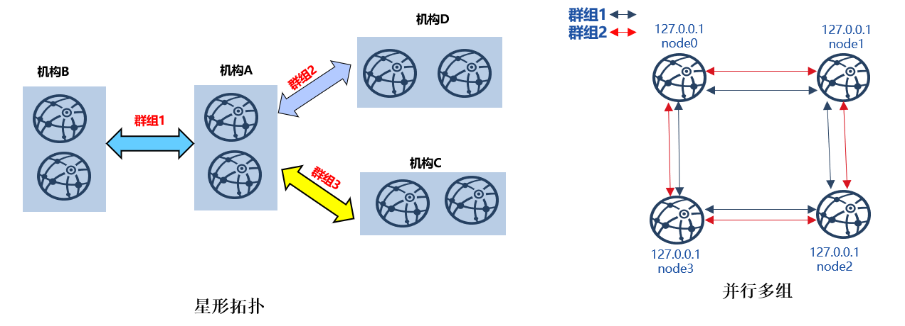

# 多群组使用案例

如下图，并行多组和星形组网拓扑是区块链应用中使用较广泛的两种组网方式。

- **并行多组**：区块链中每个节点均属于多个群组，每个群组运行独立的应用；

- **星形拓扑**：中心机构节点同时属于多个群组，运行多家机构应用，其他每家机构属于不同群组，运行各自应用。



下面以构建七节点星形拓扑和四节点并行多组区块链为例，详细介绍多群组操作方法。

## 安装依赖

部署FISCO BCOS区块链节点前，需安装`openssl，leveldb，curl`等依赖软件，具体命令如下：

```bash
### CentOS
$ sudo yum -y install openssl openssl-devel leveldb leveldb-devel curl

### Ubuntu
$ sudo apt-get install openssl libssl-dev libleveldb-dev curl

### Mac OS
$ brew install openssl leveldb
```

## 星形拓扑

本章以介绍构建本机四机构三群组七节点的星形组网拓扑为例，介绍多群组使用方法。星型组网区块链详细组网情况如下：

本章以构建上图所示的<font color=#FF0000>星形拓扑区块链</font>为例，介绍多群组使用方法。

星形区块链组网如下：

- `agencyA`：同时属于`group1、group2、group3`，包括两个节点，节点IP均为`127.0.0.1`；
- `agencyB`：属于`group1`，包括两个节点，节点IP均为`127.0.0.1`；
- `agencyC`：属于`group2`，包括两个节点，节点IP均为`127.0.0.1`；
- `agencyD`：属于`group3`，包括一个节点，节点IP均为`127.0.0.1`。

```eval_rst
.. important::
   - 真实应用场景中，**不建议将多个节点部署在同一台机器**，建议根据 **机器负载** 选择部署节点数目
   - **星形网络拓扑** 中，核心节点(本例中agencyA节点)同属于所有群组，负载较大，**建议单独部署在性能较好的机器** 
```

### 构建星形区块链

[build_chain](./build_chain.md)简单方便地支持任意拓扑多群组区块链构建，可使用该脚本构建星形拓扑区块链：

**获取预编译二进制可执行程序**

```bash
$ mkdir -p ~/fisco && cd ~/fisco
$ bash <(curl -s https://raw.githubusercontent.com/FISCO-BCOS/FISCO-BCOS/release-2.0.1/tools/ci/download_bin.sh) -b release-2.0.1
```

**获取build_chain.sh脚本**

```bash
$ mkdir -p ~/fisco && cd ~/fisco
$ curl -LO https://raw.githubusercontent.com/FISCO-BCOS/FISCO-BCOS/release-2.0.1/tools/build_chain.sh && chmod u+x build_chain.sh
```

**生成星形区块链系统配置文件**

```bash
$ mkdir -p ~/fisco && cd ~/fisco

# 生成区块链配置文件ip_list
$ cat > ip_list << EOF
127.0.0.1:2 agencyA 1,2,3
127.0.0.1:2 agencyB 1
127.0.0.1:2 agencyC 2
127.0.0.1:2 agencyD 3
EOF

# 查看配置文件ip_list内容
$ cat ip_list
127.0.0.1:2 agencyA 1,2,3
127.0.0.1:2 agencyB 1
127.0.0.1:2 agencyC 2
127.0.0.1:2 agencyD 3
```

**使用build_chain脚本构建星形区块链安装包**

```bash
# 根据配置生成星形区块链
$ bash build_chain.sh -f ip_list -e ./bin/fisco-bcos
Generating CA key...
==============================================================
Generating keys ...
Processing IP:127.0.0.1 Total:2 Agency:agencyA Groups:1,2,3
Processing IP:127.0.0.1 Total:2 Agency:agencyB Groups:1
Processing IP:127.0.0.1 Total:2 Agency:agencyC Groups:2
Processing IP:127.0.0.1 Total:2 Agency:agencyD Groups:3
==============================================================
......此处省略其他输出......
==============================================================
[INFO] FISCO-BCOS Path   : ./bin/fisco-bcos
[INFO] IP List File      : ip_list
[INFO] Start Port        : 30300 20200 8545
[INFO] Server IP         : 127.0.0.1:2 127.0.0.1:2 127.0.0.1:2 127.0.0.1:2
[INFO] State Type        : storage
[INFO] RPC listen IP     : 127.0.0.1
[INFO] Output Dir        : /home/fisco/nodes
[INFO] CA Key Path       : /home/fisco/nodes/cert/ca.key
==============================================================
[INFO] All completed. Files in /home/fisco/nodes

# 生成的节点文件如下
$ tree
.
|-- 127.0.0.1
|   |-- fisco-bcos
|   |-- node0
|   |   |-- conf  #节点配置目录
|   |   |   |-- agency.crt
|   |   |   |-- ca.crt
|   |   |   |-- group.1.genesis
|   |   |   |-- group.1.ini
|   |   |   |-- group.2.genesis
|   |   |   |-- group.2.ini
|   |   |   |-- group.3.genesis
|   |   |   |-- group.3.ini
|   |   |   |-- node.crt
|   |   |   |-- node.key
|   |   |   `-- node.nodeid
|   |   |-- config.ini
|   |   |-- start.sh
|   |   `-- stop.sh
|   |-- node1
|   |   |-- conf
......此处省略其他输出......
```

**启动节点**

节点提供`start_all.sh`和`stop_all.sh`脚本启动和停止节点。

```bash
# 进入节点目录
$ cd ~/fisco/nodes/127.0.0.1

# 启动节点
$ bash start_all.sh

# 查看节点进程
$ ps aux |grep fisco-bcos
app         301  0.8  0.0 986644  7452 pts/0    Sl   15:21   0:00 /home/fisco/nodes/127.0.0.1/node5/../fisco-bcos -c config.ini
app         306  0.9  0.0 986644  6928 pts/0    Sl   15:21   0:00 /home/fisco/nodes/127.0.0.1/node6/../fisco-bcos -c config.ini
app         311  0.9  0.0 986644  7184 pts/0    Sl   15:21   0:00 /home/fisco/127.0.0.1/node7/../fisco-bcos -c config.ini
app      131048  2.1  0.0 1429036 7452 pts/0    Sl   15:21   0:00 /home/fisco/127.0.0.1/node0/../fisco-bcos -c config.ini
app      131053  2.1  0.0 1429032 7180 pts/0    Sl   15:21   0:00 /home/fisco/127.0.0.1/node1/../fisco-bcos -c config.ini
app      131058  0.8  0.0 986644  7928 pts/0    Sl   15:21   0:00 /home/fisco/127.0.0.1/node2/../fisco-bcos -c config.ini
app      131063  0.8  0.0 986644  7452 pts/0    Sl   15:21   0:00 /home/fisco/127.0.0.1/node3/../fisco-bcos -c config.ini
app      131068  0.8  0.0 986644  7672 pts/0    Sl   15:21   0:00 /home/fisco/127.0.0.1/node4/../fisco-bcos -c config.ini

```

**查看群组共识状态**

不发交易时，共识正常的节点会输出`+++`日志，本例中，`node0、node1`同时属于`group1、group2和group3`；`node2、node3`属于`group1`；`node4、node5`属于`group2`；`node6、node7`属于`group3`，可通过`tail -f xxx.log | grep "g:${group_id}.*++"`查看各节点是否正常。

```eval_rst
.. important::

    节点正常共识打印 ``+++`` 日志， ``+++`` 日志字段含义：
     - ``g:``：群组ID
     - ``blkNum``：Leader节点产生的新区块高度；
     - ``tx``: 新区块中包含的交易数目；
     - ``myIdx``: 本节点索引；
     - ``hash``: Leader节点产生的最新区块哈希。
```

```bash
# 查看node0的group1是否正常共识
$ tail -f node0/log/* | grep "g:1.*++" 
info|2019-02-11 15:33:09.914042| [g:1][p:264][CONSENSUS][SEALER]++++++++Generating seal on,blkNum=1,tx=0,myIdx=2,hash=72254a42....

# 查看node0的group2是否正常共识
$ tail -f node0/log/* | grep "g:2.*++" 
info|2019-02-11 15:33:31.021697| [g:2][p:520][CONSENSUS][SEALER]++++++++Generating seal on,blkNum=1,tx=0,myIdx=3,hash=ef59cf17...

# 查看node0的group3是否正常共识
$ tail -f node0/log/* | grep "g:3.*++"
info|2019-02-11 15:33:51.022444| [g:3][p:776][CONSENSUS][SEALER]++++++++Generating seal on,blkNum=1,tx=0,myIdx=3,hash=2c455288...

# ... 查看node1的所有群组是否正常可参考node0操作方法...
# 查看node3的group1是否正常共识
$ tail -f node3/log/*| grep "g:1.*++"  
info|2019-02-11 15:39:43.927167| [g:1][p:264][CONSENSUS][SEALER]++++++++Generating seal on,blkNum=1,tx=0,myIdx=3,hash=5e94bf63...

# 查看node5的group2是否正常共识
$ tail -f node5/log/* | grep "g:2.*++" 
info|2019-02-11 15:39:42.922510| [g:2][p:520][CONSENSUS][SEALER]++++++++Generating seal on,blkNum=1,tx=0,myIdx=2,hash=b80a724d...

# 查看node6的group3是否正常共识
$ tail -f node6/log/* | grep "g:3.*++" 
info|2019-02-11 15:39:58.994218| [g:3][p:776][CONSENSUS][SEALER]++++++++Generating seal on,blkNum=1,tx=0,myIdx=2,hash=eb5801bf...
```

### 向群组发交易

`build_chain`提供了`transTest.sh`脚本，可向指定群组发交易，该脚本使用方法：

```bash
$ bash transTest.sh ${交易数目} ${群组ID}
```

```eval_rst
.. important::
    
    节点每出一个新块，会打印一条Report日志，Report日志中各字段含义如下：
     - ``g:``：群组ID
     - ``num``：出块高度；
     - ``idx``：出块节点索引；
     - ``hash``：区块哈希；
     - ``next``：下一个区块高度；
     - ``tx``：区块包含的交易数；
     - ``myIdx``： 当前节点索引。
```

```bash
# ... 向group1发交易...
$ bash transTest.sh 10 1
Send transaction:  1
{"id":83,"jsonrpc":"2.0","result":"0x226e54480ce325a5858240a10864d7fc1127f2adc17e3e02dd314f91baab074b"}
Send transaction:  2
{"id":83,"jsonrpc":"2.0","result":"0x9f69fa21081ef18be04536de6583d8c633bf0387b15eb8b8aa9d7f6bbbd9654e"}
......此处省略其他输出......

# 查看出块情况：有新区块产生
$ cat node0/log/* |grep "g:2.*Report"
info|2019-02-11 16:07:35.947676| [g:2][p:520][CONSENSUS][PBFT]^^^^^Report:,num=1,......此处省略其他输出......

# ...向group3发交易...
$ bash transTest.sh 10 3
Send transaction:  1
{"id":83,"jsonrpc":"2.0","result":"0x5f7a7c0a035a32a6fa17f0b797cc98eca45285f3e6347c6cd927efb7cd2a1a0b"}
Send transaction:  2
{"id":83,"jsonrpc":"2.0","result":"0x6f2279b37b98b79960e2e7291afbd89fceb9116c8d40859bf3d8374e2711b2dd"}
......此处省略其他输出......

# 查看出块情况：有新区块产生
$ cat node0/log/* |grep "g:3.*Report"
info|2019-02-11 16:17:17.147941| [g:3][p:776][CONSENSUS][PBFT]^^^^^Report:,num=1,idx=3,hash=843f6498...,next=2,tx=1,myIdx=3
......此处省略其他输出......
```

### 节点加入/退出群组

通过控制台，FISCO BCOS可将指定节点加入到指定群组，也可将节点从指定群组删除，详细介绍请参考[节点准入管理手册](node_access_management.md)，控制台配置参考[控制台操作手册](console.html#id7)。

```eval_rst
.. important::
    
    新节点加入群组前，请确保：
    
    - 新加入节点正常共识： 正常共识的节点会输出+++日志
    - 群组内节点正常共识
````

将星形区块链系统中的node2加入group2为共识节点，具体操作方法如下：

**启动控制台**

```bash
$ mkidr -p ~/fisco
# 获取控制台
$ curl -LO https://github.com/FISCO-BCOS/LargeFiles/raw/master/tools/console.tar.gz && tar -zxf console.tar.gz

# 进入控制台操作目录
$ cd ~/fisco/console

# 拷贝group2节点证书到控制台配置目录
$ cp ~/fisco/nodes/127.0.0.1/sdk/* conf/

# 获取node0的channel_listen_port
$ grep -n "channel_listen_port" ~/fisco/nodes/127.0.0.1/node0/config.ini
5:  channel_listen_port=20200

# 参考控制台操作文档，配置~/fisco/console/conf/applicationContext.xml的group id为2, ip:channel_listen_port为127.0.0.1:20200 
# Group2的关键配置如下：
<bean id="groupChannelConnectionsConfig" class="org.fisco.bcos.channel.handler.GroupChannelConnectionsConfig">
<property name="allChannelConnections">
<list>
    ... 省略若干行... 
    <bean id="group2"  class="org.fisco.bcos.channel.handler.ChannelConnections">
        <property name="groupId" value="2" />
            <property name="connectionsStr">
            <list>
            <value>127.0.0.1:20200</value>
            </list>
            </property>
    </bean>
    ... 省略若干行...
</list>
</property>
</bean>

# 配置channelService
 <bean id="channelService" class="org.fisco.bcos.channel.client.Service" depends-on="groupChannelConnectionsConfig">
        <property name="groupId" value="2" />
        <property name="orgID" value="fisco" />
        <property name="allChannelConnections" ref="groupChannelConnectionsConfig"></property>
</bean>


# 启动web3sdk，连接group2所有节点
$ bash start.sh 2
```

**将node2加入group2为共识节点**

```bash
$ cd ~/fisco/nodes/127.0.0.1

# ...获取node2的node id...
$ cat node2/conf/node.nodeid 
6dc585319e4cf7d73ede73819c6966ea4bed74aadbbcba1bbb777132f63d355965c3502bed7a04425d99cdcfb7694a1c133079e6d9b0ab080e3b874882b95ff4

# ... 从node0拷贝group2的配置到node2...
$ cp node0/conf/group.2.* node2/conf

# ...重启node2...
$ cd node2 && bash stop.sh && bash start.sh

# ...通过控制台将node2加入为共识节点
# 1. 查看当前共识节点列表
> getSealerList
[
    9217e87c6b76184cf70a5a77930ad5886ea68aefbcce1909bdb799e45b520baa53d5bb9a5edddeab94751df179d54d41e6e5b83c338af0a19c0611200b830442,
    227c600c2e52d8ec37aa9f8de8db016ddc1c8a30bb77ec7608b99ee2233480d4c06337d2461e24c26617b6fd53acfa6124ca23a8aa98cb090a675f9b40a9b106,
    7a50b646fcd9ac7dd0b87299f79ccaa2a4b3af875bd0947221ba6dec1c1ba4add7f7f690c95cf3e796296cf4adc989f4c7ae7c8a37f4505229922fb6df13bb9e,
    8b2c4204982d2a2937261e648c20fe80d256dfb47bda27b420e76697897b0b0ebb42c140b4e8bf0f27dfee64c946039739467b073cf60d923a12c4f96d1c7da6
]
# 2. 将node2加入到共识节点
> addSealer 6dc585319e4cf7d73ede73819c6966ea4bed74aadbbcba1bbb777132f63d355965c3502bed7a04425d99cdcfb7694a1c133079e6d9b0ab080e3b874882b95ff4
{
    "code":1,
    "msg":"success"
}
# 3. 查看共识节点列表
> getSealerList
[
    9217e87c6b76184cf70a5a77930ad5886ea68aefbcce1909bdb799e45b520baa53d5bb9a5edddeab94751df179d54d41e6e5b83c338af0a19c0611200b830442,
    227c600c2e52d8ec37aa9f8de8db016ddc1c8a30bb77ec7608b99ee2233480d4c06337d2461e24c26617b6fd53acfa6124ca23a8aa98cb090a675f9b40a9b106,
    7a50b646fcd9ac7dd0b87299f79ccaa2a4b3af875bd0947221ba6dec1c1ba4add7f7f690c95cf3e796296cf4adc989f4c7ae7c8a37f4505229922fb6df13bb9e,
    8b2c4204982d2a2937261e648c20fe80d256dfb47bda27b420e76697897b0b0ebb42c140b4e8bf0f27dfee64c946039739467b073cf60d923a12c4f96d1c7da6,
    6dc585319e4cf7d73ede73819c6966ea4bed74aadbbcba1bbb777132f63d355965c3502bed7a04425d99cdcfb7694a1c133079e6d9b0ab080e3b874882b95ff4 # 新加入节点
]

```

**查看新加入节点出块情况**

通过以上操作可看出，node2已成功加入group2。

> 通过`tail -f node2/log/* | grep "g:2.*++"`查看node2的group2是否出块正常：

```bash
# 查看节点共识情况
$ tail -f node2/log/* | grep "g:2.*++"
info|2019-02-11 18:41:31.625599| [g:2][p:520][CONSENSUS][SEALER]++++++++Generating seal on,blkNum=9,tx=0,myIdx=1,hash=c8a1ed9c...
......此处省略其他输出......
```

> 向group2发交易，查看node2的group2共识情况：

```bash
$ bash transTest.sh 10 2
Send transaction:  1
{"id":83,"jsonrpc":"2.0","result":"0xd834f909861599c475fa0a04b4afa4759b20fdaea683dd9692bbf79541f16b01"}
Send transaction:  2
......此处省略其他输出......

# 查看node2节点group2的：有新区块产生
$ cat node2/log/* | grep "g:2.*Report"
info|2019-02-11 18:53:20.708366| [g:2][p:520][CONSENSUS][PBFT]^^^^^Report:,num=9,idx=3,hash=80c98d31...,next=10,tx=1,myIdx=1
......此处省略其他输出......
```


## 并行多组

并行多组区块链搭建方法与星形拓扑区块链搭建方法类似，以搭建四节点两群组并行多链系统为例：

- 群组1：包括四个节点，节点IP均为`127.0.0.1`；
- 群组2: 包括四个节点，节点IP均为`127.0.0.1`。

```eval_rst
.. important::
   - 真实应用场景中，**不建议将多个节点部署在同一台机器** ，建议根据 **机器负载** 选择部署节点数目
   - 为演示并行多组扩容流程，这里仅先创建group1
   - 并行多组场景中，节点加入和退出群组操作与星形组网拓扑类似
```

### 构建单群组四节点区块链

> **用build_chain脚本生成单群组四节点区块链安装包**

```bash
$ mkdir -p ~/fisco && cd ~/fisco

# 获取fisco-bcos二进制文件
$ bash <(curl -s https://raw.githubusercontent.com/FISCO-BCOS/FISCO-BCOS/release-2.0.1/tools/ci/download_bin.sh)

# 获取build_chain.sh脚本
$ curl -LO https://raw.githubusercontent.com/FISCO-BCOS/FISCO-BCOS/release-2.0.1/tools/build_chain.sh && chmod u+x build_chain.sh

# 构建本机单群组四节点区块链(生产环境中，建议节点部署在不同物理机)
$ bash build_chain.sh -l "127.0.0.1:4" -e bin/fisco-bcos -o multi_nodes
Generating CA key...
==============================================================
Generating keys ...
Processing IP:127.0.0.1 Total:4 Agency:agency Groups:1
==============================================================
Generating configurations...
Processing IP:127.0.0.1 Total:4 Agency:agency Groups:1
==============================================================
[INFO] FISCO-BCOS Path   : bin/fisco-bcos
[INFO] Start Port        : 30300 20200 8545
[INFO] Server IP         : 127.0.0.1:4
[INFO] State Type        : storage
[INFO] RPC listen IP     : 127.0.0.1
[INFO] Output Dir        : /home/fisco/multi_nodes
[INFO] CA Key Path       : /home/fisco/multi_nodes/cert/ca.key
==============================================================
[INFO] All completed. Files in /home/fisco/multi_nodes

```

> **启动所有节点**

```bash
# 进入节点目录
$ cd ~/fisco/multi_nodes/127.0.0.1
$ bash start_all.sh

# 查看进程情况
$ ps aux | grep fisco-bcos
app       55028  0.9  0.0 986384  6624 pts/2    Sl   20:59   0:00 /home/fisco/multi_nodes/127.0.0.1/node0/../fisco-bcos -c config.ini
app       55034  0.8  0.0 986104  6872 pts/2    Sl   20:59   0:00 /home/fisco/multi_nodes/127.0.0.1/node1/../fisco-bcos -c config.ini
app       55041  0.8  0.0 986384  6584 pts/2    Sl   20:59   0:00 /home/fisco/multi_nodes/127.0.0.1/node2/../fisco-bcos -c config.ini
app       55047  0.8  0.0 986396  6656 pts/2    Sl   20:59   0:00 /home/fisco/multi_nodes/127.0.0.1/node3/../fisco-bcos -c config.ini

```

> **查看节点共识情况**

```bash
# 查看node0共识情况
$ tail -f node0/log/* | grep "g:1.*++"
info|2019-02-11 20:59:52.065958| [g:1][p:264][CONSENSUS][SEALER]++++++++Generating seal on,blkNum=1,tx=0,myIdx=2,hash=da72649e...

# 查看node1共识情况
$ tail -f node1/log/* | grep "g:1.*++" 
info|2019-02-11 20:59:54.070297| [g:1][p:264][CONSENSUS][SEALER]++++++++Generating seal on,blkNum=1,tx=0,myIdx=0,hash=11c9354d...

# 查看node2共识情况
$ tail -f node2/log/* | grep "g:1.*++" 
info|2019-02-11 20:59:55.073124| [g:1][p:264][CONSENSUS][SEALER]++++++++Generating seal on,blkNum=1,tx=0,myIdx=1,hash=b65cbac8...

# 查看node3共识情况
$ tail -f node3/log/* | grep "g:1.*++" 
info|2019-02-11 20:59:53.067702| [g:1][p:264][CONSENSUS][SEALER]++++++++Generating seal on,blkNum=1,tx=0,myIdx=3,hash=0467e5c4...

```


### 将group2加入区块链

并行多组区块链每个群组的`genesis`配置文件几乎相同，但[group].index不同，为群组号。

> **生成新群组配置**

```bash
# 拷贝group1的配置
$ cp node0/conf/group.1.genesis group.2.genesis

# 修改群组ID
$ vim group.2.genesis
[group]
    index=2

# 将配置拷贝到各个节点
$ cp group.2.genesis node0/conf
$ cp group.2.genesis node1/conf
$ cp group.2.genesis node2/conf
$ cp group.2.genesis node3/conf

# 重启区块链
$ bash stop_all.sh
$ bash start_all.sh
```

### 查看群组共识情况

```bash
# 查看node0 group2共识情况
$ tail -f node0/log/* | grep "g:2.*++" 
info|2019-02-11 21:13:28.541596| [g:2][p:520][CONSENSUS][SEALER]++++++++Generating seal on,blkNum=1,tx=0,myIdx=2,hash=f3562664...

# 查看node1 group2共识情况
$ tail -f node1/log/* | grep "g:2.*++"
info|2019-02-11 21:13:30.546011| [g:2][p:520][CONSENSUS][SEALER]++++++++Generating seal on,blkNum=1,tx=0,myIdx=0,hash=4b17e74f...

# 查看node2 group2共识情况
$ tail -f node2/log/* | grep "g:2.*++" 
info|2019-02-11 21:13:59.653615| [g:2][p:520][CONSENSUS][SEALER]++++++++Generating seal on,blkNum=1,tx=0,myIdx=1,hash=90cbd225...

# 查看node3 group2共识情况
$ tail -f node3/log/* | grep "g:2.*++" 
info|2019-02-11 21:14:01.657428| [g:2][p:520][CONSENSUS][SEALER]++++++++Generating seal on,blkNum=1,tx=0,myIdx=3,hash=d7dcb462...

```

### 向群组发交易

> 使用`transTest.sh`脚本向`group1`和`group2`发交易，验证区块链网络是否正常：

```bash
# ...向group1发交易，并查看节点共识情况...
bash transTest.sh 10 1
Send transaction:  1
{"id":83,"jsonrpc":"2.0","result":"0x24827ef7b0bed013123d9981ff61ba0a1761747a475e187467e70d9ff20c0714"}
Send transaction:  2
{"id":83,"jsonrpc":"2.0","result":"0x42058b83924248adbedf2e8f65e60b0986d378ee5255b89fd72cd76f5b0d07bf"}
......此处省略其他输出......

# 查看节点出块情况(其中num是块高, idx是出块节点索引, tx是区块中包含交易数，myIdx是当前节点索引):有新区块产生
$ cat node0/log/* | grep "g:1.*Report"
info|2019-02-11 21:14:57.216548| [g:1][p:264][CONSENSUS][PBFT]^^^^^Report:,num=1,idx=3,hash=be961c98...,next=2,tx=1,myIdx=2
......此处省略其他输出......

# ...向group2发交易，并查看节点出块情况...
 bash transTest.sh 10 2
Send transaction:  1
{"id":83,"jsonrpc":"2.0","result":"0xf8278a38d9243bfc6c7c146cb222fe13a7f8436b7df169bd1a90f7e17954c6a6"}
Send transaction:  2
{"id":83,"jsonrpc":"2.0","result":"0x43dca46e44c7658bb86db15d555081869e0157bd8ff7bc901fb3f648ead13d8e"}
......此处省略其他输出......

# 查看节点出块情况：有新区块产生
$ cat node0/log/log_2019021121.12.log | grep "g:2.*Report"
info|2019-02-11 21:15:25.310565| [g:2][p:520][CONSENSUS][PBFT]^^^^^Report:,num=1,idx=3,hash=5d006230...,next=2,tx=1,myIdx=2
......此处省略其他输出......

```