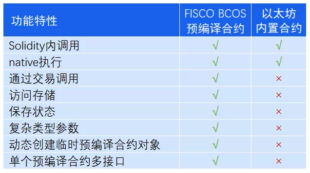

# 使用预编译合约

标签：``预编译合约`` ``高性能合约``

----

FISCO BCOS 2.0受以太坊内置合约启发，实现了一套预编译合约框架。未来，我们还会尝试将现有的典型业务场景抽象，开发成预编译合约模板，作为底层提供的基础能力，帮助用户更快的更方便的在业务中使用FISCO BCOS。

### 预编译合约的好处

**可访问分布式存储接口**：基于这套框架，用户可以访问本地DB存储状态，实现自己需要的任何逻辑。

**更好的性能表现**：由于实现是C++代码，会编译在底层中，不需要进入EVM执行，可以有更好的性能。

**无需学习Solidity语言即可上手**：基于FISCO BCOS预编译合约框架，开发者可以使用C++开发自己的预编译合约，快速实现需要的业务逻辑，而不需要学习Solidity语言。

**并行模型大幅提升处理能力**：我们在2.0版本中基于预编译合约和DAG实现了合约的并行执行，用户只需要指定接口冲突域，底层会自动根据冲突域构建交易依赖关系图，根据依赖关系尽可能并行执行交易，从而使得交易处理能力大幅提升。

### 预编译合约与以太坊内置合约的对比

上述说到，FISCO BCOS 预编译合约受以太坊内置合约启发，但实现原理却是大不相同的。

以太坊通过内置合约来避免EVM中复杂计算的代价，以太坊当前使用内置合约实现了8个函数（如下表所示）。可以看到，以太坊内置合约占用了0x1-0x8这8个地址，每个内置合约实际上就是一个本地函数的调用，只能用于状态无关的计算使用。


用户在Solidity中使用内置合约，需要借助call这个操作，依次输入下列参数

call(gasLimit, to, value, inputOffset, inputSize, outputOffset, outputSize)

包括内置合约地址、输入参数偏移、输入参数大小、输出参数偏移和输出参数大小，对用户而言，这不是一件简单的事情。

而FISCO BCOS的预编译合约框架，支持复杂的参数类型，支持通过AMDB读取和存储数据。每个预编译合约地址固定，合约内可以实现多个接口，所实现接口的调用方式与原生Solidity完全相同。

**下图是比较直观的对比**：



**注：**  √ 代表支持，× 代表不支持

## FISCO BCOS预编译合约架构

通过这一小节，你可以清楚了解预编译合约模块在FISCO BCOS中的位置，以及预编译合约的执行流程。

如下图所示，预编译合约会被区块执行引擎所调用，区块验证器通过区块执行引擎来执行区块，执行引擎执行区块时，会根据被调用合约的地址，来判断使用EVM还是预编译合约引擎。


当被调用的合约地址是EVM合约时，执行引擎会创建并执行EVM来执行交易；当被调用合约地址是已注册的预编译合约地址时，执行引擎通过调用地址对应的预编译合约接口来执行交易。

**预编译合约执行流程如下图所示**：


执行引擎首先根据预编译合约地址拿到合约对象，然后通过调用合约对象的call接口来获取执行结果。call接口中的操作主要包括：

1. 根据调用参数解析出被调用的接口
2. 根据ABI编码解析传入的参数
3. 执行被调用的合约接口
4. 将执行结果ABI编码并返回

所以，开发者如果要开发预编译合约，只需要实现其预编译合约的call接口和在执行引擎中注册所实现合约的地址即可。

## 预编译合约在FISCO BCOS 2.0中的应用

- **联盟链治理**：节点管理、系统配置管理、权限管理、CNS实现等系统合约。通过预编译合约形式实现这些功能，方便用户实现对联盟链的治理。
- **扩展Solidity能力**：KVTable合约接口、Table合约接口。使得Solidity合约中数据可以存储在FISCO的表结构中，数据逻辑分离，更容易实现合约逻辑升级。
- **支持Solidity并行**：Solidity并行合约接口，借助ParallelConfig预编译合约，使得Solidity合约接口并行成为可能。
- **提升SDK易用性，降低开发门槛**：基于CRUD预编译合约，SDK可实现CRUDService，提供类似传统数据库增删改查接口。
- **提供密码学算法**：基于预编译合约提供群签名校验、环签名校验、同态加等密码学算法功能

### FISCO BCOS当前系统合约及地址如下表：


|地址|合约|说明|
|:----|:----|:----|
|0x1000|SystemConfigPrecompiled|实现对群组系统参数配置管理|
|0x1001|TableFactoryPrecompiled|Solidity中使用的Table|
|0x1002|CRUDPrecompiled|CRUD接口实现，供SDK对链上表增删改查|
|0x1003|ConsensusPrecompiled|群组节点及节点身份管理|
|0x1004|CNSPrecompiled|保存更新CNS(contract name service)信息|
|0x1005|PermissionPrecompiled|基于表的权限控制|
|0x1006|ParallelConfigPrecompiled|Solidity中合约并行接口配置|
|0x1007|ContractLifecyclePrecompiled|合约生命周期管理|
|0x1008|ChainGovernancePrecompiled|角色权限管理|
|0x1010|KVTableFactoryPrecompiled|Solidity中使用KVTable|

## 预编译合约接口描述与SDK支持

### SystemConfigPrecompiled-0x1000

#### 接口声明

```solidity
pragma solidity ^0.4.24;

contract SystemConfigPrecompiled
{
    function setValueByKey(string key, string value) public returns(int256);
}
```

#### setValueByKey说明

- key表示配置项名称，当前支持的参数有`tx_count_limit`,`tx_gas_limit`,`rpbft_epoch_sealer_num`,`rpbft_epoch_block_num`,`consensus_timeout`。
- value表示对应配置项的值，其中`tx_count_limit`默认值为1000，不可设置为负数，`tx_gas_limit`默认值为300000000，不可设置为负数。

#### SDK支持

- [Java SDK](https://fisco-bcos-documentation.readthedocs.io/zh_CN/latest/docs/sdk/java_sdk/api.html#systemconfigservice)
- [Nodejs SDK](https://fisco-bcos-documentation.readthedocs.io/zh_CN/latest/docs/sdk/nodejs_sdk/api.html#systemconfigservice)
- [Python SDK](https://fisco-bcos-documentation.readthedocs.io/zh_CN/latest/docs/sdk/python_sdk/api.html#id3)
- [Go SDK](https://fisco-bcos-documentation.readthedocs.io/zh_CN/latest/docs/sdk/go_sdk/api.html#systemconfigservice)

### TableFactoryPrecompiled-0x1001

#### 接口声明

完整solidity请[参考这里](https://github.com/FISCO-BCOS/FISCO-BCOS/blob/master/libprecompiled/solidity/Table.sol)

```solidity
pragma solidity>=0.4.24 <0.6.11;

contract TableFactory {
    function openTable(string tableName) public view returns (Table); //open table
    function createTable(string tableName, string keyField, string valueFields) public returns (int256); //create table
}
```

#### openTable说明

- 根据入参Table返回Solidity中的Table对象

#### createTable说明

- 根据入参创建表，其中valueFields可以有多个字段，使用英文逗号分割。
- 表名允许字母、数字、下划线，表名不超48字符
- keyField不能以下划线开始，允许字母、数字、下划线，总长度不能超过64字符
- valueField不能以下划线开始，允许字母、数字、下划线，单字段名不超过64字符， valueFields总长度不超过1024
- valueFields与keyField不能存在重复字段

### CRUDPrecompiled-0x1002

#### 接口声明

```solidity
pragma solidity ^0.4.24;

contract CRUDPrecompiled {
    function insert(string tableName, string key, string entry, string) public returns (int256);
    function remove(string tableName, string key, string condition, string) public returns (int256);
    function select(string tableName, string key, string condition, string)
        public
        view
        returns (string);
    function update(
        string tableName,
        string key,
        string entry,
        string condition,
        string
    ) public returns (int256);
    function desc(string tableName) public view returns (string, string);
}
```

#### 接口说明

- Insert接口往指定的Table的key中插入一条记录，entry是json编码，需要在sdk处理
- Remove接口删除指定Table中key下的一条记录
- Update接口，根据condition和entry更新对应Table中key下的记录
- Select接口根据condition查询对应Table中key下的记录
- Desc接口，查询对应Table的字段名


#### SDK支持

- [Java SDK](https://fisco-bcos-documentation.readthedocs.io/zh_CN/latest/docs/sdk/java_sdk/api.html#tablecrudservice)
- [Nodejs SDK](https://fisco-bcos-documentation.readthedocs.io/zh_CN/latest/docs/sdk/nodejs_sdk/api.html#crudservice)
- [Python SDK](https://fisco-bcos-documentation.readthedocs.io/zh_CN/latest/docs/sdk/python_sdk/api.html#crud)
- [Go SDK](https://fisco-bcos-documentation.readthedocs.io/zh_CN/latest/docs/sdk/go_sdk/api.html#crudservice)
### ConsensusPrecompiled-0x1003

#### 接口声明

```solidity
pragma solidity ^0.4.24;

contract ConsensusPrecompiled {
    function addSealer(string) public returns (int256);
    function addObserver(string) public returns (int256);
    function remove(string) public returns (int256);
}

```

#### 接口说明

- addSealer添加一个共识节点，参数是新节点公钥的16进制表示
- addObserver添加一个观察节点或将已经存在的共识节点身份改为观察节点
- Remove删除某个节点，如果是最后一个共识节点则不允许删除
- 数据存放在_sys_consensus_表中

#### SDK支持

- [Java SDK](https://fisco-bcos-documentation.readthedocs.io/zh_CN/latest/docs/sdk/java_sdk/api.html#consensusservice)
- [Nodejs SDK](https://fisco-bcos-documentation.readthedocs.io/zh_CN/latest/docs/sdk/nodejs_sdk/api.html#consensusservice)
- [Python SDK](https://fisco-bcos-documentation.readthedocs.io/zh_CN/latest/docs/sdk/python_sdk/api.html#id1)
- [Go SDK](https://fisco-bcos-documentation.readthedocs.io/zh_CN/latest/docs/sdk/go_sdk/api.html#consensusservice)

### CNSPrecompiled-0x1004

#### 接口声明

```solidity
pragma solidity ^0.4.24;

contract CNSPrecompiled
{
    function insert(string name, string version, string addr, string abi) public returns(uint256);
    function selectByName(string name) public constant returns(string);
    function selectByNameAndVersion(string name, string version) public constant returns(string);
    function getContractAddress(string name, string version) public constant returns(address);
}
```

#### 接口说明

- Insert插入了合约版本、地址和abi
- selectByName返回该合约所有版本的版本、地址、abi的json
- selectByNameAndVersion根据合约名和版本号返回对应地址、abi的json
- getContractAddress根据合约名和版本号返回合约地址
- version不超128字符，address不超256字符，abi不超16MB

#### SDK支持

- [Java SDK](https://fisco-bcos-documentation.readthedocs.io/zh_CN/latest/docs/sdk/java_sdk/api.html#cnsservice)
- [Nodejs SDK](https://fisco-bcos-documentation.readthedocs.io/zh_CN/latest/docs/sdk/nodejs_sdk/api.html#cnsservice)
- [Python SDK](https://fisco-bcos-documentation.readthedocs.io/zh_CN/latest/docs/sdk/python_sdk/api.html#cns)
- [Go SDK](https://fisco-bcos-documentation.readthedocs.io/zh_CN/latest/docs/sdk/go_sdk/api.html#cnsservice)

### PermissionPrecompiled-0x1005

#### 接口声明

```solidity
pragma solidity ^0.4.24;

contract PermissionPrecompiled {
    function insert(string table_name, string addr) public returns (int256);
    function remove(string table_name, string addr) public returns (int256);
    function queryByName(string table_name) public view returns (string);

    function grantWrite(address contractAddr, address user)
        public
        returns (int256);
    function revokeWrite(address contractAddr, address user)
        public
        returns (int256);
    function queryPermission(address contractAddr) public view returns (string);
}

```

#### 接口说明

- Insert为某个表添加一条写权限。可以对同一个表插入多个账户有写权限。
- Remove删除某个表的一个账户的写权限。
- queryByName返回有表写权限的地址等信息的json，sdk需要解析

#### SDK支持

- [Java SDK](https://fisco-bcos-documentation.readthedocs.io/zh_CN/latest/docs/sdk/java_sdk/api.html#permissionservice)
- [Nodejs SDK](https://fisco-bcos-documentation.readthedocs.io/zh_CN/latest/docs/sdk/nodejs_sdk/api.html#permissionservice)
- [Python SDK](https://fisco-bcos-documentation.readthedocs.io/zh_CN/latest/docs/sdk/python_sdk/api.html#id2)
- [Go SDK](https://fisco-bcos-documentation.readthedocs.io/zh_CN/latest/docs/sdk/go_sdk/api.html#permissionservice)

### ParallelConfigPrecompiled-0x1006

#### 接口声明

```solidity
pragma solidity ^0.4.24;

contract ParallelConfigPrecompiled {
    function registerParallelFunctionInternal(address, string, uint256)
        public
        returns (int256);
    function unregisterParallelFunctionInternal(address, string)
        public
        returns (int256);
}

```

#### 接口说明

- registerParallelFunctionInternal注册合约的并行接口信息，参数为合约地址，并行函数签名、互斥参数个数。并行函数的互斥参数必须放在不互斥参数之前
- unregisterParallelFunctionInternal删除某个函数的并行设置

### ContractLifeCyclePrecompiled-0x1007

#### 接口声明

```solidity
pragma solidity ^0.4.24;

contract ContractLifeCyclePrecompiled {
    function freeze(address addr) public returns(int);
    function unfreeze(address addr) public returns(int);
    function grantManager(address contractAddr, address userAddr) public returns(int);
    function getStatus(address addr) public constant returns(int,string);
    function listManager(address addr) public constant returns(int,address[]);
}
```

#### 接口说明

- Kill将某个合约置为删除状态，不可恢复
- Freeze冻结合约
- Unfree解冻
- queryStatus查询合约状态


#### SDK支持

- [Java SDK](https://fisco-bcos-documentation.readthedocs.io/zh_CN/latest/docs/sdk/java_sdk/api.html#contractlifecycleservice)
- [Go SDK](https://fisco-bcos-documentation.readthedocs.io/zh_CN/latest/docs/sdk/go_sdk/api.html#contractlifecycleservice)

### ChainGovernancePrecompiled-0x1008

#### 接口声明

```solidity
pragma solidity ^0.4.24;


contract ChainGovernancePrecompiled {
    function grantCommitteeMember(address user) public returns (int256);

    function revokeCommitteeMember(address user) public returns (int256);

    function listCommitteeMembers() public view returns (string);

    function queryCommitteeMemberWeight(address user)
        public
        view
        returns (bool, int256);

    function updateCommitteeMemberWeight(address user, int256 weight)
        public
        returns (int256);
    function queryVotesOfMember(address member) public view returns (string);
    function queryVotesOfThreshold() public view returns (string);
    // threshold [0,100)
    function updateThreshold(int256 threshold) public returns (int256);

    function queryThreshold() public view returns (int256);

    function grantOperator(address user) public returns (int256);

    function revokeOperator(address user) public returns (int256);

    function listOperators() public view returns (string);

    // account life cycle
    function freezeAccount(address account) public returns (int256);

    function unfreezeAccount(address account) public returns (int256);

    function getAccountStatus(address account) public view returns (string);
}

```

#### SDK支持

- [Java SDK](https://fisco-bcos-documentation.readthedocs.io/zh_CN/latest/docs/sdk/java_sdk/api.html#chaingovernanceservice)
- [Go SDK](https://fisco-bcos-documentation.readthedocs.io/zh_CN/latest/docs/sdk/go_sdk/api.html#chaingovernanceservice)

### KVTableFactoryPrecompiled-0x1010

#### 接口声明

```solidity
pragma solidity>=0.4.24 <0.6.11;
//one record
contract Entry {
    function getInt(string memory) public view returns (int256) {}
    function getUInt(string memory) public view returns (uint256) {}
    function getAddress(string memory) public view returns (address) {}
    function getBytes64(string memory) public view returns (bytes1[64] memory) {}
    function getBytes32(string memory) public view returns (bytes32) {}
    function getString(string memory) public view returns (string memory) {}

    function set(string memory, int256) public {}
    function set(string memory, uint256) public {}
    function set(string memory, string memory) public {}
    function set(string memory, address) public {}
}

contract KVTableFactory {
    function openTable(string memory) public view returns (KVTable) {}
    function createTable(string memory, string memory, string memory) public returns (int256) {}
}

//KVTable per permiary key has only one Entry
contract KVTable {
    function get(string memory) public view returns (bool, Entry) {}
    function set(string memory, Entry) public returns (int256) {}
    function newEntry() public view returns (Entry) {}
}
```

#### 接口说明

- openTable 根据tableName返回一个solidity中的Table对象
- createTable 创建表，参数分别是表名、主键列名、以逗号分隔的其他列名。
- createTable 表名允许字母、数字、下划线，表名不超48字符
- keyField不能以下划线开始，允许字母、数字、下划线，总长度不能超过64字符
- valueField不能以下划线开始，允许字母、数字、下划线，单字段名不超过64字符， valueFields总长度不超过1024
- valueFields与keyField不能存在重复字段

