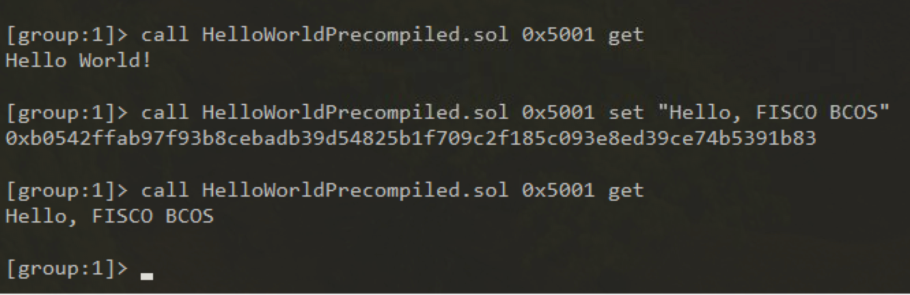

# 智能合约开发

FISCO BCOS平台目前支持Solidity、CRUD、Precompiled三种智能合约形式。

- Solidity合约与以太坊相同，支持最新版本。

- CRUD接口通过在Solidity合约中支持分布式存储预编译合约，可以实现将Solidity合约中数据存储在FISCO BCOS平台AMDB的表结构中，实现合约逻辑与数据的分离。

- 预编译（Precompiled）合约使用C++开发，内置于FISCO BCOS平台，相比于Solidity合约具有更好的性能，其合约接口需要在编译时预先确定，适用于逻辑固定但需要共识的场景，例如群组配置。关于预编译合约的开发将在下一节进行介绍。


### [Solidity合约开发](https://solidity.readthedocs.io/en/latest/)

- [Solidity官方文档](https://solidity.readthedocs.io/en/latest/)
- [Remix在线IDE](https://remix.ethereum.org/)

### 使用合约CRUD接口

访问 AMDB 需要使用 AMDB 专用的智能合约`Table.sol`接口，该接口是数据库合约，可以创建表，并对表进行增删改查操作。

```eval_rst
.. note::

    为实现AMDB创建的表可被多个合约共享访问，其表名是群组内全局可见且唯一的，所以无法在同一条链上的同一个群组中，创建多个表名相同的表

```

`Table.sol`文件代码如下:

```js
pragma solidity ^0.4.24;

contract TableFactory {
    function openTable(string) public constant returns (Table);  // 打开表
    function createTable(string,string,string) public returns(int);  // 创建表
}

// 查询条件
contract Condition {
    //等于
    function EQ(string, int) public;
    function EQ(string, string) public;
    
    //不等于
    function NE(string, int) public;
    function NE(string, string)  public;
    
    //大于
    function GT(string, int) public;
    //大于或等于
    function GE(string, int) public;
    
    //小于
    function LT(string, int) public;
    //小于或等于
    function LE(string, int) public;
    
    //限制返回记录条数
    function limit(int) public;
    function limit(int, int) public;
}

// 单条数据记录
contract Entry {
    function getInt(string) public constant returns(int);
    function getAddress(string) public constant returns(address);
    function getBytes64(string) public constant returns(byte[64]);
    function getBytes32(string) public constant returns(bytes32);
    function getString(string) public constant returns(string);
    
    function set(string, int) public;
    function set(string, string) public;
    function set(string, address) public;
}

// 数据记录集
contract Entries {
    function get(int) public constant returns(Entry);
    function size() public constant returns(int);
}

// Table主类
contract Table {
    // 查询接口
    function select(string, Condition) public constant returns(Entries);
    // 插入接口
    function insert(string, Entry) public returns(int);
    // 更新接口
    function update(string, Entry, Condition) public returns(int);
    // 删除接口
    function remove(string, Condition) public returns(int);
    
    function newEntry() public constant returns(Entry);
    function newCondition() public constant returns(Condition);
}
```

```eval_rst
.. important::
   v2.2.0及之前版本CRUD接口的表中中主Key下可以有多条记录，v2.3.0将会废弃该特性。在v2.3.0之后的版本中主Key只允许唯一对应一条记录。
```

提供一个合约案例`TableTest.sol`，代码如下：

```js
pragma solidity ^0.4.24;

import "./Table.sol";

contract TableTest {
    event CreateResult(int count);
    event InsertResult(int count);
    event UpdateResult(int count);
    event RemoveResult(int count);
    
    // 创建表
    function create() public returns(int){
        TableFactory tf = TableFactory(0x1001);  // TableFactory的地址固定为0x1001
        // 创建t_test表，表的key_field为name，value_field为item_id,item_name 
        // key_field表示AMDB主key value_field表示表中的列，可以有多列，以逗号分隔
        int count = tf.createTable("t_test", "name", "item_id,item_name");
        emit CreateResult(count);
        
        return count;
    }

    // 查询数据
    function select(string name) public constant returns(bytes32[], int[], bytes32[]){
        TableFactory tf = TableFactory(0x1001);
        Table table = tf.openTable("t_test");
        
        // 条件为空表示不筛选 也可以根据需要使用条件筛选
        Condition condition = table.newCondition();
        
        Entries entries = table.select(name, condition);
        bytes32[] memory user_name_bytes_list = new bytes32[](uint256(entries.size()));
        int[] memory item_id_list = new int[](uint256(entries.size()));
        bytes32[] memory item_name_bytes_list = new bytes32[](uint256(entries.size()));
        
        for(int i=0; i<entries.size(); ++i) {
            Entry entry = entries.get(i);
            
            user_name_bytes_list[uint256(i)] = entry.getBytes32("name");
            item_id_list[uint256(i)] = entry.getInt("item_id");
            item_name_bytes_list[uint256(i)] = entry.getBytes32("item_name");
        }
 
        return (user_name_bytes_list, item_id_list, item_name_bytes_list);
    }
    // 插入数据
    function insert(string name, int item_id, string item_name) public returns(int) {
        TableFactory tf = TableFactory(0x1001);
        Table table = tf.openTable("t_test");
        
        Entry entry = table.newEntry();
        entry.set("name", name);
        entry.set("item_id", item_id);
        entry.set("item_name", item_name);
        
        int count = table.insert(name, entry);
        emit InsertResult(count);
        
        return count;
    }
    // 更新数据
    function update(string name, int item_id, string item_name) public returns(int) {
        TableFactory tf = TableFactory(0x1001);
        Table table = tf.openTable("t_test");
        
        Entry entry = table.newEntry();
        entry.set("item_name", item_name);
        
        Condition condition = table.newCondition();
        condition.EQ("name", name);
        condition.EQ("item_id", item_id);
        
        int count = table.update(name, entry, condition);
        emit UpdateResult(count);
        
        return count;
    }
    // 删除数据
    function remove(string name, int item_id) public returns(int){
        TableFactory tf = TableFactory(0x1001);
        Table table = tf.openTable("t_test");
        
        Condition condition = table.newCondition();
        condition.EQ("name", name);
        condition.EQ("item_id", item_id);
        
        int count = table.remove(name, condition);
        emit RemoveResult(count);
        
        return count;
    }
}
```

`TableTest.sol`调用了 AMDB 专用的智能合约`Table.sol`，实现的是创建用户表`t_test`，并对`t_test`表进行增删改查的功能。`t_test`表结构如下，该表记录某公司员工领用物资和编号。

|name*|item_name|item_id|
|:----|:----|:------|
|Bob|Laptop|100010001001|

```eval_rst
.. important::
    客户端需要调用转换为Java文件的合约代码，需要将TableTest.sol和Table.sol放入控制台的contracts/solidity目录下，通过控制台的编译脚本sol2java.sh生成TableTest.java。
```


## 预编译合约开发

### 一. 简介

预编译（precompiled）合约是一项以太坊原生支持的功能：在底层使用c++代码实现特定功能的合约，提供给EVM模块调用。FISCO BCOS继承并且拓展了这种特性，在此基础上发展了一套功能强大并易于拓展的框架[precompiled设计原理](../design/virtual_machine/precompiled.md)。
本文作为一篇入门指导，旨在指引用户如何实现自己的precompiled合约,并实现precompiled合约的调用。

### 二. 实现预编译合约  

#### 2.1 流程
实现预编译合约的流程：
```eval_rst
.. mermaid::
    graph LR
        a(分配合约地址) -->b(定义合约接口)
        b -->c(设计存储结构)
        c -->d(实现合约逻辑)
        d-->e(注册合约)
```

- **分配合约地址**  

调用solidity合约或者预编译合约需要根据合约地址来区分，地址空间划分：

| 地址用途 | 地址范围 |
| --------- | --------- |
| 以太坊precompiled | 0x0001-0x0008 |
| 保留 | 0x0008-0x0fff |
| FISCO BCOS precompied | 0x1000-0x1006 |
| FISCO BCOS预留 | 0x1007-0x5000 |
| 用户分配区间 | 0x5001 - 0xffff |
| CRUD临时合约 | 0x10000+ |
| solidity | 其他 |

 用户分配地址空间为`0x5001`-`0xffff`,用户需要为新添加的预编译合约分配一个未使用的地址，**预编译合约地址必须唯一， 不可冲突**。

FISCO BCOS中实现的precompild合约列表以及地址分配：

| 地址   | 功能   | 源码([libprecompiled目录](https://github.com/FISCO-BCOS/FISCO-BCOS/tree/master/libprecompiled)) |
|--------|--------|---------|
| 0x1000 | 系统参数管理 | SystemConfigPrecompiled.cpp |
| 0x1001 | 表工厂合约 | TableFactoryPrecompiled.cpp |
| 0x1002 | CRUD合约 | CRUDPrecompiled.cpp |
| 0x1003 | 共识节点管理 | ConsensusPrecompiled.cpp |
| 0x1004 | CNS功能  | CNSPrecompiled.cpp |
| 0x1005 | 存储表权限管理 | AuthorityPrecompiled.cpp |
| 0x1006 | 并行合约配置 | ParallelConfigPrecompiled.cpp |

- **定义合约接口**  

同solidity合约，设计合约时需要首先确定合约的ABI接口， precomipiled合约的ABI接口规则与solidity完全相同，[solidity ABI链接](https://solidity.readthedocs.io/en/latest/abi-spec.html)。  

> 定义预编译合约接口时，通常需要定义一个有相同接口的solidity合约，并且将所有的接口的函数体置空，这个合约我们称为预编译合约的**接口合约**，接口合约在调用预编译合约时需要使用。 

```js
    pragma solidity ^0.4.24;
    contract Contract_Name {
        function interface0(parameters ... ) {}
        ....
        function interfaceN(parameters ... ) {}
    }
```

- **设计存储结构**  

预编译合约涉及存储操作时，需要确定存储的表信息(表名与表结构,存储数据在FISCO BCOS中会统一抽象为表结构)， [存储结构](../design/storage/storage.md)。  

```eval_rst
.. note::
    不涉及存储操作可以省略该流程。
```

- **实现调用逻辑**  

实现新增合约的调用逻辑，需要新实现一个c++类，该类需要继承[Precompiled](https://github.com/FISCO-BCOS/FISCO-BCOS/blob/master/libblockverifier/Precompiled.h#L37), 重载call函数， 在call函数中实现各个接口的调用行为。

```cpp
    // libblockverifier/Precompiled.h
    class Precompiled
    {
        virtual bytes call(std::shared_ptr<ExecutiveContext> _context, bytesConstRef _param,
            Address const& _origin = Address()) = 0;
    };
```
call函数有三个参数：  

`std::shared_ptr<ExecutiveContext> _context : ` 保存交易执行的上下文  

`bytesConstRef _param : ` 调用合约的参数信息，本次调用对应合约接口以及接口的参数可以从_param解析获取  

`Address const& _origin : ` 交易发送者，用来进行权限控制  

如何实现一个Precompiled类在下面的sample中会详细说明。
- **注册合约**  

最后需要将合约的地址与对应的类注册到合约的执行上下文，这样通过地址调用precompiled合约时合约的执行逻辑才能被正确识别执行， 查看注册的[预编译合约列表](https://github.com/FISCO-BCOS/FISCO-BCOS/blob/master/libblockverifier/ExecutiveContextFactory.cpp#L36)。   
注册路径：

```
    file        libblockverifier/ExecutiveContextFactory.cpp
    function    initExecutiveContext  
```

#### 2.2 示例合约开发

```js
// HelloWorld.sol
pragma solidity ^0.4.24;

contract HelloWorld{
    string name;

    function HelloWorld(){
       name = "Hello, World!";
    }

    function get()constant returns(string){
        return name;
    }

    function set(string n){
    	name = n;
    }
}
```

上述源码为solidity编写的HelloWorld合约， 本章节会实现一个相同功能的预编译合约，通过step by step使用户对预编译合约编写有直观的认识。
示例的c++[源码路径](https://github.com/FISCO-BCOS/FISCO-BCOS/blob/master/libprecompiled/extension/HelloWorldPrecompiled.cpp)：

```cpp
    libprecompiled/extension/HelloWorldPrecompiled.h
    libprecompiled/extension/HelloWorldPrecompiled.cpp
```

##### 2.2.1 分配合约地址  

参照地址分配空间，HelloWorld预编译合约的地址分配为：
```
0x5001
```

##### 2.2.2 定义合约接口  

需要实现HelloWorld合约的功能，接口与HelloWorld接口相同， HelloWorldPrecompiled的接口合约：
```js
pragma solidity ^0.4.24;

contract HelloWorldPrecompiled {
    function get() public constant returns(string) {}
    function set(string _m) {}
}
```

##### 2.2.3 设计存储结构  

HelloWorldPrecompiled需要存储set的字符串值，所以涉及到存储操作，需要设计存储的表结构。

表名： ```_ext_hello_world_```

表结构：

|key       | value
----------|------------
|hello_key | hello_value


该表只存储一对键值对，key字段为hello_key，value字段为hello_value 存储对应的字符串值，可以通过set(string)接口修改，通过get()接口获取。

##### 2.2.4 实现调用逻辑  
添加HelloWorldPrecompiled类，重载call函数，实现所有接口的调用行为，[call函数源码](https://github.com/FISCO-BCOS/FISCO-BCOS/blob/master/libprecompiled/extension/HelloWorldPrecompiled.cpp#L66)。

用户自定义的Precompiled合约需要新增一个类，在类中定义合约的调用行为，在示例中添加HelloWorldPrecompiled类，然后主要需要完成以下工作：

- 接口注册  
```c++
// 定义类中所有的接口
const char* const HELLO_WORLD_METHOD_GET = "get()";
const char* const HELLO_WORLD_METHOD_SET = "set(string)";

// 在构造函数进行接口注册
HelloWorldPrecompiled::HelloWorldPrecompiled()
{
    // name2Selector是基类Precompiled类中成员，保存接口调用的映射关系
    name2Selector[HELLO_WORLD_METHOD_GET] = getFuncSelector(HELLO_WORLD_METHOD_GET);
    name2Selector[HELLO_WORLD_METHOD_SET] = getFuncSelector(HELLO_WORLD_METHOD_SET);
}
```

- 创建表  

定义表名，表的字段结构
```c++
// 定义表名
const std::string HELLO_WORLD_TABLE_NAME = "_ext_hello_world_";
// 主键字段
const std::string HELLOWORLD_KEY_FIELD = "key";
// 其他字段字段，多个字段使用逗号分割，比如 "field0,field1,field2"
const std::string HELLOWORLD_VALUE_FIELD = "value";
```

```c++
// call函数中，表存在时打开，否则首先创建表
Table::Ptr table = openTable(_context, HELLO_WORLD_TABLE_NAME);
if (!table)
{
    // 表不存在，首先创建
    table = createTable(_context, HELLO_WORLD_TABLE_NAME, HELLOWORLD_KEY_FIELD,
        HELLOWORLD_VALUE_FIELD, _origin);
    if (!table)
    {
        // 创建表失败，返回错误码
    }
}
```
获取表的操作句柄之后，用户可以实现对表操作的具体逻辑。

- 区分调用接口  

通过getParamFunc解析_param可以区分调用的接口。  
**注意：合约接口一定要先在构造函数中注册**
```c++
uint32_t func = getParamFunc(_param);
if (func == name2Selector[HELLO_WORLD_METHOD_GET])
{  
    // get() 接口调用逻辑 
}
else if (func == name2Selector[HELLO_WORLD_METHOD_SET])
{  
    // set(string) 接口调用逻辑 
}
else
{  
    // 未知接口，调用错误，返回错误码
}
```

- 参数解析与结果返回  

调用合约时的参数包含在call函数的_param参数中，是按照Solidity ABI格式进行编码，使用`dev::eth::ContractABI`工具类可以进行参数的解析，同样接口返回时返回值也需要按照该编码格编码。[Solidity ABI](https://solidity.readthedocs.io/en/latest/abi-spec.html)。

`dev::eth::ContractABI`类中我们需要使用`abiIn abiOut`两个接口，前者用户参数的序列化，后者可以从序列化的数据中解析参数
```c++
// 序列化ABI数据, c++类型数据序列化为evm使用的格式
// _id : 函数接口声明对应的字符串, 一般默认为""即可。
template <class... T> bytes abiIn(std::string _id, T const&... _t)
// 将序列化数据解析为c++类型数据
template <class... T> void  abiOut(bytesConstRef _data, T&... _t)
```

下面的示例代码说明接口如何使用:
```c++ 
// 对于transfer接口 ： transfer(string,string,uint256)

// 参数1
std::string str1 = "fromAccount";
// 参数2
std::string str2 = "toAccount";
// 参数3
uint256 transferAmoumt = 11111;

dev::eth::ContractABI abi;
// 序列化, abiIn第一个string参数默认""
bytes out = abi.abiIn("", str1, str2, transferAmoumt);

std::string strOut1;
std::string strOut2;
uint256 amoumt;

// 解析参数
abi.abiOut(out, strOut1, strOut2, amount);
// 解析之后  
// strOut1 = "fromAccount";
// strOut2 = "toAccount"
// amoumt = 11111
```


最后，给出HelloWorldPrecompiled call函数的完整实现[源码链接](https://github.com/FISCO-BCOS/FISCO-BCOS/blob/master/libprecompiled/extension/HelloWorldPrecompiled.cpp#L66)。
```c++
bytes HelloWorldPrecompiled::call(dev::blockverifier::ExecutiveContext::Ptr _context,
    bytesConstRef _param, Address const& _origin)
{
    // 解析函数接口
    uint32_t func = getParamFunc(_param);
    // 
    bytesConstRef data = getParamData(_param);
    bytes out;
    dev::eth::ContractABI abi;

    // 打开表
    Table::Ptr table = openTable(_context, HELLO_WORLD_TABLE_NAME);
    if (!table)
    {
        // 表不存在，首先创建
        table = createTable(_context, HELLO_WORLD_TABLE_NAME, HELLOWORLD_KEY_FIELD,
            HELLOWORLD_VALUE_FIELD, _origin);
        if (!table)
        {
            // 创建表失败，无权限? 
            out = abi.abiIn("", CODE_NO_AUTHORIZED);
            return out;
        }
    }

    // 区分调用接口，各个接口的具体调用逻辑
    if (func == name2Selector[HELLO_WORLD_METHOD_GET])
    {  // get() 接口调用
        // 默认返回值
        std::string retValue = "Hello World!";
        auto entries = table->select(HELLOWORLD_KEY_FIELD_NAME, table->newCondition());
        if (0u != entries->size())
        { 
            auto entry = entries->get(0);
            retValue = entry->getField(HELLOWORLD_VALUE_FIELD);
        }
        out = abi.abiIn("", retValue);
    }
    else if (func == name2Selector[HELLO_WORLD_METHOD_SET])
    {  // set(string) 接口调用

        std::string strValue;
        abi.abiOut(data, strValue);
        auto entries = table->select(HELLOWORLD_KEY_FIELD_NAME, table->newCondition());
        auto entry = table->newEntry();
        entry->setField(HELLOWORLD_KEY_FIELD, HELLOWORLD_KEY_FIELD_NAME);
        entry->setField(HELLOWORLD_VALUE_FIELD, strValue);

        int count = 0;
        if (0u != entries->size())
        {  // 值存在，更新
            count = table->update(HELLOWORLD_KEY_FIELD_NAME, entry, table->newCondition(),
                std::make_shared<AccessOptions>(_origin));
        }
        else
        {  // 值不存在，插入
            count = table->insert(
                HELLOWORLD_KEY_FIELD_NAME, entry, std::make_shared<AccessOptions>(_origin));
        }

        if (count == CODE_NO_AUTHORIZED)
        {  // 没有表操作权限
            PRECOMPILED_LOG(ERROR) << LOG_BADGE("HelloWorldPrecompiled") << LOG_DESC("set")
                                   << LOG_DESC("non-authorized");
        }
        out = abi.abiIn("", u256(count));
    }
    else
    {  // 参数错误，未知的接口调用
        PRECOMPILED_LOG(ERROR) << LOG_BADGE("HelloWorldPrecompiled") << LOG_DESC(" unkown func ")
                               << LOG_KV("func", func);
        out = abi.abiIn("", u256(CODE_UNKNOW_FUNCTION_CALL));
    }

    return out;
}
```

##### 2.2.5 注册合约并编译源码

- 注册开发的预编译合约。修改`FISCO-BCOS/cmake/templates/UserPrecompiled.h.in`，在下面的函数中注册`HelloWorldPrecompiled`合约的地址。默认已有，取消注释即可。

```cpp
void dev::blockverifier::ExecutiveContextFactory::registerUserPrecompiled(dev::blockverifier::ExecutiveContext::Ptr context)
{
    // Address should in [0x5001,0xffff]
    context->setAddress2Precompiled(Address(0x5001), std::make_shared<dev::precompiled::HelloWorldPrecompiled>());
}
```

- 编译源码。请[参考这里](get_executable.html#id2)，安装依赖并编译源码。

**注意**：实现的HelloWorldPrecompiled.cpp和头文件需要放置于FISCO-BCOS/libprecompiled/extension目录下。

- 搭建FISCO BCOS联盟链。
假设当前位于`FISCO-BCOS/build`目录下，则使用下面的指令搭建本机4节点的链指令如下。更多选项[参考这里](build_chain.md)。

```bash
bash ../tools/build_chain.sh -l "127.0.0.1:4" -e bin/fisco-bcos 
```

### 三 调用

从用户角度，预编译合约与solidity合约的调用方式基本相同，唯一的区别是solidity合约在部署之后才能获取到调用的合约地址，预编译合约的地址为预分配，不用部署，可以直接使用。

#### 3.1 使用控制台调用HelloWorld预编译合约

在控制台contracts/solidity创建HelloWorldPrecompiled.sol文件，文件内容是HelloWorld预编译合约的接口声明，如下

```bash
pragma solidity ^0.4.24;
contract HelloWorldPrecompiled{
    function get() public constant returns(string);
    function set(string n);
}
```

使用编译出的二进制搭建节点后，部署控制台v1.0.2以上版本，然后执行下面语句即可调用


#### 3.2 solidity调用  

我们尝试在Solidity合约中创建预编译合约对象并调用其接口。在控制台contracts/solidity创建HelloWorldHelper.sol文件，文件内容如下

```js
pragma solidity ^0.4.24;
import "./HelloWorldPrecompiled.sol";

contract HelloWorldHelper {
    HelloWorldPrecompiled hello;
    function HelloWorldHelper() {
        // 调用HelloWorld预编译合约
        hello = HelloWorldPrecompiled(0x5001); 
    }
    function get() public constant returns(string) {
        return hello.get();
    }
    function set(string m) {
        hello.set(m);
    }
}
```

部署HelloWorldHelper合约，然后调用HelloWorldHelper合约的接口，结果如下

