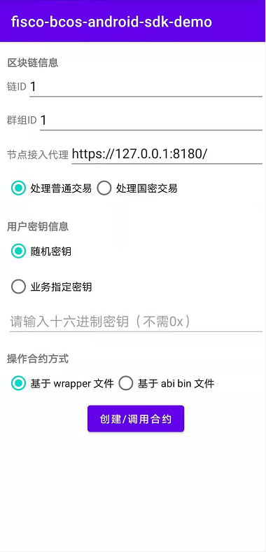

# Android SDK Demo

标签：``Android SDK`` ``Android Demo``

----

参考上一节[快速入门](./quick_start.html)描述的内容，`fisco-bcos-android-sdk`提供了一个 demo，用于展示 sdk 初始化、部署合约和调用合约相关接口、释放 sdk 的整个过程。

- [demo Github 地址](https://github.com/FISCO-BCOS/fisco-bcos-android-sdk/tree/main/demo)
- [demo Gitee 地址](https://gitee.com/FISCO-BCOS/fisco-bcos-android-sdk/tree/main/demo)

本 Demo 适用于：
- 体验 android-sdk 进行合约部署及调用的用户
- 为进行 Android App 开发而需进一步了解 SDK 接口调用顺序及时机的开发者

## 效果图

### SDK 初始化界面

Demo 主界面如下图所示。用户可在该界面配置 SDK 的初始化参数。

初始化参数大致可分为”区块链信息“、”用户密钥信息“和”操作合约方式“三个类别，由此可见 android-sdk 能实现以下功能：

- 使用指定私钥/随机私钥发送交易
- 发送国密/非国密交易
- 基于合约 Java 类部署及调用合约
- 基于合约 abi 和 binary 部署及调用合约

### 合约操作界面

用户点击主界面的按钮后，进入 Demo 内置合约`HelloWorld`的操作界面。用户可进行的操作内容包括：创建合约及调用合约接口。创建合约的方式包括部署新合约，以及基于已有合约地址加载合约。目前`HelloWorld`合约接口包括`set`接口和`get`接口。

