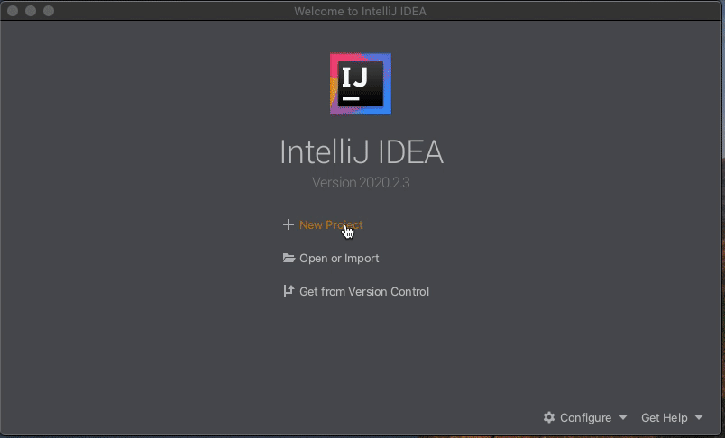

# 快速入门

标签：``java-sdk`` ``引入Java SDK``

----
## 1. 安装环境

- Java：JDK 14 （JDK1.8 至JDK 14都支持）

  首先，在官网上下载JDK14并安装

  然后，修改环境变量

  ```bash
  # 确认您当前的java版本
  $ java -version
  # 确认您的java路径
  $ ls Library/Java/JavaVirtualMachines
  # 返回
  # jdk-14.0.2.jdk
  
  # 如果使用的是bash
  $ vim .bash_profile 
  # 在文件中加入JAVA_HOME的路径
  # export JAVA_HOME = Library/Java/JavaVirtualMachines/jdk-14.0.2.jdk/Contents/Home 
  $ source .bash_profile
  
  # 如果使用的是zash
  $ vim .zashrc
  # 在文件中加入JAVA_HOME的路径
  # export JAVA_HOME = Library/Java/JavaVirtualMachines/jdk-14.0.2.jdk/Contents/Home 
  $ source .zashrc
  
  # 确认您的java版本
  $ java -version
  # 返回
  # java version "14.0.2" 2020-07-14
  # Java(TM) SE Runtime Environment (build 14.0.2+12-46)
  # Java HotSpot(TM) 64-Bit Server VM (build 14.0.2+12-46, mixed mode, sharing)
  ```

- IDE：IntelliJ IDE. 

  进入[IntelliJ IDE官网](https://www.jetbrains.com/idea/download/)，下载并安装社区版IntelliJ IDE


## 2. 搭建一条FISCO BCOS链

请参考[FISCO BCOS安装](../../installation.html#fisco-bcos)搭建。


## 3. 开发智能合约应用

### 第一步. 创建一个Gradle应用

在IntelliJ IDE中创建一个gradle项目。勾选Gradle和Java




### 第二步. 引入Java SDK

在build.gradle中引入Java SDK

```
compile ('org.fisco-bcos.java-sdk:fisco-bcos-java-sdk:2.7.2')
```

如果您使用maven 通过以下方法引入Java SDK

``` xml
<dependency>
    <groupId>org.fisco-bcos.java-sdk</groupId>
    <artifactId>fisco-bcos-java-sdk</artifactId>
    <version>2.7.2</version>
</dependency>
```


### 第三步. 配置SDK证书

参考[Java SDK证书配置](./configuration.html#id5)。

```eval_rst
.. note::
    - 大部分场景仅需要配置 `certPath` 配置项即可，其他配置项不需额外配置；
    - SDK证书获取：若参考 `安装 <../../installation.html>`_ 搭建区块链，则参考 `这里 <../../installation.html#id7>`_ 将 `nodes/${ip}/sdk/` 目录下的证书拷贝到 `certPath` 指定的路径；若区块链节点参考 `运维部署工具 <../../installation.html>`_ 搭建，则参考 `这里 <../../enterprise_tools/tutorial_one_click.html#id15>`_ 将 `generator/meta` 文件夹下的SDK证书拷贝到 `certPath` 指定路径，`certPath`默认为`conf`目录；
    - SDK与节点间SSL连接方式，可通过节点配置项 `sm_crypto_channel` 判断，该配置项详细说明请参考 `FISCO BCOS配置文件与配置项说明 <../../manual/configuration.html#id10>`_ .
```

将SDK证书拷贝到Java SDK的示例如下(这里假设SDK证书位于`~/fisco/nodes/127.0.0.1/sdk`目录)：

```bash
# 假设SDK证书位于~/fisco/nodes/127.0.0.1/sdk/目录
mkdir -p conf && cp -r ~/fisco/nodes/127.0.0.1/sdk/* conf
```


### 第四步. 准备智能合约

控制台`console`和``java-sdk-demo``均提供了工具，可以将`solidity`合约生成出调用该合约`java`工具类。本例中使用``console``做为例子，使用``java-sdk-demo``的例子请看第6章“附录一. 使用``java-sdk-demo``给智能合约生成调用它的Java工具类”
**首先，下载控制台。**

```bash
$ mkdir -p ~/fisco && cd ~/fisco
# 获取控制台
$ curl -#LO https://github.com/FISCO-BCOS/console/releases/download/v2.7.1/download_console.sh

# 若因为网络问题导致长时间无法执行以上命令，请尝试以下命令：
$ curl -#LO https://gitee.com/FISCO-BCOS/console/releases/download/v2.7.1/download_console.sh

$ bash download_console.sh
$ cd ~/fisco/console
```

**然后，将您要用到的Solidity智能合约放入``~/fisco/console/contracts/solidity``的目录**。本次我们用console中的HelloWorld.sol作为例子。保证HelloWorld.sol在指定的目录下。

```bash
# 当前目录~/fisco/console
$ ls contracts/solidity 
```

得到返回

```bash
HelloWorld.sol	KVTableTest.sol	ShaTest.sol	Table.sol	TableTest.sol
```

**接着，生成调用该智能合约的java类**

```bash
# 使用sol2java.sh将contracts/solidity下的所有合约编译产生bin,abi,java工具类。
# 当前目录~/fisco/console
$ bash sol2java.sh org.com.fisco
# 以上命令中参数“org.com.fisco”是指定产生的java类所属的包名。
# ./sol2java.sh [packageName] [solidityFilePath] [javaCodeOutputDir]
```

``sol2java.sh``的用法可以参照第4章 “附录二. ``sol2java.sh``脚本的使用方法”。

得到返回

```bash
*** Compile solidity TableTest.sol*** 
INFO: Compile for solidity TableTest.sol success.
*** Convert solidity to java  for TableTest.sol success ***

*** Compile solidity KVTableTest.sol*** 
INFO: Compile for solidity KVTableTest.sol success.
*** Convert solidity to java  for KVTableTest.sol success ***

*** Compile solidity HelloWorld.sol*** 
INFO: Compile for solidity HelloWorld.sol success.
*** Convert solidity to java  for HelloWorld.sol success ***

*** Compile solidity Table.sol*** 
INFO: Compile for solidity Table.sol success.
*** Convert solidity to java  for Table.sol success ***

*** Compile solidity ShaTest.sol*** 
INFO: Compile for solidity ShaTest.sol success.
*** Convert solidity to java  for ShaTest.sol success ***
```

查看编译结果

```bash
$ ls contracts/sdk/java/org/com/fisco 
# 得到返回
# HelloWorld.java		KVTableTest.java	ShaTest.java		Table.java		TableTest.java
```

**最后, 将编译得到的HelloWorld.java放入应用中。**注意：在应用中所放的位置要与我们设定的包名相同。

(操作示范请看如下gif动图，动画总共有2分40秒，请耐心等待观看，请勿点击图片，如果点击图片将从头开始播放。)


### 第五步. 创建配置文件

在项目中创建配置文件``config.toml``, 可参照[配置向导](./configuration.html)进行配置，也可以参照[``config-example.toml``](https://github.com/FISCO-BCOS/java-sdk/blob/master/src/test/resources/config-example.toml), 

通过``xml``配置请参照第4章“附录三. 使用xml配置进行配置”。


### 第六步. 使用Java SDK部署和调用智能合约

以使用Java SDK调用群组1的`getBlockNumber`接口获取群组1最新块高，并向群组1部署和调用`HelloWorld`合约为例，对应的示例代码如下：

```java
public class BcosSDKTest
{
    // 获取配置文件路径
    public final String configFile = BcosSDKTest.class.getClassLoader().getResource("config-example.toml").getPath();
     public void testClient() throws ConfigException {
         // 初始化BcosSDK
        BcosSDK sdk =  BcosSDK.build(configFile);
        // 为群组1初始化client
        Client client = sdk.getClient(Integer.valueOf(1));
    
        // 获取群组1的块高
        BlockNumber blockNumber = client.getBlockNumber();

        // 向群组1部署HelloWorld合约
        CryptoKeyPair cryptoKeyPair = client.getCryptoSuite().getCryptoKeyPair();
        HelloWorld helloWorld = HelloWorld.deploy(client, cryptoKeyPair);

        // 调用HelloWorld合约的get接口
        String getValue = helloWorld.get();
        
        // 调用HelloWorld合约的set接口
        TransactionReceipt receipt = helloWorld.set("Hello, fisco");
     }
}
```


## 4. 附录

### 附录一. 使用``java-sdk-demo``给智能合约生成调用它的Java工具类

```bash
$ mkdir -p ~/fisco && cd ~/fisco
# 获取java-sdk代码
$ git clone https://github.com/FISCO-BCOS/java-sdk-demo

# 若因为网络问题导致长时间无法执行以上命令，请尝试以下命令：
$ git clone https://gitee.com/FISCO-BCOS/java-sdk-demo

$ cd java-sdk-demo
# 编译
$ ./gradlew clean build -x test
# 进入sdk-demo/dist目录，创建合约存放目录
$ cd dist && mkdir -p contracts/solidity
# 将需要转换为java代码的sol文件拷贝到~/fisco/java-sdk/dist/contracts/solidity路径下
# 转换sol, 其中${packageName}是生成的java代码包路径
# 生成的java代码位于 ~/fisco/java-sdk/dist/contracts/sdk/java目录下
java -cp "apps/*:lib/*:conf/" org.fisco.bcos.sdk.demo.codegen.DemoSolcToJava ${packageName}
```


### 附录二. ``sol2java.sh``脚本的使用方法

控制台`v2.6+`提供了`sol2java.sh`脚本可将`solidity`转换为`java`代码, `sol2java.sh`使用方法如下：

```shell
$ bash sol2java.sh -h
# Compile Solidity Tool
./sol2java.sh [packageName] [solidityFilePath] [javaCodeOutputDir]
 	 packageName:
 		 the package name of the generated Java class file
 	 solidityFilePath:
 		 (optional) the solidity file path or the directory where solidity files located, default: contracts/solidity
 	 javaCodeOutputDir:
 		 (optional) the directory where the generated Java files located, default: contracts/sdk/java
```

**参数如下：**

- `packageName`: 生成`Java`文件的包名
- `solidityFilePath`: (可选)`solidity`文件的路径，支持文件路径和目录路径两种方式，参数为目录时将目录下所有的`solidity`文件进行编译转换。默认目录为`contracts/solidity`。
- `javaCodeOutputDir`: (可选)生成`Java`文件的目录，默认生成在`contracts/sdk/java`目录


### 附录三. 使用xml配置进行配置

为了适配更多场景，Java SDK支持使用`xml`初始化`BcosSDK`, `xml`配置示例请参考Java SDK源码的[`applicationContext-sample.xml`](https://github.com/FISCO-BCOS/java-sdk/blob/master/src/test/resources/applicationContext-sample.xml), 配置项的含义参考[配置说明](./configuration.md).

通过`xml`配置文件初始化`BcosSDK`之前，需要先引入`spring`。

**通过gradle引入`spring`如下**：

```bash
def spring_version = "4.3.27.RELEASE"
List spring = [
        "org.springframework:spring-core:$spring_version",
        "org.springframework:spring-beans:$spring_version",
        "org.springframework:spring-context:$spring_version",
        "org.springframework:spring-tx:$spring_version",
]
compile spring
```

**通过maven引入`spring`如下**：

```xml
<dependency>
    <groupId>org.springframework</groupId>
    <artifactId>spring-core</artifactId>
    <version>4.3.27.RELEASE</version>

    <groupId>org.springframework</groupId>
    <artifactId>spring-beans</artifactId>
    <version>4.3.27.RELEASE</version>

    <groupId>org.springframework</groupId>
    <artifactId>spring-context</artifactId>
    <version>4.3.27.RELEASE</version>

    <groupId>org.springframework</groupId>
    <artifactId>spring-tx</artifactId>
    <version>4.3.27.RELEASE</version>
</dependency>
```

**使用`applicationContext-sample`初始化`BcosSDK`如下**：


```java
ApplicationContext context =
    new ClassPathXmlApplicationContext("classpath:applicationContext-sample.xml");
BcosSDK sdk = context.getBean(BcosSDK.class);
```

### 附录四. 使用`ConfigOption`初始化`BcosSDK`

Java SDK提供了灵活的`BcosSDK`初始化方式，应用除了直接通过`toml`和`xml`直接初始化`BcosSDK`外，还可通过`ConfigProperty`对象加载`ConfigOption`，并使用`ConfigOption`初始化`BcosSDK`。

`ConfigProperty`维护了`key, value`类型配置映射，其核心的数据结构如下：

```java
public class ConfigProperty {
    // 证书配置选项，目前主要包括以下几个配置项：
    // certPath: 证书路径
    // caCert: CA证书路径
    // sslCert: SDK证书
    // sslKey: SDK私钥
    // enSslCert: 国密SSL的SDK证书
    // enSslKey: 国密SSL的SDK私钥
    public Map<String, Object> cryptoMaterial;

    // SDK到节点的网络配置选项，目前包含以下配置选项：
    // peers: 配置SDK连接的节点列表
    public Map<String, Object> network;

    // AMOP配置选项，目前包括以下配置项：
    // topicName: 订阅的AMOP topic
    // publicKeys: 私有AMOP topic中，定义允许接收本客户端消息的其他客户端的公钥列表，用于进行topic认证
    // privateKey: 私有AMOP topic中，定义本客户端的私钥，用于进行topic认证
    // password: 若客户端私钥是p12文件，此配置项定义私钥文件的加载密码
    public List<AmopTopic> amop;

    // 账户配置项，目前包括以下配置项：
    // keyStoreDir: 账户私钥保存路径，默认为account
    // accountFilePath: 从配置文件中加载的账户路劲
    // accountFileFormat: 账户格式，目前支持pem和p12
    // accountAddress: 加载的账户地址
    // password: 加载p12类型账户私钥时，定义访问账户私钥的口令
    public Map<String, Object> account;

    // 线程池配置项，目前主要包括以下配置项:
    // channelProcessorThreadSize: 处理channel消息包的线程数目，默认为CPU核心线程数目
    // receiptProcessorThreadSize: 处理交易回执的线程数目，默认为CPU核心数目
    public Map<String, Object> threadPool;
}
```
应用可根据实际情况初始化`ConfigProperty`，`ConfigProperty`初始化完毕后，可加载产生`ConfigOption`，示例代码如下：

```java
// 从ConfigProperty加载ConfigOption
public ConfigOption loadConfigOption(ConfigProperty configProperty)throws ConfigException
{
    return new ConfigOption(configProperty);
}
```

初始化`ConfigOption`后，可通过`ConfigOption`创建`BcosSDK`，示例代码如下：

```java
public BcosSDK createBcosSDK(ConfigOption configOption)throws BcosSDKException
{
    return new BcosSDK(configOption);
}
```