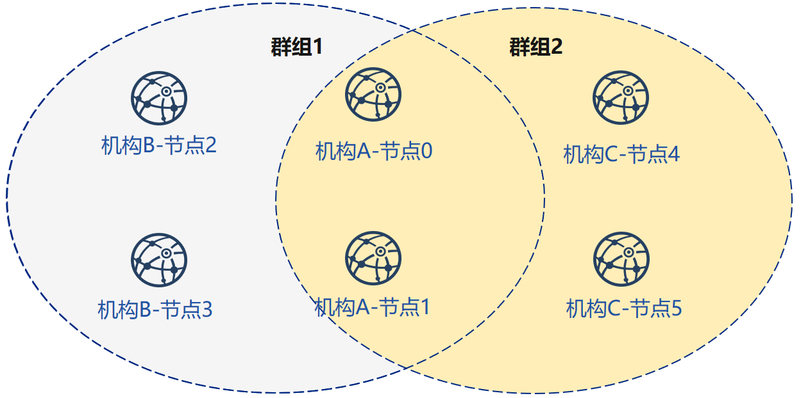
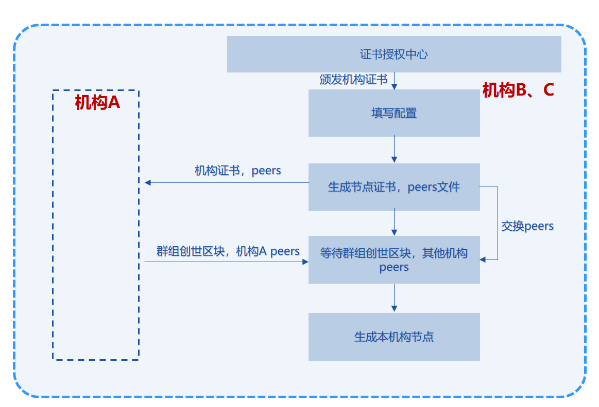

# 使用企业级部署工具

考虑到联盟链多个企业地位对等安全的诉求，[FISCO BCOS企业级部署工具](../enterprise_tools/index.md)提供一种多机构间合作部署联盟链的方式。

本章主要以部署3机构2群组6节点的组网模式，为用户讲解企业级部署工具的使用方法。

<!-- 本章节为多机构对等部署的过程，由单机构一键生成节点配置文件的教程可以参考[FISCO BCOS企业级部署工具一键部署](../enterprise_tools/enterprise_quick_start.md) -->

## 安装准备

下载

```bash
$ cd ~
$ git clone https://github.com/FISCO-BCOS/generator.git
```

安装

```bash
$ cd generator
$ bash ./scripts/install.sh
```

检查是否安装成功

```bash
$ ./generator -h
# 若成功，输出 usage: generator xxx
```

## 拉取节点二进制

拉取最新fisco-bcos二进制文件到meta中

```bash
$ ./generator --download_fisco ./meta
```

检查二进制版本

```bash
$ ./meta/fisco-bcos -v
# 若成功，输出 FISCO-BCOS Version : x.x.x-x
```

**PS**：[源码编译](../manual/get_executable.md)节点二进制的用户，只需要把编译出来的二进制放到``` meta ```文件夹下即可。

## 示例分析

在本节中，我们将在本机IP为`127.0.0.1`生成一个如图所示网络拓扑结构为3机构2群组6节点的组网模式，每个节点的ip，端口号分别为：



| 节点序号 |   P2P地址     |   RPC/channel监听地址     |   所属机构     | 所属群组 |
| :-----------: | :-------------: | :-------------: | :-------------: | :-------------: |
|   节点0     | 127.0.0.1:30300| 127.0.0.1:8545/:20200 | 机构A | 群组1、2 |
|   节点1     | 127.0.0.1:30301| 127.0.0.1:8546/:20201 | 机构A | 群组1、2 |
|   节点2     | 127.0.0.1:30302| 127.0.0.1:8547/:20202 | 机构B | 群组1 |
|   节点3     | 127.0.0.1:30303| 127.0.0.1:8548/:20203 | 机构B | 群组1 |
|  节点4      | 127.0.0.1:30304| 127.0.0.1:8549/:20204 | 机构C | 群组2 |
|  节点5      | 127.0.0.1:30305| 127.0.0.1:8550/:20205 | 机构C | 群组2 |


配置文件中字段的含义解释如下：

|   节点序号   | 节点在配置文件中的序号 |
| :----------: | :--------------------: |
|    P2P监听地址    |   节点之间p2p通信地址    |
|    RPC监听地址    |    节点开启的RPC/channel监听地址     |

```eval_rst
.. important::

    针对云服务器中的vps服务器，RPC监听地址需要写网卡中的真实地址(如内网地址或127.0.0.1)，可能与用户登录的ssh服务器不一致。
```

假设如图所示，联盟链中共有3个机构、2个群组、6个节点。

群组1，包含A，B两个机构共4个节点

群组2，包含A，C两个机构共4个节点。

在上述场景中，A机构有两个节点复用，参与到了两个群组。

组网步骤如下：

```eval_rst
.. important::

    使用时建议用户开启三个终端，分别代表机构A、机构B及机构C，以下操作$前表示为generator-A的为机构A进行的操作，generator-B的为机构B进行的操作，generator-C的为机构C进行的操作，没有前缀的为初始化操作。
```

机构A作为生成创世区块的机构，需要收集其他机构证书，并且声称自己节点时需要其他机构节点的p2p连接地址peers文件，整体流程图如下图所示：


机构B、C不需要收集证书，只需要与其他机构交换节点的连接地址peers，整体流程如下图所示：



## 联盟链初始化

```bash
# 证书授权机构准备生成证书
# 初始化链证书
# 一条联盟链拥有唯一的链证书ca.crt
$ ./generator --generate_chain_certificate ./dir_chain_ca
# 查看链证书及私钥
$ ls ./dir_chain_ca
ca.crt  ca.key   cert.cnf # 从左至右分别为链证书、链私钥、证书配置文件
```

## 机构A、B初始化

```bash
# 初始化机构A
$ git clone https://github.com/FISCO-BCOS/generator.git ~/generator-A
$ cp ./meta/fisco-bcos ~/generator-A/meta
# 初始化机构A机构证书
# 教程中为了简化操作直接生成了机构证书和私钥，实际应用时应该由机构本地生成私钥agency.key，再生成证书请求文件，向证书签发机构获取机构证书agency.crt
$ ./generator --generate_agency_certificate ./dir_agency_ca ./dir_chain_ca agencyA
# 查看机构证书及私钥
$ ls dir_agency_ca/agencyA/
agency.crt    agency.key    ca-agency.crt ca.crt    cert.cnf # 从左至右分别为机构证书、机构私钥、链证书签发机构证书中间文件、链证书、证书配置文件
# 发送链证书、机构证书、机构私钥至机构A
# 示例是通过文件拷贝的方式，从证书授权机构将机构证书发送给对应的机构，放到机构的工作目录的meta子目录下
$ cp ./dir_chain_ca/ca.crt ./dir_agency_ca/agencyA/agency.crt ./dir_agency_ca/agencyA/agency.key ~/generator-A/meta/
# 初始化机构B
$ git clone https://github.com/FISCO-BCOS/generator.git ~/generator-B
$ cp ./meta/fisco-bcos ~/generator-B/meta
# 初始化机构B机构证书
# 教程中为了简化操作直接生成了机构证书和私钥，实际应用时应该由机构本地生成私钥agency.key，再生成证书请求文件，向证书签发机构获取机构证书agency.crt
$ ./generator --generate_agency_certificate ./dir_agency_ca ./dir_chain_ca agencyB
# 发送链证书、机构证书、机构私钥至机构B
# 教程中为了简化操作直接生成了机构证书和私钥，实际应用时应该由机构本地生成私钥agency.key，再生成证书请求文件，向证书签发机构获取机构证书agency.crt
$ cp ./dir_chain_ca/ca.crt ./dir_agency_ca/agencyB/agency.crt ./dir_agency_ca/agencyB/agency.key ~/generator-B/meta/
```

```eval_rst
.. important::

    一条联盟链中需要用到一个根证书ca.crt，多服务器部署时不需要再次生成根证书和私钥。
```

## 机构A、B构建群组1

构建群组1时，由于机构A生成群组1创世区块需要机构B的证书文件，为简化操作，本示例优先进行机构B的相关操作。

### 机构B修改配置文件

机构B修改conf文件夹下的`node_deployment.ini`如下图所示:

```bash
# 请在~/generator-B目录下执行下述命令
$ cd ~/generator-B
$ cat > ./conf/node_deployment.ini << EOF
[group]
group_id=1

[node0]
; host ip for the communication among peers.
; Please use your ssh login ip.
p2p_ip=127.0.0.1
; listen ip for the communication between sdk clients.
; This ip is the same as p2p_ip for physical host.
; But for virtual host e.g. vps servers, it is usually different from p2p_ip.
; You can check accessible addresses of your network card.
; Please see https://tecadmin.net/check-ip-address-ubuntu-18-04-desktop/
; for more instructions.
rpc_ip=127.0.0.1
p2p_listen_port=30302
channel_listen_port=20202
jsonrpc_listen_port=8547

[node1]
p2p_ip=127.0.0.1
rpc_ip=127.0.0.1
p2p_listen_port=30303
channel_listen_port=20203
jsonrpc_listen_port=8548
EOF
```

执行之后./conf/node_deployment.ini文件变为：

```ini
[group]
group_id=1

[node0]
; host ip for the communication among peers.
; Please use your ssh login ip.
p2p_ip=127.0.0.1
; listen ip for the communication between sdk clients.
; This ip is the same as p2p_ip for physical host.
; But for virtual host e.g. vps servers, it is usually different from p2p_ip.
; You can check accessible addresses of your network card.
; Please see https://tecadmin.net/check-ip-address-ubuntu-18-04-desktop/
; for more instructions.
rpc_ip=127.0.0.1
p2p_listen_port=30302
channel_listen_port=20202
jsonrpc_listen_port=8547

[node1]
p2p_ip=127.0.0.1
rpc_ip=127.0.0.1
p2p_listen_port=30303
channel_listen_port=20203
jsonrpc_listen_port=8548
```

### 机构B生成并交换配置文件

```bash
# 机构B生成交换文件
generator-B$ ./generator --generate_all_certificates ./agencyB_send
# 查看需要生成文件
$ ls ./agencyB_send
cert_127.0.0.1_30302.crt cert_127.0.0.1_30303.crt peers.txt # 从左至右分别为需要交互给机构A的节点证书，节点连接文件
# 交换证书与peers至机构A
generator-B$ cp ./agencyB_send/cert* ~/generator-A/meta/
generator-B$ cp ./agencyB_send/peers.txt ~/generator-A/meta/peersB.txt
```

### 机构A修改配置文件

机构A修改conf文件夹下的`node_deployment.ini`如下图所示:

```bash
# 请在~/generator-A目录下执行下述命令
$ cd ~/generator-A
$ cat > ./conf/node_deployment.ini << EOF
[group]
group_id=1

[node0]
; host ip for the communication among peers.
; Please use your ssh login ip.
p2p_ip=127.0.0.1
; listen ip for the communication between sdk clients.
; This ip is the same as p2p_ip for physical host.
; But for virtual host e.g. vps servers, it is usually different from p2p_ip.
; You can check accessible addresses of your network card.
; Please see https://tecadmin.net/check-ip-address-ubuntu-18-04-desktop/
; for more instructions.
rpc_ip=127.0.0.1
p2p_listen_port=30300
channel_listen_port=20200
jsonrpc_listen_port=8545

[node1]
p2p_ip=127.0.0.1
rpc_ip=127.0.0.1
p2p_listen_port=30301
channel_listen_port=20201
jsonrpc_listen_port=8546
EOF
```

执行之后./conf/node_deployment.ini文件变为：

```ini
[group]
group_id=1

[node0]
; host ip for the communication among peers.
; Please use your ssh login ip.
p2p_ip=127.0.0.1
; listen ip for the communication between sdk clients.
; This ip is the same as p2p_ip for physical host.
; But for virtual host e.g. vps servers, it is usually different from p2p_ip.
; You can check accessible addresses of your network card.
; Please see https://tecadmin.net/check-ip-address-ubuntu-18-04-desktop/
; for more instructions.
rpc_ip=127.0.0.1
p2p_listen_port=30300
channel_listen_port=20200
jsonrpc_listen_port=8545

[node1]
p2p_ip=127.0.0.1
rpc_ip=127.0.0.1
p2p_listen_port=30301
channel_listen_port=20201
jsonrpc_listen_port=8546
```

### 机构A生成并交换配置文件

```bash
# 机构A生成交换文件
generator-A$ ./generator --generate_all_certificates ./agencyA_send
# 由于B机构不需要生成创世区块，因此只需交换peers至机构B
generator-A$ cp ./agencyA_send/peers.txt ~/generator-B/meta/peersA.txt
```

### 机构A生成群组1创世区块

机构A修改conf文件夹下的`group_genesis.ini`如下图所示:

```bash
# 请在~/generator-A目录下执行下述命令
$ cd ~/generator-A
$ cat > ./conf/group_genesis.ini << EOF
[group]
group_id=1

[nodes]
node0=127.0.0.1:30300
node1=127.0.0.1:30301
node2=127.0.0.1:30302
node3=127.0.0.1:30303
EOF
```

执行之后./conf/group_genesis.ini文件变为：

```ini
[group]
group_id=1

[nodes]
;机构A节点p2p地址
node0=127.0.0.1:30300
;机构A节点p2p地址
node1=127.0.0.1:30301
;机构B节点p2p地址
node2=127.0.0.1:30302
;机构B节点p2p地址
node3=127.0.0.1:30303
```

```bash
# 生成群组1群组创世区块
generator-A$ ./generator --create_group_genesis ./group
# 将群组1创世区块发送给机构B
generator-A$ cp ./meta/group.1.genesis ~/generator-B/meta
```

### 机构A生成所属节点

```bash
# 请在~/generator-A目录下执行下述命令
$ cd ~/generator-A
```

```bash
# 生成机构A所属节点
generator-A$ ./generator --build_install_package ./meta/peersB.txt ./nodeA
# 启动节点
generator-A$ bash ./nodeA/start_all.sh
# 查看节点进程
$ ps -ef | grep fisco
fisco  15347     1  0 17:22 pts/2    00:00:00 ~/generator-A/nodeA/node_127.0.0.1_30300/fisco-bcos -c config.ini
fisco  15402     1  0 17:22 pts/2    00:00:00 ~/generator-A/nodeA/node_127.0.0.1_30301/fisco-bcos -c config.ini
```

### 机构B生成所属节点

```bash
# 请在~/generator-B目录下执行下述命令
$ cd ~/generator-B
```

```bash
# 查看机构A节点连接文件peersA
generator-B$ cat ./meta/peersA.txt
# 生成机构B所属节点
generator-B$ ./generator --build_install_package ./meta/peersA.txt ./nodeB
# 启动节点
generator-B$ bash ./nodeB/start_all.sh
```

```eval_rst
.. note::

    节点启动只需要推送对应ip的node文件夹即可，如127.0.0.1的服务器，只需node_127.0.0.1_port对应的节点配置文件夹。多机部署时，只需要将生成的节点文件夹推送至对应服务器即可。
```

### 查看群组1节点运行状态

查看进程：

```bash
$ ps -ef | grep fisco
# 可以看到如下所示的三个进程
fisco  15347     1  0 17:22 pts/2    00:00:00 ~/generator-A/nodeA/node_127.0.0.1_30300/fisco-bcos -c config.ini
fisco  15402     1  0 17:22 pts/2    00:00:00 ~/generator-A/nodeA/node_127.0.0.1_30301/fisco-bcos -c config.ini
fisco  15457     1  0 17:22 pts/2    00:00:00 ~/generator-B/nodeB/node_127.0.0.1_30302/fisco-bcos -c config.ini
fisco  15498     1  0 17:22 pts/2    00:00:00 ~/generator-B/nodeB/node_127.0.0.1_30303/fisco-bcos -c config.ini
```

查看节点log：

```bash
$ tail -f ./node*/node*/log/log*  | grep +++
# +++即为节点正常共识
info|2019-02-25 17:25:56.028692| [g:1][p:264][CONSENSUS][SEALER]++++++++++++++++ Generating seal on,blkNum=1,tx=0,myIdx=0,hash=833bd983...
info|2019-02-25 17:25:59.058625| [g:1][p:264][CONSENSUS][SEALER]++++++++++++++++ Generating seal on,blkNum=1,tx=0,myIdx=0,hash=343b1141...
info|2019-02-25 17:25:57.038284| [g:1][p:264][CONSENSUS][SEALER]++++++++++++++++ Generating seal on,blkNum=1,tx=0,myIdx=1,hash=ea85c27b...
```

至此，我们完成了如图所示机构A、B搭建群组1的操作：


## 机构A、C构建群组2

接下来，机构C需要与A进行新群组建立操作，示例中以C生成创世区块为例。

### 证书授权机构初始化机构C

```bash
# 请回到拥有链证书及私钥的目录下操作
# 初始化机构C
$ cd ~/generator
$ git clone https://github.com/FISCO-BCOS/generator.git ~/generator-C
$ cp ./meta/fisco-bcos ~/generator-C/meta
# 初始化机构C机构证书
# 教程中为了简化操作直接生成了机构证书和私钥，实际应用时应该由机构本地生成私钥agency.key，再生成证书请求文件，向证书签发机构获取机构证书agency.crt
$ ./generator --generate_agency_certificate ./dir_agency_ca ./dir_chain_ca agencyC
$ cp ./dir_chain_ca/ca.crt ./dir_agency_ca/agencyC/agency.crt ./dir_agency_ca/agencyC/agency.key ~/generator-C/meta/
```

### 机构A交换配置文件

由于机构A已经生成过节点证书及peers文件，操作如下：

```bash
# 请在~/generator-A目录下执行下述命令
$ cd ~/generator-A
# 交换证书与peers至机构C
generator-A$ cp -r ./agencyA_send/cert* ~/generator-C/meta/
generator-A$ cp -r ./agencyA_send/peers.txt ~/generator-C/meta/peersA.txt
```

### 机构C修改配置文件

机构C修改conf文件夹下的`node_deployment.ini`如下图所示:

```bash
# 请在~/generator-C目录下执行下述命令
$ cd ~/generator-C
$ cat > ./conf/node_deployment.ini << EOF
[group]
group_id=2

[node0]
; host ip for the communication among peers.
; Please use your ssh login ip.
p2p_ip=127.0.0.1
; listen ip for the communication between sdk clients.
; This ip is the same as p2p_ip for physical host.
; But for virtual host e.g. vps servers, it is usually different from p2p_ip.
; You can check accessible addresses of your network card.
; Please see https://tecadmin.net/check-ip-address-ubuntu-18-04-desktop/
; for more instructions.
rpc_ip=127.0.0.1
p2p_listen_port=30304
channel_listen_port=20204
jsonrpc_listen_port=8549

[node1]
p2p_ip=127.0.0.1
rpc_ip=127.0.0.1
p2p_listen_port=30305
channel_listen_port=20205
jsonrpc_listen_port=8550
EOF
```

执行之后./conf/node_deployment.ini文件变为：

```ini
[group]
group_id=2

[node0]
; host ip for the communication among peers.
; Please use your ssh login ip.
p2p_ip=127.0.0.1
; listen ip for the communication between sdk clients.
; This ip is the same as p2p_ip for physical host.
; But for virtual host e.g. vps servers, it is usually different from p2p_ip.
; You can check accessible addresses of your network card.
; Please see https://tecadmin.net/check-ip-address-ubuntu-18-04-desktop/
; for more instructions.
rpc_ip=127.0.0.1
p2p_listen_port=30304
channel_listen_port=20204
jsonrpc_listen_port=8549

[node1]
p2p_ip=127.0.0.1
rpc_ip=127.0.0.1
p2p_listen_port=30305
channel_listen_port=20205
jsonrpc_listen_port=8550
```

### 机构C生成配置文件

```bash
# 请在~/generator-C目录下执行下述命令
$ cd ~/generator-C
# 机构C生成交换文件
generator-C$ ./generator --generate_all_certificates ./agencyC_send
# 交换机构Cpeers至机构A
generator-C$ cp -r ./agencyC_send/peers.txt ~/generator-A/meta/peersC.txt
```

### 机构C生成群组2创世区块

机构C修改conf文件夹下的`group_genesis.ini`如下图所示:

```bash
# 请在~/generator-C目录下执行下述命令
$ cd ~/generator-C
$ cat > ./conf/group_genesis.ini << EOF
[group]
group_id=2

[nodes]
node0=127.0.0.1:30300
node1=127.0.0.1:30301
node2=127.0.0.1:30304
node3=127.0.0.1:30305
EOF
```

执行之后./conf/group_genesis.ini文件变为：

```ini
[group]
group_id=2

[nodes]
node0=127.0.0.1:30300
;机构A节点p2p地址
node1=127.0.0.1:30301
;机构A节点p2p地址
node2=127.0.0.1:30304
;机构C节点p2p地址
node3=127.0.0.1:30305
;机构C节点p2p地址
```

```bash
# 生成群组2创世区块
generator-C$ ./generator --create_group_genesis ./group
# 将群组2创世区块发送给机构A
generator-C$ cp ./group/group.2.genesis ~/generator-A/meta/

```

### 机构C生成所属节点

```bash
# 请在~/generator-C目录下执行下述命令
$ cd ~/generator-C
```

```bash
# 查看机构A节点连接文件peersA
generator-C$ cat ./meta/peersA.txt
# 生成机构C所属节点
generator-C$ ./generator --build_install_package ./meta/peersA.txt ./nodeC
# 启动节点
generator-C$ bash ./nodeC/start_all.sh
```

### 机构A为现有节点初始化群组2

```bash
# 请在~/generator-A目录下执行下述命令
$ cd ~/generator-A
# 添加群组2配置文件至已有节点
generator-A$ ./generator --add_group ./meta/group.2.genesis ./nodeA
# 添加机构C节点连接文件peers至已有节点
generator-A$ ./generator --add_peers ./meta/peersC.txt ./nodeA
# 重启节点
generator-A$ bash ./nodeA/stop_all.sh
generator-A$ bash ./nodeA/start_all.sh
```

### 查看群组2节点运行状态

查看进程：

```bash
$ ps -ef | grep fisco
# 可以看到如下所示的三个进程
fisco  15347     1  0 17:22 pts/2    00:00:00 ~/generator-A/nodeA/node_127.0.0.1_30300/fisco-bcos -c config.ini
fisco  15402     1  0 17:22 pts/2    00:00:00 ~/generator-A/nodeA/node_127.0.0.1_30301/fisco-bcos -c config.ini
fisco  15457     1  0 17:22 pts/2    00:00:00 ~/generator-B/nodeB/node_127.0.0.1_30302/fisco-bcos -c config.ini
fisco  15498     1  0 17:22 pts/2    00:00:00 ~/generator-B/nodeB/node_127.0.0.1_30303/fisco-bcos -c config.ini
fisco  15550     1  0 17:22 pts/2    00:00:00 ~/generator-C/nodeC/node_127.0.0.1_30304/fisco-bcos -c config.ini
fisco  15589     1  0 17:22 pts/2    00:00:00 ~/generator-C/nodeC/node_127.0.0.1_30305/fisco-bcos -c config.ini
```

查看节点log：

```bash
generator-C$ tail -f ./node*/node*/log/log*  | grep +++
# +++即为节点正常共识
info|2019-02-25 17:25:56.028692| [g:2][p:264][CONSENSUS][SEALER]++++++++++++++++ Generating seal on,blkNum=1,tx=0,myIdx=0,hash=833bd983...
info|2019-02-25 17:25:59.058625| [g:2][p:264][CONSENSUS][SEALER]++++++++++++++++ Generating seal on,blkNum=1,tx=0,myIdx=0,hash=343b1141...
info|2019-02-25 17:25:57.038284| [g:2][p:264][CONSENSUS][SEALER]++++++++++++++++ Generating seal on,blkNum=1,tx=0,myIdx=1,hash=ea85c27b...
```

至此，我们完成了如图所示的机构A、C搭建群组2构建：


## 扩展教程--机构C节点加入群组1

将节点加入已有群组需要用户使用控制台发送指令，将节点加入群组，示例如下：

```bash
# 请在~/generator-A目录下执行下述命令
$ cd ~/generator-A
# 发送群组1配置文件至机构C节点
generator-A$ ./generator --add_group ./group/group.1.genesis  ~/generator-C/nodeC
# 机构A配置控制台
generator-A$ ./generator --download_console ./
# generator已经完成了控制台的配置，用户可以直接启动控制台 注意：请确保已经安装java
generator-A$ cd ./console
# 启动group1的控制台将机构C的节点加入group1
generator-A$ bash ./start.sh 1
# 使用控制台加入机构C节点为观察节点，其中参数第二项需要替换为加入节点的nodeid，nodeid在节点文件夹的conf文件夹下
$ [group:1]> addObserver ea2ca519148cafc3e92c8d9a8572b41ea2f62d0d19e99273ee18cccd34ab50079b4ec82fe5f4ae51bd95dd788811c97153ece8c05eac7a5ae34c96454c4d3123
{
	"code":0,
	"msg":"success"
}
# 重启机构C节点
generator-C$ bash ~/generator-C/nodeC/stop_all.sh
generator-C$ bash ~/generator-C/nodeC/start_all.sh
```

经过上述操作，机构C的节点加入group1成为了观察节点，此时机构C的节点只能同步group1的数据块，不参与共识，等待机构C节点块高与group1其他节点同步后，再通过[控制台](../manual/console.md)`addSealer`指令将机构C节点变更为group1的记账节点

至此 我们完成了所示构建教程中的所有操作。


通过本节教程，我们在本机生成一个网络拓扑结构为3机构2群组6节点的多群组架构联盟链。

如果使用该教程遇到问题，请查看[FAQ](../faq.md)
