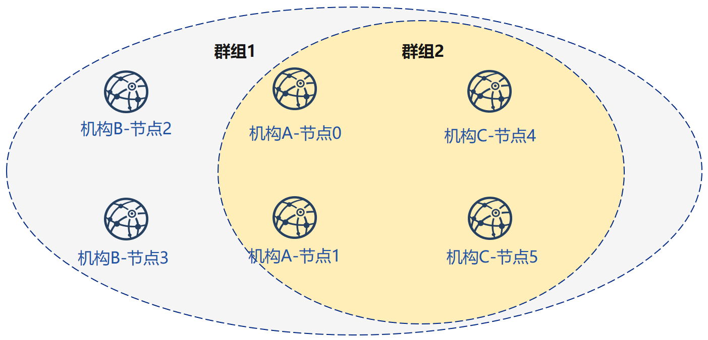

# 使用企业级部署工具

考虑到联盟链多个企业地位对等安全的诉求，[FISCO BCOS企业级部署工具](../enterprise_tools/index.md)提供一种多机构间合作部署联盟链的方式。

本章主要以部署2机构2群组6节点的组网模式，为用户讲解企业级部署工具的使用方法。

## 下载安装

使用前请确认已经满足[环境依赖](../enterprise_tools/installation.md)

```bash
$ git clone https://github.com/FISCO-BCOS/generator.git
$ cd generator
$ bash ./scripts/install.sh
$ ./generator -h
```

在使用本工具时，需要在meta文件夹下放置`fisco-bcos`二进制程序，`fisco-bcos`二进制程序的生成方式可以通过以下方式获取:

用户可以自由选择以下任一方式获取FISCO BCOS可执行程序。推荐从GitHub下载预编译二进制。

- 官方提供的静态链接的预编译文件，可以在Ubuntu 16.04和CentOS 7.2以上版本运行。

```bash
# 准备fisco-bcos二进制文件
$ bash <(curl -s https://raw.githubusercontent.com/FISCO-BCOS/FISCO-BCOS/release-2.0.1/tools/ci/download_bin.sh) -o ./meta
# 检查二进制是否可执行 执行下述命令，看是否输出版本信息
$ ./meta/fisco-bcos -v
```

- 源码编译获取可执行程序，参考[源码编译](../manual/get_executable.md)。

## 示例分析

在本节中，我们将在本机IP为`127.0.0.1`生成一个如图所示网络拓扑结构为2机构2群组6节点的组网模式，每个节点的ip，端口号分别为：



| 节点序号 |   P2P地址     |   RPC/channel地址     |   所属机构     | 所属群组 |
| :-----------: | :-------------: | :-------------: | :-------------: | :-------------: |
|   节点0     | 127.0.0.1:30300| 127.0.0.1:8545/:20200 | 机构A | 群组1、2 |
|   节点1     | 127.0.0.1:30301| 127.0.0.1:8546/:20201 | 机构A | 群组1、2 |
|   节点2     | 127.0.0.1:30302| 127.0.0.1:8547/:20202 | 机构B | 群组1、2 |
|   节点3     | 127.0.0.1:30303| 127.0.0.1:8548/:20203 | 机构B | 群组1、2 |
|  节点4      | 127.0.0.1:30304| 127.0.0.1:8549/:20204 | 机构A | 群组1 |
|  节点5      | 127.0.0.1:30305| 127.0.0.1:8550/:20205 | 机构A | 群组1 |


配置文件中字段的含义解释如下：

|              |                        |
| :----------: | :--------------------: |
|   节点序号   | 节点在配置文件中的序号 |
|    P2P地址    |   节点之间p2p通信地址    |
|    RPC地址    |    节点与sdk通信地址     |

假设如图所示，联盟链中共有2个群组，4个节点。

群组1中有6个节点，节点序号为0、1、2、3，之后扩容节点4、5。

群组2中有4个节点，节点序号为0、1、2、3。

组网步骤如下：

```eval_rst
.. important::

    使用时建议用户开启两个终端，分别代表机构A和机构B，以下操作$前表示为generator-A的为机构A进行的操作，generator-B的为机构B进行的操作，没有前缀的为观察操作。
```

## 机构初始化

```bash
# 返回generator上级目录
# 初始化机构A
generator-A$ cp -r ./generator ~/generator-A
generator-A$ cd ~/generator-A
# 初始化机构B
generator-B$ cp -r ./generator ~/generator-B
generator-B$ cd ~/generator-B
```

## 初始化证书

在此步中，将完成机构A、B初始化链证书及私钥，并生成自己所属机构证书与私钥的操作

假设链证书和机构证书及私钥由机构A生成。

```eval_rst
.. important::

    实际使用中链证书会由可信第三方生成，因此机构A与机构B的证书也由第三方机构签发。教程中为了简化操作，由机构A生成了机构A与机构B的机构证书及私钥，实际应用场景中不应采取此方式。
```

```bash
# 机构A生成链证书及私钥
generator-A$ ./generator --generate_chain_certificate ./dir_chain_ca
# 机构A生成自己的机构证书及私钥
generator-A$ ./generator --generate_agency_certificate ./dir_agency_ca ./dir_chain_ca agencyA
# 机构A生成机构B证书及私钥
generator-A$ ./generator --generate_agency_certificate ./dir_agency_ca ./dir_chain_ca agencyB
# 机构A拷贝链证书至meta目录
generator-A$ cp ./dir_chain_ca/ca.crt ./dir_agency_ca/agencyA/agency.crt ./dir_agency_ca/agencyA/agency.key ./meta/
# 机构A发送机构证书及私钥至机构B
generator-A$ cp ./meta/ca.crt ./dir_agency_ca/agencyB/agency.crt ./dir_agency_ca/agencyB/agency.key ~/generator-B/meta/
```

### 机构A生成节点证书

机构A首先修改conf文件夹下的`node_deployment.ini`如下图所示（教程中采用默认设置，不需要修改）：

```ini
[group]
group_id=1

# Owned nodes
[node0]
p2p_ip=127.0.0.1
rpc_ip=127.0.0.1
p2p_listen_port=30300
channel_listen_port=20200
jsonrpc_listen_port=8545

[node1]
p2p_ip=127.0.0.1
rpc_ip=127.0.0.1
p2p_listen_port=30301
channel_listen_port=20201
jsonrpc_listen_port=8546

# Others' nodes
[peers]
peer0=127.0.0.1:30302
peer1=127.0.0.1:30303
```

```bash
# 拷贝节点证书
generator-A$ ./generator --generate_all_certificates ./node_agencyA
```

### 机构B生成节点证书

机构B首先修改conf文件夹下的`node_deployment.ini`如下图所示：

```ini
[group]
group_id=1

# Owned nodes
[node0]
p2p_ip=127.0.0.1
rpc_ip=127.0.0.1
p2p_listen_port=30302
channel_listen_port=20202
jsonrpc_listen_port=8547

[node1]
p2p_ip=127.0.0.1
rpc_ip=127.0.0.1
p2p_listen_port=30303
channel_listen_port=20203
jsonrpc_listen_port=8548

# Others' nodes
[peers]
peer0=127.0.0.1:30300
peer1=127.0.0.1:30301
```

```bash
# 机构B生成节点证书及私钥
generator-B$ ./generator --generate_all_certificates ./node_agencyB
# 交换节点证书至机构A
generator-B$ cp ./meta/cert_127.0.0.1_30302.crt ~/generator-A/meta
generator-B$ cp ./meta/cert_127.0.0.1_30303.crt ~/generator-A/meta
```

通过上述操作，我们完成了机构A和机构B的证书协商过程，在此过程中机构A和机构B的节点私钥在本地。

## 构建第一个群组

1.生成group1群组创世区块

```bash
# 生成group1群组创世区块
generator-A$ ./generator --create_group_genesis ./group
# 发送group1群组创世区块至机构B
generator-A$ cp ./meta/group.1.genesis ~/generator-B/meta
```

2.生成节点配置文件夹，启动节点

```bash
# 机构A生成节点配置文件夹
generator-A$ ./generator --build_install_package ./nodeA
# 导入节点私钥
generator-A$ ./generator --deploy_private_key ./node_agencyA ./nodeA
# 启动节点
generator-A$ bash ./nodeA/start_all.sh
# 机构B生成节点配置文件夹
generator-B$ ./generator --build_install_package ./nodeB
# 导入节点私钥
generator-B$ ./generator --deploy_private_key ./node_agencyB ./nodeB
# 启动节点
generator-B$ bash ./nodeB/start_all.sh
```

执行成功后机构A在./nodeA目录下可以看到：

```bash
.
# 节点配置文件及群组配置文件
|-- config.ini
|-- group.1.genesis
|-- group.1.ini
# 监控脚本
|-- monitor
# 节点配置文件夹
|-- node_127.0.0.1_30300
|-- node_127.0.0.1_30301
# 操作脚本
|-- start_all.sh
|-- stop_all.sh
```

机构B在./nodeB目录下可以看到：

```bash
.
# 节点配置文件及群组配置文件
|-- config.ini
|-- group.1.genesis
|-- group.1.ini
# 监控脚本
|-- monitor
# 节点配置文件夹
|-- node_127.0.0.1_30302
|-- node_127.0.0.1_30303
# 操作脚本
|-- start_all.sh
|-- stop_all.sh
```

3.查看节点运行状态

查看进程：

```bash
$ ps -ef | grep fisco
# 可以看到如下所示的三个进程
fisco  15347     1  0 17:22 pts/2    00:00:00 ~/generator-A/nodeA/node_127.0.0.1_30300/fisco-bcos -c config.ini
fisco  15402     1  0 17:22 pts/2    00:00:00 ~/generator-A/nodeA/node_127.0.0.1_30301/fisco-bcos -c config.ini
fisco  15457     1  0 17:22 pts/2    00:00:00 ~/generator-B/nodeB/node_127.0.0.1_30302/fisco-bcos -c config.ini
fisco  15498     1  0 17:22 pts/2    00:00:00 ~/generator-B/nodeB/node_127.0.0.1_30303/fisco-bcos -c config.ini
```

查看节点log：

```bash
$ tail -f ./node*/node*/log/log*  | grep +++
# +++即为节点正常共识
info|2019-02-25 17:25:56.028692| [g:1][p:264][CONSENSUS][SEALER]++++++++++++++++ Generating seal on,blkNum=1,tx=0,myIdx=0,hash=833bd983...
info|2019-02-25 17:25:59.058625| [g:1][p:264][CONSENSUS][SEALER]++++++++++++++++ Generating seal on,blkNum=1,tx=0,myIdx=0,hash=343b1141...
info|2019-02-25 17:25:57.038284| [g:1][p:264][CONSENSUS][SEALER]++++++++++++++++ Generating seal on,blkNum=1,tx=0,myIdx=1,hash=ea85c27b...
```

至此 我们完成了如图所示构建group1的操作。


## 机构A扩容两个节点

1.机构A修改conf文件夹下的`node_deployment.ini`中的配置项如下图所示：

```ini
;port config, in general, use the default values
[group]
group_id=1

[node0]
p2p_ip=127.0.0.1 # 扩容节点配置文件
rpc_ip=127.0.0.1
p2p_listen_port=30304
channel_listen_port=20204
jsonrpc_listen_port=8549

[node1]
p2p_ip=127.0.0.1
rpc_ip=127.0.0.1
p2p_listen_port=30305
channel_listen_port=20205
jsonrpc_listen_port=8550

[peers]
peer0=127.0.0.1:30300
peer1=127.0.0.1:30301
peer2=127.0.0.1:30302
peer3=127.0.0.1:30303
```

```bash
# 生成扩容节点证书
generator-A$ ./generator --generate_all_certificates ./expand_agencyA
# 生成扩容配置文件夹
generator-A$ ./generator --build_install_package ./expand
# 导入私钥至扩容配置文件夹
generator-A$ ./generator --deploy_private_key  ./expand_agencyA ./expand
# 启动节点
generator-A$ bash ./expand/start_all.sh
# 查看节点进程
ps aux| grep fisco-bcos |grep -v grep
```

```eval_rst
.. note::
    生成扩容配置文件夹时需要fisco-bcos可执行文件和群组创世区块文件group.1.genesis。
```

2.节点进程存在，但扩容了两个节点尚未经过group1中的节点共识，需要等待群组1的节点使用[控制台](../manual/console.md)将扩容节点加入group1.

可以看到现在一共有六个fisco-bcos进程存在，但扩容了两个节点尚未经过group1中的节点共识，需要等待群组1的节点使用[控制台](../manual/console.md)将扩容节点加入群组1中，扩容的节点才会正常工作。

## 构建第二个群组

构建group1的操作中，我们已经生成了一条具有6个节点，处于群组group1中的联盟链，接下来将新建有4个节点的群组group2。


修改conf文件夹下mgroup.ini中的配置项，使其指向对应节点的ip，端口号，指定组id为group2。

```ini
[group]
group_id=2

[nodes]
node0=127.0.0.1:30300
node1=127.0.0.1:30301
node2=127.0.0.1:30302
node3=127.0.0.1:30303
```

操作步骤如下：

```bash
# 机构A生成group2群组创世区块
generator-A$ ./generator --create_group_genesis ./data
# 拷贝群组配置至节点文件夹
generator-A$ cp ./data/group.2.ini ./data/group.2.genesis ./nodeA/node_127.0.0.1_30300/conf/
generator-A$ cp ./data/group.2.ini ./data/group.2.genesis ./nodeA/node_127.0.0.1_30301/conf/
# 发送group2群组创世区块给机构B
generator-A$ cp ./data/group.2.ini ./data/group.2.genesis ~/generator-B/nodeB/node_127.0.0.1_30302/conf/
generator-A$ cp ./data/group.2.ini ./data/group.2.genesis ~/generator-B/nodeB/node_127.0.0.1_30303/conf/
# 机构A重启节点
generator-A$ bash ./nodeA/stop_all.sh
generator-A$ bash ./nodeA/start_all.sh
# 机构B重启节点
generator-A$ bash ./nodeB/stop_all.sh
generator-A$ bash ./nodeB/start_all.sh
```

此时，可以看到查看节点进程已经从新启动

```bash
$ ps -ef | grep fisco
# 可以看到如下所示的四个进程 如果上一步扩容的节点没有关闭可以看到六个进程
fisco  16356     1  0 17:22 pts/2    00:00:00 ~/generator-A/nodeA/node_127.0.0.1_30300/fisco-bcos -c config.ini
fisco  16422     1  0 17:22 pts/2    00:00:00 ~/generator-A/nodeA/node_127.0.0.1_30301/fisco-bcos -c config.ini
fisco  16467     1  0 17:22 pts/2    00:00:00 ~/generator-B/nodeB/node_127.0.0.1_30302/fisco-bcos -c config.ini
fisco  16489     1  0 17:22 pts/2    00:00:00 ~/generator-B/nodeB/node_127.0.0.1_30303/fisco-bcos -c config.ini
```

查看节点log：

```bash
$ tail -f ./node*/node*/log/log*  | grep +++
# 看到g:2 +++ 即为群组2正常共识
info|2019-02-25 17:25:56.028692| [g:2][p:264][CONSENSUS][SEALER]++++++++++++++++ Generating seal on,blkNum=1,tx=0,myIdx=0,hash=833bd983...
info|2019-02-25 17:25:59.058625| [g:1][p:264][CONSENSUS][SEALER]++++++++++++++++ Generating seal on,blkNum=1,tx=0,myIdx=0,hash=343b1141...
info|2019-02-25 17:25:57.038284| [g:2][p:264][CONSENSUS][SEALER]++++++++++++++++ Generating seal on,blkNum=1,tx=0,myIdx=1,hash=ea85c27b...
```

至此 我们完成了所示构建群组group2的操作。

通过本节教程，我们在本机生成一个网络拓扑结构为2机构2群组6节点的多群组架构联盟链。

如果使用该教程遇到问题，请查看[FAQ](../faq.md)