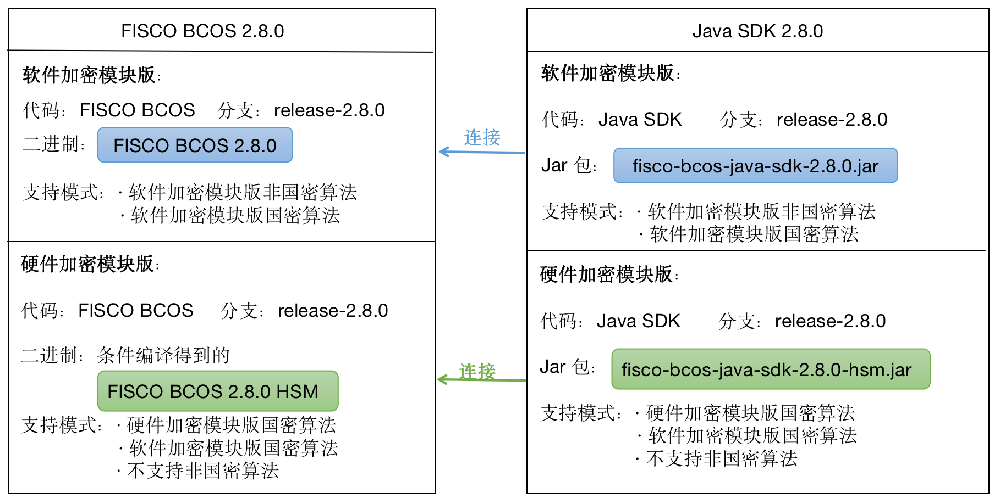

# 构建使用硬件密码模块的国密链

标签：``硬件加密`` ``HSM`` 

---

国密版的FISCO BCOS 2.8.0新增了硬件加密模块（Hardware secure module, HSM），这使得FISCO BCOS拥有更快的密码计算速度，更安全的密钥保护。本教程主主要介绍FISCO BCOS 2.8.0-hsm版本的使用方法。

## 1. 选择节点和Java SDK版本

如下图所示，FISCO BCOS 2.8.0存在两个版本的软件。2.8.0硬件加密模块版是专门为使用国密算法硬件加密功能所开发的版本，它无法与FISCO BCOS 2.X的普通版本建立连接。这就意味着：
- 这个版本的硬件加密模块仅支持国密算法。
- 当您的网络中存在节点需要使用硬件加密模块时，网络中的所有节点都需要使用FISCO BCOS 2.8.0 HSM版的二进制文件。但这并不意味着所有节点都必须使用硬件密码模块功能，这个由节点的配置文件config.ini中的内容决定。
- 当您的节点使用的是FISCO BCOS 2.8.0 HSM版本的节点二进制时，应用必须使用硬件加密版Java SDK（fisco-bcos-java-sdk-2.8.0-hsm.jar）才能与节点建立连接。



## 2. 安装密码卡/密码机
构建使用硬件密码模块的国密链，你需要在节点所在的服务器安装上密码卡或密码机。FISCO BCOS支持了《GMT0018-2012 密码设备应用接口规范》的密码卡/密码机。

### 第一步. 请根据您密码卡/密码机的安装指引安装好密码机.
确保将符合了GMT0018-2012规范的头文件和库文件安装在了动态库默认的搜索路径中。
1. 确保头文件``swsds.h``在目录``/usr/include``中，并保证所有用户都有读权限。
2. 如果您使用的是Ubuntu操作系统，请将库文件``libswsds.so``放在``/usr/lib``目录下，保重用户具有读和执行权限。
3. 如果您使用的是Centos操作系统，请将库文件``libswsds.so``以及``/lib64``目录下，保证用户具有读和执行权限。

### 第二步. 请初始化密码卡/密码机，运行其测试程序确保功能正常.
请根据密码卡/密码机厂商的指引初始化设备，并创建你所需要的内部密钥。然后运行测试程序，确保功能正常，确保能通过安装在``/usr/lib``和``/usr/lib64``下的库能正确调用密码机所提供GMT0018-2012的接口方法。

## 3. 从源码编译FISCO BCOS 2.8.0 HSM版二进制
### 第一步. 获取源码
```bash

git clone https://github.com/FISCO-BCOS/FISCO-BCOS.git
cd FISCO-BCOS
git checkout -b release-2.8.0 origin/release-2.8.0 
```

### 第二步. 编译源码
```bash
mkdir build && cd build
cmake .. -DUSE_HSM_SDF=on  # 如果您使用的是Linux X86环境
cmake3 .. -DUSE_HSM_SDF=on  # 如果您使用的是Linux X86环境
make -j6
```
### 第三步. 确认源码版本
```bash
#当前目录FISCO-BCOS/build
./bin/fisco-bcos --version
```
得到FISCO-BCOS二进制的版本为2.8.0-hsm，则您的支持硬件密码模块的FISCO BCOS编译成功。
```
FISCO-BCOS Version : 2.8.0-hsm
Build Time         : 20210629 18:07:28
Build Type         : Linux/g++/RelWithDebInfo
Git Branch         : release-2.8.0
Git Commit Hash    : 9f1273d8bc9dcef3d6a36e1f32f4f23deaa7d6bb
```

## 4. 创建使用密码机的FISCO BCOS区块链节点
### 第一步. 配置密钥类型和密钥索引
```bash
cd ../tools
# 配置节点的密钥索引
vim ipAndKeyConfig
```
以下是一个配置示例,通过这个配置指定CA、Agency、节点所使用的密钥类型和密钥索引。
```ini
[CA]
CA internalKey 1  
[agency]
agencyA internalKey 21  
[node]
127.0.0.1 agencyA 1 internalKey 31 32
127.0.0.1 agencyA 1 externalKey 
127.0.0.1 agencyA 1 internalKey 35 36
127.0.0.1 agencyA 1 externalKey
```
接下来，我们详细解读一下以上配置示例。

首先，配置CA所使用的Key。示例中的CA使用密码机内部密钥，``internalKey``说明使用内部密钥，``1``表示内部密钥的索引为1。请确保密码机中存在索引为1的SM2签名密钥，且未设置密码。

```ini
[CA]
CA internalKey 1 
```
如果CA使用外部密钥，请在CA后写``externalKey``，如：

```ini
[CA]
CA externalKey
```
然后，类似的方法配置Agency,本例中agency的名字为agencyA，使用内部密钥，其签名密钥的索引为21.

```ini
[agency]
agencyA internalKey 21 
```

最后，配置节点所使用的密钥。每个节点占据一行，配置内容依次是IP地址、Agency名、所属的群组列表（如果属于多个群组请用逗号隔开）、密钥类型、签名密钥索引、加密密钥索引。
```ini
[node]
127.0.0.1 agencyA 1 internalKey 31 32
127.0.0.1 agencyA 1 externalKey 
127.0.0.1 agencyA 1 internalKey 35 36
127.0.0.1 agencyA 1 externalKey
```
### 第二步. 生成节点
使用build_gm_hsm_chain.sh脚本生成节点。
```bash
#当前目录FISCO-BCOS/tools
bash build_gm_hsm_chain.sh -f ipAndKeyConfig -e ../build/bin/fisco-bcos -H 192.168.10.12,10000,XXXXX
```
通过``-f``标签指定配置文件，``-e``指定您所使用的fisco-bcos二进制文件，``-H``指定您所连接的密码机的IP地址、端口以及密码。


### 第三步. 启动节点
```bash
./nodes/127.0.0.1/start_all.sh 
```
启动成功
```bash
try to start node0
try to start node1
try to start node2
try to start node3
 node0 start successfully
 node1 start successfully
 node2 start successfully
 node3 start successfully
 ```

 ### 第四步. 确认节点运行正常
 检查进程是否启动

```bash
ps -ef | grep -v grep | grep fisco-bcos
```

正常情况会有类似下面的输出；
如果进程数不为4，则进程没有启动（一般是端口被占用导致的）

```bash
fisco       5453     1  1 17:11 pts/0    00:00:02 /home/ubuntu/fisco/nodes/127.0.0.1/node0/../fisco-bcos -c config.ini
fisco       5459     1  1 17:11 pts/0    00:00:02 /home/ubuntu/fisco/nodes/127.0.0.1/node1/../fisco-bcos -c config.ini
fisco       5464     1  1 17:11 pts/0    00:00:02 /home/ubuntu/fisco/nodes/127.0.0.1/node2/../fisco-bcos -c config.ini
fisco       5476     1  1 17:11 pts/0    00:00:02 /home/ubuntu/fisco/nodes/127.0.0.1/node3/../fisco-bcos -c config.ini
```

如下，查看节点node0链接的节点数

```bash
tail -f nodes/127.0.0.1/node0/log/log*  | grep connected
```

正常情况会不停地输出连接信息，从输出可以看出node0与另外3个节点有连接。
```bash
info|2019-01-21 17:30:58.316769| [P2P][Service] heartBeat,connected count=3
info|2019-01-21 17:31:08.316922| [P2P][Service] heartBeat,connected count=3
info|2019-01-21 17:31:18.317105| [P2P][Service] heartBeat,connected count=3
```

执行下面指令，检查是否在共识


```bash
tail -f nodes/127.0.0.1/node0/log/log*  | grep +++
```

正常情况会不停输出`++++Generating seal`，表示共识正常。
```bash
info|2020-12-22 17:24:43.729402|[g:1][CONSENSUS][SEALER]++++++++++++++++ Generating seal on,blkNum=1,tx=0,nodeIdx=1,hash=2e133146...
info|2020-12-22 17:24:47.740603|[g:1][CONSENSUS][SEALER]++++++++++++++++ Generating seal on,blkNum=1,tx=0,nodeIdx=1,hash=eb199760...
```

## 4. 以使用密码机外部密钥运行Java SDK并发送交易
命令行使用Java SDK与节点交互。我们用命令行交互控制台展示Java SDK与FISCO BCOS HSM节点建立连接和发送交易等功能。
### 第一步. 准备依赖

首先，安装java （推荐使用java 14）.

```bash
# ubuntu系统安装java
sudo apt install -y default-jdk

#centos系统安装java
sudo yum install -y java java-devel
```

### 第二步. 构建并启动控制台
然后，获取控制台并构建控制台

```bash
git clone https://github.com/FISCO-BCOS/console.git
cd console
git checkout -b release-2.8.0 origin/release-2.8.0
./gradlew build -b build-hsm.gradle
```

配置控制台
```bash
cp dist/conf/config-example.toml dist/conf/config.toml
# 将SDK的证书从节点复制到dist/conf/目录下
# 假设节点目录在～/fisco/FISCO-BCOS/tools/nodes/127.0.0.1
cp -r ～/fisco/FISCO-BCOS/tools/nodes/127.0.0.1/sdk/* dist/conf
```

启动并使用控制台

- 启动
```bash
cd dist && bash start.sh
```

输出下述信息表明启动成功 否则请检查conf/config.toml中节点端口配置是否正确

```bash
=============================================================================================
Welcome to FISCO BCOS console(2.8.0)！
Type 'help' or 'h' for help. Type 'quit' or 'q' to quit console.
 ________  ______   ______    ______    ______         _______    ______    ______    ______
|        \|      \ /      \  /      \  /      \       |       \  /      \  /      \  /      \
| $$$$$$$$ \$$$$$$|  $$$$$$\|  $$$$$$\|  $$$$$$\      | $$$$$$$\|  $$$$$$\|  $$$$$$\|  $$$$$$\
| $$__      | $$  | $$___\$$| $$   \$$| $$  | $$      | $$__/ $$| $$   \$$| $$  | $$| $$___\$$
| $$  \     | $$   \$$    \ | $$      | $$  | $$      | $$    $$| $$      | $$  | $$ \$$    \
| $$$$$     | $$   _\$$$$$$\| $$   __ | $$  | $$      | $$$$$$$\| $$   __ | $$  | $$ _\$$$$$$\
| $$       _| $$_ |  \__| $$| $$__/  \| $$__/ $$      | $$__/ $$| $$__/  \| $$__/ $$|  \__| $$
| $$      |   $$ \ \$$    $$ \$$    $$ \$$    $$      | $$    $$ \$$    $$ \$$    $$ \$$    $$
 \$$       \$$$$$$  \$$$$$$   \$$$$$$   \$$$$$$        \$$$$$$$   \$$$$$$   \$$$$$$   \$$$$$$

=============================================================================================
```


### 第三步. 使用控制台获取节点信息，并发送交易。

```bash
# 获取节点信息
[group:1]> getNodeVersion
ClientVersion{
    version='2.8.0-hsm gm',
    supportedVersion='2.8.0',
    chainId='1',
    buildTime='20210629 18:07:28',
    buildType='Linux/g++/RelWithDebInfo',
    gitBranch='newoct',
    gitCommitHash='9f1273d8bc9dcef3d6a36e1f32f4f23deaa7d6bb'
}
# 部署HelloWorld
[group:1]> deploy HelloWorld
0x8c17cf316c1063ab6c89df875e96c9f0f5b2f744
```

## 5. 使用密码机内部密钥运行Java SDK并发送交易
我们仍然以控制台为例。
### 第一步. 获取内部密钥对应的SDK证书
假设密码机/密码卡中已经生成了51号签名密钥，52号加密密钥，53号签名密钥给SDK使用。则可以使用加密卡/加密机的配套SSL程序产生密钥申请文件，并从节点获取证书。

### 第二步. 配置Java SDK使用内部密钥
```toml
[cryptoMaterial]

certPath = "conf"                           # The certification path

# The following configurations take the certPath by default if commented
# caCert = "conf/ca.crt"                    # CA cert file path
                                            # If connect to the GM node, default CA cert path is ${certPath}/gm/gmca.crt

# sslCert = "conf/sdk.crt"                  # SSL cert file path
                                            # If connect to the GM node, the default SDK cert path is ${certPath}/gm/gmsdk.crt

# sslKey = "conf/sdk.key"                   # SSL key file path
                                            # If connect to the GM node, the default SDK privateKey path is ${certPath}/gm/gmsdk.key

# enSslCert = "conf/gm/gmensdk.crt"         # GM encryption cert file path
                                            # default load the GM SSL encryption cert from ${certPath}/gm/gmensdk.crt

# enSslKey = "conf/gm/gmensdk.key"          # GM ssl cert file path
                                            # default load the GM SSL encryption privateKey from ${certPath}/gm/gmensdk.key
cryptoProvider = "hsm"                      # Use hard ware secure module
sslKeyIndex = "51"                          # HSM internal sign key index 
enSslKeyInde = "52"                         # HSM internal encrypt key index 

[network]
peers=["172.17.0.2:20200", "172.17.0.2:20201"]    # The peer list to connect

# Configure a private topic as a topic message sender.
# [[amop]]
# topicName = "PrivateTopic1"
# publicKeys = [ "conf/amop/consumer_public_key_1.pem" ]    # Public keys of the nodes that you want to send AMOP message of this topic to.

# Configure a private topic as a topic subscriber.
# [[amop]]
# topicName = "PrivateTopic2"
# privateKey = "conf/amop/consumer_private_key.p12"         # Your private key that used to subscriber verification.
# password = "123456"


[account]
# keyStoreDir = "account"         # The directory to load/store the account file, default is "account"
# accountFilePath = ""          # The account file path (default load from the path specified by the keyStoreDir)
# accountFileFormat = "pem"       # The storage format of account file (Default is "pem", "p12" as an option)

# accountAddress = ""           # The transactions sending account address
                                # Default is a randomly generated account
                                # The randomly generated account is stored in the path specified by the keyStoreDir

accountKeyIndex = "53"
password = "XXXXX"                 # The password used to load the account file or hsm internal 

[threadPool]
# channelProcessorThreadSize = "16"         # The size of the thread pool to process channel callback
                                            # Default is the number of cpu cores

# receiptProcessorThreadSize = "16"         # The size of the thread pool to process transaction receipt notification
                                            # Default is the number of cpu cores

maxBlockingQueueSize = "102400"             # The max blocking queue size of the thread pool
```

这里，需要在``[cryptoMaterial]``配置下，指定使用硬件加密模块``cryptoProvider = "hsm" ``, 并配置好建立TLS连接所使用的内部密钥索引。请确保密码卡/密码机中存在这两个密钥，且未设置密码。
```toml
cryptoProvider = "hsm"                      # Use hard ware secure module
sslKeyIndex = "51"                          # HSM internal sign key index 
enSslKeyInde = "52"                         # HSM internal encrypt key index 
```
需要在``[account]``配置中，指定发送交易所使用的内部密钥索引以及密码。
```toml
accountKeyIndex = "53"
password = "XXXXX"                 # The password used to load the account file or hsm internal 
```

### 第三步. 运行控制台，发送交易
```bash
cd dist && bash start.sh

=============================================================================================
Welcome to FISCO BCOS console(2.6.0)！
Type 'help' or 'h' for help. Type 'quit' or 'q' to quit console.
 ________  ______   ______    ______    ______         _______    ______    ______    ______
|        \|      \ /      \  /      \  /      \       |       \  /      \  /      \  /      \
| $$$$$$$$ \$$$$$$|  $$$$$$\|  $$$$$$\|  $$$$$$\      | $$$$$$$\|  $$$$$$\|  $$$$$$\|  $$$$$$\
| $$__      | $$  | $$___\$$| $$   \$$| $$  | $$      | $$__/ $$| $$   \$$| $$  | $$| $$___\$$
| $$  \     | $$   \$$    \ | $$      | $$  | $$      | $$    $$| $$      | $$  | $$ \$$    \
| $$$$$     | $$   _\$$$$$$\| $$   __ | $$  | $$      | $$$$$$$\| $$   __ | $$  | $$ _\$$$$$$\
| $$       _| $$_ |  \__| $$| $$__/  \| $$__/ $$      | $$__/ $$| $$__/  \| $$__/ $$|  \__| $$
| $$      |   $$ \ \$$    $$ \$$    $$ \$$    $$      | $$    $$ \$$    $$ \$$    $$ \$$    $$
 \$$       \$$$$$$  \$$$$$$   \$$$$$$   \$$$$$$        \$$$$$$$   \$$$$$$   \$$$$$$   \$$$$$$

=============================================================================================
# 获取节点信息
[group:1]> getNodeVersion
ClientVersion{
    version='2.8.0-hsm gm',
    supportedVersion='2.8.0',
    chainId='1',
    buildTime='20210629 18:07:28',
    buildType='Linux/g++/RelWithDebInfo',
    gitBranch='newoct',
    gitCommitHash='9f1273d8bc9dcef3d6a36e1f32f4f23deaa7d6bb'
}
# 部署HelloWorld
[group:1]> deploy HelloWorld
0x8c17cf316c1063ab6c89df875e96c9f0f5b2f744
```