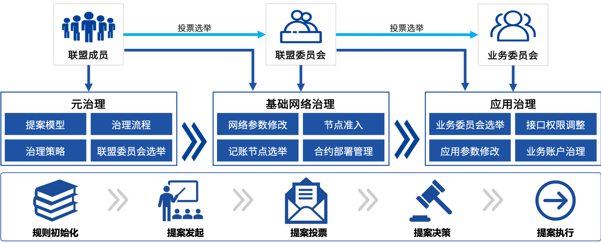
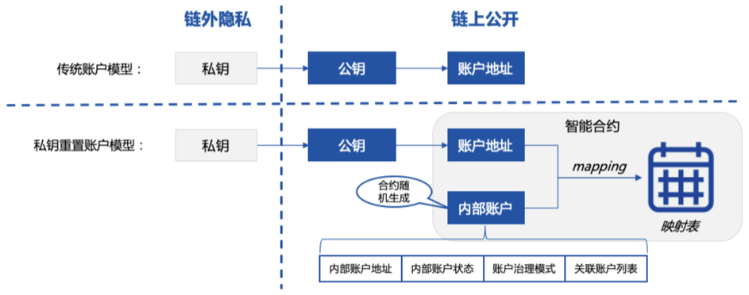
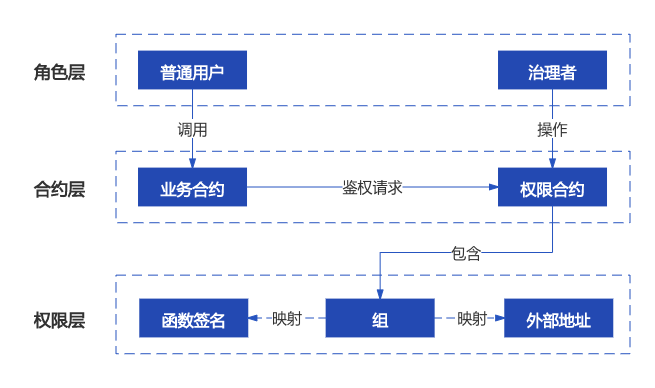
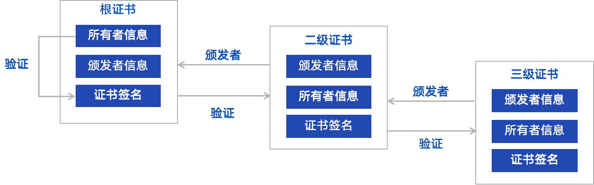
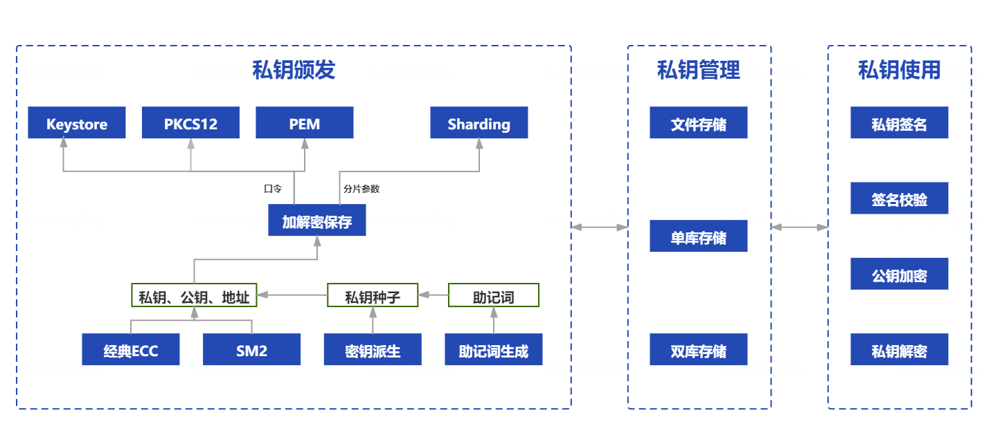

# 多方协作治理组件

标签：``WeBankBlockchain-Governance`` ``区块链多方协作治理`` ``通用组件`` ``账户治理`` ``权限治理`` ``私钥管理`` ``证书管理``

----

## 组件定位
区块链历经10余年的发展，基础技术框架逐渐完善，链上承载的业务越来越丰富，参与方越来越多。多方协作能否顺畅进行、业务摩擦能否得到有效解决、既往治理策略和实践能否满足日后高速发展的需求……行业关注的重点逐步聚焦到这些更具挑战性的难题上。

2021年1月，微众银行区块链在多年技术研究和应用实践的基础上，重磅发布了[《面向区块链的多方协作治理框架》白皮书](https://mp.weixin.qq.com/s?__biz=MzU0MDY4MDMzOA==&mid=2247486381&idx=1&sn=caae41a2241e3b1c2cd58181ef73a1bc&chksm=fb34c250cc434b46b2c1b72299c2eb71e1bd6b7597c341423c5d262f18a6e0af1628e0ba4037&scene=21#wechat_redirect)，即MCGF（Multilateral Collaborative Governance Framework）。

作为区块链治理的参考架构，MCGF全面覆盖区块链治理的设计规范、参与角色、核心系统架构、功能流程及应用场景等领域。

其开放式的框架可适配多种异构区块链底层网络，并结合管理和技术策略，统筹链上治理和链下治理。在系统层面，MCGF通过各类工具、组件和服务等方式支撑治理。最后，MCGF为各参与方设计可视化、交互式、多终端的感知和操作方式，提供优良的用户体验。

区块链本身追求多方协作，其体系和技术的发展落地都离不开社区的支持。我们秉持一贯的开源、开放的理念，诚邀各行业伙伴携手共建区块链治理体系，共同探索区块链治理之道。

我们将逐步把MCGF的内容一一开源，以飨社区。本次开源列表包含一套开箱即可用的区块链治理通用组件（WeBankBlockchain-Governance）。这些组件是MCGF框架的实做基础和原子性构件，可复用、可定制。

它们嵌入和运行在整个MCGF大框架的各部分，宛如高速行驶的汽车上的车轮、齿轮、传动组、传感器，协同助力构建治理框架和提升开发效率。欢迎社区一起建设和发展更多、更优的高可用组件。

## 设计目标

在基于分布式协作的联盟链中，各参与方以一种松散耦合、且彼此并不完全信任的形式参与协作。

联盟链中，设计了多种机制来帮助参与者之间建立信任且达成共识，私钥、证书、账户和权限管理都是其中关键的支撑技术。

但上述技术较为复杂，在应用效果看，还需要更多的可复用、易落地的工具或组件。

我们也常常会听到这样一些关于联盟链开发、使用和治理过程中的问题：

私钥概念复杂，其算法类型、存储文件、生成方式众多，难以理解和掌握，有没有简单、好用的工具来提升使用的体验？

区块链节点上的密钥是明文存储在硬盘上的，存在很大的操作风险，有没有安全存储的解决方案？

现有的区块链网络是以私钥为控制中心进行设计的，万一泄露或丢失了私钥该怎么办？

如何在同一区块链网络群组，针对不同的业务，以更细的粒度来控制智能合约的访问权限？

如何解决区块链应用角色设置不当导致的系统性风险？

现有的证书管理工具，尤其是国密相关的证书管理工具，相对不完善，有没有好用的工具推荐？

证书管理不仅仅涉及证书的生成，还包括了证书托管、签发、重置，尤其是在证书有效期设置被要求不断缩短的大趋势下，更需要频繁地重置，有没有完整的、一站式的解决方案？

……

分析、归纳以上问题，不难看出私钥、账户、权限和证书管理和使用等方面均存在较高门槛：开发者需要在不同场景重复且繁琐地解决同一个问题，用户在使用过程中容易出现困惑和不顺手，甚至可能因为治理方案不完善给系统带来安全隐患和风险。

为了解决上述问题，我们开发了区块链治理通用组件，旨在提供轻量解耦、开箱即用、简洁易用、一站式的区块链治理能力。

- **轻量解耦**。所有的治理组件与具体的业务解耦。可轻量化集成，在不侵入底层的前提下可插拔。通过类库、智能合约、SDK等多种方式提供。使用者甚至只需要使用链控制台，就可以部署和管控治理过程。
- **通用场景**。所有治理组件所瞄准的都是所有联盟链治理中的“刚需”场景，例如首批开源的账户重置、合约权限、私钥和证书的生命周期管理，账户、合约、私钥和证书堪称联盟链技术及上层治理的基石。
- **一站式**。链治理通用组件致力于提供一站式的使用体验。以私钥管理组件为例，支持多种私钥生成方式和格式、覆盖几乎所有主流场景，提供基于文件、多数据库等托管方式，并支持私钥派生、分片等加密方式。
- **简洁易用**。致力于提供简洁的使用体验，让用户轻松上手。
WeBankBlockchain-Governance 定位为区块链链治理组件，不仅希望在开发层面提供趁手的工具，更希望在实践层面为区块链参与者提供可参考落地的实践案例，从整体上助力区块链行业治理水平的提升。

## 组件简介
本次开源的区块链治理通用组件由私钥管理组件（Governance-Key）、账户治理组件（Governance-Account）、权限治理组件（Governance-Authority）、证书管理组件（Governance-Cert）等组件构成。

各治理组件提供了详细的使用文档。其中，账户治理组件和权限治理组件还提供了合约代码、Java语言的SDK、合约集成Demo和Java版SDK的使用Demo，以便于使用者基于自身业务的实际场景进行自由、灵活地使用和集成。

### WeBankBlockchain-Governance-Account 账户治理组件
基于智能合约开发，提供区块链用户账户注册、私钥重置、冻结、解冻等账户全生命周期管理，支持管理员、阈值投票、多签制等多种治理策略。 

在现有的区块链设计中，一旦私钥丢失，就无法对应身份进行再操作。于是，账户治理组件秉持以“账户为核心”的理念，提出双层账户体系，解决私钥和账户强绑定的痛点，从而实现账户私钥更换能力，意味着即使私钥丢失，账户也能找回。

在账户治理组件中，账户不再采用公钥地址，而是采用公钥账户加内部随机账户的双层账户体系。

账户治理组件提供了多种区块链账户治理规则、账户生命周期管理等整体解决方案，包括创建治理账户、选择多种治理规则，授权治理权限，创建账户、冻结账户、解冻账户、更换私钥、销户等账户生命周期的各类账户管理功能。

请参考
- [Github地址](https://github.com/WeBankBlockchain/Governance-Account)
- [Gitee地址](https://gitee.com/WeBankBlockchain/Governance-Account)
- [文档](https://governance-doc.readthedocs.io/zh_CN/latest/docs/WeBankBlockchain-Governance-Acct/index.html)
- [快速开始](https://governance-doc.readthedocs.io/zh_CN/latest/docs/WeBankBlockchain-Governance-Acct/quickstart.html)

### WeBankBlockchain-Governance-Authority 权限治理组件
基于智能合约，提供区块链账户、合约、函数等粒度的权限控制的功能的通用组件。 

随着基于智能合约的区块链应用开发案例的涌现，各应用开发场景对智能合约权限的控制和分组的需求也越来越迫切。权限治理组件提供基于智能合约的区块链账户、合约函数等粒度的权限控制。

权限治理组件支持拦截对合约函数的非法调用，还支持权限分组——通过配置函数与组的关联，可轻松实现分组的权限控制。只需在业务代码中引入权限合约地址，并在需要进行权限控制的函数中，访问权限合约的判断接口，就可以实现权限控制。

治理者只需操作权限治理合约，不需要调整业务合约，权限的修改即可实时生效。权限控制支持按需配置黑名单模式、白名单模式。

此外，权限治理组件还支持多种权限治理规则，例如一票通过、阈值投票等。

请参考 
- [Github地址](https://github.com/WeBankBlockchain/Governance-Authority)
- [Gitee地址](https://gitee.com/WeBankBlockchain/Governance-Authority)
- [文档](https://governance-doc.readthedocs.io/zh_CN/latest/docs/WeBankBlockchain-Governance-Auth/index.html)
- [快速开始](https://governance-doc.readthedocs.io/zh_CN/latest/docs/WeBankBlockchain-Governance-Auth/quickstart.html)

### WeBankBlockchain-Governance-Key 私钥管理组件
提供私钥生成、存储、加解密、加签、验签等私钥全生命周期管理的通用解决方案。 

私钥管理组件提供了私钥的生成、保存、托管、使用的能力，覆盖私钥使用全生命周期。

该组件支持多种标准协议，在私钥生成方面，支持随机数生成、助记词生成和派生生成等方式；就保存而言，支持门限分片还原，也支持按pkcs12（p12）、keystore、pem等格式导出；就托管而言，适配多种信任模型，可满足企业级用户的多样化需求；就使用而言，支持私钥签名、公钥加密等。

私钥管理组件还全面提供了国密支持。

请参考 
- [Github地址](https://github.com/WeBankBlockchain/Governance-Key)
- [Gitee地址](https://gitee.com/WeBankBlockchain/Governance-Key)
- [文档](https://governance-doc.readthedocs.io/zh_CN/latest/docs/WeBankBlockchain-Governance-Key/index.html)
- [快速开始](https://governance-doc.readthedocs.io/zh_CN/latest/docs/WeBankBlockchain-Governance-Key/corequickstart.html)

### WeBankBlockchain-Governance-Cert 证书管理组件
提供证书生成、验证、子证书请求等证书全生命周期管理的通用解决方案。 

证书管理组件提供了X509标准的多级证书的签发、验证、重置、撤销、导出及托管的能力，覆盖证书的全生命周期，并支持多种签名算法，如SHA256WITHRSA、SHA256WITHECDSA、SM3WITHSM2等签名算法，并提供国密支持。

组件包括了cert-toolkit和cert-mgr两个模块，cert-toolkit提供证书生成等基础能力，可作为独立工具包使用，cert-mgr基于cert-toolkit工具包，提供了证书的托管能力，并统一规范了签发的流程。

请参考 
- [Github地址](https://github.com/WeBankBlockchain/Governance-Cert)
- [Gitee地址](https://gitee.com/WeBankBlockchain/Governance-Cert)
- [文档](https://governance-doc.readthedocs.io/zh_CN/latest/docs/WeBankBlockchain-Governance-Cert/index.html)
- [快速开始](https://governance-doc.readthedocs.io/zh_CN/latest/docs/WeBankBlockchain-Governance-Cert/start.html)
  
## 使用场景

###私钥管理场景
私钥在区块链的设计体系中是不可或缺的。但是私钥本身难于理解，难于使用，更难于保管，管理成本巨大，严重削弱了区块链的使用体验。

现有区块链的实际场景中对私钥管理的有效工具依旧缺位。私钥管理普遍存在难度大、学习成本高、用户体验差等问题。

私钥管理组件提供了一系列丰富而独立的私钥管理手段，用户可根据自己的需求选择合适的方案。

**私钥生成**：用户可以使用助记词方式生成。一方面，助记词由单词构成，相对容易记忆，减少了记忆和表达的难度。另一方面，如果为不同的场景使用独立的私钥，会增加记忆的成本和丢失的风险，此时可采用私钥派生功能，用户只需保管根私钥即可，在不同的场景下根私钥会派生不同的子私钥。

**私钥托管**：得到私钥后，可选择经口令加密后导出为keystore或者pkcs12等格式，也可以交由企业级机构托管；还可以选择分片为若干个子片，分给不同的设备来存储。

**私钥使用**：用户得到私钥后，可使用该私钥签发交易、使用公钥加密私钥解密等。

### 账户治理场景
私钥本身存在易于丢失、易泄露的问题。因私钥丢失造成的经济损失屡见不鲜。由于巨大的经济利益驱使，对于私钥的安全攻击和盗窃案例也层出不穷。如何重置用户私钥，保护用户的资产安全是区块链推广的底线。

账户治理组件旨在提供基于智能合约的自洽的账户治理机制，实现私钥变更而身份不变的效果。账户治理组件既支持联盟链治理委员会的元治理，也支持基于联盟链具体业务应用的治理场景。

联盟链治理委员会账户治理：在传统的中心化解决方案中，存在着一家独大的风险。在联盟链中，通常会采用多中心的治理委员会来规避单点风险。联盟链治理委员会成员可依托治理合约，来行使管理职能，对各项事务进行投票和表决。

但是，与委员会成员所关联的私钥仍然存在泄露或丢失的风险。账户治理组件可应用于联盟链治理委员会账户治理中，联盟链治理委员会成员的账户也依托账户治理组件进行管理。

区块链存证业务账户治理：用户可用当前私钥在账户治理组件中开户，以生成内部身份。业务系统可依赖该内部身份，例如在存证业务合约中，数据的记录是与该内部身份相绑定的。

当需要修改私钥时，可通过关联账户或治理委员会以投票形式修改私钥，用新的私钥申请绑定旧的身份，这样用新的私钥便可继续操作旧的身份，同时旧的私钥则作废。

### 权限治理场景

在应用开发中，若缺乏一套安全机制，必然会产生很严重的后果。一方面，区块链应用需要细化到合约函数粒度级别的安全访问控制；另一方面，针对不同用户进行权限分组，防范交易越权等漏洞，避免被黑客攻击，也是区块链应用安全的刚需。

权限治理组件提供了业务权限治理工具，包含了不同账户的分组信息，还有不同组的权限。权限配置满足各类需求，使得开发者可以快速地为自己的智能合约应用集成权限控制功能。典型的功能如下：
- **账户分组**：可以将账户地址分组，并设置该组的权限，实现组的复用。
- **黑白名单模式**：支持黑白名单两种权限模式，管理员或治理委员会可以设置一个函数仅由一个组的成员来访问，或者仅允许该组以外的账户访问。
- **跨合约**：允许跨合约配置权限，例如可设置一组成员同时被多个合约中的函数禁止。
- **轻量接入**：业务方合约不需要知道这些复杂的权限配置，只需要在自己的函数中调用权限合约的拦截接口，当用户调用该函数的时候，业务方合约会自动将调用信息上下文交予权限系统进行判断、拦截。

### 证书管理场景
在联盟链的企业级身份认证管理中，证书是网络安全的基石。证书操作和使用体验的劣势，会危及整个联盟链网络的参与者，影响彼此的信任和业务的安全。

例如FISCO BCOS网络采用面向CA的准入机制，使用x509协议的证书格式，支持任意多级的证书结构，保障信息保密性、认证性、完整性及不可抵赖性。

证书管理组件提供了证书生命周期管理的解决方案，规范证书签发流程，支持证书托管，支持多种签名算法，方便个人或企业使用。以证书管理和工具包使用为例：

**链上节点准入证书管理**：链上节点证书的签发统一由证书管理组件来完成，证书管理组件可以集成或者独立部署，并由权威机构来管理服务。

在链初始化时，部署者可调用接口完成根证书的生成。新增机构或节点可以通过证书管理组件提供的查询接口，来查询根证书，并提交子证书请求。根证书管理者可从通过查询请求列表，选择签发子证书。通过证书管理组件对于证书的管理，可以规范签发流程，提升效率。

**证书工具包使用**：证书管理组件中cert-toolkit可作为独立JAVA工具包在项目中引用，代替命令行完成证书的生成和签发。企业或个人项目可集成证书管理组件作为证书签发工具包。
