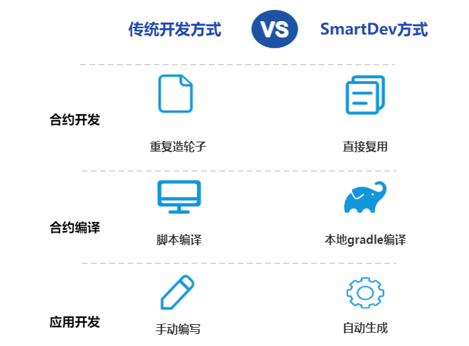
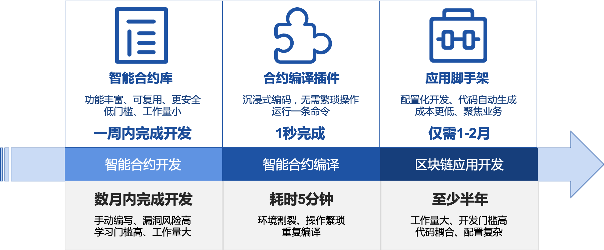
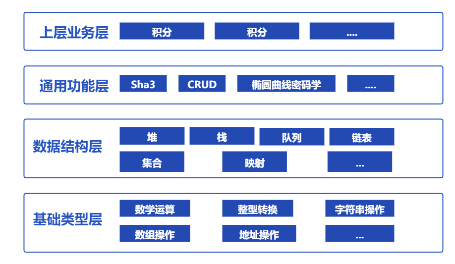
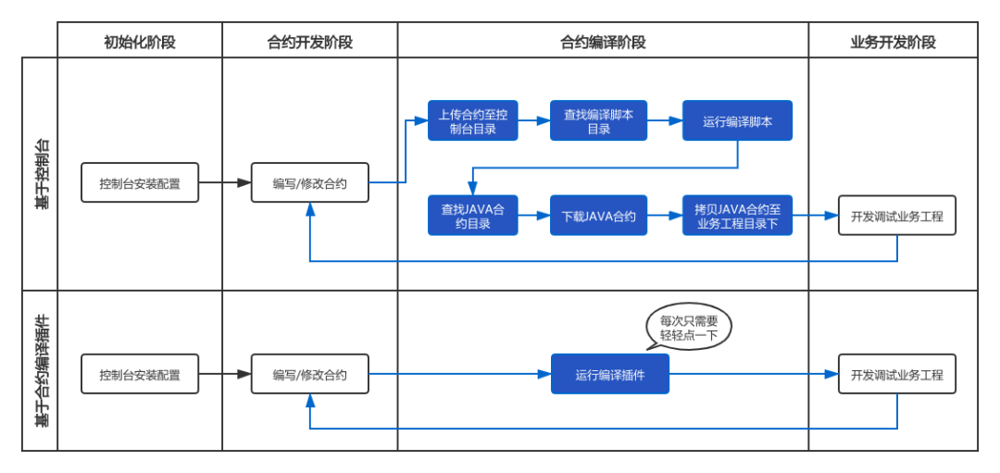
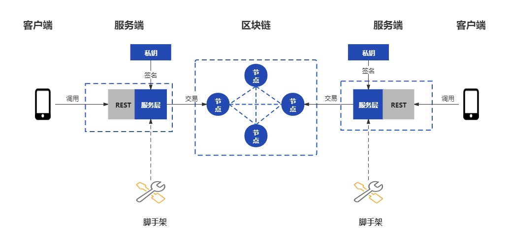
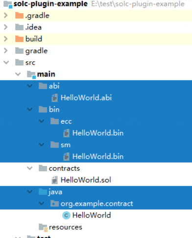

# 区块链应用开发组件

标签：``WeBankBlockchain-SmartDev`` ``应用开发`` ``通用组件`` ``智能合约库`` ``智能合约编译插件`` ``应用开发脚手架``

----

## 组件定位

区块链技术在经历了十余年的发展历程以后，渐呈“燎原之势”，不断在各行业落地生根。但同时，从技术角度看，区块链应用开发仍然有着较高的门槛，存在不少痛点，在应用开发各个环节上的用户体验有待提升。

WeBankBlockchain-SmartDev应用开发组件的初衷是全方位助力开发者高效、敏捷地开发区块链应用。SmartDev包含了一套开放、轻量的开发组件集，覆盖智能合约的开发、调试、应用开发等环节，开发者可根据自己的情况自由选择相应的开发工具，提升开发效率。

## 设计目标
区块链技术在经历了十余年的发展后，渐呈“燎原之势”，不断在各行业落地生根。但同时，从技术的角度看，区块链应用开发仍然有着较高的门槛，存在不少痛点，在应用开发各个环节上的用户体验、效率及安全有待提升。

在社区中，我们也经常听到关于区块链应用开发的诸多问题：
如何在solidity代码中将账户地址和字符串互转？
现有的solidity代码是否支持高级语言中常用但相对复杂的数据结构，例如可迭代的mapping？
是否可以提供一套基于明确应用场景的可供复用、参考的智能合约代码？
solidity智能合约如何快速编译为abi和binary文件？
如何在使用gradle构建的区块链应用中快速编译智能合约代码，而不必使用编译脚本？
写完智能合约后，如何编写区块链应用？
是否可以提供一个便于开发的区块链应用代码生成器？
编程小白如何快速上手区块链应用开发？
...

这些问题既有与合约开发相关的，也有与应用开发相关的。基于此类场景问题，结合自身实践经验，微众银行区块链正式开源区块链应用开发组件WeBankBlockchain-SmartDev，期望从区块链应用开发中的各个环节入手，多维度地提高区块链应用的开发效率，帮助开发者成为区块链应用开发的“10倍工程师”。目前，整个组件基于solidity语言开发。近期微众银行区块链还开源了Liquid合约语言，未来我们也会适配Liquid语言。

区块链应用开发组件WeBankBlockchain-SmartDev的研发初衷在于打造低代码开发的组件库，全方位助力开发者高效、敏捷地开发区块链应用。WeBankBlockchain-SmartDev包含了一套开放、轻量的开发组件集，覆盖合约的开发、编译、应用开发等环节，开发者可根据自己的情况选择相应开发工具，提升开发效率。

从合约开发的视角来看，对于常用的功能，不必再重复造轮子，只需按需引用，参考“智能合约库”中的代码，就可以引入相应功能，为合约开发的效率和安全保驾护航。对于非基础性功能，例如业务场景，我们也提供了代码模板供参考复用。

从合约编译的视角来看，对于正在开发中的区块链应用，不必再依赖控制台对合约代码进行编译，只需使用合约gradle编译插件就地编译，便可立即得到abi、bin和java合约。这些编译物直接被输出到Java项目中，省去了拷贝的步骤，提供了如开发原生java程序一样迅捷、丝滑的体验。

从应用开发的视角来看，从智能合约到项目搭建，包含了大量机械而重复的工作，如创建项目、引入依赖、编写配置代码、访问智能合约、编写相关实体类等。相形之下，通过WeBankBlockchain-SmartDev，开发者可以选用应用开发脚手架。脚手架会根据智能合约自动生成项目工程。工程中已经包含了上述逻辑代码，开发者只需基于该工程继续添加业务逻辑代码，聚焦在自身的业务上即可。

## 组件简介
SmartDev包含了一套开放、轻量的开发组件集，覆盖智能合约的开发、调试、应用开发等环节，包括智能合约库（SmartDev-Contract）、智能合约编译插件（SmartDev-SCGP）和应用开发脚手架（SmartDev-Scaffold）。开发者可根据自己的情况自由选择相应的开发工具，提升开发效率。

### SmartDev-Contract 智能合约库
solidity智能合约代码库。包含基础类型、数据结构、通用功能、上层业务等智能合约库。用户可根据实际需求进行参考、复用。

请参考  

- [Github地址](https://github.com/WeBankBlockchain/SmartDev-Contract)

- [gitee地址](https://gitee.com/WeBankBlockchain/SmartDev-Contract)

- [文档地址](https://smartdev-doc.readthedocs.io/zh_CN/latest/docs/WeBankBlockchain-SmartDev-Contract/index.html)
  
- [快速开始](https://smartdev-doc.readthedocs.io/zh_CN/latest/docs/WeBankBlockchain-SmartDev-Contract/quick_start.html)

### SmartDev-SCGP (Solidity Compiler Gradle Plugin) 智能合约编译插件
将solidity智能合约代码编译为Java代码的gradle插件，可以编译项目中的智能合约，生成对应的Java文件，并自动拷贝到对应包目录下。 

请参考

- [Github地址](https://github.com/WeBankBlockchain/SmartDev-SCGP)

- [gitee地址](https://gitee.com/WeBankBlockchain/SmartDev-SCGP)

- [文档地址](https://smartdev-doc.readthedocs.io/zh_CN/latest/docs/WeBankBlockchain-SmartDev-SCGP/index.html)
  
- [快速开始](https://smartdev-doc.readthedocs.io/zh_CN/latest/docs/WeBankBlockchain-SmartDev-SCGP/quick_start.html)

### SmartDev-Scaffold 应用开发脚手架
基于配置的智能合约文件，自动生成应用项目的脚手架代码，包含了智能合约所对应的实体类、服务类等内容，帮助用户只需要修改和编写较少量的代码，即可实现一个应用，大大简化了智能合约开发。 

请参考

- [Github地址](https://github.com/WeBankBlockchain/SmartDev-Scaffold)

- [gitee地址](https://gitee.com/WeBankBlockchain/SmartDev-Scaffold)

- [文档地址](https://smartdev-doc.readthedocs.io/zh_CN/latest/docs/WeBankBlockchain-SmartDev-Scaffold/index.html)

- [快速开始](https://smartdev-doc.readthedocs.io/zh_CN/latest/docs/WeBankBlockchain-SmartDev-Scaffold/quick_start.html)

## 使用场景

### 场景1：智能合约开发

在智能合约开发中，从基础的四则运算到上层的业务场景，都可以使用成熟的、可复用的库。

以四则运算为例，需要判断是否存在溢出的风险，此时可以使用数学相关库LibSafeMathForUint256Utils。

以数据结构为例，在solidity中，mapping类型的key不可被迭代，此时若需要使用对key进行迭代的映射，可以使用mapping相关的库LibBytesMap。

以通用功能为例，如果希望引入哈希、验签等密码学功能，则可以使用Crypto库。

以业务场景为例，如果想实现存证功能，可以参考场景模板Evidence，模板中纳入了相关实现，起到抛砖引玉的效果。

### 场景2：合约修改与调试

在区块链应用开发、调试过程中，通常需要在项目中用到abi、bin、java合约等内容，并基于这些内容进行相应的调试。如果合约出于调整等原因而需要重新编译，此时不必将合约拷入控制台编译，只需运行相应的gradle指令，就可以生成新的编译物。同时，这些编译物直接嵌在了项目中。如下图示例中，对HelloWorld合约编译后，产生的编译物示例：

### 场景3：区块链应用开发

假如用户已经写好了智能合约，需要基于智能合约，开发一个提供rest接口的web项目。在这种情况下，用户可以将合约拖入脚手架，一键生成项目。下图是生成的样例工程，包含了必要的配置类、DAO（Data Access Object）相关代码。开发者只需对项目进行必要的配置，并添加相应的controller等代码，就可以轻松实现上述需求。

