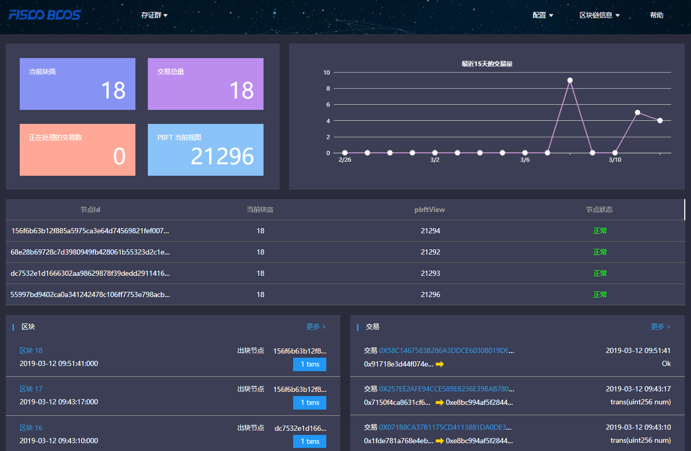
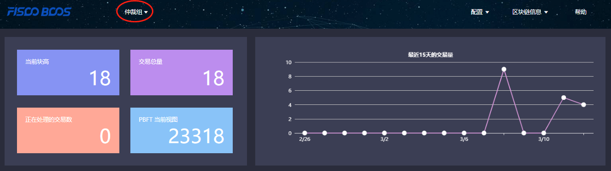
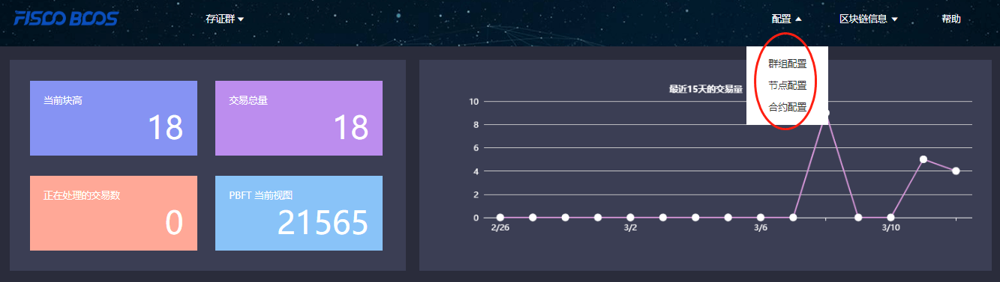
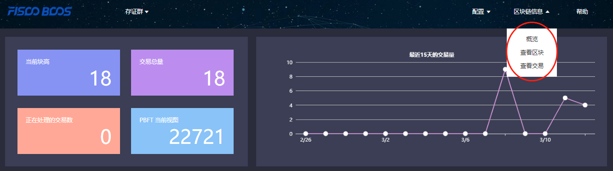
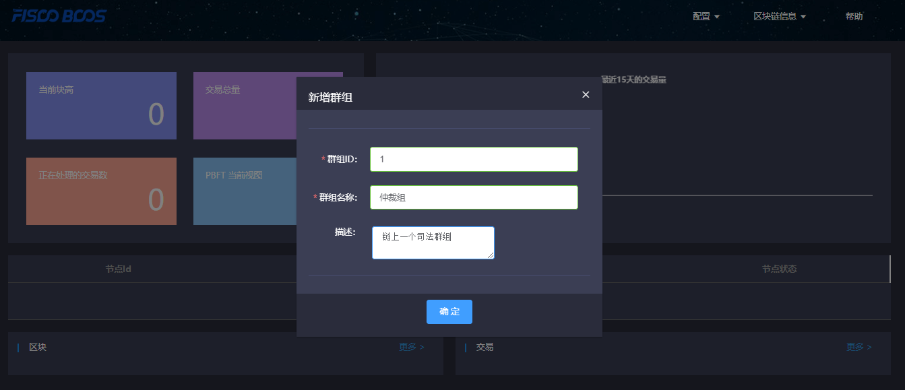
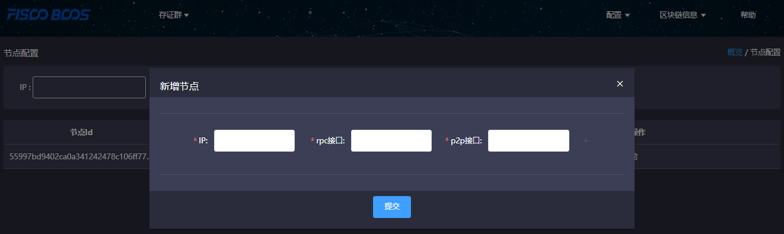
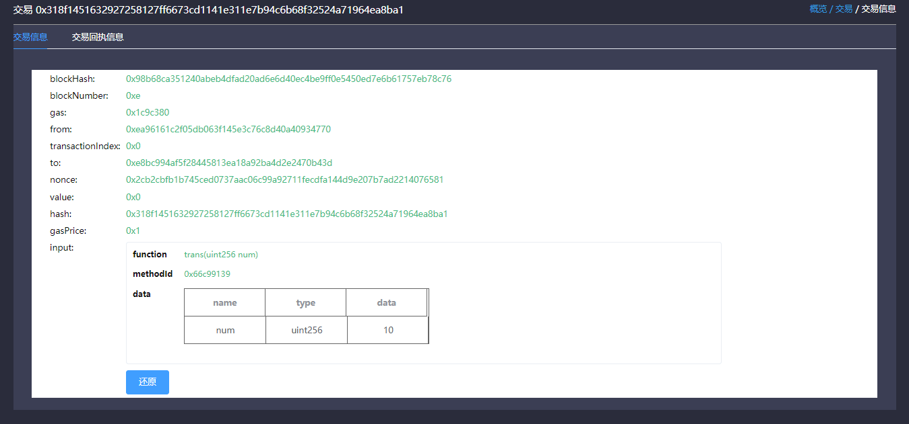
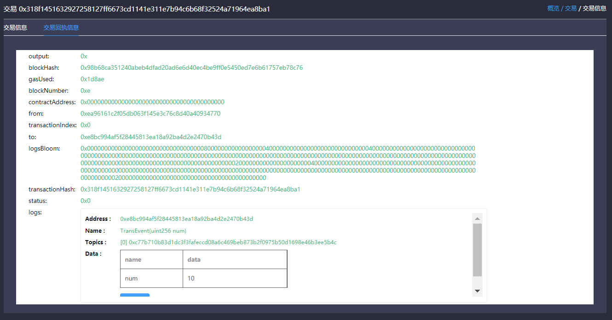

# Blockchain browser

## 1. Description

### 1.1 Introduction
**This blockchain browser is compatible with FISCO BCOS 2.0.0. FISCO BCOS 1.2 or 1.3 users please check [v1.2.1](https://github.com/FISCO-BCOS/fisco-bcos-browser/releases/tag/v1.2.1).**

Blockchain browser is capable of blockchain visualization and real-time presentation. Users can get the information of the blockchain through web pages. This browser is only compatible with [FISCO BCOS 2.0+](https://github.com/FISCO-BCOS/FISCO-BCOS). You can learn the newest features in [here](../introduction.md). Before using this browser,  you may need to learn the [groups feature](../what_is_new.html#id2) of FISCO BCOS 2.0+.

#### 1.2 Main functional modules

This chapter will give a brief introduction on each module of the browser for all-round understanding. Main functional modules of  the blockchain browser includes: group switch module, configuration module and data visualization module.

##### 1.2.1 Group switch module

Group switch module is adopted to access blockchain data when switching to different groups in multi-groups case.

##### 1.2.2 Configuration module

Configuration module includes group configuration, node configuration and  contract configuration.

##### 1.2.3 Data visualization module

Blockchain browser demonstrates the detail information of specific group on the chain including: overview, block information and transaction information.

## 2. Premises of use

### 2.1 Group building

Data shown in the blockchain browser is synchronized with blockchain. To synchronize data, initialization configuration (adding group information and node information) is needed. So users have to run a FISCO BCOS instance and build groups before data synchronizing. [FISCO BCOS 2.0+](https://github.com/FISCO-BCOS/FISCO-BCOS) has provided multiple convenient group building methods.

1. For developers to experience and debug quickly, we recommend the script [build_chain](../installation.md).
2. For enterprise applications,  [FISCO BCOS generator](../enterprise_tools/tutorial_one_click.md) is a  more considerable deployment tool.

The distinguish of the above methods lie in that the script `build_chain` is for better and quicker building experience and it helps developers generate private key of each node in groups; deployment tool doesn't automatically generate private key for safety consideration, and business users need to generate and set by themselves.

## 3. Building of blockchain browser

Blockchain browser can be divided into two parts: the back-end service "fisco-bcos-browser" and the front-end web page "fisco-bcos-browser-front".

We also provide two ways for browser building in the current version: [**one-key setup**](./deploy.md) and manual setup.

### 3.1.1 One-click setup

One-click setup is suitable for single-machine deployment of front-end and back-end to experience quickly. The detail process is introduced in [**Installation document**](./deploy.md).

### 3.1.2 Manual setup

#### Back-end service building

The back-end service of blockchain browser adopts JAVA back-end service, i.e., Spring Boot. The exactly building process can be referred in [**Installation document**](./server.md).

#### Front-end web page service building

Front-end conducts `vue-cli`. Also, the tutorial can be found in  [**Installation document**](./web.md).

## 4. Initialization environment

### 4.1 Adding group

Once it is set up, users can access the front-end by typing IP and its port configured by nginx through web browser. Browser without group initialization will lead to new group configuration page, where the group ID, group name and group description are needed.

**Group ID should be consistent with the specific blockchain.** There are many methods to check group ID: 

- [acquire rpc interface](../api.html#getgrouplist). 
- [console command](../manual/console.md).
- console commands: Please refer to [here](../manual/console_of_java_sdk.md) for the console user manual of version 2.6 and above, and [here](../manual/console.md) for the console user manual of version 1.x

Group name should be meaningful and better understandable as a explanation of group ID.

Group description is the further illustration of the name.

### 4.2 Adding node

The next step, you need to add the node information belong to the group to obtain relative information shown in blockchain browser. RPC port and P2P port of nodes can be acquired from the file **config.ini** in the directory of a specific node.

For easy use, the newly added group will synchronize the information of shared node which configured by other groups before.

### 4.3 Adding contract

On this version, the browser provides the function of contract analysis, which requires users to import all contracts the group had deployed before. User can upload zip package (only support one-level directory) to solve namesake contract issues.

Steps of import

#### 4.3.1 Import contract

1. Contract is required to be uploaded as `*.sol` file or zip package.
2. Zip package is compatible with one-level directory at most and defaulted to be uploaded to root directory. Zip package can only contain `*.sol` files.

#### 4.3.2 Compile contract

## 5. Functions introduction

### 5.1 Blockchain overview

#### 5.1.1 Overall overview

Overall overview includes block number of the group, transaction volume, processing transaction amount and the PBFT view.

#### 5.1.2 Transaction volume in 15 days

The transactions of the group in 15 days are shown in the line chart.

#### 5.1.3 Node overview

Node overview includes node ID, current block height, the PBFT view and node status.

#### 5.1.4  Block overview

Block overview includes the information of the latest four blocks, including block height, block generator, generation time and transaction volume on the block.

#### 5.1.5  Transaction overview

Transaction overview includes the latest four transactions, including transaction hash, transaction time, transaction sender & receiver. The information invoked by transactions can also be shown if the related contract is imported correctly.

### 5.2 Block information

Block information includes pages of block list and block details.

### 5.3 Transaction information

Transaction information includes pages of transaction list and transaction details.

#### 5.3.1 Transaction analysis

After contract is uploaded and compiled, blockchain browser can analyze the transaction method names and parameters. The analysis of the browser is based on correct import of contract. Therefore, when using JAVA or JS to call contract, please **save the correct version of contract.**

#### 5.3.2 Event analysis

After contract is uploaded and compiled, blockchain browser can analyze event method names and parameters in the transaction receipts.

