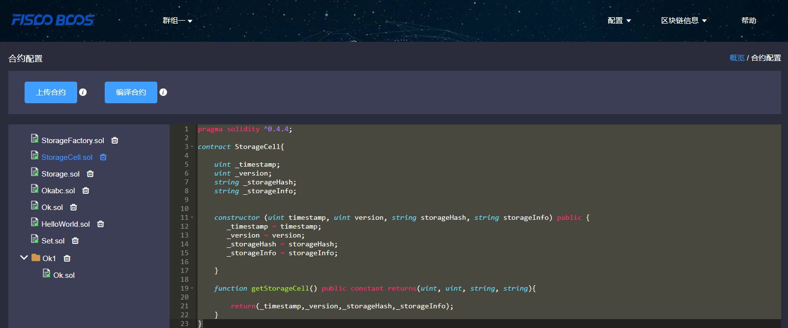

# Blockchain explorer

## 1. Description

### 1.1 Basic introduction
**This blockchain explorer is adaptable to FISCO-BCOS 2.0.0. FISCO-BCOS 1.2 or 1.3 users please check [v1.2.1](https://github.com/FISCO-BCOS/fisco-bcos-browser/releases/tag/v1.2.1).**

Blockchain explorer is capable of blockchain data visualization and real-time presentation. Users can access the information on blockchain through web pages. This explorer is adaptable to [FISCO-BCOS 2.0](https://github.com/FISCO-BCOS/FISCO-BCOS). You can learn its features in [here](../introduction.md). Before using this explorer, basic understanding on groups features of FISCO BCOS 2.0 is needed, which is referred in [here](../what_is_new.html#id2).

#### 1.2 Main function models

This chapter will give a brief introduction on each model of the browser for all-round understanding. Main function models of blockchain browser includes: group switch model, config model and blockchain data demo model.

##### 1.2.1 Group switch model

Group switch model is adopted to access blockchain data by switching to different groups in multi-group cases.

##### 1.2.2 Config model

Config model functions group configuration, node configuration and contract configuration.

##### 1.2.3 Blockchain data demo model

Blockchain browser demonstrates detail information of groups on chain including: overview, block information and transaction information.

## 2. Premises of use

### 2.1 Group building

Data shown in the blockchain browser is synchronized with blockchain. To synchronize data, initialization configuration (adding group information and node information) is needed. So users have to build groups before data synchronizing. [FISCO-BCOS 2.0](https://github.com/FISCO-BCOS/FISCO-BCOS) has provided multiple convenient group building methods.

1. For developers to develop and debug, we recommend [build_chain](../installation.md).
2. For business applications, we recommend deployment tool [FISCO-BCOS generator](../tutorial/enterprise_quick_start.md).

The distinguish of the two lies in that build_chain is for better and quicker building experience and it helps generate private key of each node in groups; deployment tool doesn't help generate private key for safety consideration, and users need to generate and set by themselves.

## 3. Building of blockchain browser

There are 2 parts in blockchain browser: back-end service "fisco-bcos-browser", front-end web page "fisco-bcos-browser-front".

We provide 2 ways of building in the current version: [**one-click setup**](./deploy.md) and manual setup.

### 3.1.1 One-click setup

One-click setup is suitable for single-machine deployment of frontend and backend and quick experience. The detail process is introduced in [**Installation document**](./deploy.md).

### 3.1.2 Manual setup

##### Backend service building

The backend service of blockchain browser adopts JAVA backend service of Spring Boot. The basic building process is introduced in [**Installation document**](./server.md).

#### Frontend web page service building

Frontend web page of blockchain browser uses frame `vue-cli`. The basic building process is introduced in [**Installation document**](./web.md).

## 4. Initialization environment

### 4.1 Add group

After service is set up, users can access frontend IP and port configured by nginx through web browser and enter the web page.Browser without group initialization will lead to new group configuration page, where configurations of group ID, name and description are needed.

**Group ID should be consistent with the blockchain.** There are many methods to check group ID: 1, [acquire rpc interface](../api.htmlmd#getgrouplist). 2, [console command](../manual/console.md).

Group name is made to be meaningful and better understandable for group ID.

Description is the further illustration of the name.

### 4.2 Add node

Node information in groups is added to acquire relative information demonstrated by blockchain browser.RPC port and p2p port of nodes can be acquired from config file **config.ini** of node.

For easy use, the newly added group will synchronize the configured and shared node information of other groups.

### 4.3 Add contract

This browser provides function of contract analysis, which requires users to import all contract of a group. For this version, user can upload zip package to top level directory to solve namesake contract issues.

Steps of import

#### 4.3.1 Import contract

1. Contract is required to be uploaded as sol file or zip package.
2. Zip package is adaptable to top level directory at most and defaulted to be uploaded to root directory. Zip package can only contain sol files.

#### 4.3.2 Compile contract

## 5. Functions introduction

### 5.1 Information overview

#### 5.1.1 Overall overview

Overall overview includes block number of the group, transaction volume, processing transaction amount and PBFT view.

#### 5.1.2 Transaction volume in 15 days

The transactions of this group in 15 days are shown in the line chart.

#### 5.1.3 Node overview

Node overview includes node ID, current block height, PBFT view and node status of the current group.

#### 5.1.4  Block overview

Block overview includes the information of the latest 4 blocks, including each's block height, block generator, generation time and transaction volume on the block.

#### 5.1.5  Transaction overview

Transaction overview includes the latest 4 transactions, including transaction hash, transaction time, transaction sender & receiver. The interface information called by transactions can also be shown if the related contract is imported correctly.

### 5.2 Block information

Block information includes pages of block list and block details.

### 5.3 Transaction information

Transaction information includes pages of transaction list and transaction details.

#### 5.3.1 Transaction analysis

After contract is uploaded and compiled, blockchain browser can analyze the transaction method names and parameters. The analysis of the browser is based on correct import of contract. Therefore, when using JAVA or JS to call contract, please **save the correct version of contract.**

#### 5.3.2 Event analysis

After contract is uploaded and compiled, blockchain browser can analyze event method names and parameters in the transaction receipts.

