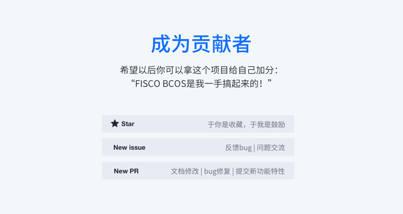

# Community

FISCO BCOS, officially launched in December 2017, is the first China-developed open source consortium blockchain platform. It was collaboratively built by the FISCO open source working group, which was formed by Beyondsoft, Huawei, Shenzhen Securities Communications, Digital China, Forms Syntron, Tencent, WeBank, YIBI Technology, Yuexiu Financial Holdings (Fintech) and more.

## FISCO BCOS resources

- [Github homepage](https://github.com/FISCO-BCOS/FISCO-BCOS)  
- [Technical documents](https://fisco-bcos-documentation.readthedocs.io)

- [Inlightful articles](http://mp.weixin.qq.com/mp/homepage?__biz=MzU5NTg0MjA4MA==&hid=9&sn=7edf9a62a2f45494671c91f0608db903&scene=18#wechat_redirect) 
- [Code contribution](https://mp.weixin.qq.com/s/hEn2rxqnqp0dF6OKH6Ua-A)
- [Feedbacks](https://github.com/FISCO-BCOS/FISCO-BCOS/issues)
- [Application cases](https://mp.weixin.qq.com/s/vUSq80LkhF8yCfUF7AILgQ)

## Join FISCO BCOS community

