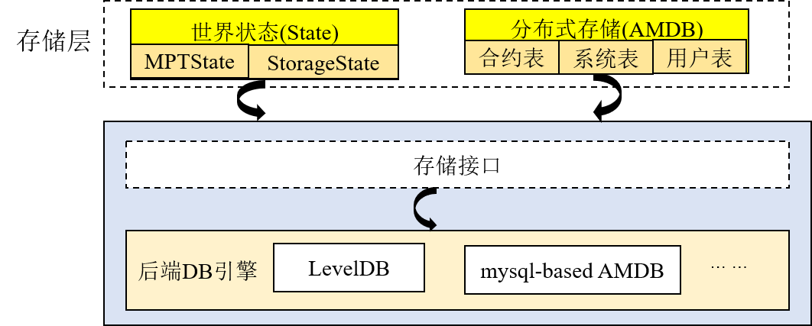

# Multi-group structure

To fit most business scenarios, FISCO BCOS supports various functions including multi-group activation, transactions among groups, data storage and block consensus in separation engined by multi-group structure. It can safely guard the system privacy but also eliminate the difficulty in operation and maintenance of blockchain system.


```eval_rst
.. note::

    For example:

    Agency A, B, C, D constituted a blockchain network to operate Project 1. But now, A and B want to start Project 2 in the condition that C has no access to its data and transactions. How to realize it?

    - **1.3 series FISCO BCOS** : Agency A and B build another chain to operate Project 2. Administrator needs to operate and maintain both chains and their ports.

    - **FISCO BCOS +** ：Agency A and B build another group for Project 2. Administrator maintains only one chain.

    Obviously both solutions can achieve privacy protection, but FISCO BCOS 2.0+ gets advantages in scalability, operation and maintenance and flexibility.
```

In multi-group structure, Networking is shared among groups. Groups can isolate messages of some ledger through [networking access and whitelist] (../security_control/node_management.md).


Then, data will be isolated with other groups. Every group runs consensus algorithm independently or differently. Each ledger model contains three layers: Core, Access, Administration (from the bottom to the top). This three layers will cooperate to ensure stable operation of each group in FISCO BCOS platform.

## Core

Core layer is responsible for inputing group data [block](../../tutorial/key_concepts.html#id3), block information, system table and execution result into data base.

Storage is formed by two parts: State and amdb-proxy. State contains MPTState and StorageState who store the status information of transactions. StorageState has higher performance than MPTState, but it doesn't store history records of block. amdb-proxy opens accesses of select, commit and update and operates contract table, system table, user table. It is pluggable and adaptable to multiple kinds of database. Currently supports [RocksDB数据库](https://github.com/facebook/rocksdb) and MySQL[storage](../storage/storage.md).




## Access

Access layer includes three models: TxPool, BlockChain and BlockVerifier.

- **TxPool**: interact with networking and administration layers. Store the transactions propagated by client ends or other nodes. Administration layer (mainly syncing and consensus models) outputs transactions in TxPool for propagation and block packing.

- **BlockChain**: interact with core layer and administration layer. The only access to bottom storage. Administration layer (syncing and consensus models) can check block number, acquire block and submit block through Blockchain.

- **BlockVerifier**: interact with administration layer, execute the block inputed by administration layer and sends result back to administration layer.


## Administration

Administration layer includes two models: Consensus and Sync.

- **Consensus**: include two threads that are Sealer and Engine, one for packing transactions and another for executing consensus workflow. Sealer outputs transactions from TxPool and packs into new blocks. Engine executes consensus workflow, during which block is also executed, and submits execution result to Blockchain. Blockchain will input the information to bottom storage and trigger TxPool to delete all transactions in the on-chain block. and notifies transaction result to client ends using callbacks. Currently FISCO BCOS mainly supports consensus algorithm [PBFT](../consensus/pbft.md) and [Raft](../storage/storage.md).

- **Sync**: propagate transactions and acquire new block.
During consensus workflow, [leader](../consensus/pbft.html#id1) is responsible for block packing and leader may be switched at any time. Therefore, it is necessary to ensure that the transactions in client ends will reach every node on chain, whose sync model will propagate the new transaction to the other nodes. Considering the inconsistency of machines' performance on Blockchain, or increment of node may causing lagging of block number, Sync model offers block syncing function. Sync model sends the latest block number to other nodes so that they can download the newest block when finding the block number is lagging behind others.
