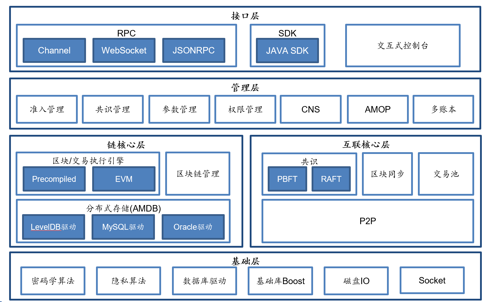

##############################################################
Overall network
##############################################################

The overall network of FISCO BCOS can be categorized into four layers: fundamental, core, administration and access.

- **fundamental**: provide basic data structure and algorithms library

- **core**: implement the core logic of blockchain. It can be further divided into 2 parts:

  (1) Chain core: realize the chain data structure, transaction execution engine and storage driving of Blockchain

  (2) Internetworking core: realize the basic P2P networking, consensus mechanism and syncing mechanism of blockchain

- **administration**: realize the administration of blockchain, including parameter setting, ledger management and AMOP

- **access**: access for blockchain users including RPC interface of multiple protocols, SDK and interactive console.

FISCO BCOS boasts strong scalability due to multi-group structure and a strong and stable blockchain system based on reasonable model design.

This chapter emphasizes the group structure and transaction flow (submission, package, execution and write-on-chain of transaction) of FISCO BCOS.
empha

.. toctree::
   :maxdepth: 1

   group.md
   transaction_stream.md
