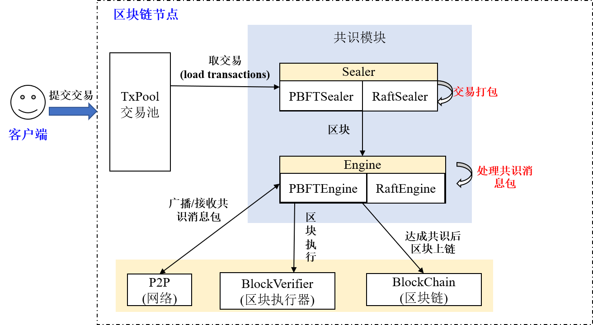

## Framework

FISCO BCOS realized a extensible consensus framwork with pluggable consensus algorithm. Currently it supports **PBFT(Practical Byzantine Fault Tolerance)** and **Raft(Replication and Fault Tolerant)** algorithm. The consensus model framework is as below:

**Sealer thread**

Sealer thread takes transaction out from txPool and seal transactions based on the highest block of nodes to generate new block and send it to engine thread. The sealer threads of PBFT and Raft are respectively PBFTSealer and RaftSealer.

**Engine thread**

Engine thread receives the new block locally or through internet, and finishes consensus process according to the received consensus information, and finally writes the consensused new block to blockchain, after which the transaction will be deleted from txPool. The engine threads of PBFT and Raft are respectively PBFTEngine and RaftEngine.
