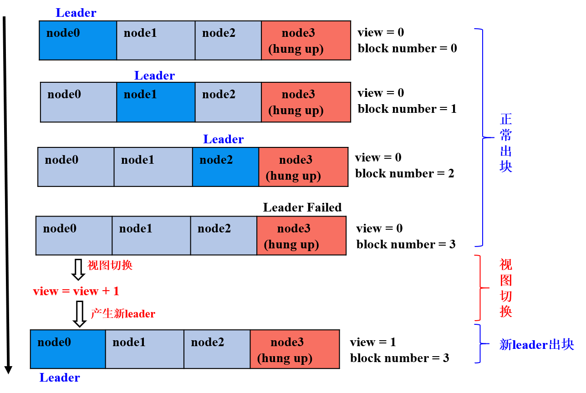

# PBFT

**PBFT**(Practical Byzantine Fault Tolerance) consensus algorithm is still workable when it comes to minority malicious nodes (like faking message), as its message delivery system is tamper-resistant, non-forgeable and non-deniable due to digital signature, signature verification, hash and other cryptographic algorithms. Besides, it has optimized the past achievement by reducing the level of complexity of BFT from exponential to polynomial. In a system formed by (3\*f+1) nodes, as long as there is more than (2\*f+1) non-malicious nodes, it can reach consistency. For example: a system of 7 nodes can allow 2 nodes of Byzantine Fault.

FISCO BCOS system has realized PBFT consensus algorithm.


## 1. Core concepts

Node type, node ID, node index and view are core concepts of PBFT consensus algorithm. The basic concepts of blockchain system is introduced in [Core concept](../../tutorial/key_concepts.md).

### 1.1 Node type

- **Leader/Primary**: consensused node responsible for sealing blocks of transaction and block consensus. Each round of consensus will contain only one leader, who will be switched after a round to prevent it from faking block;

- **Replica**: replica node responsible for block consensus, each round of consensus contains multiple replica nodes with similar process each;

- **Observer**: observer node responsible for acquiring new block from consensused nodes or replica nodes, executing and verifying result, and adding the new block to blockchain.

Leaders and Replicas are named consensus nodes.


### 1.2 Node ID && node index

To prevent node from being malicious, each consensused node during PBFT process signs the message they send, and does signature verification on received message. Therefore, each node maintains a public and private key pair. Private key is to sign on the message it sends; public key as the node ID for identification and signature verification.

> **Node ID** : public key for signature and the unique identification of consensused node, usually a 64-byte binary string, other nodes  verifies the message package by the sender node ID.


Considering the length of node ID would take up bandwidths if containing this field in consensus message, so FISCO BCOS adapts node index through which each node ID can be located in the consensused node list maintained by each node. When sending message package, by the input node index other nodes can search out node ID for signature verification:

> **Node index** : the location of each consensused node in the public node ID list


### 1.3 View

View is adapted in PBFT consensus algorithm to record consensus status of each node. Nodes with the same view maintain the same node list of Leader and Replicas. When Leader fails, the view will be switched. If it is switched successfully (at least 2\*f+1 nodes have the same view), a new Leader will be picked according to the new view and start generating block. If not, it will keep switching until most nodes (equal or more than 2\*f+1) reach the same view.


In FISCO BCOS system, the computing formula of leader index is:

```bash
leader_idx = (view + block_number) % node_num
```


The following drawing shows the switch of view in a FISCO BCOS system of `4(3*f+1, f=1)` nodes where node 3 is Byzantine node:




- the former 3 rounds of consensus: node 0, 1, 2 are leader nodes, `2*f+1` non-malicious nodes, nodes generates block in normal consensus status;

- the 4th round of consensus: node 3 is the leader and a Byzantine node, node 0, 2 doesn't receive the block seal from node 3 on time, the view is being switched to new view `view_new=view+1` and broadcast viewchange package, when the `(2*f+1)` viewchange packages in `view_new` are fully collected, nodes will switch it as the new view `view_new` and calculate the new leader;

- the 5th round of consensus: node 0 is the leader and keeps sealing blocks.


### 1.4 Consensus messages

PBFT model mainly includes **PrepareReq, SignReq, CommitReq and ViewChangeReq** 4 consensus messages:

- **PrepareReqPacket**: includes request package of block, leader generates it and broadcasts to all replica nodes who receives Prepare package and verifies PrepareReq signature, executes block and caches the execution result, in order to prevent Byzantine nodes from doing evil and ensure the certainty of the block execution result;

- **SignReqPacket**: signature request with block execution result, generated by consensused node after receiving Prepare package and executing block, SignReq request contains the hash and its signature of executed block, which are SignReq.block_hash and SignReq.sig, node broadcast SignReq to other consensus nodes for the consensus of SignReq (or block execution result);

- **CommitReqPacket**: commit request to confirm block execution result, generated by nodes who fully collected `(2*f+1)` SignReq request with the same block_hash and from different nodes. When CommitReq is broadcasted to other consensused nodes, which will add the latest block cached locally on chain after fully connecting `(2*f+1)` CommitReq requests with the same block_hash and from different nodes;

- **ViewChangeReqPacket**: request to switch view, when leader fails (networking abnormality, server crash down, etc.), other nodes will start switching view, ViewChangeReq includes the new view (marked as toView, the current view plus one), a node will switch its current view to toView after collecting `(2*f+1)` ViewChangeReq requests with toView and from different nodes.

Fields contained in the 4 types of messages are almost the same:

| Field | Definition |
| ------ | ------ |
| field | definition |
| idx | current node index|
| packetType | type of request package (including PrepareReqPacket/SignReqPacket/CommitReqPacket/ViewChangeReqPacket) |
| height | in-process block number (usually local block number plus one) |
| blockHash | hash of in-process block |
| view | view of current node |
| sig | signature on blockHash of current node|

PrepareReqPacket includes information of in-process block:

| package type | field  |definition |
| ------ | ------ | ----- |
| PrepareReqPacket | block | block data during consensus by all consensused nodes |

## 2. System framework

The system framework is described as below:


PBFT consensus process mainly contains 2 threads:

- PBFTSealer: PBFT sealer thread takes transaction out of txPool, encapsulating the sealed block into PBFT Prepare package and sending the package to PBFTEngine;

- PBFTEngine: PBFT consensus thread receives PBFT consensus message packet from PBFT sealer or P2P network. Blockverifier module is response to execute block, after the consensus process completes, transactions will be deleted from txPool.


## 3. Core process

PBFT consensus process includes 3 phases, Pre-prepare, Prepare and Commit:

- **Pre-prepare**: executes block, generates signature package and broadcast it to all consensused nodes;
- **Prepare**: collects signature package, when a node collects `2*f+1` signature packages, it will state that it is ready from committing blocks and start broadcasting Commit package;
- **Commit**: collects Commit package, when a node collects `2*f+1` Commit packages, it will commit the locally-cached latest block to data base.


The following picture introduces the detail processes of each phase of PBFT:

```eval_rst
.. mermaid::

   graph TB
         classDef blue fill:#4C84FF,stroke:#4C84FF,stroke-width:4px, font:#1D263F, text-align:center;

         classDef yellow fill:#FFEEB8,stroke:#FFEEB8,stroke-width:4px, font:#1D263F, text-align:center;

         classDef light fill:#EBF5FF,stroke:#1D263F,stroke-width:2px,  font:#1D263F, text-align:center;

         subgraph Consensus process
         A((start))-->B
         B(acquire PBFT request type)-->|Prepare request|C
         B-->|Sign request|D
         B-->|Commit request|F
         C(Prepare is valid?)-->|Yes|G
         C-->|No|B

         G(addRawPrepare<br/>cache Prepare request)-->H
         H(Empty block in Prepare?)-->|No|I
         H-->|Yes|T
         T(Switch view)

         I(execBlock<br/>execute block in Prepare)-->J
         J(generateSignPacket<br/>generate signature request)-->K
         K(addPrepareCache<br/>cache executed block)-->L
         L(broadcastSignReq<br/>broadcast signature request)

         D(isSignReqValid<br/>signature request valid?)-->|Yes|M
         D-->|No|B
         M(addSignReq<br/>cache received signature request)-->N
         N(checkSignEnough<br/>signature requests reach 2*f+1?)-->|Yes|O
         N-->|No|B
         O(updateLocalPrepare<br/>back up Prepare request)-->P
         P(broadcastCommitReq<br/>broadcast Commit request, state that the node is ready to commit block)

         F(isCommitReqValid <br/> Commit request is valid?)-->|Yes|Q
         Q(addCommitReq <br/> cache Commit request)-->R
         R(checkCommitEnough <br/> Commit requests reach 2*f+1?)-->|Yes|S
         R-->|No|B
         S(CommitBlock<br> commit the cached executed block to DB)

         class A,B light
         class C,G,H,I,J,K,L,T light
         class D,M,N,O,P light
         class Q,F,R,S light
         end
```


### 3.1 Leader to seal block


In PBFT consensus algorithm, consensus nodes generate blocks in turn, each round of consensus has one leader to seal block. Leader index can be calculated through formula `(block_number + current_view) % consensus_node_num`.

Node starts sealing block when finding that the leader index is the same with the index of itself. Block sealing is mainly conducted by PBFTSealer thread, with detail functions as below:


- **generate new empty block**: acquire the latest block on blockchain, based on which new empty block will be generated (set the parent hash of the new block as the hash of the highest block, time stamp as the current time, delete transaction);

- **seal transaction from txPool**: acquire transaction from txPool after the new empty block is generated, and insert the transaction to the new block;

- **encapsulate new block**: Sealer thread seal the transaction and sets the sealer of the new block as self index, and calculate transactionRoot of all transactions according to the sealed transaction;

- **generate Prepare package**: encode the encapsulated new block to Prepare package, broadcast to all consensused nodes in group through PBFTEngine thread, other nodes receive Prepare package and start 3 phases of consensus.


### 3.2 Pre-prepare phase

Consensused nodes enters pre-prepare phase after receiving Prepare package. The workflow of this phase includes:

- **Prepare package validity judgments**：judge whether the Prepare package is replicated, whether the parent hash of block in Prepare request is the hash of the highest block currently (to avoid forking), whether the block number in Prepare request equals the latest block number plus one;

- **cache valid Prepare package**: if the Prepare request is valid, cache it locally to filter replicated Prepare requests;

- **Empty block judgement**：if the transaction quantity in the block contained in Prepare request is 0, start view switching of empty block by adding one, and broadcast view switching request to other nodes;

- **execute block and cache execution result**: if the transaction quantity in the block contained in Prepare request is more than 0, call BlockVerifier to execute block and cache the executed block;

- **generate and broadcast signature package**：generate and broadcast signature package based on the hash of executed block, state that this node has finished block execution and verification.


### 3.3 Prepare phase

Consensus nodes enter Prepare phase after receiving the signature package. The workflow of this phase is as below:

- **signature package validity judgment**：judge whether the hash of the signature package is the same with the hash of executed block cached in Pre-prepare phase, if not, judge whether the request belongs to future block (generation of future block is caused by lower performance of the node, who is still in the last round of consensus, to judge whether it's future block: height field of the signature package bigger than the latest block number plus one); if not future block, it is invalid signature request which will be denied by node;

- **cache valid signature package**：node will cache valid signature package;

- **judge whether the cached signature packages of block cached in Pre-prepare phase reach `2*f+1`, commit packages if they are fully collected**：if the quantity of signature packages of the block hash cached in Pre-prepare phase exceeds `2*f+1`, then most nodes has executed the block and get the same result, and the node is ready to commit block and broadcast Commit package;

- **write to disk the Prepare package cached in Pre-prepare phase for backup if signature packages are fully collected**：to avoid more than `2*f+1` nodes crashing down before committing block to data base in Commit phase, the crashed nodes will again generate blocks after re-started, which will cause forking (the highest block of these nodes are different with the latest block of other nodes), therefore, it's needed to backup the Prepare package cached in Pre-prepare phase to data base, so nodes can process the backup Prepare package first after re-started.


### 3.4 Commit phase

Consensus nodes enter Commit phase after receiving Commit package. The workflow of this phase includes:

- **Commit package validity judgment**：mainly judge whether the hash of Commit package is the same with the block hash cached in Pre-prepare phase, if not, judge whether the request belongs to future block (the generation of future block is caused by lower performance of the node, who is still is the last round of consensus, to judge whether it is future block: height field of Commit is bigger than the highest local block number plus one); if it's not future block, it is invalid Commit request which will be denied by node;

- **cache valid Commit package**：nodes cache valid Commit package;

- **judge whether the cached Commit packages of block cached in Pre-prepare phase reach `2*f+1`, write the new block to disk if the Commit packages are fully collected**：if the number of Commit requests of the block hash cached in Pre-prepare phase reaches `2*f+1`, most nodes are ready to commit block and get the same execution result, call BlockChain to write the block cached in Pre-prepare phase to data base.


### 3.5 View switching process

When the 3 consensus phases of PBFT is time-out or nodes receive empty block, PBFTEngine will try to switch to higher view (the new view toView plus one) and start ViewChange process; nodes will also start ViewChange process when receiving ViewChange package:

- **ViewChange package validity judgment**: block number in a valid ViewChange request shouldn't be less than the highest block number currently, the view should be higher than current node view;

- **cache ViewChange package**： avoid repeated process of the same ViewChange request, also the evidence to check if the node can switch view;

- **collect ViewChange package**：if the view in received ViewChange package equals the new view toView and the node has collected `2*f+1` ViewChange packages from different nodes whose views equal toView, then more than 2 thirds of nodes should be switched to toView; otherwise at least i third of nodes have other views, then the view of this node should be switched to the same with these nodes.
