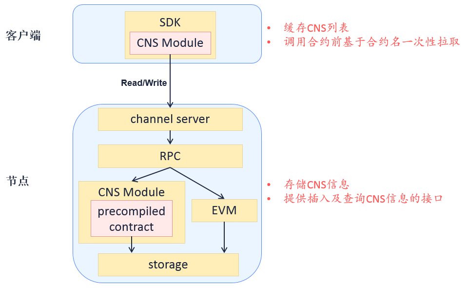
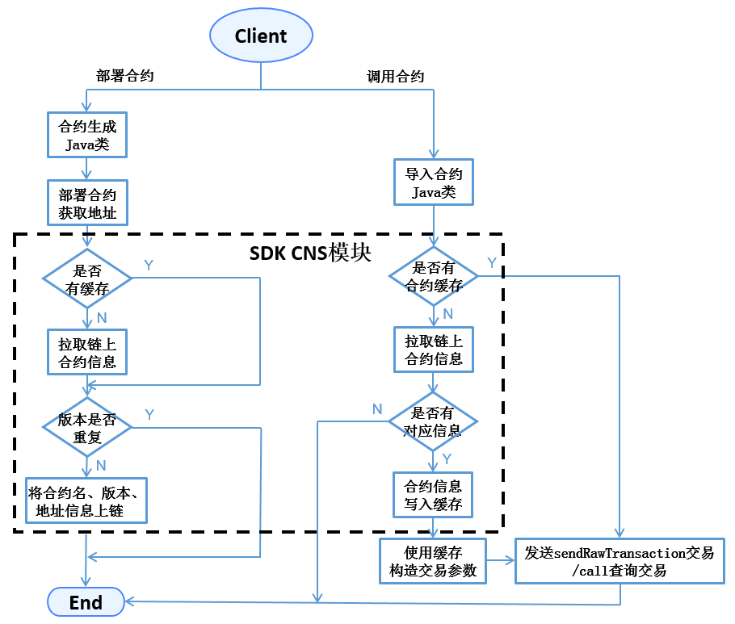

# CNS

## Introduction

The process to call smart contract in Ethereum includes:
1. program contract;
2. compile contract and get abi description of API;
3. deploy contract and get address;
4. encapsulate contract abi and address, and call contract by SDK or other tools.

From the process of calling contract, we know that contract abi and address are needed. This can lead to following problems:
1. contract abi is a long JSON string, no need to be sensed by caller;
2. contract address is a 20-byte magic number, difficult to remember, and contract cannot be accessed again if lost it;
3. one or more callers need to update contract address after re-deployment;
4. inconvenient for version management and grey release of contract.

To solve the problems and offer better experience for callers, FISCO BCOS has proposed **CNS**.

## Terms definition

- **CNS** (Contract Name Service) offers records of map relations between contract name and address and query function, so caller can call contract by easier contract name.
- **CNS information** includes contract name, version, address and abi.
- **CNS table** stores CNS information

## Advantages of CNS

- simplify the call of contract;
- support transparent update and grey release of contract.

## Comparison with ENS

ENS is Ethereum Name Service.

ENS has similar functions with DNS(Domain Name Service), though it doesn't offer Internet address. It expresses contract address and wallet address in the form of xxxxxx.eth web address for contract storage and payment transfer. Comparing it with CNS:

- ENS maps both contract address and wallet address, so does CNS; contract abi will be empty when it's wallet address.
- ENS has auction function, CNS does not.
- ENS supports multi-level domain name, CNS does not.

## Model structure



<center>CNS structure</center>

## Core process

The processes to deploy contract and call contract by SDK are:



<center>process to deploy contract and call contract by SDK</center>

- when deploying contract, SDK generates Java class of contract, call its deploy API to get address, and call insert API of CNS contract to write CNS information on chain.
- when calling contract, SDK imports Java class of contract and loads instantiation. Load API can input contract address (in Ethereum type) or contract name and composition of contract version (in CNS type). SDK handles CNS and gets address by calling CNS model.
- For contract lacking of version number, SDK is defaulted to call the latest version of contract.
- abi information of contract on chain belongs to optional fields.

## Data structure

### CNS table structure

CNS information is stored in system tables with independent ledgers. Definition of CNS table:

<table border="3">
<tr bgcolor="#CDCDCD">
  <td><center>Field</center></td>
  <td><center>Type</center></td>
  <td><center>Null</center></td>
  <td><center>Key</center></td>
  <td><center>Expain</center></td>
</tr>
<tr><td>name</td><td>string</td><td>No</td><td>PRI</td><td>contract name, name and version are joint primary key</td></tr>
<tr><td>version</td><td>string</td><td>No</td><td></td><td>contract version, name and version are joint primary key</td></tr>
<tr><td>address</td><td>string</td><td>No</td><td></td><td>contract address</td></tr>
<tr><td>abi</td><td>string</td><td>YES</td><td></td><td>contract abi</td></tr>
<tr><td>_status_</td><td>string</td><td>No</td><td></td><td>general fields in distributed storage, “0” means available, “1” means removed</td></tr>
</table>

### Contract API

```
pragma solidity ^0.4.2;
contract CNS
{
    function insert(string name, string version, string addr, string abi) public returns(uint256);
    function selectByName(string name) public constant returns(string);
    function selectByNameAndVersion(string name, string version) public constant returns(string);
}
```

- CNS contract is not exposed to users. It is the interaction API of SDK and CNS table.
- insert API can write CNS information to blockchain, containing 4 parameters: contract name, version, addr and abi information. SDK needs to verify if the composition of name and version has been already recorded in database. Only when it's not repeated can it be written on chain for transaction. When node executing transactions, precompiled logic will Double Check the data, discard the transaction if repeated. Insert API will only increase but not modify contents in CNS table.
- selectByName API's parameter is contract name, returns all version records of this contract.
- selectByNameAndVersion API's parameter are contract name and version, returns the unique address of this version of contract.

#### Update CNS table

**Precompiled contract** is an efficient smart contract implemented by C++ in FISCO BCOS structure for configuration and management of system information. The process of transaction execution of nodes in precompiled logic adopted by FISCO BCOS is:

CNS contract belongs to precompiled contract. Nodes insert and inquire CNS table through the built in C++ code logic, not through EVM. So CNS contract offers API description of function but not implementation. **CNS contract's precompiled address is presetted to 0x1004.**

#### Return of contract API

selectByName and selectByNameAndVersion API returns string in Json. Example:
```json
[
    {
        "name" : "Ok",
        "version" : "1.0",
        "address" : "0x420f853b49838bd3e9466c85a4cc3428c960dde2",
        "abi" : "[{\"constant\":false,\"inputs\":[{\"name\":\"num\",\"type\":\"uint256\"}],\"name\":\"trans\",\"outputs\":[],\"payable\":false,\"type\":\"function\"},{\"co
nstant\":true,\"inputs\":[],\"name\":\"get\",\"outputs\":[{\"name\":\"\",\"type\":\"uint256\"}],\"payable\":false,\"type\":\"function\"},{\"inputs\":[],\"payable\":false,\
"type\":\"constructor\"}]"
    },
    {
        "name" : "Ok",
        "version" : "2.0",
        "address" : "0x420f853b49838bd3e9466c85a4cc3428c960dde2",
        "abi" : "[{\"constant\":false,\"inputs\":[{\"name\":\"num\",\"type\":\"uint256\"}],\"name\":\"trans\",\"outputs\":[],\"payable\":false,\"type\":\"function\"},{\"co
nstant\":true,\"inputs\":[],\"name\":\"get\",\"outputs\":[{\"name\":\"\",\"type\":\"uint256\"}],\"payable\":false,\"type\":\"function\"},{\"inputs\":[],\"payable\":false,\
"type\":\"constructor\"}]"
    }
]
```

## SDK_API

SDK developer can realize registration and query of CNS through the following 2 APIs in `org.fisco.bcos.web3j.precompile.cns`.

### registerCns
- Description：public TransactionReceipt registerCns(String name, String version, String addr, String abi)
- Function：write contract information to chain
- Parameter：name——contract name, version——contract version, addr——contract address, abi——contract abi
- Return：transaction receipt, containing result and error information (if there is).

### resolve
- Description：public String resolve(String contractNameAndVersion)
- Function：inquire contract address based on contract name and version
- Parameter：contractNameAndVersion——contract name+contract version information
- Return：contract address, API throw exception if no contract information specified in parameters
- Illustration：contractNameAndVersion splits contract name and version through `:`, SDK is defaulted to call the latest version of contract for query when lacking of version information

Note：
1. Before calling API, sol contract needs to be transferred to Java class and placed it to the right folder together with abi, bin files. For detail operations please check [Java SDK](../../sdk/java_sdk.md);
2. The operation examples of the 2 API are introduced in the implementation of deployByCNS and callByCNS APIs in[ConsoleImpl.java](https://github.com/FISCO-BCOS/console/blob/master/src/main/java/console/contract/ContractImpl.java).

## Operation tool

Console offers functions to deploy, call contract and inquire on-chain contract based on name. For the detail operations please refer to [here](../../console/console_of_java_sdk.md) for the console user manual of version 2.6 and above, and [here](../../console/console.md) for the console user manual of version 1.x

Commands of console:

- deployByCNS：deploy contract through CNS
- callByCNS：call contract through CNS
- queryCNS：inquire CNS table information by contract name, version number (optional parameter)
