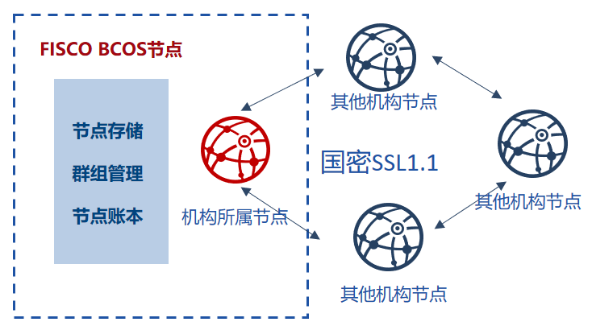

# OSCCA algorithm

## Design objective

Bases on [national cryptography standard] (http://www.gmbz.org.cn/main/bzlb.html), FISCO has realized the national encryption and decryption, signature, verification, Hash algorithm, national cryptography SSL communication protocol, and integrated into the FISCO BCOS platform, and to achieve full support for **commercial password identified by the National Cryptographic Bureau**.

**The national cryptography version of FISCO BCOS replaces the cryptographic algorithms of the underlying modules such as transaction signature verification, p2p network connection, node connection, and data disk encryption with the national cryptography algorithm**.

The different features between national cryptography version of FISCO BCOS and the standard version are as follows:

 | | standard FISCO BCOS | national cryptography FISCO BCOS |
 | :-: | :-: | :-: |
 | SSL connect | Openssl TLSv1.2 protocol | national cryptography TLSv1.1 protocol|
 | signature verification | ECDSA signature algorithm | SM2 signature algorithm |
 | Message digest algorithm | SHA-256 SHA-3 | SM3 message digest algorithm |
 | Disk encryption algorithm | AES-256 encryption algorithm | SM4 encryption algorithm |
 | Certificate mode | OpenSSL certificate mode | National cryptography double certificate mode |
 | Contract compiler | Ethereum solidity compiler | National cryptography solidity compiler |

(Note: National cryptography algorithms SM2, SM3, SM4 are developed based on [national cryptography standards] (http://www.gmbz.org.cn/main/bzlb.html))

## System framework

The overall framework of the system is shown below:

## National cryptography SSL 1.1 establish process

The authentication among the nodes of national cryptography FISCO BCOS selects the ECDHE_SM4_SM3 cipher suite of the national cryptography SSL 1.1 for the establishment of SSL connect. The differences are shown in the following table:

 | | OpenSSL | National cryptography SSL |
 | :-: | :-: | :-: |
 | Cipher suite | Adopts ECDH, RSA, SHA-256, AES256 and other cryptographic algorithms| Adopts national cryptography |
 | PRF algorithm | SHA-256 | SM3 |
 | Key exchange method | Transmits elliptic curve parameters and the signature of current message | Current message signature and encryption certificate |
 | Certificate mode | OpenSSL certificate mode | National cryptography double certificate modes, encryption certificate and signature certificate. |

## Data structure difference

The difference in data structure between the national cryptography version and the standard version of FISCO BCOS is as follows:

 | Algorithm type | Standard FISCO BCOS | National cryptography FISCO BCOS |
 | :-: | :-: | :-: |
 | signature | ECDSA (Public and private key length: 512 bits, 256 bits)| SM2 (Public and private key length: 512 bits, 256 bits) |
 | hash | SHA3 (Hash string length: 256 bits) | SM3 (Hash string length: 256 bits) |
 | Symmetric encryption and decryption | AES (Encryption key length: 256 bits) | SM4 (Symmetric key length: 128 bits) |
 | Transaction length | 520bits(identifier is 8bits, signature length is 512bits) | 1024bits(128 bytes, public key is 512bits, signature length is 512bits) |

