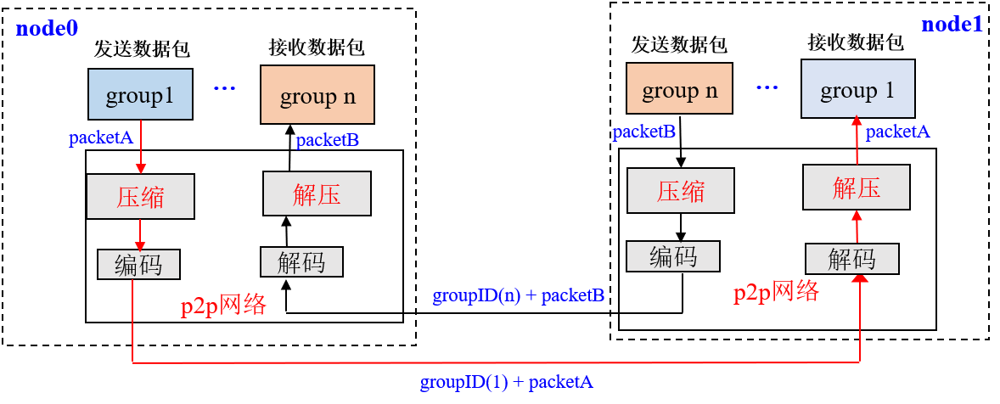
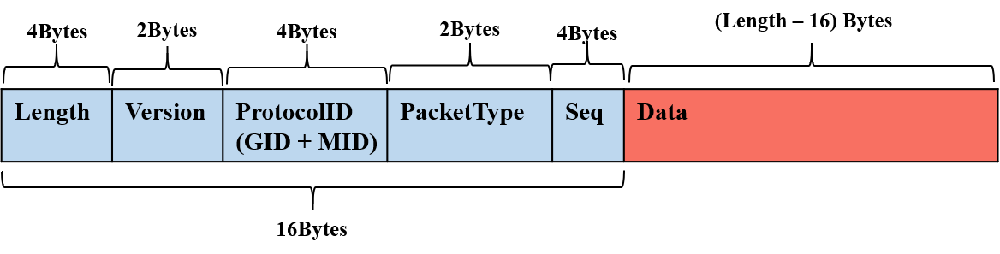

# Network compression

In external network environment, the performance of blockchain system is limited by the network bandwidth. For minimizing the impact of network bandwidth on system performance, FISCO BCOS supports network compression from version `relase-2.0.0-rc2`. This function mainly performs network packet compression on transmit(tx) data (TXD) and packet uncompression on receive(rx) data (RXD), and transmits the unpacked data to the upper module.

## System framework

Network compression is mainly implemented in P2P network underlying. The system framework is as follows:

Network compression mainly consists of two processes:

- **packet compression on transmit(tx) data**: When the group layer sending data through the P2P layer, if the data packet size exceeds 1 KB, then packet is sent to the target node after compression.

- **packet uncompression on receive(rx) data**: After receiving the data packet, the node first determines whether the received data packet is compressed. If the data packet is compressed, to decompress it and transmit to the specified group, otherwise to transmit the data transmitted to the corresponding group directly.

## Core implementation

Considering performance, compression efficiency, and etc., we selected [Snappy](https://github.com/google/snappy) to implement data packet compression and decompression. In this section, we mainly introduce the implementation of network compression.

### Data compression flag

FISCO BCOS's network packet structure is as follows:

The network data packet mainly includes two parts: header and data. The header contains 16 bytes. The meanings of the fields are as follows:

- Length: the length of data packet.
- Version: extension bit, for extending network module function. 
- ProtocolID: storing the group ID and module ID of Destination Network Address Translation (DNAT) for multi-group packet routing. Currently it supports up to 32767 groups. 
- PaketType: tagged data packet type.
- Seq: data packet serial number

**Network compression module only compresses network data but not data packet header. **

Considering that compressing and decompressing small data packets can not save data space and waste performance, in the data compression process, the undersize packets are not compressed, and only the data packets with size larger than `c_compressThreshold` are compressed. The default value of `c_compressThreshold` is 1024 (1KB). We have extended the highest bit of Version as a packet compression flag:

- When the highest value of Version is 0, indicating that the data which is corresponding to data packet is uncompressed.
- When the highest value of Version is 1, indicating that the data which is corresponding to data packet is compressed.

### Processing flow

In the following, we take a node in group1 sending network message packet groupA to other nodes(such as sending a transaction, a block, a consensus message packet, etc.) as an example to detail the key processing flow of network compression module.

**Transmit(tx) data processing flow:**

- Group1's group module passes packetA to P2P layer;
- When P2P determines that the packetA is greater than `c_compressThreshold`, then calls the compression interface to compress packetA, otherwise it directly passes packetA to the encoding module;
- The encoding module adds header to packetA with data compression information, ie: if packetA is compressed, the highest value of Version(header) is set to 1; otherwise, it is set to 0;
- P2P transmits the encoded data packet to the destination node.

**Receive(rx) data processing flow:**

- After the target machine receives the data packet, the decoding module separates the packet header, and determines whether the network data is compressed by the highest value of Version is 1 or not;

- If the network packet is compressed, the decompression interface is called to decompress part of data, and transmit the decompressed data to the specified module of group according to the GID and PID attached to the packet header; otherwise, the data packet is directly passed to the upper module.

## Compatibility note

- **Data Compatibility**: not involve the changes of stored data;
- **Network Compatibility rc1**: Forward compatible, only the relase-2.0.0-rc2 node has network compression.
