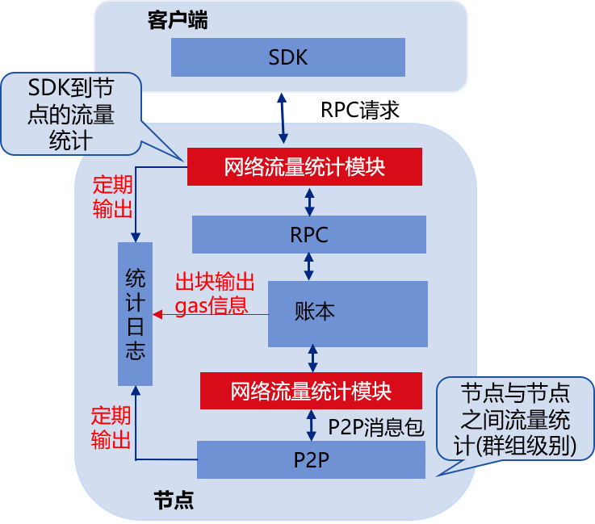

 # Network traffic and Gas statistics

ISCO BCOS 2.0 introduces a multi-group architecture that allows a node to start several groups. This architecture can be quickly expanded in parallel, simplifying operation and maintenance complexity, and reducing management costs, but because a node process runs multiple groups, Increasing the complexity of group monitoring. Considering that real-time monitoring of system resource usage is very important in actual production systems, FISCO BCOS v2.4.0 introduces statistical logs and implements group-level network traffic statistics and transaction-level Gas consumption statistics.

## Module architecture

The following figure is a block diagram of network traffic and Gas statistics. The FISCO BCOS node calculates the network and Gas consumption information in the group in real time and outputs it to the statistics log:



Network traffic statistics are regularly output to the statistics log. The current statistics of network traffic mainly include:

- SDK-to-node network traffic: statistics of RPC traffic, transaction push traffic, and event push traffic of each group

- P2P network traffic: Count the network traffic generated by P2P network interaction between modules due to synchronization and consensus among groups

- Total network traffic: the total network consumption of each group network, including the network traffic from the SDK to the node and the P2P network traffic


Gas statistic output is triggered by block order placement. Each block placed will output the corresponding Gas consumption information to the statistics log. The current statistics include:

- Gas consumption information for each block

- Gas consumption information for each transaction


## Detailed description of statistical logs

```eval_rst
.. note::
    - Statistics log level is info
    - The statistics log is divided every hour
```

### Network traffic statistics log

In order to facilitate developers to diagnose the system based on the network traffic statistics log, FISCO BCOS v2.4.0 makes a breakdown according to the relevant modules of the traffic when counting network traffic. Here is a detailed introduction to the format and keyword meaning of network traffic statistics logs.

```eval_rst
.. note::
    - The unit of network traffic output to the log is byte
    - The network statistics function only counts the total network consumption of a certain period of time. After the statistical information is output to the log, the counter will be cleared and the next round of statistics will be restarted.
```

#### Network traffic from SDK to node

The module keyword for network traffic statistics logging from SDK to node is `SDK`, which not only counts the total outgoing and incoming traffic between each group and SDK, but also subdivides the traffic generated by RPC requests and event push traffic and transaction push traffic. Examples of logs are as follows:

```bash
info|2020-04-24 12:58:41.173045|SDK|,g=1,SDK_RPCIn=10023,SDK_EventLogIn=500,SDK_totalIn=10523,SDK_RPC_Out=0,SDK_Txs_Out=0,SDK_EventLog_Out=0,SDK_total_Out=0
```
**Keyword description**

Log keywords | Explanation
-|-
g | Group ID
SDK_RPCIn | RPC request incoming traffic |
SDK_EventLogIn | Inbound traffic related to event push |
SDK_totalIn | The total inflow of the group |
SDK_RPC_Out | RPC requests outgoing traffic |
SDK_Txs_Out | Outgoing traffic generated by transaction push |
SDK_EventLog_Out | Outgoing traffic generated by event push |
SDK_total_Out |Total outgoing traffic of the group |

#### P2P network traffic

The module keyword for P2P traffic statistics logging among groups is `P2P`, which not only counts the total P2P outgoing and incoming traffic of each group, but also subdivides consensus traffic and synchronous traffic. The log example is as follows:

```bash
info|2020-04-24 12:58:41.173077|P2P|,g=2,P2P_CONSIn=80505,P2P_SYNCIn=19008,P2P_totalIn=99513,P2P_CONS_Out=211377,P2P_SYNC_Out=19008,P2P_total_Out=230385  
```

**Keyword description**

Log keywords | Explanation
-|-
g | Group ID
P2P_CONSIn | Incoming traffic due to consensus module scheduling |
P2P_SYNCIn | Incoming traffic due to synchronization module scheduling |
P2P_totalIn | Group's total P2P inbound traffic |
P2P_CONS_Out | Outgoing traffic due to consensus module scheduling |
P2P_SYNC_Out | Outgoing traffic due to synchronization module scheduling |
P2P_total_Out | Group's total P2P outgoing traffic |


#### Group total traffic

In order to facilitate business parties to understand the overall bandwidth consumption of the blockchain system, the network traffic statistics module also counts the total outgoing and incoming traffic of each group. The keyword of the module is `Total`. The log example is as follows:

```bash
info|2020-04-24 12:58:41.173052|Total|,g=1,Total_In=74524,Total_Out=115434 
```

**Keyword description**

Log keywords | Explanation
-|-
g | Group ID
Total_In | Group inbound traffic |
Total_Out | Total outgoing traffic of the group |


### Gas consumption statistics log

The Gas consumption of a transaction measures the physical resources consumed by the transaction. In order to facilitate business parties to monitor the consumption of transaction resources, FISCO BCOS v2.4.0 counts the Gas consumption of each block and each transaction.

#### Gas consumption information for each block

The keyword of the statistical logging module for block Gas consumption is `BlockGasUsed`, and the statistical information includes: block height, group to which the block belongs, the number of transactions within the block, and gas consumption of the block.

```bash
info|2020-04-24 12:46:31.974147|BlockGasUsed|,g=2,txNum=193,gasUsed=3860579,blockNumber=1419,sealerIdx=2,blockHash=b10bdcc5da9c9cd5399ca5821bed9ae6f3fecbe1ddf8ec723b44e6fa30c4bd05,nodeID=0e23d6e237cfc5041d1754fa6682d71bef842b29ddfe3412b284aeac4b8b4794a51df409b667829750c2b4e91bdf95f51742e001e44dc9f97123a5002e49b8ca
```

**Keyword description**

Log keywords | Explanation
-|-
g | Group ID
txNum | Number of transactions within the block |
gasUsed | The total gas consumption of all transactions in the block |
blockNumber | Block height |
sealerIdx | Generate the consensus node index of the block |
blockHash | Block hash |
nodeID | Node ID|

#### Gas consumption information for each transaction

The keyword of the statistic logging module for the Gas consumption of each transaction is `TxsGasUsed`, which mainly counts the Gas consumption of each transaction. The log example is as follows:

```bash
info|2020-04-24 12:46:31.976080|TxsGasUsed|,g=2,txHash=a81ae1f60289cf7e8f6987b20c68ba9580a1c34d9252c5b4b9c097113309b9d7,gasUsed=20003
```

**Keyword description**

Log keywords | Explanation
-|-
g | Group ID
txHash | Transaction hash |
gasUsed | Gas consumed by transaction |


## Configuration options

```eval_rst
.. note::
    Statistics log configuration options are located in ``config.ini``, for details, please refer to  `here <../../manual/configuration.html#statistics-log-configuration-items>`_ 
```


