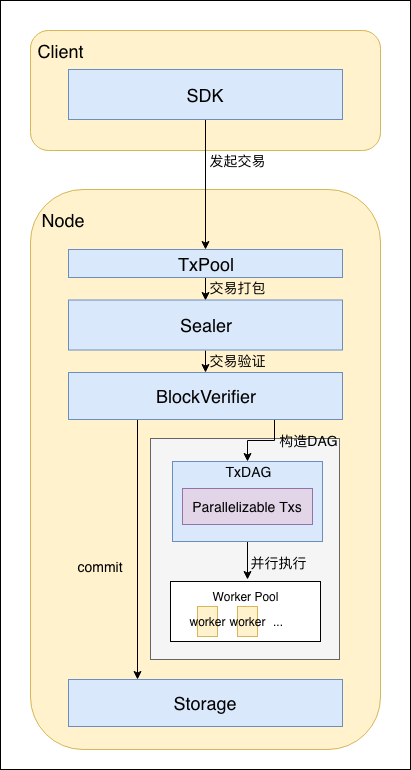
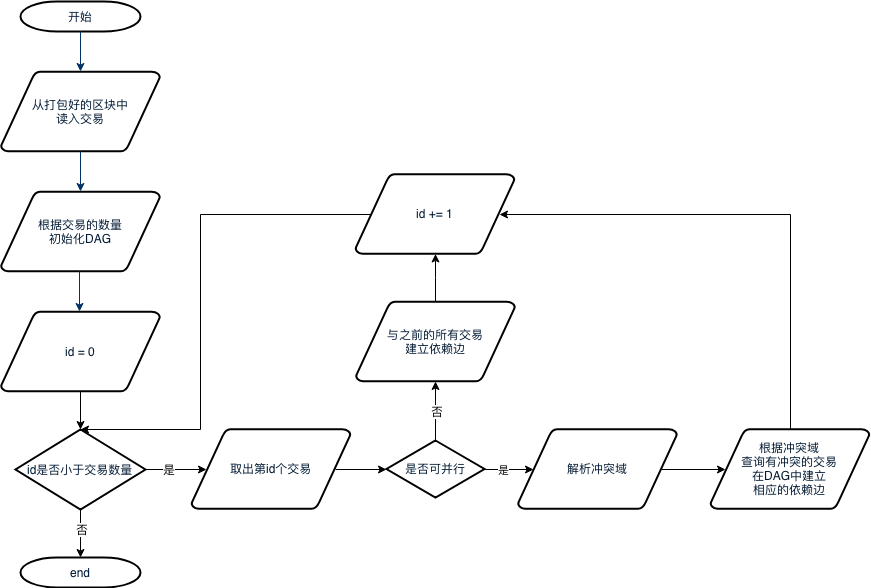

# Transaction parallel

## 1 Terms definition

### 1.1 DAG

An acyclic directed graph is called **D**irected **A**cyclic **G**raph, or DAG. In a batch of transactions, it can recognize the mutually exclusive resource to be occupied in each transaction, and make a transaction dependency DAG according to the sequence of transaction in block and the occupation relationship of mutually exclusive resource. As the picture shows below, transaction with 0 in-degree (no dependent pre-order task) can be executed in parallel. By topological sort based on the sequence of the initial transaction list in the left graphic, you can get transaction DAG in the right graphic.

## 2 Model structure

Main process includes:

- user directly and indirectly initiates transaction through SDK, transaction can be either executed in parallel or not;
- transaction enters txPool and waits to be sealed;
- transaction gets sealed to block by Sealer and sent to BlockVerifier for verification after consensus;
- BlockVerifier generates transaction DAG according to the transaction list in block;
- BlockVerifier builds the execution context and executes transaction DAG;
- block is on chain after verified.

## 3 Crucial process

### 3.1 Building of transaction DAG

#### 3.1.1 DAG data structure

The DAG data structure in the solution is:

Note:
- Vertex
	- inDegree stores the current in-degree of Vertex;
    - outEdge stores outedge information of the Vertex, containing ID list of all out-edge connected Vertexs.
- DAG：
	- vtxs stores the list of all nodes in DAG;
    - topLevel is a concurrent queue storing node ID with 0 in-degree, supports concurrent access of multiple threads;
    - totalVtxs：total vertexs
    - totalConsume：total executed vertexs;
    - void init(uint32_t \_maxSize)：initialize the maximum vertex to get maxSize DAG;
    - void addEdge(ID from, ID to)：set a directed edge between vertex from and to;
    - void generate()：build a DAG structure by the existed edges and vertexs;
    - ID waitPop(bool needWait)：wait to extract a 0 in-degree node from topLevel;
    - void clear()：clear all nodes and edges information in DAG.
- TxDAG:
	- dag：DAG examples
    - exeCnt：executed transactions count;
    - totalParaTxs：total parallel transactions;
    - txs：parallel transactions list;
    - bool hasFinished()：return true if the DAG is executed, return false if not;
    - void executeUnit()：take out a transaction without upper level dependency and execute;

#### 3.1.2 Transaction DAG building process

Process:

1. take out all transaction from sealed blocks；
2. initialize a DAG example with transactions amount as the maximum vertex amount;
3. read all transactions in sequence. If a transaction can be executed in parallel, analyze the collision domain and check if it collides to former transactions, if does, build dependent edge between transactions; if a transaction cannot be executed in parallel, it should be executed after all pre-order transactions are executed, and so there will be a dependent edge between it and the pre-order transactions.

### 3.2 DAG execution process

Process:

1. Main thread will initialize a same size thread group according to hardware coreness. If it fails to get hardware coreness, then other threads will not be created;
2. When DAG is still in execution, thread waits in loop to pop out 0 out-in degree transaction。 If it works, the transaction will be executed and the in-degree of its later dependent task minus 1. If transaction in-degree is minus to 0, it will be added to topLevel; if fails, then it means that DAG has finished execution and thread has been logged out.
