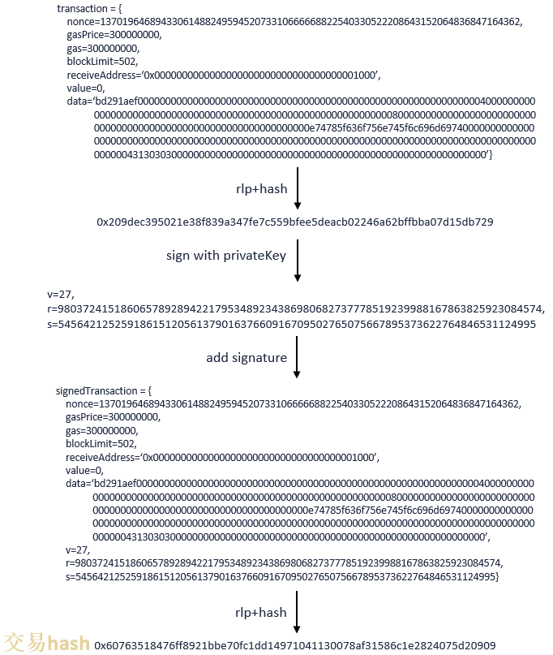

# Protocol description

## Transaction structure and its RLP coding description

The transaction structure of FISCO BCOS has been increased or decreased some fields based on the transaction structure of the original Ethereum. The transaction structure fields of FISCO BCOS 2.0+ are as follows:

| name           | type            | description                                                  | RLP index | RLP index RC2 |
| :------------- | :-------------- | :----------------------------------------------------------- | --------- | ------------- |
| type           | enum            | Transaction type, represents whether the transaction is a contract creatio -             |n or a contract transaction, initially an empty contract. | -         |
| nonce          | u256            | A random number provided by the message sender, to uniquely identify the t 0             |ransaction. | 0         |
| value          | u256            | The amount of the transfer. FISCO BCOS does not use this field.| 5         5             | |
| receiveAddress | h160            | The receiver address. type is 0x0 when the contract is created.| 4         4             | |
| gasPrice       | u256            | The unit price of gas in this transaction. In FISCO BCOS, it is fixed as 3 1             |00000000.| 1         |
| gas            | u256            | This transaction allows the maximum amount of gas consumed. In FISCO BCOS, 2             | this value can be configured. | 2         |
| data           | vector< byte >  | It is the data related to the transaction, or the initialization parameter 6             | when creating the contract.| 6         |
| chainId        | u256            | It records chain/transactional information of the transaction              7             |               | -             | 7             |
| groupId        | u256            | It records the group of the transaction                                    8             |    | -             | 8             |
| extraData      | vector< byte >  | Reserved field, recording transaction information, using “#” internally to             | separate information                | -             | 9             |
| vrs            | SignatureStruct | Data that generated after transaction sender signs the hash on 7 field RLP 10,11,12      | code of the transaction        | 7,8,9         | 10,11,12      |
| hashWith       | h256            | The hash of all fields (containing signature) after RPL code             | -             | -             | -             |
| sender         | h160            | Transaction sender's address based on vrs                                  -             || -             | -             |
| blockLimit     | u256            | Transaction life cycle, the last processed block number of this transactio 3             |n, FISCO BCOS new field     | 3             | 3             |
| importTime     | u256            | Unix timestamp when transaction enters txPool, FISCO BCOS new field        -             |        | -             | -             |
| rpcCallback    | function        | RPC callback after block generation, FISCO BCOS new field                  -             |       | -             | -             |

The generation process of the hashWith field (also called transaction hash/transaction unique identifier) in RC1 is as follows:

It is similar with RC2 generation process, only that the transaction struct of `rlp+hash` in the first step is added with chainId, groupId, extraData the three fields.

## Block structure and its RLP coding description

The block of FISCO BCOS consists of the following five parts:

**rc1:**

| name                | description                                      | RLP index |
| :------------------ | :----------------------------------------------- | --------- |
| blockHeader         | Block header RLP coding                                  | 0         |
| transactions        | Transaction list RLP code                                 | 1         |
| transactionReceipts | Transaction receipt list RLP code                             | 2         |
| hash                | The hash encoded by block header RLP encoded                         | 3         |
| sigList             | The node signature list that is collected during PBFT consensus. Raft does not use this. | 4         |

**rc2, rc3, 2.0 and newer**

| name                | description                                                  | RLP index |
| :------------------ | :----------------------------------------------------------- | --------- |
| blockHeader         | Block header RLP coding                                      | 0         |
| transactions        | Transaction list RLP code                                    | 1         |
| hash                | The hash encoded by block header RLP encoded                 | 2         |
| sigList             | The node signature list that is collected during PBFT consensus. Raft does not use this. | 3         |
| transactionReceipts | Transaction receipt list RLP code                            | 4         |

The description of each field in the block header of FISCO BCOS is as follows:

| name             | type          | description                                                          | RLP index |
| :--------------- | :------------ | :------------------------------------------------------------------- | --------- |
| parentHash       | h256          | parent blocks hash                                                       | 0         |
| stateRoot        | h256          | The root hash of the state tree                                          | 1         |
| transactionsRoot | h256          | The root hash of the transaction tree                                    | 2         |
| receiptsRoot     | h256          | The root hash of the receipt tree                                        | 3         |
| dbHash           | h256          | Distributed storage records the data written in a block by calculating the hash. A new field in FISCO BCOS. | 4         |
| logBloom         | LogBloom      | The Bloom filter consisting of transaction receipt logs. It is not used in FISCO BCOS currently.               | 5         |
| number           | int64_t       | The block number, counts from 0.                                     | 6         |
| gasLimit         | u256          | The upper limit of Gas consumed by all transactions in this block.  | 7         |
| gasUsed          | u256          | The sum of the Gas used in all transactions in this block.     | 8         |
| timestamp        | int64_t       | The unix timestamp of the packed block.                                | 9         |
| extraData        | vector<bytes> | Additional data for the block. Currently, it is only used to record group genesis file information in block 0 in FISCO BCOS | 10        |
| sealer           | u256          | The index of the node of packed block in the sealer list. A new field in FISCO BCOS.             | 11        |
| sealerList       | vector<h512>  | The list of sealer nodes (without observing nodes). A new field in FISCO BCOS. | 12        |
| hash             | h256          | The hash of the first 13 fields of the block header after RLP encoding. A new field in FISCO BCOS.               | -         |

## Transaction Receipt

| name            | type          | description                    | RLP index |
| :---------------| :------------ | :------------------------------| --------- |
| stateRoot       | h256          | state root of block              | 0         |
| gasUsed         | u256          | gas used of transaction          | 1         |
| contractAddress | Address       | the address of deployed contract | 2         |
| bloom           | h2048         | bloom filter                     | 3         |
| status          | h256          | status code of transaction       | 4         |
| output          | LogBloom      | transaction return value         | 5         |
| logs            | LogEntry[]    | event logs                       | 6        |

## Network transmission protocol

FISCO BCOS currently has two types of data packet formats. The data packets communicated among nodes are in the P2PMessage format, and the data packets communicated between nodes and SDK are in the ChannelMessage format.

### P2PMessage: v2.0.0-rc2

V2.0.0-rc2 has expanded the range of **group ID and model ID**, **supporting 32767 groups at most**. It has also increased **Version** field for other features (like network compression) with package header being 16 bytes. The network data package structure of v2.0.0-rc2 is as below:

| name       | type         | description                          |
| :--------- | :----------- | :----------------------------------- |
| Length     | uint32_t     | length of data package, containing header and data             |
| Version    | uint16_t     | it records version and features information of data package, currently the highest 0x8000 is to record if the data package is compressed or not|
| groupID (GID)    | int16_t  | group ID, ranging from 1-32767   |
| ModuleID (MID)   | uint16_t | model ID, ranging from 1-65535   |
| PacketType | uint16_t     | data packet type, sub-protocol identification with same mode ID  |
| Seq        | uint32_t     | data packet serial number, each increment itself         |
| Data       | vector<byte> | data itself, length length-12           |

For definitions of P2PMessage before v2.0.0-rc2, please [refer here.](https://fisco-bcos-documentation.readthedocs.io/zh_CN/v2.0.0-rc3/docs/design/protocol_description.html#p2pmessage-v2-0-rc1)

**Additional**

1. P2PMessage does not limit the packet size, and the packet size management is performed by the upper layer calling module (consensus/synchronization/AMOP, etc.);
2. The group ID and module ID can uniquely identify the protocol ID, and the relationship among them is `protocolID = (groupID << sizeof(groupID)*8) | ModuleID`;
3. The data packet distinguishes between request packet and response packet by the 16-bit binary value where the protocolID is located.  The data greater than 0 is the request packet, and less than 0 is the corresponding packet.
4. The packetType currently used by AMOP include `SendTopicSeq = 1，RequestTopics = 2，SendTopics = 3`.

### ChannelMessage v2

[ChannelMessage v1 Please refer here](https://fisco-bcos-documentation.readthedocs.io/zh_CN/v2.0.0/docs/design/protocol_description.html#channelmessage-v1)

| name   | type         |length(4Byte)| description                          |
| :----- | :----------- |:----| :------------------------------------------- |
| length| uint32_t      |4| Data packet length, including header and data|
| type   | uint16_t     |2| Data packet type                                 |
| seq    | string       |32| Data packet serial number, 32 bytes|
| result | int          |4| Process result                                   |
| data   | bytes |length-42| Data                                     |

#### AMOP Message Packet

AMOP message packages inherit the ChannelMessage package organization and add custom content to the data field. Includes `0x30, 0x31, 0x35, 0x1001.`

|| Length Byte | Description|
|:-- |:-- |:----|
| Length of length | 1 | Topic|
| topic | length | topic name|

#### Message Packet Type

Enumeration values of packet types and their corresponding meanings are as follows:

| Type | Inclusion | Description | Interpretation|
|:------ |:--------|:--------|:--------|
| 0x12 | JSONRPC 2.0 format | RPC interface message package | SDK -> node|
| 0x13 | JSON format heartbeat package `{"heartbeat":"0"}`|heartbeat package | 0: SDK -> node, 1: node -> SDK|
| 0x14 | SDK -> node's package `{"minimumSupport":version,"maximumSupport":version,"clientType":"client type"}`, node -> SDK's package `{"protocol":version,"nodeVersion":"fisco-bcos version"` | JSON format, protocol version negotiation, handshake package | Node <-> Node|
| 0x30 | AMOP message package package package package | AMOP request package | SDK<-> node, bidirectional|
| 0x31 | Package of failed AMOP message | AMOP Failure Response Package | Node -> SDK or Node -> Node|
| 0x32 | JSON array to store Topics | report Topic information | SDK -> nodes monitored by SDK|
| 0x35 | AMOP Message Packet Package | AMOP Multicast Message | Node -> Node|
| 0x1000 | JSON Format Transaction Notification | Transaction Callback | Node -> SDK|
| 0x1001  |JSON format,`{"groupID":"groupID","blockNumber":"blockNumber"}`| Block on-chain notify | 节点->SDK |
| Block Notification in 0x1001 | JSON format `{groupID":"GroupID","blockNumber":"BlockNumber"}`Block Height Notification'| Node -> SDK|

#### Error code

| code | message    |
| :--- | :--------- |
| 0    | successful      |
| 100  | node unreachable |
| 101  | SDK unreachable |
| 102  | time out       |

