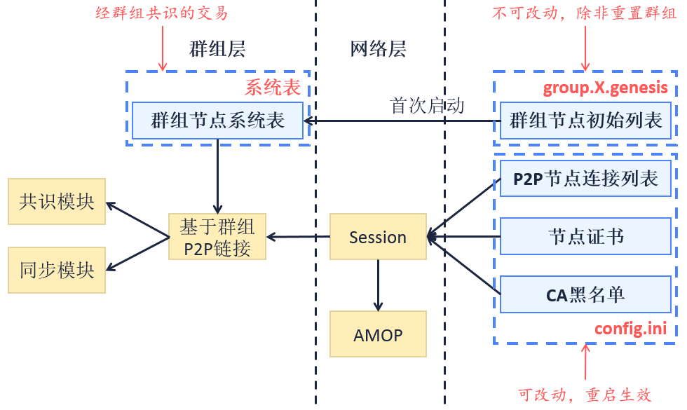

# CA blacklist and whitelist

This section contains the brief introduction of blacklist and whitelist, for the implementation please check [CA blacklist and whitelist operation tutorial](../../manual/certificate_list.md). 

## Terms definition

**CA blacklist** 

* CA blacklist is also known as **Certificate Blacklist**, or CBL. CA blacklist verifies and denies connection requests from each node based on node ID in `[certificate_blacklist]` of `config.ini` configuration file.

**CA whitelist**

* CA whitelist is also known as **Certificate Whitelist**, or CAL. CA whitelist verifies and denies connection requests from each node which is not belong to `[certificate_whitelist]` of `config.ini` configuration file.

**Config types of CA blacklist and whitelist**

- according to **effective area** (network config/ledger config), it belongs to **network config** and affects the node connection in the overall network;
- according to **modifiability** (modifiable config/fixed config), it belongs to **modifiable config**, modification valid after restart;
- according to **storage location** (local storage/store on chain), it belongs to **local storage**, content recorded in local instead of on chain.

## Model structure

The below diagram shows the model and relations of CA blacklist. A->B informs that model B depends on the data of model A, and it is later in initialization than model A. The framework of whitelist is the same.



<center>Model structure</center>
## Core process

SSL two-way certificate is implemented in the bottom level of FISCO BCOS. During handshake, nodes acquire each other's NodeID from its certificate and verify if it is among the CA blacklist and whitelist. If it is rejected by the strategy of blacklist and whitelist, close the connect and resume the later process.

**Reject strategy**

* Blacklist: Reject all connections which NodeID belong to blacklist.
* Whitelist: Reject all connections which NodeID is not belong to whitelist. If whitelist is empty, accept all connections.

**Priority of blacklist and whitelist**

The priority of blacklist is higher than whitelist. For example, the whitelist is A, B, C and blacklist is A. The connection coming from A will be rejected.

## Effective area

- CA blacklist and whitelist has evident influence in P2P node connection in network level and AMOP function by **invalidation**;
- CA blacklist has potential influence in consensus and syncing in ledger level by **interfering message/data transfer**.

## Config format

**CA blacklist**

`config.ini` node config adds `[certificate_blacklist]` route (`[certificate_blacklist]` is optional). CA blacklist contains node ID list. node.X indicates node ID of rejected nodes. Config format of CA blacklist is as below:

```ini
[certificate_blacklist]
    crl.0=4d9752efbb1de1253d1d463a934d34230398e787b3112805728525ed5b9d2ba29e4ad92c6fcde5156ede8baa5aca372a209f94dc8f283c8a4fa63e3787c338a4
    crl.1=af57c506be9ae60df8a4a16823fa948a68550a9b6a5624df44afcd3f75ce3afc6bb1416bcb7018e1a22c5ecbd016a80ffa57b4a73adc1aeaff4508666c9b633a
```

**CA whitelist**

Same as blacklist. Add `cal.x=` below `[certificate_whitelist]`.

``` ini
[certificate_whitelist]
    cal.0=4d9752efbb1de1253d1d463a934d34230398e787b3112805728525ed5b9d2ba29e4ad92c6fcde5156ede8baa5aca372a209f94dc8f283c8a4fa63e3787c338a4
    cal.1=af57c506be9ae60df8a4a16823fa948a68550a9b6a5624df44afcd3f75ce3afc6bb1416bcb7018e1a22c5ecbd016a80ffa57b4a73adc1aeaff4508666c9b633a
```