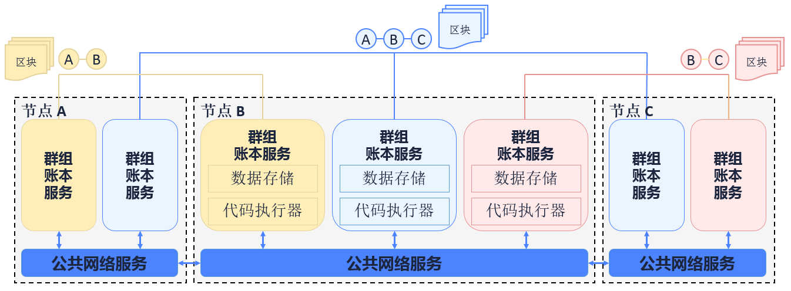
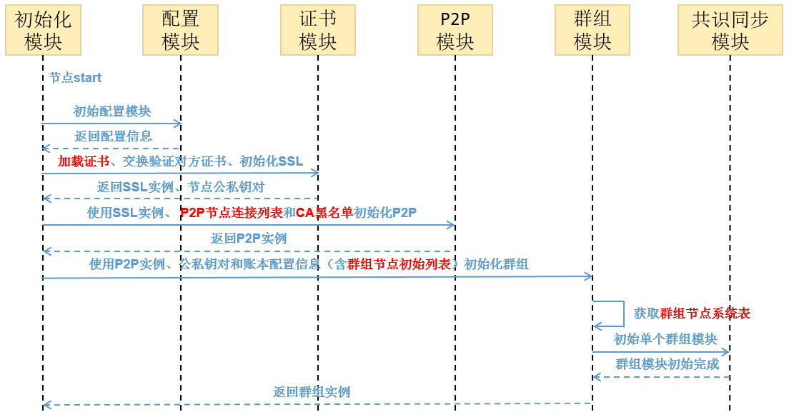
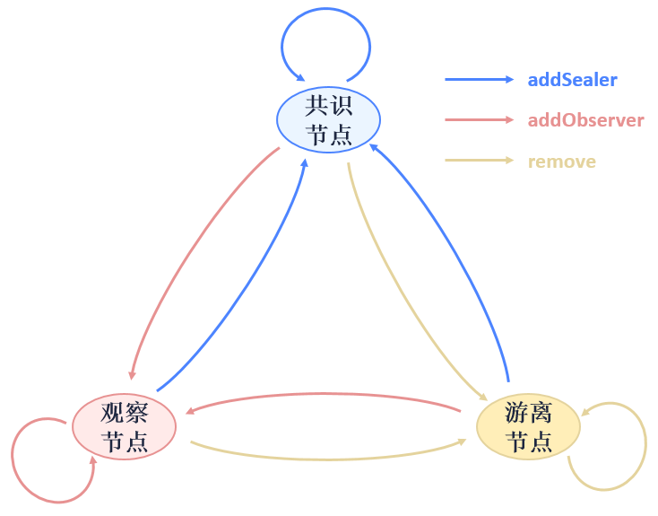

# Node access management

This chapter will give a brief introduction on node access management. For implementation methods please read [Node access management](../../manual/node_management.md)。

## Introduction

### Single-chain multi-ledger

Blockchain is a technology with decentralized and transparent distributed data storage which has lower cost in trust and highly reliability of data interaction. But meanwhile, the transaction data of blockchain faces threat of leakage:

- for public chain, any nodes can join some network and acquire all data from global ledger;
- for consortium chain, through there is network access mechanism, nodes can still acquire data from global ledger once joined blockchain.

FISCO BCOS, as a consortium chain, has proposed Single-chain multi-ledger solution to solve the privacy issue. It has also adopted **Group** concept, transferring the traditional storage/execution mechanism from one-chain one-ledger to one chain and multi-ledger and realizing independency and secrecy of data on a chain based on groups.


<center>multi-ledger</center>

As the above diagram shows, node A, B, C join the blue group and co-maintain the blue ledger; node B, C join the pink group and co-maintain the pink ledger; node A, B join the yellow group and co-maintain the yellow ledger. The three groups share the public internet service but have independent ledger storage and transaction executive environment each. Client end sends transaction to a group it belongs, in which transaction and data will be consensus and stored by members, while other group can not sense or access to the transaction.

### Node access mechanism

Based on groups, node access management can be divided into **Network access mechanism** and **Group access mechanism**. Rules of the mechanism are recorded in the configuration, which will be read by node once it is started to implement access control of network and group.

## Terms definition

### Node type

Nodes mentioned in this document are all permitted with network access for P2P communication. **The process of network access involves adding P2P node connection list and certificate verification.**

- **Group node**：nodes with network permission that joined a group. Group node is either consensus node or observer node. Consensus node takes part in consensus block generation and transaction/block syncing; observer node only involves block syncing. **The process of node access involves the sending of transactions to dynamically create/remove node.**

- **Free node**：nodes with network permission but not join any group. **Free node doesn't get group permission nor join consensus and syncing process.**

The relations of node:


<center>node relations</center>

### Config type

<table border="3">
<tr bgcolor="#CDCDCD">
  <td>division of dimension</td>
  <td>config type</td>
  <td><center>description</center></td>
</tr>
<tr>
  <td rowspan="2">affected scope</td>
  <td>network config</td><td>global config; node config affects all network; nodes share the same config within the network <br><B> Config file named config.*</B></td>
</tr>
<tr>
  <td>group config</td><td>node configuration affects the group it belongs to; each group has a config <br><B>Config file named group.X.*, X being group number</B></td>
</tr>
<tr>
  <td rowspan="2">configure modifiable or not</td><td>fixed config modifiable or not</td><td>stick to the initial config, modification will be invalid, <br><B>suffix named .genesis</B></td>
</tr>
<tr>
  <td>config modifiable</td><td>config modifiable, valid when restarting node, <br><B>suffix named .ini</B></td>
<tr>
  <td rowspan="2">store location</td><td>local storage</td><td>config stored in local file for user to modify directly,<br><B>by modifying the file user can restart valid config items</B></td>
</tr>
<tr>
  <td>store on chain</td><td>config stored on blockchain, the modification of which need to be consensus by group. currently there is no content needing global consensus,<br><B>need to reset chan or modify valid config items through transactions</B></td>
</tr>
</table>

### Node access config items

The config items involving in node access management are: **P2P node connection list**, **node certificate**, **CA blacklist**, **group node intial list** and **group node system list**.

<table border="3">
<tr bgcolor="#CDCDCD">
  <td><center>config items</center></td>
  <td><center>effects</center></td>
  <td><center>effect area</center></td>
  <td><center>modifiable or not</center></td>
  <td><center>store location</center></td>
</tr>
<tr>
  <td>P2P node connection list</td><td>record nodes that this node wants to connect with</td><td>network config</td><td>config modifiable</td><td>local storage</td>
</tr>
<tr>
  <td>node certificate</td><td>prove itself as a node permitted by a trusted third-party</td><td>network config</td><td>config modifiable</td><td>local storage</td>
</tr>
<tr>
  <td>CA blacklist</td><td>record the nodes that this node forbids to connect with</td><td>network config</td><td>config modifiable</td><td>local storage</td>
</tr>
<tr>
  <td>group node initial list</td><td>record nodes joining consensus/syncing in genesis block</td><td>group config</td><td>fixed config</td><td>local storage</td>
</tr>
<tr>
  <td>group node system list</td><td>record list of nodes joining group consensus/syncing</td><td>group config</td><td>config modifiable</td><td>store on chain</td>
</tr>
</table>

## Model structure


<center>model structure</center>

In **the diagram of relation between config items and system model** above, A->B means that B model depends on data of A model, and B model's initialized later than model A.

## Core process

### Regular initialize process


<center>regular initialize process</center>

### The first initialization

When a node is started at the first time, groups it belongs to write the fixed config to block 0 and commit to blockchain. The detail logic of initialization is:


<center>The first initialization</center>

Config contents concerning node access management and needing to be written in this phase include:**group node initial list->group node system list**.

Description:

- The block 0 of each node in one ledger should be the same, that is **the fixed config file** should be the same;
- The following starts of nodes should contain checking if block 0 information is the same with the fixed config file. If the config file has been modified, node will send warning message in its next start but won't interfere with other groups' operation.

### Node networking based on CA blacklist

**SSL certificate to confirm nodes access to blockchain**. Nodes on one chain all trust a trustable third party (issuer of node certificate).

FISCO BCOS requires implementation of **SSL two-way certificate**. During handshake, nodes acquire each other's node ID from the certificates and verify if it is in CA blacklist. If is, close the connect; if not, create session.

CA blacklist mechanism also supports **SSL one-way certificate**, which is used in this case: when node has created session, it can acquire the counter node's ID from session to verify if it's in the CA blacklist. If is, shut down the session.

### Node types and transfer

The three types of nodes (consensus node/observer node/free node) can transfer through APIs like this:


<center>consensus node types and related transfer operations</center>

## API and Config

### Hierarchy of node config file


<center>Hierarchy of config file</center>

The organization rules of config file are: **independent config among groups**;**fixed config and modifiable config are independent**. The files involved include: **network modifiable config file** `config.ini`, **group fixed config file** `group.N.genesis` and **group modifiable config file** `group.N.ini`, among which `N` is the group number of node. For **network/group modifiable config file**, if the value of config item is not shown in the file, the program will use the default value.

### Config file example

For **network modifiable config file **`config.ini`, node access management involves **P2P node connection list `[p2p]`**, **node certificate `[secure]`**, **CA blacklist `[certificate_blacklist]`**. `[certificate_blacklist]` is optional. Example of config items:
```
[p2p]
    ;p2p listen ip
    listen_ip=0.0.0.0
    ;p2p listen port
    listen_port=30300
    ;nodes to connect
    node.0=127.0.0.1:30300
    node.1=127.0.0.1:30301
    node.2=127.0.0.1:30302
    node.3=127.0.0.1:30303

;certificate blacklist
[crl]
    ;crl.0 should be nodeid, nodeid's length is 128
    ;crl.0=

;certificate configuration
[secure]
    ;directory the certificates located in
    data_path=conf/
    ;the node private key file
    key=node.key
    ;the node certificate file
    cert=node.crt
    ;the ca certificate file
    ca_cert=ca.crt
```
For **group fixed config file**`group.N.genesis`, node access management involves **group node initial list [consensus]**. Example of config items:
```
;consensus configuration
[consensus]
    ;consensus algorithm type, now support PBFT(consensus_type=pbft) and Raft(consensus_type=raft)
    consensus_type=pbft
    ;the max number of transactions of a block
    max_trans_num=1000
    ;the node id of leaders
    node.0=79d3d4d78a747b1b9e59a3eb248281ee286d49614e3ca5b2ce3697be2da72cfa82dcd314c0f04e1f590da8db0b97de466bd08e27eaa13f85df9b60e54d6a1ec8
    node.1=da527a4b2aeae1d354102c6c3ffdfb54922a092cc9acbdd555858ef89032d7be1be499b6cf9a703e546462529ed9ea26f5dd847110ff3887137541bc651f1c32
    node.2=160ba08898e1e25b31e24c2c4e3c75eed996ec56bda96043aa8f27723889ab774b60e969d9bd25d70ea8bb8779b7070521d9bd775dc7636f4b2b800d2fc8c7dd
    node.3=a968f1e148e4b51926c5354e424acf932d61f67419cf7c5c00c7cb926057c323bee839d27fe9ad6c75386df52ae2b30b2e7ba152b0023979d25dee25b20c627f
```

### Group node system list definition

<table border="3">
<tr bgcolor="#CDCDCD">
  <td><center>Field</center></td>
  <td><center>Type</center></td>
  <td><center>Null</center></td>
  <td><center>Key</center></td>
  <td><center>Expain</center></td>
</tr>
<tr><td>name</td><td>string</td><td>No</td><td>PRI</td><td>entries share the same value, query of table based on the key in distributed storage</td></tr>
<tr><td>type</td><td>string</td><td>No</td><td></td><td>node type（sealer/observer）</td></tr>
<tr><td>node_id</td><td>string</td><td>No</td><td></td><td>node ID</td></tr>
<tr><td>enable_num</td><td>string</td><td>No</td><td></td><td>valid block number of the node type</td></tr>
<tr><td>_status_</td><td>string</td><td>No</td><td></td><td>general fields of distributed storage, “0” available “1” delete</td></tr>
</table>

### Group system API definition

**Group system list implements whitelist mechanism in group level (comparing to the implementation of CA blacklist)**. APIs offered by group system list include:

```sol
contract ConsensusSystemTable
{
    // modify one node to be sealer
    function addSealer(string nodeID) public returns(int256);
    // modify one node to be observer
    function addObserver(string nodeID) public returns(int256);
    // remove the node from group system list
    function remove(string nodeID) public returns(int256);
}
```

## Expectation on functions

- **Modifiable config** is valid by restart after modification. In the future, dynamic loading and real-time validation can be realized;
- **CA blacklist** has realized the node-based blacklist. In the future, we will consider about blacklist based on agency.
