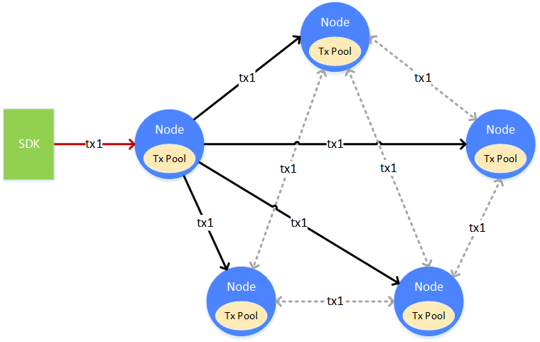
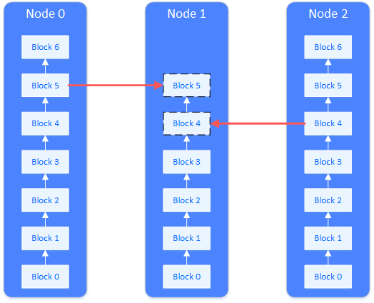

# Syncing

Syncing is a fundamental function of blockchain nodes. It provides necessary conditions for [consensus](../consensus/). Syncing can be divided into transaction syncing and status syncing. Transaction syncing ensures each transaction reaches nodes correctly. Status syncing ensures that nodes of lagging blocks can catch up with the newest status. Only nodes with the newest status can join in the consensus mechanism.

## Transaction syncing

Transaction syncing makes is possible for transactions to reach every node, laying the foundation for sealing transaction into blocks during consensus process.

Transaction 1 (tx1) start from client end to a node, the node receives and places it into its Tx Pool for consensus process. At the same time, node will broadcast it to other nodes who will place it into their own TxPool either. For there might be miss of transaction during sending, to ensure the arrival, nodes who received transactions can further broadcast to other nodes with certain strategy.

**Transaction broadcast strategy**

If there is no limit for nodes to transfer and broadcast transactions, the bandwidth will be overloaded, causing avalanche of transaction broadcasting. To prevent from this, FISCO BCOS adapts a delicate transaction broadcast strategy, which can reduce reiteration on the premise of transaction reachability.

* Transactions from SDK will be broadcasted to all nodes.
* Transactions broadcasted by other nodes will be re-broadcasted to nodes selected randomly in a proportion of 25%.
* One transaction on one node will be broadcasted only once. When received an existing transaction, there will not be a second broadcast.

Though the above strategy can ensure reachability of most transactions, the odds of missing still exist, which is admissible. The effort to increase reachability is to guarantee that the transaction can be sealed, in consensus, confirmed and returned with result as soon as possible. Even if a node missed the transaction, it will only effect its execution efficiency but not correctness.

## Status syncing

Status syncing is to keep the node status updated. When we talk about the new or old status, it means the status of data on the node, namely the high or low of its block number. If a node has the highest block number on blockchain, then it is in the newest status. Only when a node is in the newest status can it be in consensus and start the consensus process of a new block.

When a new node joined blockchain, or a disconnected node reconnected with the network, the node is lagging behind other nodes and not in the newest status. This is when status syncing is needed. As the picture shows, Node 1 needs status syncing, so it will request block downloading from other nodes. The load of downloading will be spread to multiple nodes.

**Status syncing and downloading queue**

During operation, a node will regularly broadcast their highest block number to other nodes. Nodes who received the block number will compare it with their own block number. If a node finds its block number behind others, then it will start request for block downloading.
Nodes in downloading process will pick nodes who meet the standard and send blocks for downloading. Nodes who received request will return with relative blocks.

Nodes receive blocks and maintain a download queue locally to buffer and queue up the downloaded blocks. The order of downloading queue is in accordance with block numbers. The downloaded blocks will keep joining the queue. When they are able to connect the local blockchain, they will be taken off the queue and start connection.

## Syncing example

### Transaction syncing

The process of a transaction being broadcasted to all nodes:

1. A transaction is sent to a node through channel or RPC.
2. The node receives the transaction and broadcast it to other nodes.
3. Other nodes receive transaction and select 25% of other nodes to broadcast again to ensure reachability.
4. When a node received the broadcasted transaction, it will not broadcast again.

### Status syncing

The logic of broadcasting when a node generating blocks

1. A node generates block.
2. This node broadcasts its newest status (newest block number, hash of the highest block, hash of the Genesis Block) to all nodes.
3. Other nodes receive the status of the peer node and update the peer data maintained locally.

**Syncing of group members**

A member of a group is accidentally closed at some point when other members were generating blocks. This member reconnects with the network but finds its block number behind other members:

1. The member reboots itself.
2. The member receives the status package from other members.
3. The member compares and finds its block number behind other members, then starts downloading block.
4. The member divides the missing blocks into multiple downloading requests and sends to members to even out load.
5. The member waits for return of blocks from other nodes.
6. Other nodes receive request and search the block from its blockchain and return to the rebooted node.
7. The node receives block and places it into downloading queue.
8. The node takes the block out from the downloading queue and writes it on blockchain.
9. If the downloading is unfinished, it will keep sending requests. If finished, it will switch its status and start transaction syncing and consensus process.

**Syncing of a new member**

When a new node has joined group, and it's its first start, the new member would need to synchronize with the block from other members:

1. non-member node is started before being registered by the group.
2. being outside of the group, the node won't do state or transaction broadcasting but wait for another member's status message.
3. with the new member not registered, members won't broadcast their status to it.
4. the manager adds new member to the group.
5. members broadcast their status to the new member.
6. the new member receives the block message and compares with its block number (which is 0), and start downloading.
7. the following process is the same as block syncing among group members. 
