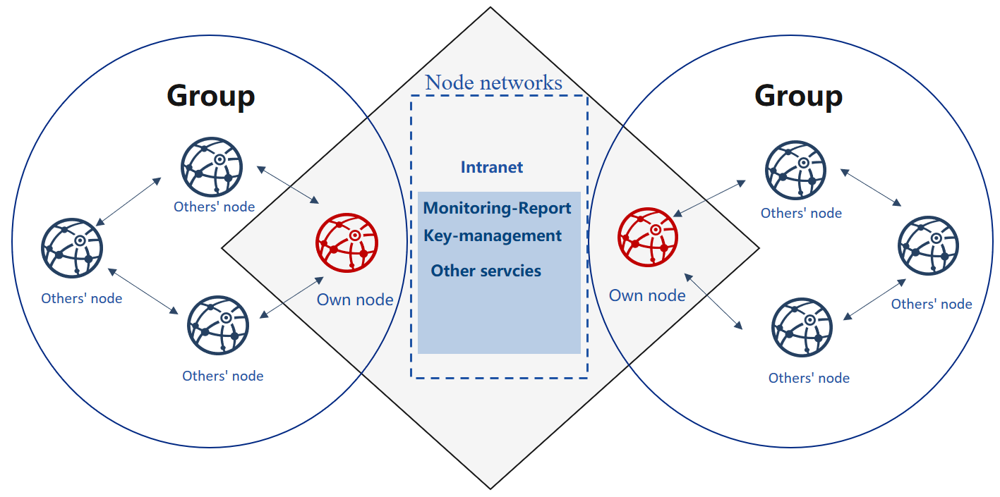

# Enterprise deployment tool

**Introduction**

[FISCO BCOS generator](https://github.com/FISCO-BCOS/generator) provides companies with an easy toolkit for deployment, administration and monitoring of multi-group consortium chain.

- It eliminates the complexity of generating and maintaining blockchain and offers alternative deployment methods.
- It requires agencies to share node credentials and manage their own private key but not expose to outsider, maintaining security of all nodes.
- It helps agencies deploy nodes safely through e-certificate trading, maintaining equality of all nodes.



**Design background**

There cannot be exhaustive trust between equal agencies in consortium chain, where e-certificate will be needed for nodes to authenticate each other’s identity.
Certificate is the identity documentation for each agency. And the generation of certificate depends on its own public & private key pair. Private key represents its identity information that is private and strictly confidential. In the process of activation and operation, node signs on the data packet with private key in order to fulfil identity authentication. Provided that an agency’s private key is revealed, anyone else can pretend as the owner and get authorized without affirmation of this agency.

```eval_rst
.. important:
    During deployment and operation of consortium chain, each agency is the one and only generator and custodian of its own private key, and should never reveal it to anyone.
```

When initializing the group of FISCO BCOS, nodes should reach an agreement to create a Genesis Block. Genesis Block, unique and only within one group, bears the identity information of the initial nodes, which is formed through e-credential exchanging.

Current IT administration tools for consortium chain usually ignore the requirement for equality and security of companies during initialization. And initialization needs agencies to agree on identity information on Genesis Block. So, who should be the information generator is crucial. One of the solution is that an agency generates its node information first and then activate blockchain for other nodes to join in; or a third-party authority generates information for all nodes and send the node configuration files to each agency.
Additionally, FISCO BCOS 2.0 adapts more private and scalable multi-group architecture. It is an architecture where data and transactions between groups are separated by running independent consensus algorithm, a way to maintain privacy and security in blockchain scenarios.

In the above models, there is always one agency who gains priority to join the consortium chain or acquires private keys of all nodes.

How to make sure the group is formed in an equal, safe and private way? How to guarantee reliable and effective operation of nodes? The privacy and security of group ledgers, as well as the confidentiality of group formation and operation, need to be achieved in an effective way.

**Design concept**

FISCO BCOS generator is a solution designed for problems described above. It takes into consideration the equal deployment and group formation of different agencies on the basis of flexibility, security, ease-of-use and equality.

Flexibility:

- No installation, ready to use
- Alternative deployment methods
- Allow multiple changes in architecture

Safety:

- Allow multiple changes in architecture
- Private key is kept internally
- Negotiation between agencies is based on certificates only

Ease-to-use:

- Support multiple networking models
- Alternative commands for various needs
- Monitor audit script

Equality:

- Equal authority of agencies
- All agencies co-generate Genesis Block
- Equal administrative power within groups

For consortium chain based on existed root credential, it can fast configure multiple groups on chain to adapt for different business needs.

After agreeing on the data model of node certificate, IP and port number and filling the configuration items, each agency can generate a configuration file folder locally that includes no private key. Agencies can keep their private keys internally and prevent malicious attackers in disguise of nodes or any information leakage, even if the configuration files are lost. In this way, security and usability of nodes can be achieved at the same time.

Users make agreement to generate Genesis Block and node configuration file folder, and then activate nodes so that they will conduct multi-group networking according to the configuration files.

```eval_rst
.. toctree::
   :hidden:
   :maxdepth: 1

   installation.md
   enterprise_quick_start.md
   config.md
   operation.md
```
