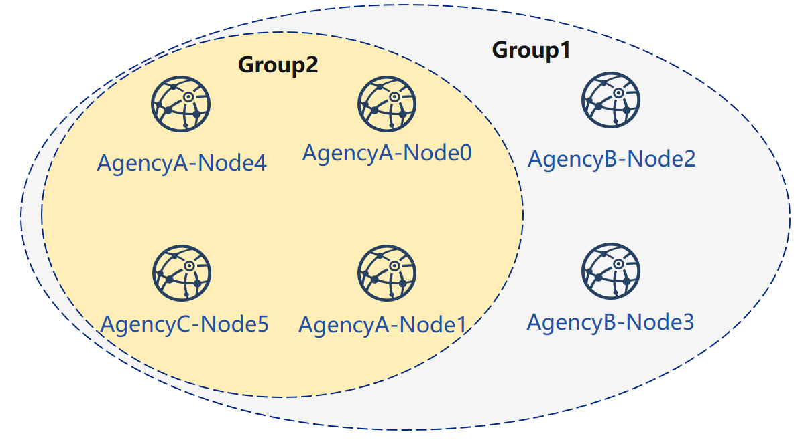
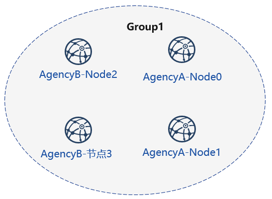
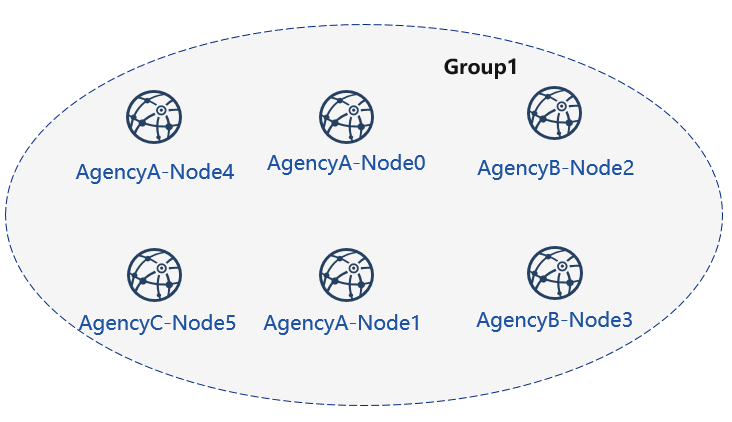

# Tutorial of one_click_generator.sh

<!-- TODO: add console details fix type-->

The `one_click_generator.sh` script is a script that deploys a federated chain with one click based on the node configuration filled out by the user. The script will generate the corresponding node under the folder according to the `node_deployment.ini` configured under the user-specified folder.

This chapter mainly uses the networking mode of deploying **3 organizations 2 groups 6 nodes** to explain the use of enterprise-level deployment tools for single-button one-button deployment.

This tutorial is suitable for single-node deployment of all nodes. The enterprise-level deployment tool multi-agent deployment tutorial can refer to [Using Enterprise Deployment Tools](./tutorial_one_click.md).

```eval_rst
.. important::
      When using the one-click deployment script, you need to ensure that the current meta folder does not contain node certificate information. You can clean the meta folder.
```

## Download and install

**download**

```bash
cd ~/
git clone https://github.com/FISCO-BCOS/generator.git

# If you have network issue for exec the command above, please try:
git clone https://gitee.com/FISCO-BCOS/generator.git
```

**Installation**

This action requires the user to have sudo privileges.

```bash
cd ~/generator && bash ./scripts/install.sh
```

Check if the installation is successful. If successful, output usage: generator xxx

```bash
./generator -h
```

**Get node binary**

Pull the latest fisco-bcos binary to the meta, you can try `--cdn` to improve your download speed.

```bash
./generator --download_fisco ./meta
```

**Check the binary version**

If successful, output FISCO-BCOS Version : x.x.x-x

```bash
./meta/fisco-bcos -v
```

**PS**: [source compile](../manual/get_executable.md) Node binary user, you only need to replace the binary in the `meta` folder with the compiled binary.

## Typical example

This section demonstrates how to use the one-click deployment function of the enterprise-level deployment tool to build a blockchain.

### Node Network Topology

A networking model of a 6-node 3-institution 2 group as shown. agency B and agency C are located in Group 1 and Group 2, respectively. agency A belongs to both Group 1 and Group 2.



### Machine Environment

The IP of each node, the port number is as follows:

| agency  | Node   | Group  | P2P Address    | RPC Listening Address | Channel Listening Address |
| -------- | ------ | ---------- | ------------- | -------------------- |  ------------ |
| agency A | Node 0 | Group 1, 2 | 127.0.0.1:30300 | 127.0.0.1:8545| 0.0.0.0:20200 |
|          | Node 1 | Group 1, 2 | 127.0.0.1:30301 | 127.0.0.1:8546 | 0.0.0.0:20201 |
|          | Node 4 | Group 1, 2 | 127.0.0.1:30304 | 127.0.0.1:8549 | 0.0.0.0:20202 |
| agency B | Node 2 | Group 1    | 127.0.0.1:30302 | 127.0.0.1:8547 | 0.0.0.0:20203 |
|          | Node 3 | Group 1    | 127.0.0.1:30303 | 127.0.0.1:8548 | 0.0.0.0:20204 |
| agency C | Node 5 | Group 1, 2 | 127.0.0.1:30305 | 127.0.0.1:8550 | 0.0.0.0:20205 |

```eval_rst
.. note::
    - The public IP of the cloud host is a virtual IP. If you enter the external IP in rpc_ip/p2p_ip/channel_ip, the binding will fail. You must fill in 0.0.0.0

    - The RPC/P2P/Channel listening port must be in the range of 1024-65535, and must not conflict with other application listening ports on the machine

    - For security and ease of use consideration, FISCO BCOS v2.3.0 latest node config.ini configuration splits listen_ip into jsonrpc_listen_ip and channel_listen_ip, but still retains the parsing function of listen_ip, please refer to `here <../manual/configuration.html#configure-rpc>`_

    - In order to facilitate development and experience, the reference configuration of channel_listen_ip is `0.0.0.0`. For security reasons, please modify it to a safe listening address according to the actual business network situation, such as: intranet IP or specific external IP
```

## Generate group 1 node

First, complete the operation of group A and B to set up group 1, as shown in the figure:



Before use, the user needs to prepare a folder such as `tmp_one_click,` which has a directory of different organizations under the folder. Each agency directory needs to have a corresponding configuration file [```node_deployment.ini```](./config.md#node-deployment-ini). Before use, you need to ensure that the generator's meta folder has not been used.

View the one-click deployment template folder:

```bash
cd ~/generator
ls ./tmp_one_click
```

```bash
#Parameter explanation
# For multiple organizations, you need to create this folder manually.
Tmp_one_click # user specifies the folder for a one-click deployment operation
├── agencyA #agencyA directory, after the command is executed, the node of the agency A and related files will be generated in the list.
│ └── node_deployment.ini # Institution A node configuration file, one-click deployment command will create the corresponding node according to the data
└── agencyB #agencyB directory, after the command is executed, the node of the agency B and related files will be generated in the list.
    └── node_deployment.ini # Institution B node configuration file, one-click deployment command will generate the corresponding node according to the data
```

### Institution to fill in node information

The configuration file is placed in the tutorial with agencyA under the tmp_one_click folder, under agencyB

```bash
cat > ./tmp_one_click/agencyA/node_deployment.ini << EOF
[group]
group_id=1

[node0]
; host IP for the communication among peers.
; Please use your ssh login IP.
p2p_ip=127.0.0.1
; listening IP for the communication between SDK clients.
; This IP is the same as p2p_ip for the physical host.
; But for virtual host e.g., VPS servers, it is usually different from p2p_ip.
; You can check accessible addresses of your network card.
; Please see https://tecadmin.net/check-ip-address-ubuntu-18-04-desktop/
; for more instructions.
rpc_ip=127.0.0.1
channel_ip=0.0.0.0
p2p_listen_port=30300
channel_listen_port=20200
jsonrpc_listen_port=8545

[node1]
p2p_ip=127.0.0.1
rpc_ip=127.0.0.1
channel_ip=0.0.0.0
p2p_listen_port=30301
channel_listen_port=20201
jsonrpc_listen_port=8546
EOF
```

```bash
cat > ./tmp_one_click/agencyB/node_deployment.ini << EOF
[group]
group_id=1

[node0]
; Host IP for the communication among peers.
; Please use your ssh login IP.
p2p_ip=127.0.0.1
; listening IP for the communication between SDK clients.
; This IP is the same as p2p_ip for the physical host.
; But for virtual host e.g., VPS servers, it is usually different from p2p_ip.
; You can check accessible addresses of your network card.
; Please see https://tecadmin.net/check-ip-address-ubuntu-18-04-desktop/
; for more instructions.
rpc_ip=127.0.0.1
channel_ip=0.0.0.0
p2p_listen_port=30302
channel_listen_port=20202
jsonrpc_listen_port=8547

[node1]
p2p_ip=127.0.0.1
rpc_ip=127.0.0.1
channel_ip=0.0.0.0
p2p_listen_port=30303
channel_listen_port=20203
jsonrpc_listen_port=8548
EOF
```

### Generate node

```bash
bash ./one_click_generator.sh -b ./tmp_one_click
```

After the execution is completed, the ./tmp_one_click folder structure is as follows:

View the one-click deployment template folder after execution:

```bash
ls ./tmp_one_click
```

```bash
├── agencyA # A agency folder
│ ├── agency_cert # A agency certificate and private key
│ ├── generator-agency # Automatically replaces the generator folder operated by the A mechanism
│ ├── node #A node generated by the agency, when the multi-machine is deployed, it can be pushed to the corresponding server.
│ ├── node_deployment.ini # Node configuration information of A agency
│ └── SDK # A SDK or console configuration file
├── agencyB
|   ├── agency_cert
|   ├── generator-agency
|   ├── node
|   ├── node_deployment.ini
|   └── sdk
|── ca.crt # chain certificate
|── ca.key # chain private key
|── group.1.genesis # group one's genesis block
|── peers.txt # node's peers.txt
```

### Start node

Call the script to start the node:

```bash
bash ./tmp_one_click/agencyA/node/start_all.sh
```

```bash
bash ./tmp_one_click/agencyB/node/start_all.sh
```

View the node process:

```bash
ps -ef | grep fisco
```

```bash
#Command explanation
# can see the following process
fisco 15347 1 0 17:22 pts/2 00:00:00 ~/generator/tmp_one_click/agencyA/node/node_127.0.0.1_30300/fisco-bcos -c config.ini
fisco 15402 1 0 17:22 pts/2 00:00:00 ~/generator/tmp_one_click/agencyA/node/node_127.0.0.1_30301/fisco-bcos -c config.ini
fisco 15442 1 0 17:22 pts/2 00:00:00 ~/generator/tmp_one_click/agencyB/node/node_127.0.0.1_30302/fisco-bcos -c config.ini
fisco 15456 1 0 17:22 pts/2 00:00:00 ~/generator/tmp_one_click/agencyB/node/node_127.0.0.1_30303/fisco-bcos -c config.ini
```

### View node running status

View the node log:

```bash
tail -f ~/generator/tmp_one_click/agency*/node/node*/log/log* | grep +++
```

```bash
#Command explanation
# +++ is the normal consensus of the node
Info|2019-02-25 17:25:56.028692| [g:1][p:264][CONSENSUS][SEALER]++++++++++++++++ Generating seal on,blkNum =1, tx=0, myIdx=0, hash=833bd983...
Info|2019-02-25 17:25:59.058625| [g:1][p:264][CONSENSUS][SEALER]++++++++++++++++ Generating seal on,blkNum =1, tx=0, myIdx=0, hash=343b1141...
Info|2019-02-25 17:25:57.038284| [g:1][p:264][CONSENSUS][SEALER]++++++++++++++++ Generating seal on,blkNum =1, tx=0, myIdx=1, hash=ea85c27b...
```

## Add node to group 1

Next, we add new nodes for agency A and agency C, and complete the networking shown in the following figure:



### Initialize the expansion configuration

```eval_rst
.. important::
      When using the one-click deployment script, you need to ensure that the current meta folder does not contain node certificate information. You can clean the meta folder.
```

**Create an expansion folder, don't use the same foler**

```bash
mkdir ~/generator/tmp_one_click_expand/
```

Copy the chain certificate and private key to the expansion folder

```bash
cp ~/generator/tmp_one_click/ca.* ~/generator/tmp_one_click_expand/
```

Copy group 1 genesis block `group.1.genesis` to expansion folder

```bash
cp ~/generator/tmp_one_click/group.1.genesis ~/generator/tmp_one_click_expand/
```

Copy group 1 node P2P connection file `peers.txt` to expansion folder

```bash
cp ~/generator/tmp_one_click/peers.txt ~/generator/tmp_one_click_expand/
```

### agency A configuration node information

Create the directory where the agency A expansion node is located.

```bash
mkdir ~/generator/tmp_one_click_expand/agencyA
```

At this time, the agency A already exists in the alliance chain. So it is necessary to copy the agency A certificate and the private key to the corresponding folder.

```bash
cp -r ~/generator/tmp_one_click/agencyA/agency_cert ~/generator/tmp_one_click_expand/agencyA
```

agency A fills in the node configuration information

```bash
cat > ./tmp_one_click_expand/agencyA/node_deployment.ini << EOF
[group]
group_id=1

[node0]
; Host IP for the communication among peers.
; Please use your ssh login IP.
p2p_ip=127.0.0.1
; listening IP for the communication between SDK clients.
; This IP is the same as p2p_ip for the physical host.
; But for virtual host e.g., VPS servers, it is usually different from p2p_ip.
; You can check accessible addresses of your network card.
; Please see https://tecadmin.net/check-ip-address-ubuntu-18-04-desktop/
; for more instructions.
rpc_ip=127.0.0.1
channel_ip=0.0.0.0
p2p_listen_port=30304
channel_listen_port=20204
jsonrpc_listen_port=8549
EOF
```

### Institution C configuration node information

Create a directory where the agency C expansion node is located.

```bash
mkdir ~/generator/tmp_one_click_expand/agencyC
```

agency C fills in the node configuration information

```bash
cat > ./tmp_one_click_expand/agencyC/node_deployment.ini << EOF
[group]
group_id=1

[node0]
; Host IP for the communication among peers.
; Please use your ssh login IP.
p2p_ip=127.0.0.1
; listening IP for the communication between SDK clients.
; This IP is the same as p2p_ip for the physical host.
; But for virtual host e.g., VPS servers, it is usually different from p2p_ip.
; You can check accessible addresses of your network card.
; Please see https://tecadmin.net/check-ip-address-ubuntu-18-04-desktop/
; for more instructions.
rpc_ip=127.0.0.1
channel_ip=0.0.0.0
p2p_listen_port=30305
channel_listen_port=20205
jsonrpc_listen_port=8550
EOF
```

### Generate expansion nodes

```bash
bash ./one_click_generator.sh -e ./tmp_one_click_expand
```

### Starting a new node

Call the script to start the node:

```bash
bash ./tmp_one_click_expand/agencyA/node/start_all.sh
```

```bash
bash ./tmp_one_click_expand/agencyC/node/start_all.sh
```

View the node process:

```bash
ps -ef | grep fisco
```

```bash
#Command explanation
# can see the following process
fisco  15347     1  0 17:22 pts/2    00:00:00 ~/generator/tmp_one_click/agencyA/node/node_127.0.0.1_30300/fisco-bcos -c config.ini
fisco  15402     1  0 17:22 pts/2    00:00:00 ~/generator/tmp_one_click/agencyA/node/node_127.0.0.1_30301/fisco-bcos -c config.ini
fisco  15403     1  0 17:22 pts/2    00:00:00 ~/generator/tmp_one_click_expand/agencyA/node/node_127.0.0.1_30304/fisco-bcos -c config.ini
fisco  15442     1  0 17:22 pts/2    00:00:00 ~/generator/tmp_one_click/agencyB/node/node_127.0.0.1_30302/fisco-bcos -c config.ini
fisco  15456     1  0 17:22 pts/2    00:00:00 ~/generator/tmp_one_click/agencyB/node/node_127.0.0.1_30303/fisco-bcos -c config.ini
fisco  15466     1  0 17:22 pts/2    00:00:00 ~/generator/tmp_one_click_expand/agencyC/node/node_127.0.0.1_30305/fisco-bcos -c config.ini
```

```eval_rst
.. important::

   New nodes that are expanded for group 1 need to be added to the group using SDK or console.
```

### Registering a node with the console

Due to the large size of the console, there is no direct integration in a one-click deployment. Users can use the following command to get the console.

Getting the console may take a long time, and domestic users can use the `--cdn` command:

For example, if the agency A uses the console, this step needs to be switched to the `generator-agency` folder corresponding to the agency A.

```bash
cd ~/generator/tmp_one_click/agencyA/generator-agency
```

```bash
./generator --download_console ./ --cdn
```

### Viewing agency A node-4 information

agency A uses the console to join the agency A node 4 as the consensus node, where the second parameter needs to be replaced with the nodeid of the joining node, and the nodeid is the `node.nodeid` of the conf of the node folder.

View the agency A node nodeid:

```bash
cat ~/generator/tmp_one_click_expand/agencyA/node/node_127.0.0.1_30304/conf/node.nodeid
```

```bash
ea2ca519148cafc3e92c8d9a8572b41ea2f62d0d19e99273ee18cccd34ab50079b4ec82fe5f4ae51bd95dd788811c97153ece8c05eac7a5ae34c96454c4d3123
```

### Registering Consensus Nodes Using the Console

Start the console:

```bash
cd ~/generator/tmp_one_click/agencyA/generator-agency/console && bash ./start.sh 1
```

Use the console `addSealer` command to register the node as a consensus node. In this step, you need to use the `cat` command to view the node `node.nodeid` of the agency A node:

```bash
addSealer ea2ca519148cafc3e92c8d9a8572b41ea2f62d0d19e99273ee18cccd34ab50079b4ec82fe5f4ae51bd95dd788811c97153ece8c05eac7a5ae34c96454c4d3123
```

```bash
$ [group:1]> addSealer ea2ca519148cafc3e92c8d9a8572b41ea2f62d0d19e99273ee18cccd34ab50079b4ec82fe5f4ae51bd95dd788811c97153ece8c05eac7a5ae34c96454c4d3123
{
	"code":0,
	"msg":"success"
}
```

exit console：

```bash
exit
```

### Viewing agency C Node 5

agency A uses the console to join node 5 of agency C as the observation node, where the second parameter needs to be replaced with the nodeid of the joining node, and the nodeid is the node.nodeid file of the conf of the node folder.

View the agency C node nodeid:

```bash
cat ~/generator/tmp_one_click_expand/agencyC/node/node_127.0.0.1_30305/conf/node.nodeid
```

```bash
5d70e046047e15a68aff8e32f2d68d1f8d4471953496fd97b26f1fbdc18a76720613a34e3743194bd78aa7acb59b9fa9aec9ec668fa78c54c15031c9e16c9e8d
```

### Registering an observation node using the console

Start the console:

```bash
cd ~/generator/tmp_one_click/agencyA/generator-agency/console && bash ./start.sh 1
```

Use the console `addObserver` command to register the node as a watch node. In this step, you need to use the `cat` command to view the node #node.nodeid\` of the agency C node:

```bash
addObserver 5d70e046047e15a68aff8e32f2d68d1f8d4471953496fd97b26f1fbdc18a76720613a34e3743194bd78aa7acb59b9fa9aec9ec668fa78c54c15031c9e16c9e8d
```

```bash
$ [group:1]> addObserver 5d70e046047e15a68aff8e32f2d68d1f8d4471953496fd97b26f1fbdc18a76720613a34e3743194bd78aa7acb59b9fa9aec9ec668fa78c54c15031c9e16c9e8d
{
	"code":0,
	"msg":"success"
}
```

Exit the console:

```bash
exit
```

At this point, we have completed the operation of adding a new node to an existing group.

## Existing Node New Group 2

The operation of the new group can be done by modifying the `./conf/group_genesis.ini` file in the directory where the `one_click_generator.sh` is executed and executing the `--create_group_genesis` command.

Generate group 2 as shown in Figure 4


### Configure Group 2 genesis block

```eval_rst
.. important::

     This operation needs to be performed under the above operation generator.
```

```bash
cd ~/generator
```

Configuring the group genesis block file. Add `nodeX=ip:port` under `[nodes]` which belong to the members of new group.  For example they are: AgencyA-Node0, AgencyA-Node1, AgencyA-Node4 and AgencyC-Node5.

```bash
cat > ./conf/group_genesis.ini << EOF
[group]
group_id=2

[nodes]
node0=127.0.0.1:30300
node1=127.0.0.1:30301
node2=127.0.0.1:30304
node3=127.0.0.1:30305
EOF
```

### Get the corresponding node certificate

AgencyA-Node0（`node0=127.0.0.1:30300`）

```bash
cp ~/generator/tmp_one_click/agencyA/generator-agency/meta/cert_127.0.0.1_30300.crt ~/generator/meta
```

AgencyA-Node1（`node1=127.0.0.1:30301`）

```bash
cp ~/generator/tmp_one_click/agencyA/generator-agency/meta/cert_127.0.0.1_30301.crt ~/generator/meta
```

AgencyA-Node4（`node2=127.0.0.1:30304`）

```bash
cp ~/generator/tmp_one_click_expand/agencyA/generator-agency/meta/cert_127.0.0.1_30304.crt ~/generator/meta
```

AgencyC-Node5（`node3=127.0.0.1:30305`）

```bash
cp ~/generator/tmp_one_click_expand/agencyC/generator-agency/meta/cert_127.0.0.1_30305.crt ~/generator/meta
```

### Generating genesis block and group configure file

```bash
./generator --create_group_genesis ./group2
```

将群组创世区块加入现有节点：

AgencyA-Node0（`node0=127.0.0.1:30300`）

```bash
./generator --add_group ./group2/group.2.genesis ./tmp_one_click/agencyA/node/node_127.0.0.1_30300
```

AgencyA-Node1（`node1=127.0.0.1:30301`）

```bash
./generator --add_group ./group2/group.2.genesis ./tmp_one_click/agencyA/node/node_127.0.0.1_30301
```

AgencyA-Node4（`node2=127.0.0.1:30304`）

```bash
 ./generator --add_group ./group2/group.2.genesis ./tmp_one_click_expand/agencyA/node/node_127.0.0.1_30304
```

AgencyC-Node5（`node3=127.0.0.1:30305`）

```bash
./generator --add_group ./group2/group.2.genesis ./tmp_one_click_expand/agencyC/node/node_127.0.0.1_30305
```

### Load and start new group

Use `load_new_groups.sh` to load configuration of new group, and call `startGroup` RPC interface to start new group

AgencyA-Node0（`node0=127.0.0.1:30300`）

```bash
bash ./tmp_one_click/agencyA/node/node_127.0.0.1_30300/scripts/load_new_groups.sh
curl -X POST --data '{"jsonrpc":"2.0","method":"startGroup","params":[2],"id":1}' http://127.0.0.1:8545
```

AgencyA-Node1（`node1=127.0.0.1:30301`）

```bash
bash ./tmp_one_click/agencyA/node/node_127.0.0.1_30301/scripts/load_new_groups.sh
curl -X POST --data '{"jsonrpc":"2.0","method":"startGroup","params":[2],"id":1}' http://127.0.0.1:8546
```

AgencyA-Node4（`node2=127.0.0.1:30304`）

```bash
bash ./tmp_one_click_expand/agencyA/node/node_127.0.0.1_30304/scripts/load_new_groups.sh
curl -X POST --data '{"jsonrpc":"2.0","method":"startGroup","params":[2],"id":1}' http://127.0.0.1:8549
```

AgencyA-Node5（`node3=127.0.0.1:30305`）

```bash
bash ./tmp_one_click_expand/agencyC/node/node_127.0.0.1_30305/scripts/load_new_groups.sh
curl -X POST --data '{"jsonrpc":"2.0","method":"startGroup","params":[2],"id":1}' http://127.0.0.1:8550
```

### Check node

View the group1 information in the node log:

```bash
tail -f ~/generator/tmp_one_click/agency*/node/node*/log/log* | grep g:2 | grep +++
```

```bash
info|2019-02-25 17:25:56.028692| [g:2][p:264][CONSENSUS][SEALER]++++++++++++++++ Generating seal on,blkNum=1,tx=0,myIdx=0,hash=833bd983...
info|2019-02-25 17:25:59.058625| [g:2][p:264][CONSENSUS][SEALER]++++++++++++++++ Generating seal on,blkNum=1,tx=0,myIdx=0,hash=343b1141...
info|2019-02-25 17:25:57.038284| [g:2][p:264][CONSENSUS][SEALER]++++++++++++++++ Generating seal on,blkNum=1,tx=0,myIdx=1,hash=ea85c27b...
```

So far, we have completed all the operations in the build tutorial shown.

```eval_rst
.. note::

     After using it, it is recommended to clean the meta folder with the following command:

     - rm ./meta/cert_*
     - rm ./meta/group*
```

## More operations

For more operations, refer to the [Operation Manual](./operation.md) or [Enterprise Tools Peer-to-Peer Deployment Tutorial](./tutorial_one_click.md).

If you have problems with this tutorial, please check [FAQ](../faq.md)
