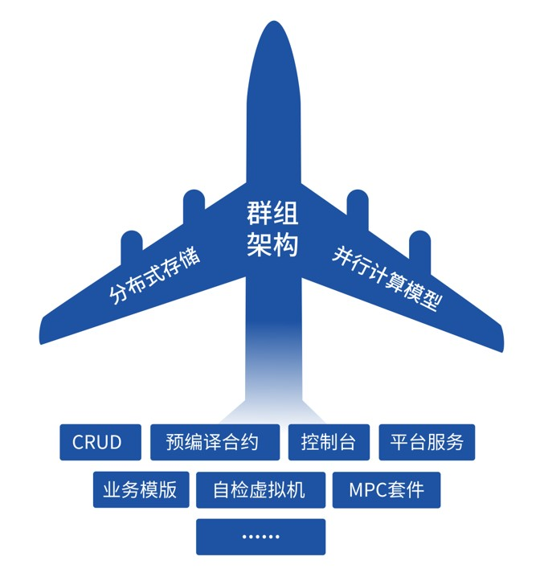

# Introduction

FISCO BCOS is the first safe and controllable enterprise-level financial consortium blockchain platform open source by domestic enterprises. It is jointly created by the FISCO open source working group and officially launched in December 2017.

The community links multiple parties with open source. As of May 2020, more than 1000 enterprises and institutions and more than 10,000 community members have joined to build and co-governance, and developed into the largest and most active domestic consortium blockchain platform ecosystem. The underlying platform is highly available and easy to use after extensive application and practice. Hundreds of application projects are developed based on the FISCO BCOS underlying platform, and over 80 have been steadily operating in the production environment, covering cultural copyright, judicial services, government services, Internet of Things, finance, smart communities and other fields.


```eval_rst
.. note::
    FISCO BCOS takes the actual needs of the consortium blockchain as a starting point, taking into account performance, security, maintainability, ease of use, and scalability, and supports multiple SDK, and provides visual middleware tools, greatly reducing the time to build chains, develop and deploy applications. In addition, FISCO BCOS passed the two evaluations of the Trusted Blockchain evaluation function and performance of the Information Communication Institute, and the single-chain TPS can reach 20,000.
```

## Key Features

<font color=Blue>**Architecture**</font> | |
| - | - |
| Architectural model | one-body, two-wing, multi-engine|
| Group architecture | Support dynamic expansion of multiple groups in the chain|
| AMDB | Support massive data storage|
| Parallel transaction processing | Support parallel execution of intra-block transactions |
| Node type | Consensus node, observation node |
| Execution model | sort-execute-verify |
| <font color=Blue>**System performance**</font> |
| Peak TPS | 20,000+ TPS (PBFT）|
| Transaction confirmation delay | Confirm in seconds|
| <font color=Blue>**Recommended hardware configuration**</font> |
| CPU | 2.4GHz * 8|
| Memory | 8GB |
| Storage | 4TB |
| Network bandwidth| 10Mb |
| <font color=Blue>**Ledger model**</font> |
| Data structure | Chain structure, blocks are connected by hash|
| Whether to fork| No fork |
| Bookkeeping type | Account model (non-UTXO)|
| <font color=Blue>**Consensus algorithm**</font>  |
| Consensus framework | Pluggable design |
| Consensus algorithm | PBFT、Raft、rPBFT|
| <font color=Blue>**Storage engine**</font>  |
| Storage design | Support KV and SQL |
| Storage engine type | Support leveldb, rocksdb, mysql|
| CRUD interface | Provide CRUD interface to access data on the chain |
| <font color=Blue>**Network protocol**</font>  |
| Node communication | P2P protocol |
| Client and node communication | JsonRPC, Channel protocol |
| Message subscription service | AMOP protocol |
| <font color=Blue>**Smart contract**|
|Contract engine| Support Solidity and precompiled contracts |
|Contract engine features| Turing complete, sandbox running |
|Version control| Support multi-version contracts based on CNS |
| Grayscale upgrade | Support multi-version contract coexistence, grayscale upgrade|
| Life cycle management |Support contract and account freezing and unfreezing|
| <font color=Blue>**Cryptographic algorithms and protocols**</font>  |
| OSCCA algorithm | Support feature |
| OSCCA SSL | Support feature |
| Hash algorithm | Keccak256、SM3 |
| Symmetric encryption algorithm | AES、SM4 |
| Asymmetric encryption algorithm |ECDSA、SM2|
| Asymmetric encryption elliptic curve |secp256k1、sm2p256v1|
| <font color=Blue>**safety control**</font>  |
|Storage security| Support encrypted data storage |
|Communication security| Support SSL |
|Access security| PKI-based identity authentication system |
|Certificate management| Support certificate issuance, revocation and renewal |
|Access control| Support fine-grained permission control|
| <font color=Blue>**privacy protection**</font> |
| Physical isolation| Data isolation among groups |
| Privacy Protection Agreement| Support group signature, ring signature, homomorphic encryption |
|Scene privacy protection mechanism |Based on [WeDPR](https://fintech.webank.com/wedpr), it supports scenarios such as hidden payment, anonymous voting, anonymous bidding, selective disclosure, etc.|
| <font color=Blue>**Cross-chain protocol**</font> |
|SPV|Provide an interface to obtain SPV proof|
|Cross-chain protocol|Based on [WeCross](https://github.com/WeBankFinTech/WeCross) supports homogeneous and heterogeneous cross-chain |
| <font color=Blue>**Development support**</font> |
|Contract development tools|[WeBASE-IDE](https://github.com/WeBankFinTech/WeBASE)，[ChainIDE](https://fiscoide.com/)|
|Development of chain building tools | [build_chain](manual/build_chain.md)|
|Contract deployment and testing tools| [Console](console/console.html)|
|SDK|[Java](https://github.com/FISCO-BCOS/java-sdk)、[nodejs](https://github.com/FISCO-BCOS/nodejs-sdk)、[go](https://github.com/FISCO-BCOS/go-sdk)、[python](https://github.com/FISCO-BCOS/python-sdk)|
|Rapid component development| [Spring-boot-starter](https://github.com/FISCO-BCOS/spring-boot-starter)|
|Performance measuring tool|SDK embedded performance testing tool, supports Caliper|
| <font color=Blue>**Operation and maintenance support**</font> |
|Operation and maintenance chain building tools| Provide [enterprise level consortium chain deployment tool](enterprise_tools/index.html)|
|Visual data display|[Blockchain browser](browser/browser.html)|
|Visual node management| Provide node manager based on [WeBASE](https://github.com/WeBankFinTech/WeBASE) |
|Dynamic management node | Supports dynamically adding, removing, and changing nodes|
|Dynamic configuration changes | Support dynamic change of system configuration|
|Data backup and recovery | Provide data export and recovery service components|
|Monitoring statistics | Output statistical logs and provide monitoring tools|
|Regulatory audit| Based on [WeBASE](https://github.com/WeBankFinTech/WeBASE), providing regulatory audit entrance|

## Architecture

In 2.0, FISCO BCOS innovatively proposed a "one-body, two-wing, multi-engine" architecture to achieve horizontal expansion of system throughput and greatly improve performance. It has industry in terms of security, operation and maintenance, ease of use, and scalability, and leading edge.



The 'One-body' refers to the group structure, supports the rapid formation of consortium blockchain, and allows companies to build chains as easily as chat groups. According to business scenarios and business relationships, enterprises can choose different groups to form data sharing and consensus of multiple different ledgers, thereby quickly enriching business scenarios, expanding business scale, and greatly simplifying the deployment and operation and maintenance costs of the chain.

The 'two wings' refer to supporting parallel computing models and distributed storage, both of which bring better scalability to the group architecture. The former changes the method of serial execution in the order of transactions in the block, and executes transactions in parallel based on DAG (directed acyclic graph), which greatly improves performance. The latter supports enterprises (nodes) to store data in remote distributed systems, overcoming many limitations of localized data storage.


'Multi-engine' is a summary of a series of functional features. For example, pre-compiled contracts can break through the performance bottleneck of EVM and achieve high-performance contracts; the console allows users to quickly master blockchain usage skills.

The above features all focus on solving the pain points of technology and experience, provide more tool support for development, operation and maintenance, governance and supervision, make the system process faster and have higher capacity, and make the application operating environment safer and more stable.

## Core module

FISCO BCOS adopts high-throughput scalable [multi-group architecture](design/architecture/group.md), which can dynamically manage multiple chains and groups to meet the expansion and isolation requirements of multiple business scenarios. Modules include:

- <font color=blue>**[Consensus mechanism](design/consensus/index.md)**</font>: Pluggable consensus mechanism, supporting PBFT, Raft and rPBFT consensus algorithms, low transaction confirmation delay, high throughput, and ultimate consistency. Among them, PBFT and rPBFT can solve Byzantine problems and have higher security.

- <font color=blue>**[Storage](design/storage/index.md)**</font>: The storage of the world state is changed from the original MPT storage structure to [distributed storage](design/storage/storage.md), avoids the problem of performance degradation caused by the rapid expansion of the world state. Introduces a pluggable storage engine, supports LevelDB, RocksDB, MySQL and other back-end storage, supports data expansion quickly and easily, and isolates calculation from data, reducing the impact of node failure on node data.

- <font color=blue>**[Network](design/p2p/p2p.md)**</font>: Support network compression, and implement a good distributed network distribution mechanism based on the idea of load balancing to minimize bandwidth overhead.

## Performance

In order to improve system performance, FISCO BCOS optimizes transaction execution in terms of improving transaction execution efficiency and concurrency, so that transaction processing performance can reach more than 10,000 levels.

- <font color=blue>**[Precompiled contract based on C++](design/virtual_machine/precompiled.md)**</font>: The Precompiled contract written in C++ language is built into the blockchain platform, and the execution efficiency is higher.

- <font color=blue>**[Transaction execution in parallel](design/parallel/dag.md)**</font>: Based on the DAG algorithm to build a transaction execution flow within a block based on the mutually exclusive relationship between transactions, maximizing parallel execution of transactions within a block.


## Safety

Considering the high security requirements of the consortium blockchain platform, in addition to the TLS security protocol used for communication between nodes and between nodes and clients, FISCO BCOS also implements a complete set of security solutions:

- <font color=blue>**[Network access mechanism](design/security_control/node_management.md)**</font>: Restrict nodes from joining and exiting the alliance chain, and delete the malicious nodes of the specified group from the group, ensuring system security.

- <font color=blue>**[Black and white list mechanism](design/security_control/certificate_list.md)**</font>: Each group can only receive messages from the corresponding group to ensure the isolation of network communication between the groups; the CA blacklist mechanism can disconnect the network connection from the malicious node in time, ensuring the security of the system.

- <font color=blue>**[Authority management mechanism](design/security_control/permission_control.md)**</font>: Based on distributed storage permission control mechanism, flexible and fine-grained control of permissions for external account deployment contracts and creation, insertion, deletion and update of user tables.

- <font color=blue>**[Support OSCCA-approved algorithm](manual/guomi_crypto.md)**</font>: Support OSCCA-approved encryption, signature algorithm and OSCCA-approved SSL communication protocol.

- <font color=blue>**[Disk encryption algorithm](design/features/storage_security.md)**</font>: Support the disk encryption algorithm to ensure the confidentiality of the data on the chain.

- <font color=blue>**[Key management scheme](design/features/storage_security.md)**</font>: Based on the disk encryption algorithm, the KeyManager service is used to manage the node key, which is more secure.

- <font color=blue>**[Homomorphic encryption](manual/privacy.md)、[Group/Ring signature](manual/privacy.md)**</font>: Homomorphic encryption and group ring signature interfaces are provided on the chain to meet more business needs.


## Operability

In the consortium blockchain platform, the operation and maintenance of the blockchain is crucial. FISCO BCOS provides a complete set of operation and maintenance deployment tools, and introduces **contract naming service**, **data archiving and migration**, **contract lifecycle management** to improve Operation and Management efficiency.

- <font color=blue>**[Operation and Management deployment tool](enterprise_tools/index.md)**</font>: Convenient tool for deploying, managing and monitoring multi-institution multi-group consortium blockchain, supporting multiple operations such as expanding nodes and expanding new groups.

- <font color=blue>**[Contract naming service](design/features/cns_contract_name_service.md)**</font>: Establish a mapping relationship between the contract address to the contract name and the contract version, so that the caller can easily call the contract on the chain by remembering the simple contract name.

- **Data archiving, migration and export functions**: Provide data export components, support on-chain data archiving, migration and export, increase the maintainability of on-chain data, and reduce the complexity of operation.

- <font color=blue>**[Contract lifecycle management](design/features/contract_management.md)**</font>: Provide contract life cycle management function on the chain, which is convenient for the chain administrator to manage the contract on the chain.


## Ease of use

FISCO BCOS introduces tools such as development and deployment tools, interactive console, blockchain browsers, etc. to improve the ease of use of the system and greatly reduce the time to build chains and deploy applications.

- <font color=blue>**[Development and deployment tools](manual/build_chain.md)**</font>
- <font color=blue>**[Interactive command line tool console based on JavaSDK](console/console_of_java_sdk.md)**</font>
- <font color=blue>**[Interactive command line tool console based on Web3SDK](console/console.md)**</font>
- <font color=blue>**[Blockchain browser](browser/browser.md)**</font>

In order to facilitate the rapid development of applications for developers of different languages, FISCO BCOS also supports [Java SDK](sdk/java_sdk/index.md)、[Node.js SDK](sdk/nodejs_sdk/install.md)、[Python SDK](sdk/python_sdk/configuration.md) and [Go SDK](https://github.com/FISCO-BCOS/go-sdk)

## Community development tools

Relying on the huge open source ecosystem, all partners in the community uphold the co-construction concept of "from developers, for developers", On the bottom platform of FISCO BCOS, independently develop multiple development tools at hand and give back to the community to reduce the difficulty and cost of blockchain application development from different business levels. The following is a partial list, and more institutions or developers are welcome to feedback more useful tools to the community.

- <font color=blue>**[Blockchain middleware platform WeBASE](https://github.com/WeBankFinTech/WeBASE)**</font>: For a variety of roles, such as developers and operators, and according to different scenarios, including development, debugging, deployment, audit, etc., to create a wealth of functional components and practical tools, providing a friendly and visual operating environment.

- <font color=blue>**[Distributed identity solution WeIdentity](https://github.com/webankfintech/weidentity)**</font>: A distributed multi-center technology solution based on blockchain, providing a series of basic layer and application interfaces such as distributed entity identity identification and management, trusted data exchange protocol, etc., which can realize the data of entity objects (people or things) Security authorization and exchange.

- <font color=blue>**[Distributed event-driven architecture WeEvent](https://github.com/webankfintech/weevent)**</font>: Implemented a credible, reliable, and efficient cross-institutional and cross-platform event notification mechanism. Without changing the development language and access protocol of existing commercial systems, realize cross-institution and cross-platform event notification and processing.

- <font color=blue>**[Cross-chain collaboration solution WeCross](https://github.com/WeBankFinTech/WeCross)**</font>: Support cross-chain transaction transactions, meet the atomicity of cross-chain transactions, manage cross-chain transactions, support multi-party collaborative management, and avoid single-point risks.

- <font color=blue>**[Scene-style privacy protection solution WeDPR](https://fintech.webank.com/wedpr)**</font>: For hidden payment, anonymous voting, anonymous bidding and selective disclosure and other application solutions, provide an immediately available scenario-based privacy protection and efficient solutions to help various industries to explore data-related businesses legally and compliantly.

- <font color=blue>**[ChainIDE](https://fiscoide.com/)**</font>: Provide smart contract cloud development tools to help developers save marginal costs and accelerate the launch of blockchain applications.

- <font color=blue>**[FISCO BCOS Blockchain Toolbox](https://github.com/SUIBE-Blockchain/FISCO_BCOS_Toolbox/)**</font>: Work with IDEs such as WeBase/Remix/VSCode/ChainIDE to improve development experience and efficiency.
