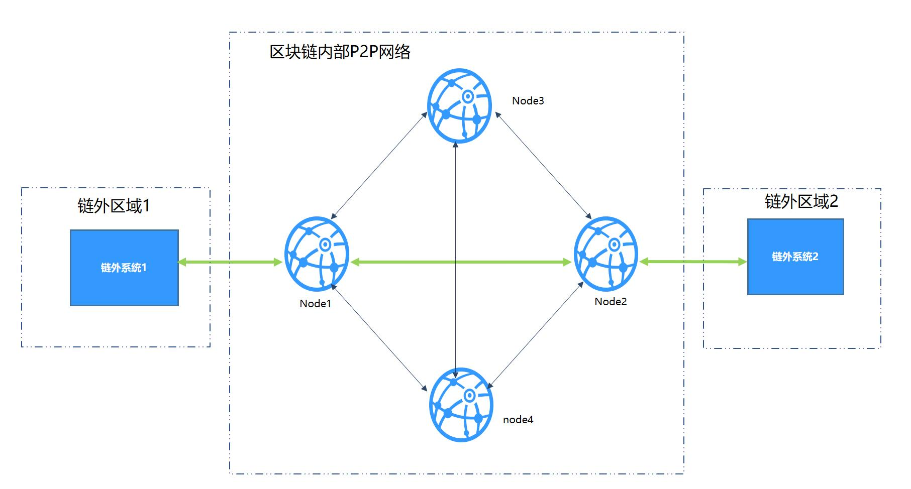

# AMOP

## Introduction  

Advanced Messages Onchain Protocol (AMOP) aims to provide a secure and efficient message channel for alliance chain. Each agency in the alliance chain can use AMOP to communicate as long as they deploy blockchain nodes, whether they are Sealer or Observer. AMOP has the following advantages:

- Real-time: AMOP messages do not rely on blockchain transactions and consensus. Messages are transmitted in real time among nodes with a milliseconds delay.
- Reliability: When AMOP message is transmitting, it can automatically search all feasible link in blockchain network for communication. As long as at least one link is available, the message is guaranteed to be reachable.
- Efficiency: The AMOP message has simple structure and efficient processing logic. AMOP message's simple structure and efficient processing logic makes it to fully utilize network bandwidth and require a small amount of CPU usage only.
- Security: All communication links of AMOP use SSL encryption. The encryption algorithm is configurable,and the topic supports identity authentication mechanism.
- Easy to use: No additional configuration is required in SDK when using AMOP.

## Logical architecture

We take the typical IDC architecture of the bank as the example to overview each region:

- SF region: The business service region inside the agency. The business subsystem in this region uses blockchain SDK. the configured SDK connects to the blockchain node.
- Blockchain P2P network: This is a logical region and deployed blockchain nodes of each agency. Blockchain nodes can also be deployed inside the agency.

## Configuration

AMOP does not require any additional configuration. The following is a configuration case for [Java SDK]] (./../configuration.md) .
SDK configuration（Spring Bean）：


```
<?xml version="1.0" encoding="UTF-8" ?>
<beans xmlns="http://www.springframework.org/schema/beans"
  xmlns:xsi="http://www.w3.org/2001/XMLSchema-instance" xmlns:p="http://www.springframework.org/schema/p"
  xmlns:tx="http://www.springframework.org/schema/tx" xmlns:aop="http://www.springframework.org/schema/aop"
  xmlns:context="http://www.springframework.org/schema/context"
  xsi:schemaLocation="http://www.springframework.org/schema/beans   
    http://www.springframework.org/schema/beans/spring-beans-2.5.xsd  
          http://www.springframework.org/schema/tx   
    http://www.springframework.org/schema/tx/spring-tx-2.5.xsd  
          http://www.springframework.org/schema/aop   
    http://www.springframework.org/schema/aop/spring-aop-2.5.xsd">
    
<!-- AMOP message processing pool configuration, which can be configured according to actual needs -->
<bean id="pool" class="org.springframework.scheduling.concurrent.ThreadPoolTaskExecutor">
  <property name="corePoolSize" value="50" />
  <property name="maxPoolSize" value="100" />
  <property name="queueCapacity" value="500" />
  <property name="keepAliveSeconds" value="60" />
  <property name="rejectedExecutionHandler">
    <bean class="java.util.concurrent.ThreadPoolExecutor.AbortPolicy" />
  </property>
</bean>

<!-- group information configuration -->
  <bean id="groupChannelConnectionsConfig" class="org.fisco.bcos.channel.handler.GroupChannelConnectionsConfig">
      <property name="allChannelConnections">
        <list>
          <bean id="group1"  class="org.fisco.bcos.channel.handler.ChannelConnections">
            <property name="groupId" value="1" />
            <property name="connectionsStr">
              <list>
                <value>127.0.0.1:20200</value> <!-- format：IP:port -->
                <value>127.0.0.1:20201</value>
              </list>
            </property>
          </bean>
        </list>
      </property>
    </bean>

  <!-- blockchain node information configuration -->
    <bean id="channelService" class="org.fisco.bcos.channel.client.Service" depends-on="groupChannelConnectionsConfig">
      <property name="groupId" value="1" />
      <property name="orgID" value="fisco" />
      <property name="allChannelConnections" ref="groupChannelConnectionsConfig"></property>
      <!-- If you want to enable topic authentication, please uncomment the following configuration. -->  
      <!-- <property name="topic2KeyInfo" ref="amopVerifyTopicToKeyInfo"></property>--> 
    </bean>

  <!-- If you want to enable topic authentication, please uncomment the following configuration. -->  
  <!--
    <bean class="org.fisco.bcos.channel.handler.AMOPVerifyTopicToKeyInfo" id="amopVerifyTopicToKeyInfo">
		<property name="topicToKeyInfo">
			<map>
				<entry key="${topicname}" value-ref="AMOPVerifyKeyInfo_${topicname}" />
			</map>
		</property>
	</bean>
	-->  
	
  <!-- If you are a topic producer, you need to configure the publicKey property.
		Each authenticated consumer holds a different public-private key pair.
		Please list the public key files of all the authenticated consumers.
	-->  
  <!--
	<bean class="org.fisco.bcos.channel.handler.AMOPVerifyKeyInfo" id="AMOPVerifyKeyInfo_${topicname}">
		<property name="publicKey">
			<list>
				<value>classpath:$consumer_public_key_1.pem$</value>
				<value>classpath:$consumer_public_key_2.pem$</value>
			</list>
		</property>
	</bean>
	--> 
	
  <!-- If you are a topic consumer, you need to configure the privateKey property.
		This private key will authenticate you to the corresponding topic producer.
	--> 
  <!--
	<bean class="org.fisco.bcos.channel.handler.AMOPVerifyKeyInfo" id="AMOPVerifyKeyInfo_${topicname}">
		<property name="privateKey" value="classpath:$consumer_private_key.pem$"></property>
	</bean>
	--> 
```

## SDK uses

AMOP's messaging is based on the topic mechanism. A topic is set in a server first. When a client sends a message to the topic, the server can receive soon. AMOP supports multiple topic for messaging in the same blockchain network. Topic supports any number of servers and clients. When multiple servers follow on the same topic, the topic messages are randomly sent to one of available servers.

Server code:

```java
package org.fisco.bcos.channel.test.amop;

import org.fisco.bcos.channel.client.Service;
import org.slf4j.Logger;
import org.slf4j.LoggerFactory;
import org.springframework.context.ApplicationContext;
import org.springframework.context.support.ClassPathXmlApplicationContext;

import java.util.HashSet;
import java.util.Set;

public class Channel2Server {
    static Logger logger = LoggerFactory.getLogger(Channel2Server.class);

    public static void main(String[] args) throws Exception {
        if (args.length < 1) {
          System.out.println("Param: topic");
          return;
        }

        String topic = args[0];

        logger.debug("init Server");

        ApplicationContext context = new ClassPathXmlApplicationContext("classpath:applicationContext.xml");
        Service service = context.getBean(Service.class);

        // set topic to support multiple topic
        Set<String> topics = new HashSet<String>();
        topics.add(topic);
        service.setTopics(topics);

        // PushCallback class, is used to handles messages. see the Callback code.
        PushCallback cb = new PushCallback();
        service.setPushCallback(cb);

        System.out.println("3s...");
        Thread.sleep(1000);
        System.out.println("2s...");
        Thread.sleep(1000);
        System.out.println("1s...");
        Thread.sleep(1000);

        System.out.println("start test");
        System.out.println("===================================================================");
        
        // launch service
        service.run();
    }
}
```

The server's PushCallback class case:

```java
package org.fisco.bcos.channel.test.amop;

import java.time.LocalDateTime;
import java.time.format.DateTimeFormatter;

import org.slf4j.Logger;
import org.slf4j.LoggerFactory;

import org.fisco.bcos.channel.client.ChannelPushCallback;
import org.fisco.bcos.channel.dto.ChannelPush;
import org.fisco.bcos.channel.dto.ChannelResponse;

class PushCallback extends ChannelPushCallback {
    static Logger logger = LoggerFactory.getLogger(PushCallback2.class);

    // onPush method is called when an AMOP message is received.
    @Override
    public void onPush(ChannelPush push) {
        DateTimeFormatter df = DateTimeFormatter.ofPattern("yyyy-MM-dd HH:mm:ss");
        logger.debug("push:" + push.getContent());

        System.out.println(df.format(LocalDateTime.now()) + "server:push:" + push.getContent());

        // respond message
        ChannelResponse response = new ChannelResponse();
        response.setContent("receive request seq:" + String.valueOf(push.getMessageID()));
        response.setErrorCode(0);

        push.sendResponse(response);
    }
}
```

client case:

```java
package org.fisco.bcos.channel.test.amop;

import java.time.LocalDateTime;
import java.time.format.DateTimeFormatter;

import org.slf4j.Logger;
import org.slf4j.LoggerFactory;
import org.springframework.context.ApplicationContext;
import org.springframework.context.support.ClassPathXmlApplicationContext;

import org.fisco.bcos.channel.client.Service;
import org.fisco.bcos.channel.dto.ChannelRequest;
import org.fisco.bcos.channel.dto.ChannelResponse;

public class Channel2Client {
    static Logger logger = LoggerFactory.getLogger(Channel2Client.class);

    public static void main(String[] args) throws Exception {
        if(args.length < 2) {
            System.out.println("param: target topic total number of request");
            return;
        }

        String topic = args[0];
        Integer count = Integer.parseInt(args[1]);
        DateTimeFormatter df = DateTimeFormatter.ofPattern("yyyy-MM-dd HH:mm:ss");

        ApplicationContext context = new ClassPathXmlApplicationContext("classpath:applicationContext.xml");

        Service service = context.getBean(Service.class);
        service.run();

        System.out.println("3s ...");
        Thread.sleep(1000);
        System.out.println("2s ...");
        Thread.sleep(1000);
        System.out.println("1s ...");
        Thread.sleep(1000);

        System.out.println("start test");
        System.out.println("===================================================================");
        for (Integer i = 0; i < count; ++i) {
          Thread.sleep(2000);  // It needs to take time to establish a connection. If you send a message immediately, it will fail.

          ChannelRequest request = new ChannelRequest();
          request.setToTopic(topic); // set the message topic
          request.setMessageID(service.newSeq());  // The message sequence number. When you need to uniquely identify a message, you can use newSeq() to generate randomly.
          request.setTimeout(5000);  // Message timeout

          request.setContent("request seq:" + request.getMessageID());  // The message content is sent
          System.out.println(df.format(LocalDateTime.now()) + " request seq:" + String.valueOf(request.getMessageID())
          + ", Content:" + request.getContent());

          ChannelResponse response = service.sendChannelMessage2(request);  // send message

          System.out.println(df.format(LocalDateTime.now()) + "response seq:" + String.valueOf(response.getMessageID())
                + ", ErrorCode:" + response.getErrorCode() + ", Content:" + response.getContent());
        }
    }
}
```

## Test
After completing the configuration as described above, user can specify a topic: topic and execute the following two commands for testing.
### Unicast text

Launch AMOP server:
```shell
java -cp 'conf/:apps/*:lib/*' org.fisco.bcos.channel.test.amop.Channel2Server [topic]
```  
Launch AMOP client:
```shell
java -cp 'conf/:apps/*:lib/*' org.fisco.bcos.channel.test.amop.Channel2Client [topic] [Number of messages]
```

In addition to supporting unicast text, AMOP also supports sending binary data, multicast, and authentication mechanisms. The corresponding test commands are as follows:


### Unicast binary，multicast text，multicast binary

Launch AMOP server:  
```shell
java -cp 'conf/:apps/*:lib/*' org.fisco.bcos.channel.test.amop.Channel2Server [topic]
```  
Launch AMOP client:
```shell
#unicast binary
java -cp 'conf/:apps/*:lib/*' org.fisco.bcos.channel.test.amop.Channel2ClientBin [topic] [filename]
#multicast text
java -cp 'conf/:lib/*:apps/*' org.fisco.bcos.channel.test.amop.Channel2ClientMulti [topic]  [Number of messages]
#multicast binary
java -cp 'conf/:lib/*:apps/*' org.fisco.bcos.channel.test.amop.Channel2ClientMultiBin [topic]  [filename]
```


### Unicast text and binary,multicast text and  binary with authentication mechanisms

Launch AMOP server:
```shell
java -cp 'conf/:apps/*:lib/*' org.fisco.bcos.channel.test.amop.Channel2ServerNeedVerify [topic]
```  
启动AMOP客户端：
```shell
#Unicast text with authentication mechanisms
java -cp 'conf/:apps/*:lib/*' org.fisco.bcos.channel.test.amop.Channel2ClientNeedVerify [topic] [Number of messages]
#Unicast binary with authentication mechanisms
java -cp 'conf/:apps/*:lib/*' org.fisco.bcos.channel.test.amop.Channel2ClientBinNeedVerify [topic] [filename]
#multicast text with authentication mechanisms
java -cp 'conf/:lib/*:apps/*' org.fisco.bcos.channel.test.amop.Channel2ClientMultiNeedVerify [topic]  [Number of messages]
#multicast binary with authentication mechanisms
java -cp 'conf/:lib/*:apps/*' org.fisco.bcos.channel.test.amop.Channel2ClientMultiBinNeedVerify [topic]  [filename]
```


## Error code
- 99:message failed to be sent. After AMOP attempts to send message by all the links, the message is not sent to the server. It is recommended to use `seq` that is generated during the transmission to check the processing status of each node on the link.
- 100：message failed to be sent. After AMOP attempts to send message by all the links, the message is not sent to the node from one node by P2P. It is recommended to use `seq` that is generated during the transmission to check the processing status of each node on the link.
- 101：message failed to be sent. After AMOP attempts to send message by all the links, the message is not sent to the sdk from node. It is recommended to use `seq` that is generated during the transmission to check the processing status of each node on the link.
- 102: message times out. It is recommended to check whether the server has processed the message correctly and the bandwidth is sufficient.
- 103: Due to the bandwidth limitation of the node, the AMOP request from the SDK to the node was rejected.

