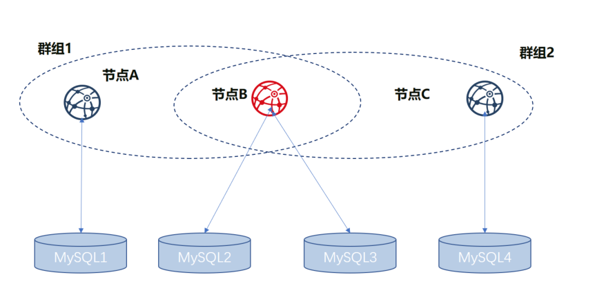

# Distributed storage

## Install MySQL

The currently supported distributed database is MySQL. Before using distributed storage, you need to set up the MySQL service. The configuration on Ubuntu and CentOS servers is as follows:

Ubuntu: Execute the following three commands to configure the root account password during the installation process.

```bash
sudo apt install -y mysql-server mysql-client libmysqlclient-dev
```
Start the MySQL service and log in:
root account password.
```bash
sudo service mysql start
mysql -uroot -p
```
CentOS: Perform the following two commands to install.
```bash
yum install mysql*
# some versions of linux need to install mariadb which is a branch of mysql
yum install mariadb*
```

Start the MySQL service. Log in and set a password for the root user.

```bash
service mysqld start
#If mariadb is installed, to use the following command to start
service mariadb start
mysql -uroot
mysql> set password for root@localhost = password('123456');
```

## Configure MySQL parameters
### check the configuration file my.cnf
```bash
mysql --help | grep 'Default options' -A 1
```
After execution, you can see the following data:

```
Default options are read from the following files in the given order:
/etc/mysql/my.cnf /etc/my.cnf ~/.my.cnf
```
### Configure my.cnf
mysql loads the configuration from /etc/mysql/my.cnf, /etc/my.cnf, ~/.my.cnf in turn. Search these files in turn, find the first file that exists, and add the following content in the [mysqld] section (modify the value if it exists).
```
max_allowed_packet = 1024M
sql_mode =STRICT_TRANS_TABLES
ssl=0
default_authentication_plugin = mysql_native_password
```

### Restart mysql-server and verify parameters

Ubuntu：Execute the following command to restart
```bash
service mysql restart
```

CentOS：Execute the following command to restart
```bash
service mysqld start
# If mariadb is installed, use the following command to start:
service mariadb start
```

Validation parameter:
```bash
mysql -uroot -p
# Execute the following command to view the value of max_allowed_packet
MariaDB [(none)]>  show variables like 'max_allowed_packet%';
+--------------------+------------+
| Variable_name      | Value      |
+--------------------+------------+
| max_allowed_packet | 1073741824 |
+--------------------+------------+
1 row in set (0.00 sec)

# Execute the following command to view the value of sql_mode
MariaDB [(none)]>  show variables like 'sql_mode%';
+---------------+---------------------+
| Variable_name | Value               |
+---------------+---------------------+
| sql_mode      | STRICT_TRANS_TABLES |
+---------------+---------------------+
1 row in set (0.00 sec)
```

## Node directly connected to MySQL

FISCO BCOS in version 2.0.0-rc3 supports nodes directly connected to MySQL through connection pool. Compared to the proxy access MySQL mode, this configuration is simple. No need to manually create a database. Please refer to the configuration method:

### Logical architecture diagram

The multi-group architecture means that blockchain node supports launching multiple groups. The transaction processing, data storage, and block consensus among the groups are isolated from each other. Therefore, each node in the group corresponds to a database instance. For example, in blockchain network, there are three nodes A, B, and C, where A and B belong to Group1, and B and C belong to Group2. Nodes A and C correspond to one database instance respectively, and Node B corresponds to two database instances. The logical architecture diagram is as follows.


As shown in the above figure, NodeB belongs to multiple groups. The database instances which are corresponded by the same node in different groups are separate. For distinguishing the same node in different groups, the nodes of A, B, and C are respectively represented with Group1_A (NodeA in Group1, same as below), Group1_B, Group2_B, and Group2_C.

We use the above figure as an example to describe the setup configuration process in following.

### Build node

Before using distributed storage, you need to complete the establishment of the alliance chain and the configuration of multiple groups. For details, refer to the following steps.

#### Prepare dependence
```bash
mkdir -p ~/fisco && cd ~/fisco
# Download build_chain.sh script
curl -#LO https://github.com/FISCO-BCOS/FISCO-BCOS/releases/download/v2.7.2/build_chain.sh && chmod u+x build_chain.sh
```

```eval_rst
.. note::
    - If the script cannot be downloaded for a long time due to network problems, try `curl -#LO https://gitee.com/FISCO-BCOS/FISCO-BCOS/raw/master/tools/gen_node_cert.sh`
```

#### Generate configuration file
```bash
# generate blockchain configuration file ipconf
cat > ipconf << EOF
127.0.0.1:1 agencyA 1
127.0.0.1:1 agencyB 1,2
127.0.0.1:1 agencyC 2
EOF

# view configuration file
cat ipconf
127.0.0.1:1 agencyA 1
127.0.0.1:1 agencyB 1,2
127.0.0.1:1 agencyC 2
```

#### Build blockchain with build_chain
```bash
### build blockchain（please confirm the ports of 30300~30302，20200~20202，8545~8547 are not occupied）
### The difference right here is that the parameter "-s MySQL" is appended to the command and the port is changed.
bash build_chain.sh -f ipconf -p 30300,20200,8545 -s MySQL
==============================================================
Generating CA key...
==============================================================
Generating keys ...
Processing IP:127.0.0.1 Total:1 Agency:agencyA Groups:1
Processing IP:127.0.0.1 Total:1 Agency:agencyB Groups:1,2
Processing IP:127.0.0.1 Total:1 Agency:agencyC Groups:2
==============================================================
Generating configurations...
Processing IP:127.0.0.1 Total:1 Agency:agencyA Groups:1
Processing IP:127.0.0.1 Total:1 Agency:agencyB Groups:1,2
Processing IP:127.0.0.1 Total:1 Agency:agencyC Groups:2
==============================================================
Group:1 has 2 nodes
Group:2 has 2 nodes
```
### Modify node ini file

In group.[group].ini configuration file, the configuration information of MySQL is related to this feature. Suppose that the MySQL configuration information is as follows:

```bash
|node|db_ip|db_port|db_username|db_passwd|db_name|
|Group1_A|127.0.0.1|3306|root|123456|db_Group1_A|
|Group1_B|127.0.0.1|3306|root|123456|db_Group1_B|
|Group2_B|127.0.0.1|3306|root|123456|db_Group2_B|
|Group2_C|127.0.0.1|3306|root|123456|db_Group2_C|
```

### Modify the group.1.ini configuration in node0

Modify the content in the section ~/fisco/nodes/127.0.0.1/node0/conf/group.1.ini[storage] and add the following content. Db_passwd is the corresponding password.

```bash
    	db_ip=127.0.0.1
    	db_port=3306
    	db_username=root
    	db_name=db_Group1_A
    	db_passwd=
```

### Modify the group.1.ini configuration in node1

Modify the content in the section ~/fisco/nodes/127.0.0.1/node1/conf/group.1.ini[storage] and add the following content. Db_passwd is the corresponding password.

```bash
    	db_ip=127.0.0.1
    	db_port=3306
    	db_username=root
    	db_name=db_Group1_B
    	db_passwd=
```

### Modify the group.2.ini configuration in node1

Modify the content in the section ~/fisco/nodes/127.0.0.1/node1/conf/group.2.ini[storage] and add the following content. Db_passwd is the corresponding password.

```bash
    	db_ip=127.0.0.1
    	db_port=3306
    	db_username=root
    	db_name=db_Group2_B
    	db_passwd=
```
### Modify the group.2.ini configuration in node2

Modify the content in the section ~/fisco/nodes/127.0.0.1/node2/conf/group.2.ini[storage] and add the following content. Db_passwd is the corresponding password.

```bash
    	db_ip=127.0.0.1
    	db_port=3306
    	db_username=root
    	db_name=db_Group2_C
    	db_passwd=
```

### Start node
```bash
cd ~/fisco/nodes/127.0.0.1;sh start_all.sh
```
### Check process
```bash
ps -ef|grep fisco-bcos|grep -v grep
fisco   111061      1  0 16:22 pts/0    00:00:04 /data/home/fisco/nodes/127.0.0.1/node2/../fisco-bcos -c config.ini
fisco   111065      1  0 16:22 pts/0    00:00:04 /data/home/fisco/nodes/127.0.0.1/node0/../fisco-bcos -c config.ini
fisco   122910      1  1 16:22 pts/0    00:00:02 /data/home/fisco/nodes/127.0.0.1/node1/../fisco-bcos -c config.ini
```
If it starts successfully, you can see there are 3 fisco-bcos processes. If it fails, please refer to the log to confirm whether the configuration is correct.

### Check output of log
Execute the following command to view the number of nodes connected to node0 (similar to other nodes)

```
tail -f nodes/127.0.0.1/node0/log/log*  | grep connected
```
Normally, you will see an output similar to the following, and you can see that node0 is connecting to the other two nodes from it.

```
info|2019-05-28 16:28:57.267770|[P2P][Service] heartBeat,connected count=2
info|2019-05-28 16:29:07.267935|[P2P][Service] heartBeat,connected count=2
info|2019-05-28 16:29:17.268163|[P2P][Service] heartBeat,connected count=2
info|2019-05-28 16:29:27.268284|[P2P][Service] heartBeat,connected count=2
info|2019-05-28 16:29:37.268467|[P2P][Service] heartBeat,connected count=2
```
Execute the following command to check if it is in consensus

```
tail -f nodes/127.0.0.1/node0/log/log*  | grep +++
```

Normally, the output will continue to output ++++Generating seal to indicate that the consensus is normal.

```
info|2019-05-28 16:26:32.454059|[g:1][CONSENSUS][SEALER]++++++++++++++++ Generating seal on,blkNum=28,tx=0,nodeIdx=3,hash=c9c859d5...
info|2019-05-28 16:26:36.473543|[g:1][CONSENSUS][SEALER]++++++++++++++++ Generating seal on,blkNum=28,tx=0,nodeIdx=3,hash=6b319fa7...
info|2019-05-28 16:26:40.498838|[g:1][CONSENSUS][SEALER]++++++++++++++++ Generating seal on,blkNum=28,tx=0,nodeIdx=3,hash=2164360f...
```

### Send transaction by console

#### Prepare dependence
```bash
cd ~/fisco;
curl -#LO https://github.com/FISCO-BCOS/console/releases/download/v2.7.2/download_console.sh && bash download_console.sh
cp -n console/conf/config-example.toml console/conf/config.toml
cp nodes/127.0.0.1/sdk/* console/conf/
```

```eval_rst
.. note::
    - If the script cannot be downloaded for a long time due to network problems, try `https://gitee.com/FISCO-BCOS/console/raw/master/tools/download_console.sh`
```

#### Modify configuration file
Modify ~/fisco/console/conf/applicationContext.xml to the following configuration (partial information)

```bash
peers=["127.0.0.1:20300", "127.0.0.1:20301"]    # The peer list to connect
```
#### Start console
```bash
cd ~/fisco/console
sh start.sh 1
#deploy TableTest contract
[group:1]> deploy TableTest
contract address:0x8c17cf316c1063ab6c89df875e96c9f0f5b2f744
```

view the table in the database

```bash
MySQL -uroot -p123456 -A db_Group1_A
use db_Group1_A;
show tables;
----------------------------------------------------------+
| Tables_in_db_Group1_A                                  |
+----------------------------------------------------------+
| c_8c17cf316c1063ab6c89df875e96c9f0f5b2f744 |
| c_f69a2fa2eca49820218062164837c6eecc909abd |
| _sys_block_2_nonces_                                     |
| _sys_cns_                                                |
| _sys_config_                                             |
| _sys_consensus_                                          |
| _sys_current_state_                                      |
| _sys_hash_2_block_                                       |
| _sys_number_2_hash_                                      |
| _sys_table_access_                                       |
| _sys_tables_                                             |
| _sys_tx_hash_2_block_                                    |
+----------------------------------------------------------+
12 rows in set (0.02 sec)
```

view the table in the database

```bash
show tables;
+----------------------------------------------------------+
| Tables_in_db_Group1_A                                  |
+----------------------------------------------------------+
| c_8c17cf316c1063ab6c89df875e96c9f0f5b2f744 |
| c_f69a2fa2eca49820218062164837c6eecc909abd |
| _sys_block_2_nonces_                                     |
| _sys_cns_                                                |
| _sys_config_                                             |
| _sys_consensus_                                          |
| _sys_current_state_                                      |
| _sys_hash_2_block_                                       |
| _sys_number_2_hash_                                      |
| _sys_table_access_                                       |
| _sys_tables_                                             |
| _sys_tx_hash_2_block_                                    |
| u_t_test                                             |
+----------------------------------------------------------+
```

Inserting a record to the database
```bash
#insert data into the table
call TableTest 0x8c17cf316c1063ab6c89df875e96c9f0f5b2f744 insert "fruit" 100 "apple"
0x082ca6a5a292f1f7b20abeb3fb03f45e0c6f48b5a79cc65d1246bfe57be358d1
```

open the MySQL client and query the u_t_test table data

```bash
#view data in the user table
select * from u_t_test\G;
*************************** 1. row ***************************
     _id_: 31
   _hash_: 0a0ed3b2b0a227a6276114863ef3e8aa34f44e31567a5909d1da0aece31e575e
    _num_: 3
 _status_: 0
     name: fruit
  item_id: 100
item_name: apple
1 row in set (0.00 sec)
```
